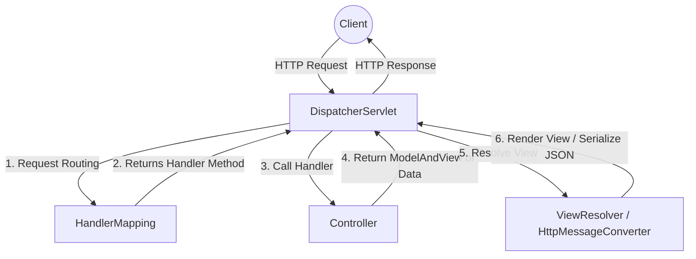

# Spring MVC and REST APIs

## 1. What is Spring MVC and what is its main purpose? <Badge type="tip" text="easy" />

::: details View Answer
Spring MVC (Model-View-Controller) is a framework within the Spring ecosystem designed for building web applications and RESTful APIs. It provides a structured approach to separating the application's concerns:
- **Model**: Represents the data and business logic.
- **View**: Renders the UI (less relevant in pure REST APIs, where data is often serialized to JSON/XML).
- **Controller**: Processes incoming HTTP requests, interacts with the Model, and returns the appropriate View or Data.

Spring MVC simplifies web development by handling boilerplate tasks like request routing, data binding, and validation.
:::

## 2. What is the role of `DispatcherServlet` in Spring MVC? <Badge type="tip" text="easy" />

::: details View Answer
The `DispatcherServlet` is the core front controller in Spring MVC. It acts as the central entry point for all incoming HTTP requests to a Spring web application. Its primary role is to route requests to the appropriate handlers (Controllers), orchestrate the processing, and return the response to the client.


:::

## 3. What is the difference between `@Controller` and `@RestController`? <Badge type="tip" text="easy" />

::: details View Answer
- `@Controller`: A Spring stereotype annotation used to mark a class as a web controller. By default, methods in a `@Controller` return a view name (String) which is resolved by a `ViewResolver` to render a web page (e.g., JSP, Thymeleaf).
- `@RestController`: A specialized version of `@Controller` introduced in Spring 4.0. It is a convenience annotation that combines `@Controller` and `@ResponseBody`. Methods in a `@RestController` automatically serialize the return object into the HTTP response body (e.g., as JSON or XML) instead of returning a view name.

```java
// Returns a view (HTML)
@Controller
public class WebController {
    @GetMapping("/home")
    public String home() {
        return "homePage"; // Resolves to homePage.html
    }
}

// Returns JSON data
@RestController
public class ApiController {
    @GetMapping("/api/data")
    public MyData getData() {
        return new MyData("Hello"); // Serialized to {"message": "Hello"}
    }
}
```
:::

## 4. Explain the `@RequestMapping` annotation and its shortcut variants. <Badge type="tip" text="easy" />

::: details View Answer
`@RequestMapping` maps HTTP requests to specific handler classes or methods. It can specify the path, HTTP method, consumed media types, and produced media types.

Spring provides shortcut variants for specific HTTP methods to make code more readable:
- `@GetMapping`: Shortcut for `@RequestMapping(method = RequestMethod.GET)`
- `@PostMapping`: Shortcut for `@RequestMapping(method = RequestMethod.POST)`
- `@PutMapping`: Shortcut for `@RequestMapping(method = RequestMethod.PUT)`
- `@DeleteMapping`: Shortcut for `@RequestMapping(method = RequestMethod.DELETE)`
- `@PatchMapping`: Shortcut for `@RequestMapping(method = RequestMethod.PATCH)`
:::

## 5. How do you extract query parameters and path variables in a Spring REST API? <Badge type="warning" text="medium" />

::: details View Answer
- **`@RequestParam`**: Used to extract query parameters from the URL (e.g., `/api/users?role=admin`).
- **`@PathVariable`**: Used to extract values directly from the URI path (e.g., `/api/users/123`).

```java
@RestController
@RequestMapping("/api/users")
public class UserController {

    // Extracts 'id' from the path: /api/users/123
    @GetMapping("/{id}")
    public User getUserById(@PathVariable("id") Long id) {
        return userService.findById(id);
    }

    // Extracts 'role' from query params: /api/users/search?role=admin
    @GetMapping("/search")
    public List<User> getUsersByRole(@RequestParam(value = "role", defaultValue = "user") String role) {
        return userService.findByRole(role);
    }
}
```
:::

## 6. What is the purpose of `@RequestBody` and `@ResponseBody`? <Badge type="warning" text="medium" />

::: details View Answer
- **`@RequestBody`**: Binds the incoming HTTP request body (e.g., JSON payload) to a Java object. Spring uses an `HttpMessageConverter` (like Jackson) to deserialize the JSON into the Java domain model.
- **`@ResponseBody`**: Binds the return value of a method directly to the HTTP response body. When placed on a method (or implicitly used via `@RestController`), Spring serializes the returned Java object into JSON/XML and writes it to the response.
:::

## 7. How does content negotiation work in Spring REST APIs? <Badge type="warning" text="medium" />

::: details View Answer
Content negotiation determines the media type (e.g., JSON, XML) returned by the API based on the client's request.
Spring MVC resolves the requested media type by checking:
1. The URL suffix (e.g., `/api/users.xml` vs `/api/users.json`) - *deprecated in newer versions*.
2. A URL query parameter (e.g., `/api/users?format=xml`).
3. The `Accept` HTTP header (e.g., `Accept: application/json`).

The `DispatcherServlet` then uses the appropriate `HttpMessageConverter` (e.g., `MappingJackson2HttpMessageConverter` for JSON) to serialize the response.
:::

## 8. What is the role of `ResponseEntity` in Spring? <Badge type="warning" text="medium" />

::: details View Answer
`ResponseEntity` represents the entire HTTP response, including the status code, headers, and the body. It gives you full control over the HTTP response returned to the client, which is crucial for building robust REST APIs.

```java
@PostMapping("/create")
public ResponseEntity<User> createUser(@RequestBody User user) {
    User savedUser = userService.save(user);
    
    // Setting custom headers and a 201 Created status code
    return ResponseEntity
            .status(HttpStatus.CREATED)
            .header("Custom-Header", "Value")
            .body(savedUser);
}
```
:::

## 9. How do you handle exceptions globally in a Spring REST API? <Badge type="warning" text="medium" />

::: details View Answer
Global exception handling in Spring is achieved using the `@ControllerAdvice` or `@RestControllerAdvice` annotation combined with `@ExceptionHandler` methods. This centralizes error handling logic so you don't need `try-catch` blocks in every controller.

```java
@RestControllerAdvice
public class GlobalExceptionHandler {

    @ExceptionHandler(ResourceNotFoundException.class)
    public ResponseEntity<ErrorResponse> handleNotFound(ResourceNotFoundException ex) {
        ErrorResponse error = new ErrorResponse("NOT_FOUND", ex.getMessage());
        return new ResponseEntity<>(error, HttpStatus.NOT_FOUND);
    }
    
    @ExceptionHandler(Exception.class)
    public ResponseEntity<ErrorResponse> handleGeneric(Exception ex) {
        ErrorResponse error = new ErrorResponse("INTERNAL_ERROR", "An unexpected error occurred");
        return new ResponseEntity<>(error, HttpStatus.INTERNAL_SERVER_ERROR);
    }
}
```
:::

## 10. Explain how to upload and download files using Spring MVC. <Badge type="danger" text="hard" />

::: details View Answer
Spring provides `MultipartFile` to handle file uploads. For downloads, you return a `Resource` wrapped in a `ResponseEntity` with the correct headers.

**File Upload:**
```java
@PostMapping("/upload")
public ResponseEntity<String> uploadFile(@RequestParam("file") MultipartFile file) {
    if (file.isEmpty()) {
        return ResponseEntity.badRequest().body("File is empty");
    }
    // Save file logic here
    return ResponseEntity.ok("File uploaded successfully: " + file.getOriginalFilename());
}
```

**File Download:**
```java
@GetMapping("/download/{filename}")
public ResponseEntity<Resource> downloadFile(@PathVariable String filename) {
    Resource file = fileStorageService.load(filename);
    return ResponseEntity.ok()
        .header(HttpHeaders.CONTENT_DISPOSITION, "attachment; filename=\"" + file.getFilename() + "\"")
        .body(file);
}
```
:::

## 11. What is `@ResponseStatus` and when would you use it? <Badge type="tip" text="easy" />

::: details View Answer
`@ResponseStatus` marks a method or an exception class with the HTTP status code that should be returned.
It can be used:
1. On a custom exception class, so whenever that exception is thrown, Spring automatically returns the specified status.
2. On a controller method to define a default status code (e.g., returning 201 Created for a successful POST), instead of using `ResponseEntity`.

```java
@ResponseStatus(HttpStatus.NOT_FOUND)
public class UserNotFoundException extends RuntimeException {
    // ...
}
```
:::

## 12. How can you validate request bodies in Spring REST APIs? <Badge type="warning" text="medium" />

::: details View Answer
Validation is done using Jakarta Bean Validation (Hibernate Validator). You annotate your DTO classes with constraints (`@NotNull`, `@Size`, `@Email`) and prefix the method parameter with `@Valid` or `@Validated`.

```java
public class UserDto {
    @NotBlank
    private String name;
    
    @Email
    private String email;
}

@PostMapping("/users")
public ResponseEntity<String> createUser(@Valid @RequestBody UserDto user) {
    // If validation fails, Spring throws MethodArgumentNotValidException
    return ResponseEntity.ok("Valid user!");
}
```
:::

## 13. What is the difference between `@ModelAttribute` and `@RequestBody`? <Badge type="warning" text="medium" />

::: details View Answer
- **`@RequestBody`**: Used for REST APIs. It parses the body of the HTTP request (JSON/XML) using an `HttpMessageConverter` and maps it to a Java object.
- **`@ModelAttribute`**: Used primarily for traditional web apps with form submissions (application/x-www-form-urlencoded). It binds HTTP request parameters (from form fields or URL parameters) to a Java object using data binders.
:::

## 14. How do you implement HATEOAS in a Spring Boot REST API? <Badge type="danger" text="hard" />

::: details View Answer
HATEOAS (Hypermedia as the Engine of Application State) enables REST APIs to include hypermedia links in their responses, guiding clients on how to interact with the API dynamically.
Spring provides the `spring-boot-starter-hateoas` dependency. You use `EntityModel` (or `CollectionModel`) to wrap your domain objects and add `Link` objects via `WebMvcLinkBuilder`.

```java
@GetMapping("/{id}")
public EntityModel<User> getUser(@PathVariable Long id) {
    User user = userService.findById(id);
    
    EntityModel<User> model = EntityModel.of(user);
    
    // Add link to self
    Link selfLink = WebMvcLinkBuilder.linkTo(
        WebMvcLinkBuilder.methodOn(UserController.class).getUser(id)
    ).withSelfRel();
    
    model.add(selfLink);
    return model;
}
```
:::

## 15. How can you implement API versioning in Spring Boot? <Badge type="danger" text="hard" />

::: details View Answer
API versioning allows evolving an API without breaking existing clients. Common strategies include:
1. **URI Versioning**: Adding version to the path (`/v1/users`, `/v2/users`). Use `@RequestMapping("/v1/users")`.
2. **Request Parameter Versioning**: Passing version as a query param (`/users?version=1`). Use `@GetMapping(value = "/users", params = "version=1")`.
3. **Header Versioning**: Passing a custom header (`X-API-VERSION: 1`). Use `@GetMapping(value = "/users", headers = "X-API-VERSION=1")`.
4. **Media Type (Content Negotiation) Versioning**: Modifying the `Accept` header (`Accept: application/vnd.company.app-v1+json`). Use `@GetMapping(value = "/users", produces = "application/vnd.company.app-v1+json")`.
:::

## 16. How do you handle Cross-Origin Resource Sharing (CORS) in Spring Boot? <Badge type="warning" text="medium" />

::: details View Answer
CORS restricts web pages from making requests to a different domain than the one that served the web page. Spring handles CORS through:
1. **Method/Controller Level**: Using the `@CrossOrigin` annotation.
```java
@CrossOrigin(origins = "http://localhost:3000")
@RestController
public class MyController { ... }
```
2. **Global Configuration**: By implementing `WebMvcConfigurer` and overriding `addCorsMappings`.
```java
@Configuration
public class WebConfig implements WebMvcConfigurer {
    @Override
    public void addCorsMappings(CorsRegistry registry) {
        registry.addMapping("/api/**").allowedOrigins("http://localhost:3000");
    }
}
```
:::

## 17. What are Interceptors in Spring MVC, and how are they different from Filters? <Badge type="warning" text="medium" />

::: details View Answer
**Filters** are part of the Servlet API and intercept the request *before* it reaches the Spring `DispatcherServlet`. They are ideal for low-level tasks like encoding, security (Spring Security uses filters), and logging.
**Interceptors** (e.g., `HandlerInterceptor`) are part of Spring MVC. They intercept the request *after* it reaches the `DispatcherServlet` but *before* (and after) the Controller method is executed. They are ideal for application-level logic like checking user authorization, applying themes, or checking rate limits. Interceptors have access to the actual `Handler` (Controller method).
:::

## 18. How do you perform asynchronous request processing in Spring MVC? <Badge type="danger" text="hard" />

::: details View Answer
Spring MVC allows asynchronous processing where the HTTP thread handling the request is freed up immediately, and the actual processing happens on a separate background thread. The response is written back once processing is complete.
This is achieved by returning a `Callable<T>`, `DeferredResult<T>`, or `CompletableFuture<T>` from the controller.

```java
@GetMapping("/async")
public Callable<String> processAsync() {
    return () -> {
        Thread.sleep(2000); // Simulated long-running task
        return "Async result";
    };
}
```
:::

## 19. What is the difference between `RestTemplate` and `WebClient`? <Badge type="warning" text="medium" />

::: details View Answer
- **`RestTemplate`**: The traditional, synchronous (blocking) HTTP client provided by Spring for making HTTP requests to external APIs. It is currently in maintenance mode and Spring recommends migrating away from it.
- **`WebClient`**: Introduced in Spring WebFlux, it is a modern, non-blocking, reactive HTTP client. It is highly scalable and supports both asynchronous and synchronous execution.
:::

## 20. How do you test Spring MVC controllers? <Badge type="tip" text="easy" />

::: details View Answer
Spring provides `@WebMvcTest` to test controllers in isolation without spinning up the entire application context. It auto-configures Spring MVC infrastructure and `MockMvc`. You can mock the service layer dependencies using `@MockBean`.

```java
@WebMvcTest(UserController.class)
class UserControllerTest {

    @Autowired
    private MockMvc mockMvc;

    @MockBean
    private UserService userService;

    @Test
    void shouldReturnUser() throws Exception {
        Mockito.when(userService.findById(1L)).thenReturn(new User(1L, "John"));

        mockMvc.perform(get("/users/1"))
               .andExpect(status().isOk())
               .andExpect(jsonPath("$.name").value("John"));
    }
}
```
:::