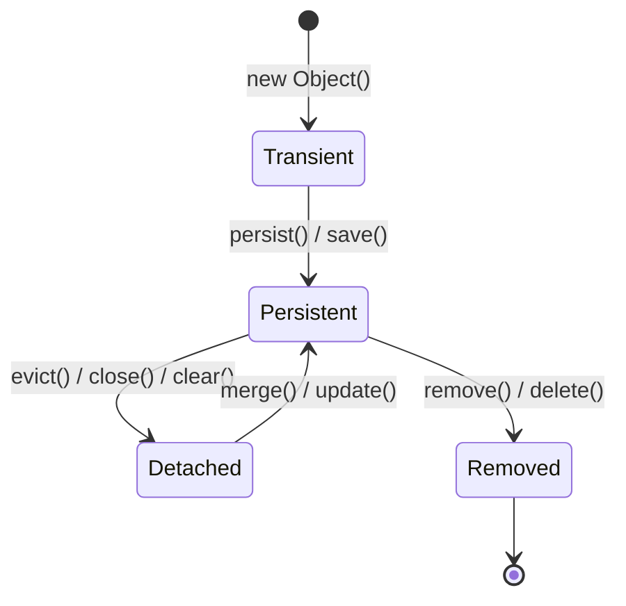

# Spring Data JPA and Hibernate

## What is the difference between JPA, Hibernate, and Spring Data JPA? <Badge type="tip" text="easy" />

::: details View Answer
**Answer:**
- **JPA (Java Persistence API):** A specification that defines the rules and guidelines for object-relational mapping (ORM) in Java. It is just an API, not an implementation.
- **Hibernate:** A popular ORM framework that implements the JPA specification. It provides the actual logic to map Java objects to database tables.
- **Spring Data JPA:** A Spring module that provides an abstraction layer on top of JPA providers (like Hibernate). It significantly reduces boilerplate code by generating repositories at runtime and providing features like derived query methods.
:::

## What is the EntityManager and how does it relate to Session in Hibernate? <Badge type="warning" text="medium" />

::: details View Answer
**Answer:**
The `EntityManager` is an interface provided by JPA used to interact with the persistence context. It provides methods to create, read, update, and delete entities (`persist`, `merge`, `remove`, `find`).
In Hibernate, the `Session` interface is the core component for persistence. The `EntityManager` is essentially a JPA wrapper around the Hibernate `Session`. When using Spring Data JPA, you usually don't interact with `EntityManager` directly, as repositories handle this internally.

```java
@PersistenceContext
private EntityManager entityManager;

public void customMethod() {
    Session session = entityManager.unwrap(Session.class);
    // Use session specific methods
}
```
:::

## Explain the different states of an entity in Hibernate. <Badge type="warning" text="medium" />

::: details View Answer
**Answer:**
Entities in Hibernate can exist in one of four states:
1. **Transient:** An object is instantiated but not yet associated with a Hibernate Session. It has no representation in the database.
2. **Persistent (Managed):** The object is associated with a Session. Any changes made to it will be synchronized with the database when the transaction commits.
3. **Detached:** The object was once persistent but the Session it was associated with has been closed or cleared. Changes will not be tracked unless it is re-attached (`merge()`).
4. **Removed:** The object is scheduled to be deleted from the database upon transaction commit.


:::

## What is the N+1 select problem and how do you solve it in Spring Data JPA? <Badge type="danger" text="hard" />

::: details View Answer
**Answer:**
The N+1 problem occurs when an application executes a query to fetch `N` entities, and then executes an additional query for each entity to fetch its associated lazy-loaded collections, resulting in `N+1` database queries instead of 1.

**Solutions:**
1. **`FETCH JOIN` in JPQL:** Force the initialization of the collection in the original query.
```java
@Query("SELECT u FROM User u JOIN FETCH u.roles")
List<User> findAllUsersWithRoles();
```
2. **`@EntityGraph`:** Define fetching behavior at runtime.
```java
@EntityGraph(attributePaths = {"roles"})
List<User> findAll();
```
3. **Hibernate Batch Fetching:** Fetch associations in batches.
```java
@BatchSize(size = 10)
@OneToMany(mappedBy = "user")
private List<Role> roles;
```
:::

## Explain the difference between `@EntityGraph` and `FETCH JOIN`. <Badge type="warning" text="medium" />

::: details View Answer
**Answer:**
Both solve the N+1 problem by fetching lazy associations eagerly.
- **`FETCH JOIN`:** A JPQL construct. It explicitly dictates the SQL join and fetch mechanism in the query. It is powerful but requires writing custom queries, which might not be reusable if you need different fetching strategies for the same entity.
- **`@EntityGraph`:** A JPA 2.1 feature integrated into Spring Data JPA. It allows you to specify which properties should be fetched dynamically without changing the base query. It's often cleaner and more flexible as it separates the query logic from the fetching strategy.
:::

## What is the difference between `save()` and `saveAndFlush()` in Spring Data JPA? <Badge type="warning" text="medium" />

::: details View Answer
**Answer:**
- **`save()`:** Adds the entity to the persistence context. The actual SQL `INSERT` or `UPDATE` is not necessarily sent to the database immediately; it is delayed until the transaction commits or a flush is triggered (write-behind).
- **`saveAndFlush()`:** Saves the entity and immediately synchronizes the persistence context with the underlying database by executing the SQL statements immediately.

Use `saveAndFlush()` when subsequent code within the same transaction depends on the changes being physically present in the database (e.g., executing a native query right after saving).
:::

## How does pagination work in Spring Data JPA? <Badge type="tip" text="easy" />

::: details View Answer
**Answer:**
Spring Data JPA provides the `Pageable` interface and `Page` return type to handle pagination. You extend `PagingAndSortingRepository` or `JpaRepository`.

```java
public interface UserRepository extends JpaRepository<User, Long> {
    Page<User> findByStatus(String status, Pageable pageable);
}

// Usage:
Pageable firstPageWithTenElements = PageRequest.of(0, 10, Sort.by("username").descending());
Page<User> users = userRepository.findByStatus("ACTIVE", firstPageWithTenElements);
```
The returned `Page` object contains the data along with metadata like total elements, total pages, and whether it's the first or last page.
:::

## What are derived query methods in Spring Data JPA? <Badge type="tip" text="easy" />

::: details View Answer
**Answer:**
Derived query methods allow you to define database queries simply by declaring method names in your repository interface following a specific naming convention. Spring Data parses the method name and automatically generates the corresponding JPQL query.

```java
public interface UserRepository extends JpaRepository<User, Long> {
    // Generates: SELECT u FROM User u WHERE u.emailAddress = ?1 AND u.lastname = ?2
    List<User> findByEmailAddressAndLastname(String emailAddress, String lastname);

    // Generates: SELECT u FROM User u WHERE u.age > ?1
    List<User> findByAgeGreaterThan(int age);
}
```
:::

## Explain the `@Query` annotation and when to use native queries vs JPQL. <Badge type="warning" text="medium" />

::: details View Answer
**Answer:**
The `@Query` annotation allows you to execute custom queries when derived query methods are insufficient or become too complex.

- **JPQL (Java Persistence Query Language):** The default for `@Query`. It uses entity names and fields rather than database tables and columns. It is database-agnostic.
```java
@Query("SELECT u FROM User u WHERE u.status = 1")
List<User> findActiveUsers();
```
- **Native Queries:** Set `nativeQuery = true`. It uses standard SQL and maps directly to the underlying database tables. Useful for database-specific features (e.g., PostgreSQL JSON functions) or complex joins that are difficult in JPQL, but breaks database portability.
```java
@Query(value = "SELECT * FROM users WHERE status = 1", nativeQuery = true)
List<User> findActiveUsersNative();
```
:::

## What is a Specification in Spring Data JPA and when would you use it? <Badge type="danger" text="hard" />

::: details View Answer
**Answer:**
`Specification` is based on the JPA Criteria API. It is used to programmatically build dynamic, type-safe queries. You use it when you have complex search screens where users can filter on multiple optional fields (e.g., an advanced search form).

To use it, your repository must extend `JpaSpecificationExecutor`.

```java
public static Specification<User> hasLastName(String lastName) {
    return (root, query, criteriaBuilder) -> 
        criteriaBuilder.equal(root.get("lastName"), lastName);
}

// Usage:
List<User> users = userRepository.findAll(Specification.where(hasLastName("Doe")).and(isAdult()));
```
:::

## Explain first-level and second-level caching in Hibernate. <Badge type="warning" text="medium" />

::: details View Answer
**Answer:**
- **First-Level Cache:** Enabled by default and tied to the Hibernate `Session` (or JPA `EntityManager`). It caches entities retrieved within the scope of a single transaction. It prevents multiple database hits for the same entity in the same transaction.
- **Second-Level Cache:** Disabled by default and tied to the `SessionFactory`. It is scoped across the entire application and shared among different sessions. It requires a cache provider (e.g., EhCache, Hazelcast, Redis). You enable it via properties and `@Cacheable` on entities.
:::

## What is the difference between `@OneToMany` and `@ManyToMany`? <Badge type="tip" text="easy" />

::: details View Answer
**Answer:**
- **`@OneToMany`:** Defines a one-to-many relationship where one entity is associated with multiple instances of another entity (e.g., a `Department` has many `Employee`s). It typically relies on a foreign key in the "many" side table.
- **`@ManyToMany`:** Defines a relationship where multiple instances of one entity are associated with multiple instances of another (e.g., `Student`s and `Course`s). This requires a separate "join table" in the database to map the relationship.
:::

## Explain `@Transactional` in the context of Spring Data JPA and what `readOnly=true` does. <Badge type="warning" text="medium" />

::: details View Answer
**Answer:**
`@Transactional` wraps a method execution in a database transaction. If the method completes successfully, the transaction commits. If a runtime exception is thrown, it rolls back.

Setting `readOnly = true` provides several benefits for queries that only fetch data:
1. **Performance optimization:** Hibernate disables dirty checking (it doesn't track if objects change).
2. **Database optimizations:** Spring might set the JDBC connection to read-only, allowing the database engine to optimize the execution.
3. **Session flush mode:** Hibernate sets the flush mode to `MANUAL`, meaning it won't trigger unnecessary flushes.

```java
@Transactional(readOnly = true)
public List<User> getAllUsers() { ... }
```
:::

## How do you implement auditing (created by, created date) in Spring Data JPA? <Badge type="warning" text="medium" />

::: details View Answer
**Answer:**
Spring Data JPA provides automatic auditing.
1. Enable it by adding `@EnableJpaAuditing` to a configuration class.
2. Annotate the entity class with `@EntityListeners(AuditingEntityListener.class)`.
3. Add fields annotated with `@CreatedDate`, `@LastModifiedDate`, `@CreatedBy`, and `@LastModifiedBy`.
4. For `@CreatedBy`/`@LastModifiedBy`, implement the `AuditorAware<T>` interface to tell Spring Data who the current user is.

```java
@Entity
@EntityListeners(AuditingEntityListener.class)
public class AuditModel {
    @CreatedDate
    private LocalDateTime createdAt;
    
    @CreatedBy
    private String createdBy;
}
```
:::

## What are the differences between `GenerationType.IDENTITY` and `GenerationType.SEQUENCE`? <Badge type="warning" text="medium" />

::: details View Answer
**Answer:**
These dictate how primary keys are generated.
- **`IDENTITY`:** Relies on an auto-incremented database column (e.g., in MySQL). The ID is generated upon the `INSERT` statement. This prevents Hibernate from using JDBC batch inserts because it needs to execute the insert immediately to know the ID for the persistence context.
- **`SEQUENCE`:** Uses a database sequence object (e.g., in PostgreSQL or Oracle). Hibernate retrieves the ID *before* inserting the row. This is highly recommended as it allows Hibernate to utilize batch inserts, improving performance.
:::

## How does optimistic locking work in Hibernate using `@Version`? <Badge type="danger" text="hard" />

::: details View Answer
**Answer:**
Optimistic locking assumes concurrent updates are rare. It prevents lost updates without using physical database locks.
You add a version field (usually integer or timestamp) to the entity annotated with `@Version`.
When a transaction reads an entity, it gets the current version. When it attempts to update, Hibernate adds a `WHERE version = [read_version]` clause and increments the version.
If another transaction updated the row in the meantime, the version in the DB will be higher. The update will affect 0 rows, and Hibernate throws an `OptimisticLockException`.

```java
@Entity
public class Product {
    @Id private Long id;
    private String name;
    
    @Version
    private Integer version;
}
```
:::

## Explain lazy loading vs eager loading in Hibernate. What are the default fetch types? <Badge type="warning" text="medium" />

::: details View Answer
**Answer:**
- **Lazy Loading (`FetchType.LAZY`):** Related entities or collections are not fetched from the database until they are explicitly accessed (e.g., calling `user.getRoles()`). This improves initial load performance but can lead to the N+1 problem.
- **Eager Loading (`FetchType.EAGER`):** Related entities are fetched immediately along with the parent entity using joins or subsequent selects.

**Defaults:**
- `@OneToMany` and `@ManyToMany`: `LAZY`
- `@ManyToOne` and `@OneToOne`: `EAGER`
:::

## What is the purpose of `@MappedSuperclass`? <Badge type="tip" text="easy" />

::: details View Answer
**Answer:**
`@MappedSuperclass` designates a class whose mapping information is applied to the entities that inherit from it. The superclass itself is not an entity; it cannot be queried, and there is no database table for it.

It's commonly used to define base fields shared across many entities, such as IDs or auditing fields (`createdAt`, `updatedAt`).

```java
@MappedSuperclass
public abstract class BaseEntity {
    @Id @GeneratedValue
    private Long id;
    private LocalDateTime createdAt;
}

@Entity
public class User extends BaseEntity { ... } // Has id and createdAt
```
:::

## How do you handle composite primary keys in Spring Data JPA? <Badge type="warning" text="medium" />

::: details View Answer
**Answer:**
You can use `@IdClass` or `@EmbeddedId`.

**Using `@EmbeddedId` (Preferred):**
1. Create a class representing the key, implementing `Serializable`, and override `equals()` and `hashCode()`. Annotate it with `@Embeddable`.
2. Use this class as a field in the entity and annotate it with `@EmbeddedId`.

```java
@Embeddable
public class OrderItemId implements Serializable {
    private Long orderId;
    private Long productId;
    // equals() and hashCode()
}

@Entity
public class OrderItem {
    @EmbeddedId
    private OrderItemId id;
    private int quantity;
}
```
:::

## What is a projection in Spring Data JPA? <Badge type="danger" text="hard" />

::: details View Answer
**Answer:**
Projections allow you to fetch only specific columns from the database rather than retrieving the entire entity. This improves performance and reduces memory usage.

You define an interface containing getter methods for the fields you want.

```java
// Projection Interface
public interface UserSummary {
    String getUsername();
    String getEmail();
}

// Repository
public interface UserRepository extends JpaRepository<User, Long> {
    List<UserSummary> findByStatus(String status);
}
```
Spring Data creates a proxy at runtime that maps the specific queried columns into this interface. You can also use DTO classes (Class-based Projections) or Dynamic Projections using generics.
:::