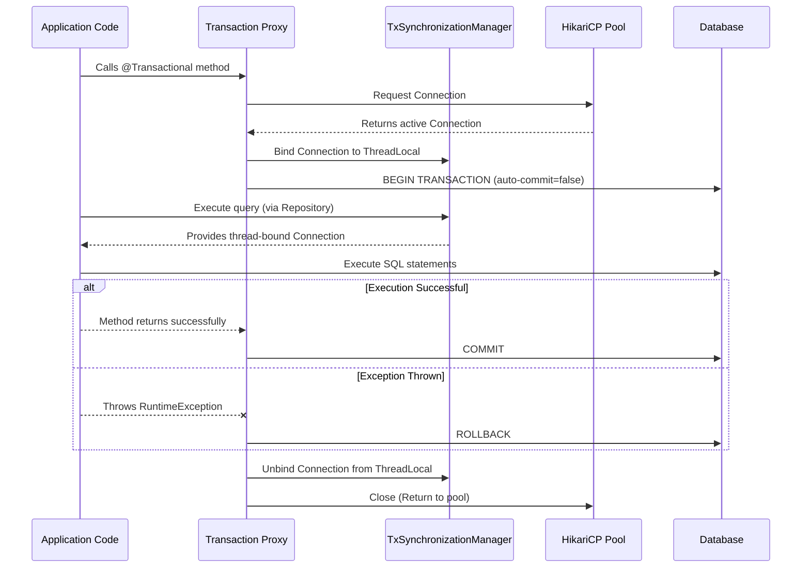

# Database Transactions and Connection Pooling

## 1. What is a transaction in the context of a database, and why is it important in Spring Boot? <Badge type="tip" text="easy" />

::: details View Answer
A transaction is a sequence of operations performed as a single logical unit of work. A logical unit of work must exhibit four properties, called the ACID (Atomicity, Consistency, Isolation, Durability) properties, to qualify as a transaction.
In Spring Boot, transactions are crucial because they ensure data integrity. If a business process involves multiple database operations (e.g., deducting funds from one account and adding to another), transaction management guarantees that either all operations succeed, or none do, preventing inconsistent database states if an error occurs midway.
:::

## 2. How do you enable transaction management in a Spring Boot application? <Badge type="tip" text="easy" />

::: details View Answer
In a standard Spring application, you typically enable transaction management by adding the `@EnableTransactionManagement` annotation to a configuration class. However, in Spring Boot, if you include a data access starter like `spring-boot-starter-data-jpa` or `spring-boot-starter-jdbc`, transaction management is automatically auto-configured for you. 
You simply need to annotate your service methods or classes with `@Transactional` to manage transactions.

```java
import org.springframework.stereotype.Service;
import org.springframework.transaction.annotation.Transactional;

@Service
public class UserService {

    @Transactional
    public void createUser() {
        // database operations
    }
}
```
:::

## 3. Explain the `@Transactional` annotation and its common attributes. <Badge type="warning" text="medium" />

::: details View Answer
The `@Transactional` annotation is used to declare that a method or class should be executed within a transactional context. Spring uses AOP to create a proxy around the class, intercepting calls to start, commit, or roll back transactions.

Common attributes include:
- `propagation`: Defines how the transaction relates to existing transactions (e.g., `REQUIRED`, `REQUIRES_NEW`).
- `isolation`: Defines the data isolation level (e.g., `READ_COMMITTED`, `SERIALIZABLE`).
- `timeout`: The maximum time the transaction is allowed to run before being rolled back.
- `readOnly`: A boolean flag that can be set to true for read-only queries to optimize performance.
- `rollbackFor`: Specifies which exception types must cause a transaction rollback.
- `noRollbackFor`: Specifies which exception types must *not* cause a rollback.
:::

## 4. What are the different propagation behaviors available in Spring's `@Transactional`? <Badge type="warning" text="medium" />

::: details View Answer
Spring defines seven propagation behaviors in the `Propagation` enum:
1. `REQUIRED` (Default): Joins the current transaction if one exists; otherwise, creates a new one.
2. `REQUIRES_NEW`: Always creates a new transaction, suspending the current one if it exists.
3. `SUPPORTS`: Executes within a transaction if one exists; otherwise, executes non-transactionally.
4. `NOT_SUPPORTED`: Always executes non-transactionally, suspending any existing transaction.
5. `MANDATORY`: Requires an existing transaction; throws an exception if none exists.
6. `NEVER`: Throws an exception if an active transaction exists.
7. `NESTED`: Executes within a nested transaction if a current transaction exists; otherwise, acts like `REQUIRED`.
:::

## 5. Explain `Propagation.REQUIRES_NEW` with an example. <Badge type="warning" text="medium" />

::: details View Answer
`REQUIRES_NEW` ensures that a new, independent transaction is always started. If an outer transaction exists, it is suspended until the new transaction completes. The inner transaction can commit or roll back independently of the outer transaction.

This is commonly used for audit logging, where you want to log an action regardless of whether the main business transaction succeeds or fails.

```java
@Service
public class OrderService {
    @Autowired
    private AuditLogService auditLogService;

    @Transactional(propagation = Propagation.REQUIRED)
    public void placeOrder(Order order) {
        auditLogService.logAudit("Attempting to place order"); // Commits even if placeOrder fails
        // Order processing logic that might throw an exception
    }
}

@Service
public class AuditLogService {
    @Transactional(propagation = Propagation.REQUIRES_NEW)
    public void logAudit(String message) {
        // Save audit log to DB
    }
}
```
:::

## 6. What is the difference between `Propagation.REQUIRED` and `Propagation.NESTED`? <Badge type="danger" text="hard" />

::: details View Answer
- `REQUIRED`: The inner method joins the same physical transaction as the outer method. If the inner method throws a runtime exception, the entire transaction (both inner and outer) is marked for rollback.
- `NESTED`: The inner method creates a savepoint within the outer transaction. If the inner method fails, the transaction rolls back only to the savepoint, allowing the outer transaction to catch the exception and potentially recover and commit. `NESTED` relies on JDBC savepoints and is not supported by all transaction managers (like Hibernate/JPA without specific dialect support).
:::

## 7. What are isolation levels, and how do you configure them in Spring Boot? <Badge type="warning" text="medium" />

::: details View Answer
Isolation levels determine how transaction integrity is visible to other concurrent transactions, addressing issues like dirty reads, non-repeatable reads, and phantom reads.

In Spring, you configure this using the `isolation` attribute of the `@Transactional` annotation.

```java
@Transactional(isolation = Isolation.SERIALIZABLE)
public void criticalOperation() {
    // ...
}
```
Available levels:
- `DEFAULT`: Uses the database's default isolation level.
- `READ_UNCOMMITTED`: Lowest level, allows dirty reads.
- `READ_COMMITTED`: Prevents dirty reads.
- `REPEATABLE_READ`: Prevents dirty and non-repeatable reads.
- `SERIALIZABLE`: Highest level, prevents dirty, non-repeatable, and phantom reads, usually by locking tables.
:::

## 8. What is the default isolation level in Spring, and what problems does it typically solve? <Badge type="warning" text="medium" />

::: details View Answer
The default isolation level in Spring is `Isolation.DEFAULT`. This means Spring defers to the underlying database's default isolation level.
For example:
- PostgreSQL and SQL Server default to `READ_COMMITTED`.
- MySQL (InnoDB) defaults to `REPEATABLE_READ`.

Assuming a database defaults to `READ_COMMITTED`, it solves the "dirty read" problem, ensuring that a transaction can only read data that has been successfully committed by other transactions. It does not prevent non-repeatable reads or phantom reads.
:::

## 9. How does Spring handle rollbacks in `@Transactional` by default? <Badge type="tip" text="easy" />

::: details View Answer
By default, Spring's `@Transactional` will only mark a transaction for rollback if an unchecked exception (`RuntimeException` or its subclasses) or an `Error` is thrown from the transactional method. 
If a checked exception (e.g., `IOException`, `SQLException`) is thrown, the transaction will **not** roll back automatically, and a commit will be attempted.
:::

## 10. How can you trigger a rollback for checked exceptions using `@Transactional`? <Badge type="warning" text="medium" />

::: details View Answer
You can override the default rollback behavior by using the `rollbackFor` attribute of the `@Transactional` annotation. You specify the class(es) of the checked exceptions that should trigger a rollback.

```java
@Transactional(rollbackFor = {CustomCheckedException.class, IOException.class})
public void processFile() throws CustomCheckedException, IOException {
    // If CustomCheckedException or IOException is thrown, the transaction will roll back.
}
```
Alternatively, you can use `rollbackFor = Exception.class` to roll back on any exception (checked or unchecked).
:::

## 11. What is the "self-invocation" problem with `@Transactional`, and how do you solve it? <Badge type="danger" text="hard" />

::: details View Answer
Because Spring uses proxy-based AOP, `@Transactional` only works when a method is called from *outside* the bean (through the proxy). If a method within the same class calls another `@Transactional` method within the same class, the proxy is bypassed, and the transaction is not initiated or propagated.

**Solutions:**
1. **Refactor**: Move the inner method to a different service class and inject it. (Best practice).
2. **Self-Injection**: Inject the class into itself using `@Autowired` or `@Lazy`.
3. **AspectJ**: Use AspectJ weaving instead of Spring AOP proxies, which modifies the actual bytecode and intercepts internal calls.

```java
// Example of the problem
@Service
public class MyService {
    public void nonTransactionalMethod() {
        // The transactional proxy is bypassed!
        transactionalMethod(); 
    }

    @Transactional
    public void transactionalMethod() { ... }
}
```
:::

## 12. What is connection pooling, and why is it necessary in a web application? <Badge type="tip" text="easy" />

::: details View Answer
Opening and closing database connections is a heavy and time-consuming network operation. Connection pooling is a technique where a cache (pool) of database connections is maintained in memory so they can be reused when future requests to the database are required.
It is necessary for web applications to handle multiple concurrent user requests efficiently. Instead of creating a new connection for every request, the application borrows a connection from the pool, uses it, and returns it, drastically reducing latency and database load.
:::

## 13. Which is the default connection pool in Spring Boot 2.x and later, and why? <Badge type="tip" text="easy" />

::: details View Answer
**HikariCP** is the default connection pool in Spring Boot 2.x and later.
It was chosen because of its incredible performance, reliability, and lightweight footprint. It is often benchmarked as the fastest Java connection pool. It achieves this through optimizations like byte-code level engineering, lock-free concurrent data structures, and a minimalist design.
:::

## 14. How do you configure HikariCP properties (like max pool size) in Spring Boot? <Badge type="warning" text="medium" />

::: details View Answer
You can configure HikariCP properties directly in your `application.properties` or `application.yml` file under the `spring.datasource.hikari.*` prefix.

```yaml
# application.yml
spring:
  datasource:
    url: jdbc:mysql://localhost:3306/mydb
    username: root
    password: password
    hikari:
      maximum-pool-size: 20
      minimum-idle: 5
      connection-timeout: 30000
      idle-timeout: 600000
      max-lifetime: 1800000
```
:::

## 15. What are the key properties to tune in HikariCP for optimal performance? <Badge type="warning" text="medium" />

::: details View Answer
- `maximum-pool-size`: The maximum number of connections the pool will keep open. Needs to be tuned based on database server limits and application concurrency.
- `minimum-idle`: The minimum number of idle connections HikariCP tries to maintain. Often set equal to `maximum-pool-size` for fixed-size pools, which provides the best performance.
- `connection-timeout`: Maximum number of milliseconds a client will wait for a connection from the pool.
- `max-lifetime`: Maximum lifetime of a connection in the pool. It should be a few seconds shorter than any database or infrastructure-imposed connection time limit.
:::

## 16. Explain the difference between read-only and read-write transactions in Spring. <Badge type="warning" text="medium" />

::: details View Answer
By setting `@Transactional(readOnly = true)`, you hint to the transaction manager that the transaction will only read data and not modify it.
- **Performance**: JPA providers like Hibernate can optimize read-only transactions by bypassing dirty checking (they don't need to track changes to entities to flush them).
- **Routing**: In primary-replica database setups, read-only transactions can be routed to read-only replicas, offloading the primary node.
- **Safety**: Some databases or JDBC drivers may reject `INSERT`/`UPDATE` statements if the connection is flagged as read-only.
:::

## 17. How does Spring's `PlatformTransactionManager` work under the hood? <Badge type="danger" text="hard" />

::: details View Answer
The `PlatformTransactionManager` is the core interface of Spring's transaction infrastructure. It abstracts the underlying transaction API (JDBC, JPA, JTA, etc.).

When a `@Transactional` method is invoked:
1. The AOP proxy intercepts the call.
2. It delegates to the `TransactionInterceptor`, which asks the `PlatformTransactionManager` to get a transaction (`getTransaction()`).
3. The Transaction Manager binds the database connection (or Hibernate Session) to the current executing thread using `ThreadLocal` (via `TransactionSynchronizationManager`).
4. The business logic executes using the bound connection.
5. If successful, the proxy tells the Transaction Manager to `commit()`. If an exception occurs, it calls `rollback()`.
6. The connection is unbound from the thread and returned to the pool.
:::

## 18. Can you manage transactions programmatically in Spring instead of using `@Transactional`? <Badge type="warning" text="medium" />

::: details View Answer
Yes, Spring provides the `TransactionTemplate` for programmatic transaction management. This is useful when you need fine-grained control over transaction boundaries, such as wrapping only a small block of code within a large method, rather than the whole method.

```java
@Service
public class MyService {
    private final TransactionTemplate transactionTemplate;

    public MyService(PlatformTransactionManager transactionManager) {
        this.transactionTemplate = new TransactionTemplate(transactionManager);
    }

    public void programmaticTransaction() {
        transactionTemplate.execute(status -> {
            try {
                // DB operations here
                return true;
            } catch (Exception e) {
                status.setRollbackOnly();
                return false;
            }
        });
    }
}
```
:::

## 19. What happens if a database connection times out while waiting for a lock in a transaction? <Badge type="danger" text="hard" />

::: details View Answer
If a database query waits for a lock longer than the database lock timeout, or if the overall transaction exceeds the `timeout` specified in `@Transactional(timeout = X)`, an exception is thrown.
- Typically, a database lock timeout results in a `CannotAcquireLockException` or `DeadlockLoserDataAccessException` (both subclasses of `DataAccessException`).
- Spring catches this, automatically marks the current transaction for rollback, and propagates the exception up the call stack. The connection is rolled back and safely returned to the HikariCP pool.
:::

## 20. Describe the lifecycle of a database connection when using Spring Data JPA and HikariCP. <Badge type="danger" text="hard" />

::: details View Answer
Below is a flowchart illustrating the lifecycle:



1. **Borrow**: The Spring transaction manager requests a connection from HikariCP.
2. **Bind**: The connection is bound to the current thread. Auto-commit is set to false.
3. **Execute**: JPA uses this bound connection for all queries in the transaction.
4. **End**: The transaction is committed or rolled back.
5. **Return**: The connection's state is reset (auto-commit=true) and it is returned to the HikariCP pool for reuse.
:::