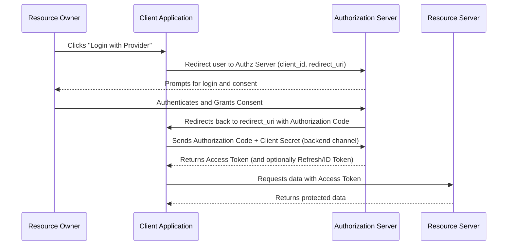

# Spring Security and OAuth2

## 1. What is Spring Security, and what are its core features? <Badge type="tip" text="easy" />

::: details View Answer
**Answer:**
Spring Security is a powerful, highly customizable authentication and access-control framework for Java applications. It is the de-facto standard for securing Spring-based applications.
Core features include:
- Comprehensive and extensible support for both Authentication (who you are) and Authorization (what you are allowed to do).
- Protection against common attacks like Session Fixation, Clickjacking, Cross-Site Request Forgery (CSRF).
- Seamless integration with Spring Web MVC and Spring Boot.
- Built-in support for various authentication mechanisms (e.g., Basic, Form, OAuth2, LDAP).
:::

## 2. Explain the core components of Spring Security architecture. <Badge type="warning" text="medium" />

::: details View Answer
**Answer:**
The core components of Spring Security include:
- `SecurityContextHolder`: Stores details of the currently authenticated user (`SecurityContext`).
- `SecurityContext`: Holds the `Authentication` object.
- `Authentication`: Represents the principal (user) and their credentials/authorities.
- `AuthenticationManager`: The API that defines how Spring Security's Filters perform authentication.
- `ProviderManager`: The most common implementation of `AuthenticationManager`. It delegates to a list of `AuthenticationProvider`s.
- `AuthenticationProvider`: Performs specific types of authentication (e.g., `DaoAuthenticationProvider` for database-backed authentication).
- `UserDetailsService`: A core interface which loads user-specific data.
:::

## 3. How do you secure a Spring Boot application using basic authentication? <Badge type="tip" text="easy" />

::: details View Answer
**Answer:**
Basic authentication can be enabled by simply adding the Spring Boot Starter Security dependency. Spring Boot auto-configures basic authentication by default.
To customize it programmatically, you define a `SecurityFilterChain` bean:

```java
import org.springframework.context.annotation.Bean;
import org.springframework.context.annotation.Configuration;
import org.springframework.security.config.annotation.web.builders.HttpSecurity;
import org.springframework.security.web.SecurityFilterChain;
import static org.springframework.security.config.Customizer.withDefaults;

@Configuration
public class SecurityConfig {

    @Bean
    public SecurityFilterChain filterChain(HttpSecurity http) throws Exception {
        http
            .authorizeHttpRequests((authz) -> authz
                .anyRequest().authenticated()
            )
            .httpBasic(withDefaults());
        return http.build();
    }
}
```
:::

## 4. What is the `SecurityFilterChain` in Spring Security, and how is it configured? <Badge type="warning" text="medium" />

::: details View Answer
**Answer:**
`SecurityFilterChain` is an interface used by `FilterChainProxy` to determine which Spring Security Filters should be invoked for a given request.
Instead of extending `WebSecurityConfigurerAdapter` (which is deprecated in Spring Security 5.7+), modern configuration registers a `SecurityFilterChain` bean.

```java
@Bean
public SecurityFilterChain securityFilterChain(HttpSecurity http) throws Exception {
    http
        .authorizeHttpRequests(auth -> auth
            .requestMatchers("/public/**").permitAll()
            .requestMatchers("/admin/**").hasRole("ADMIN")
            .anyRequest().authenticated()
        )
        .formLogin(Customizer.withDefaults());
    return http.build();
}
```
:::

## 5. Explain the role of `UserDetailsService` and `PasswordEncoder`. <Badge type="warning" text="medium" />

::: details View Answer
**Answer:**
- `UserDetailsService`: An interface with a single method, `loadUserByUsername(String username)`. It is used by `DaoAuthenticationProvider` to retrieve user details (username, password, granted authorities) from a persistent store (e.g., database) during authentication.
- `PasswordEncoder`: An interface for performing one-way hashing of passwords. Spring Security requires a `PasswordEncoder` bean to verify passwords securely without storing plaintext. `BCryptPasswordEncoder` is the most commonly used implementation.

```java
@Bean
public PasswordEncoder passwordEncoder() {
    return new BCryptPasswordEncoder();
}
```
:::

## 6. What is the difference between `@Secured`, `@RolesAllowed`, and `@PreAuthorize`? <Badge type="warning" text="medium" />

::: details View Answer
**Answer:**
All three are used for method-level security, but they have different origins and capabilities:
- `@Secured`: A legacy Spring-specific annotation used to specify a list of roles. Does not support Spring EL (Expression Language).
- `@RolesAllowed`: The JSR-250 Java standard equivalent to `@Secured`. Also doesn't support Spring EL.
- `@PreAuthorize`: The most powerful and recommended Spring Security annotation. It supports Spring EL, allowing complex access-control expressions (e.g., `@PreAuthorize("hasRole('ADMIN') or principal.username == #username")`).
:::

## 7. How does Method Security work in Spring Security? <Badge type="danger" text="hard" />

::: details View Answer
**Answer:**
Method security in Spring Security is implemented using Spring AOP (Aspect-Oriented Programming). When you enable method security (via `@EnableMethodSecurity`), Spring creates proxy objects around your beans.
When a secured method is invoked, the AOP interceptor (`MethodSecurityInterceptor`) intercepts the call:
1. It evaluates any pre-invocation annotations (like `@PreAuthorize` or `@PreFilter`) using the current `SecurityContext`.
2. If access is denied, an `AccessDeniedException` is thrown.
3. If allowed, the actual method executes.
4. After execution, post-invocation annotations (like `@PostAuthorize` or `@PostFilter`) are evaluated before returning the result to the caller.
:::

## 8. What is CORS, and how do you configure it in Spring Security? <Badge type="warning" text="medium" />

::: details View Answer
**Answer:**
CORS (Cross-Origin Resource Sharing) is a browser security feature that restricts cross-origin HTTP requests. To allow a frontend application on a different domain to access your API, you must configure CORS.
In Spring Security, you enable CORS using `http.cors()` and defining a `CorsConfigurationSource` bean.

```java
@Bean
public SecurityFilterChain filterChain(HttpSecurity http) throws Exception {
    http
        .cors(Customizer.withDefaults())
        .authorizeHttpRequests(auth -> auth.anyRequest().authenticated());
    return http.build();
}

@Bean
CorsConfigurationSource corsConfigurationSource() {
    CorsConfiguration configuration = new CorsConfiguration();
    configuration.setAllowedOrigins(Arrays.asList("https://example.com"));
    configuration.setAllowedMethods(Arrays.asList("GET","POST"));
    UrlBasedCorsConfigurationSource source = new UrlBasedCorsConfigurationSource();
    source.registerCorsConfiguration("/**", configuration);
    return source;
}
```
:::

## 9. What is CSRF, and how does Spring Security protect against it? <Badge type="warning" text="medium" />

::: details View Answer
**Answer:**
CSRF (Cross-Site Request Forgery) is an attack that forces an authenticated user to execute unwanted actions on a web application.
Spring Security protects against CSRF by implementing the Synchronizer Token Pattern. It generates a unique, unpredictable CSRF token for the user's session. State-changing requests (POST, PUT, DELETE) must include this token (either in a form field or an HTTP header, usually `X-CSRF-TOKEN`).
CSRF protection is enabled by default in Spring Security. For stateless REST APIs (where a token like JWT is used instead of cookies), CSRF is typically disabled:
```java
http.csrf(csrf -> csrf.disable());
```
:::

## 10. What is OAuth2, and how does it differ from traditional authentication? <Badge type="tip" text="easy" />

::: details View Answer
**Answer:**
OAuth2 is an industry-standard authorization protocol. It allows a user to grant a third-party application limited access to their resources without sharing their credentials (username/password).
**Differences:**
- Traditional Authentication is about identity ("Who are you?"), usually involving passing credentials directly to the server.
- OAuth2 is about delegated authorization ("What can this app do on my behalf?"). It issues an Access Token to the client, which is then used to access resources. (Though OIDC sits on top of OAuth2 to provide identity).
:::

## 11. Explain the OAuth2 Authorization Code Grant flow. <Badge type="warning" text="medium" />

::: details View Answer
**Answer:**
The Authorization Code Grant is the most common OAuth2 flow, used for web and mobile applications where the client backend can securely store a client secret.


:::

## 12. How do you integrate OAuth2 Login in a Spring Boot application? <Badge type="warning" text="medium" />

::: details View Answer
**Answer:**
Spring Boot makes OAuth2 login trivial via the `spring-boot-starter-oauth2-client` dependency.
1. Add the dependency to `pom.xml` / `build.gradle`.
2. Configure application properties for your provider (e.g., GitHub, Google):
```yaml
spring:
  security:
    oauth2:
      client:
        registration:
          github:
            client-id: your-client-id
            client-secret: your-client-secret
```
3. Configure the `SecurityFilterChain`:
```java
@Bean
public SecurityFilterChain filterChain(HttpSecurity http) throws Exception {
    http
        .authorizeHttpRequests(auth -> auth.anyRequest().authenticated())
        .oauth2Login(Customizer.withDefaults());
    return http.build();
}
```
:::

## 13. What is a JWT (JSON Web Token), and how is it used in Spring Security? <Badge type="warning" text="medium" />

::: details View Answer
**Answer:**
JWT is a compact, URL-safe means of representing claims to be transferred between two parties. It is heavily used in OAuth2 as an Access Token or ID Token.
In Spring Security, when acting as an OAuth2 Resource Server, you configure Spring to validate the incoming JWT's signature (using a JWK Set URI) and decode its claims. The claims are then converted into a `JwtAuthenticationToken`, which populates the `SecurityContext`.
:::

## 14. How do you implement a Resource Server in Spring Security with OAuth2? <Badge type="danger" text="hard" />

::: details View Answer
**Answer:**
A Resource Server protects APIs and validates Access Tokens sent by clients.
1. Add the `spring-boot-starter-oauth2-resource-server` dependency.
2. Provide the authorization server's JWK Set URI in your properties:
```yaml
spring:
  security:
    oauth2:
      resourceserver:
        jwt:
          jwk-set-uri: https://auth-server.com/.well-known/jwks.json
```
3. Configure HTTP Security to act as an OAuth2 Resource Server:
```java
@Bean
public SecurityFilterChain filterChain(HttpSecurity http) throws Exception {
    http
        .authorizeHttpRequests(auth -> auth
            .requestMatchers("/api/public").permitAll()
            .anyRequest().authenticated()
        )
        .oauth2ResourceServer(oauth2 -> oauth2.jwt(Customizer.withDefaults()));
    return http.build();
}
```
:::

## 15. What are Scopes and Authorities in OAuth2, and how does Spring Security map them? <Badge type="danger" text="hard" />

::: details View Answer
**Answer:**
In OAuth2, a **Scope** represents a permission granted to the client (e.g., `read:messages`). 
In Spring Security, permissions are typically represented as **GrantedAuthority** objects (e.g., `ROLE_USER`, `SCOPE_read`).
By default, Spring Security's `JwtAuthenticationConverter` extracts the `scope` or `scp` claim from a JWT and prefixes it with `SCOPE_`, creating authorities like `SCOPE_read:messages`.
To map these to custom authorities or roles, you can provide a custom `JwtAuthenticationConverter`:
```java
@Bean
public JwtAuthenticationConverter jwtAuthenticationConverter() {
    JwtGrantedAuthoritiesConverter grantedAuthoritiesConverter = new JwtGrantedAuthoritiesConverter();
    grantedAuthoritiesConverter.setAuthorityPrefix("ROLE_");
    grantedAuthoritiesConverter.setAuthoritiesClaimName("roles"); // use 'roles' claim instead of 'scope'

    JwtAuthenticationConverter jwtAuthenticationConverter = new JwtAuthenticationConverter();
    jwtAuthenticationConverter.setJwtGrantedAuthoritiesConverter(grantedAuthoritiesConverter);
    return jwtAuthenticationConverter;
}
```
:::

## 16. How do you handle custom authentication exceptions in Spring Security? <Badge type="warning" text="medium" />

::: details View Answer
**Answer:**
You handle exceptions using the `AuthenticationEntryPoint` (for unauthenticated users attempting to access secured resources) and `AccessDeniedHandler` (for authenticated users lacking sufficient privileges).

```java
@Bean
public SecurityFilterChain filterChain(HttpSecurity http) throws Exception {
    http
        .exceptionHandling(exceptions -> exceptions
            .authenticationEntryPoint((request, response, authException) -> {
                response.sendError(HttpServletResponse.SC_UNAUTHORIZED, "Unauthorized");
            })
            .accessDeniedHandler((request, response, accessDeniedException) -> {
                response.sendError(HttpServletResponse.SC_FORBIDDEN, "Forbidden");
            })
        );
    return http.build();
}
```
:::

## 17. What is the role of `AuthenticationManager` and `AuthenticationProvider`? <Badge type="danger" text="hard" />

::: details View Answer
**Answer:**
- `AuthenticationManager` is the primary interface for performing authentication. Its `authenticate()` method receives an unauthenticated `Authentication` object (like a `UsernamePasswordAuthenticationToken`) and returns a fully populated, authenticated one.
- `AuthenticationProvider` does the actual work. A `ProviderManager` (the default `AuthenticationManager`) contains a list of `AuthenticationProvider`s. It iterates through them until one supports the specific `Authentication` type and successfully authenticates it. For example, `DaoAuthenticationProvider` validates usernames/passwords against a database, while a `JwtAuthenticationProvider` validates JWT tokens.
:::

## 18. Explain how Spring Security handles session management and concurrent sessions. <Badge type="warning" text="medium" />

::: details View Answer
**Answer:**
Spring Security integrates closely with the Servlet container's session management. You can configure session fixation protection and concurrent session control (limiting how many active sessions a single user can have).

```java
http.sessionManagement(session -> session
    .sessionCreationPolicy(SessionCreationPolicy.IF_REQUIRED) // Or STATELESS for REST
    .sessionFixation().migrateSession()
    .maximumSessions(1) // Only one active session per user
    .maxSessionsPreventsLogin(true) // Prevent new logins when max reached
);
```
To make concurrent session control work, you must also register a `HttpSessionEventPublisher` bean so Spring Security is notified of session lifecycle events.
:::

## 19. How do you configure Multiple HttpSecurity instances in Spring Security? <Badge type="danger" text="hard" />

::: details View Answer
**Answer:**
You can define multiple `SecurityFilterChain` beans, each representing a different set of security rules for different endpoints. You use the `@Order` annotation to define the evaluation order. The first filter chain whose `securityMatcher` matches the request is applied.

```java
@Configuration
public class MultiSecurityConfig {
    
    @Bean
    @Order(1)
    public SecurityFilterChain apiFilterChain(HttpSecurity http) throws Exception {
        http
            .securityMatcher("/api/**") // Applies only to /api/**
            .authorizeHttpRequests(auth -> auth.anyRequest().hasRole("API_USER"))
            .httpBasic(Customizer.withDefaults());
        return http.build();
    }

    @Bean
    @Order(2)
    public SecurityFilterChain webFilterChain(HttpSecurity http) throws Exception {
        http
            .authorizeHttpRequests(auth -> auth.anyRequest().authenticated())
            .formLogin(Customizer.withDefaults());
        return http.build();
    }
}
```
:::

## 20. What is the difference between OIDC (OpenID Connect) and OAuth2, and how does Spring Boot support OIDC? <Badge type="danger" text="hard" />

::: details View Answer
**Answer:**
- **OAuth2** is an *authorization* framework. It grants access to APIs via Access Tokens.
- **OIDC (OpenID Connect)** is an *authentication* protocol built on top of OAuth2. It provides an `id_token` (a JWT) alongside the access token, which contains identity information about the user (e.g., email, name, profile picture), and standardizes the `/userinfo` endpoint.
Spring Boot's `oauth2Login()` automatically detects OIDC providers (by checking if the scopes include `openid`) and uses the `OidcUserService` to parse the ID Token and map OIDC claims to a `OidcUser` object in the `SecurityContext`.
:::