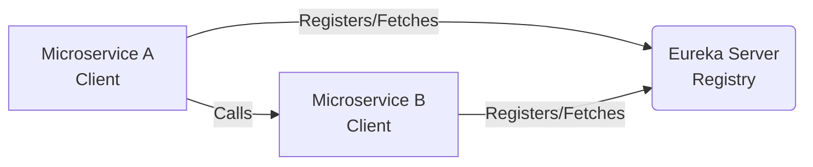

# Microservices and Spring Cloud

## 1. What is a Microservices Architecture? <Badge type="tip" text="easy" />

::: details View Answer
**Answer:**
Microservices Architecture is an architectural style that structures an application as a collection of loosely coupled, independently deployable, and highly maintainable services. Each microservice typically runs in its own process and communicates with other services via lightweight mechanisms, often an HTTP resource API.

**Key characteristics include:**
*   **Independent deployment:** Each service can be updated, deployed, and scaled independently.
*   **Business capability focus:** Services are organized around business capabilities rather than technical layers.
*   **Decentralized data management:** Each service typically manages its own database to ensure loose coupling.
*   **Polyglot persistence and programming:** Different services can be written in different programming languages and use different data storage technologies.
:::

## 2. What is Spring Cloud and how does it relate to Microservices? <Badge type="tip" text="easy" />

::: details View Answer
**Answer:**
Spring Cloud is a framework that provides developers with tools to quickly build some of the common patterns in distributed systems (e.g., configuration management, service discovery, circuit breakers, intelligent routing, micro-proxy, control bus, one-time tokens, global locks, leadership election, distributed sessions, cluster state).

While Spring Boot makes it easy to create stand-alone, production-grade Spring-based Applications, Spring Cloud provides the necessary infrastructure to manage these Spring Boot applications when they are deployed as microservices in a distributed environment. It seamlessly integrates with various cloud-native technologies like Netflix OSS (Eureka), HashiCorp Consul, Resilience4j, and Zipkin.
:::

## 3. What is Service Discovery and how is it implemented in Spring Cloud? <Badge type="warning" text="medium" />

::: details View Answer
**Answer:**
Service Discovery is a mechanism that allows microservices to dynamically locate each other on a network. In a microservices architecture, the physical IP addresses and ports of instances are dynamic (due to auto-scaling, failures, and updates). Hardcoding these locations is not feasible.

**Implementation in Spring Cloud:**
Spring Cloud commonly uses Netflix Eureka or HashiCorp Consul for Service Discovery. It consists of two parts:
1.  **Service Registry (Eureka Server):** A central server where all microservices register themselves.
2.  **Discovery Client (Eureka Client):** The microservices themselves, which register with the server and fetch the registry to locate other services.


:::

## 4. Explain how to configure a Eureka Server and a Eureka Client. <Badge type="warning" text="medium" />

::: details View Answer
**Answer:**
To set up Eureka, you need a Spring Boot application acting as the server and others as clients.

**Eureka Server:**
Add the `@EnableEurekaServer` annotation to the main class.
```java
@SpringBootApplication
@EnableEurekaServer
public class EurekaServerApplication {
    public static void main(String[] args) {
        SpringApplication.run(EurekaServerApplication.class, args);
    }
}
```
*application.yml (Server)*
```yaml
server:
  port: 8761
eureka:
  client:
    register-with-eureka: false
    fetch-registry: false
```

**Eureka Client:**
Add `@EnableDiscoveryClient` to the client's main class.
```java
@SpringBootApplication
@EnableDiscoveryClient
public class MyMicroserviceApplication {
    public static void main(String[] args) {
        SpringApplication.run(MyMicroserviceApplication.class, args);
    }
}
```
*application.yml (Client)*
```yaml
spring:
  application:
    name: my-microservice
eureka:
  client:
    service-url:
      defaultZone: http://localhost:8761/eureka/
```
:::

## 5. What is API Gateway and why is it needed in Microservices? <Badge type="warning" text="medium" />

::: details View Answer
**Answer:**
An API Gateway is a server that acts as a single entry point into a system. It sits between the client applications and the microservices.

**Why it's needed:**
*   **Routing:** It routes incoming requests to the appropriate microservice based on the URL path.
*   **Cross-cutting concerns:** It handles authentication, authorization, SSL termination, and rate limiting in one place rather than replicating this logic in every service.
*   **Aggregation:** It can aggregate responses from multiple microservices into a single response, reducing the number of round trips the client needs to make.
*   **Protocol Translation:** It can translate between web protocols (like HTTP/REST) and internal protocols (like gRPC or AMQP).
:::

## 6. How do you implement an API Gateway using Spring Cloud Gateway? <Badge type="warning" text="medium" />

::: details View Answer
**Answer:**
Spring Cloud Gateway provides a simple, yet effective way to route to APIs and provide cross-cutting concerns to them such as security, monitoring/metrics, and resiliency.

**Example Configuration:**
```yaml
spring:
  cloud:
    gateway:
      routes:
      - id: user_service_route
        uri: lb://USER-SERVICE  # Load balances to services registered as USER-SERVICE
        predicates:
        - Path=/users/**
        filters:
        - AddRequestHeader=X-Request-Source, Gateway
```
In this configuration, any request coming to the gateway with the path `/users/**` will be routed to the `USER-SERVICE` discovered via Eureka, using a load balancer (`lb://`). A custom header `X-Request-Source` will also be added before forwarding.
:::

## 7. What is Client-side Load Balancing and how does Spring Cloud handle it? <Badge type="warning" text="medium" />

::: details View Answer
**Answer:**
Client-side Load Balancing means the client (or an API Gateway) holds the list of available server instances and applies a load balancing algorithm (like Round Robin) to select one before making a request. This removes the need for a dedicated hardware or software load balancer in the middle.

**Handling in Spring Cloud:**
Spring Cloud uses **Spring Cloud LoadBalancer** (replacing the deprecated Netflix Ribbon). It integrates seamlessly with Eureka Client to get the list of instances.

When using `RestTemplate` or `WebClient`, you can add the `@LoadBalanced` annotation to automatically apply load balancing:
```java
@Bean
@LoadBalanced
public RestTemplate restTemplate() {
    return new RestTemplate();
}
```
Alternatively, Spring Cloud OpenFeign integrates with Spring Cloud LoadBalancer by default.
:::

## 8. What is the Circuit Breaker pattern and how is it used in Spring Cloud? <Badge type="danger" text="hard" />

::: details View Answer
**Answer:**
The Circuit Breaker pattern prevents an application from repeatedly trying to execute an operation that's likely to fail. It wraps a fragile method call in a circuit breaker object, which monitors for failures.

**States:**
*   **CLOSED:** Normal operation; requests flow through. If failures exceed a threshold, it transitions to OPEN.
*   **OPEN:** The circuit is "tripped." Requests fail immediately without hitting the backend, giving the downstream service time to recover.
*   **HALF-OPEN:** After a timeout, the circuit lets a limited number of test requests through. If they succeed, it closes; if they fail, it re-opens.

Spring Cloud previously used Netflix Hystrix, but now standardized on **Resilience4j**. It helps to provide fallback mechanisms when a service is down.
:::

## 9. How do you implement Resilience4j Circuit Breaker in a Spring Boot application? <Badge type="danger" text="hard" />

::: details View Answer
**Answer:**
First, add the `spring-cloud-starter-circuitbreaker-resilience4j` dependency.
Then, you can use annotations to protect your service calls and provide a fallback method.

```java
@Service
public class InventoryService {

    @CircuitBreaker(name = "inventoryService", fallbackMethod = "fallbackInventory")
    public String checkInventory(String productId) {
        // Code that calls an external service which might fail
        return restTemplate.getForObject("http://inventory-service/items/" + productId, String.class);
    }

    public String fallbackInventory(String productId, Throwable t) {
        return "Fallback: Inventory is currently unavailable for product " + productId;
    }
}
```
Configuration in `application.yml`:
```yaml
resilience4j.circuitbreaker:
  instances:
    inventoryService:
      slidingWindowSize: 10
      failureRateThreshold: 50
      waitDurationInOpenState: 10000
```
:::

## 10. What is Spring Cloud Config and why is it useful? <Badge type="warning" text="medium" />

::: details View Answer
**Answer:**
Spring Cloud Config provides server-side and client-side support for externalized configuration in a distributed system.

**Why it's useful:**
*   **Centralized Management:** Instead of keeping `application.yml` files in every microservice, you store them in a central repository (like Git, SVN, or Vault).
*   **Environment Specificity:** You can manage configurations for different environments (dev, test, prod) centrally.
*   **Dynamic Updates:** Configuration changes can be propagated to running applications without requiring a restart or rebuild.
:::

## 11. How do you refresh properties dynamically in Spring Cloud Config without restarting the application? <Badge type="warning" text="medium" />

::: details View Answer
**Answer:**
To achieve dynamic configuration refresh:
1.  **Actuator Dependency:** Ensure `spring-boot-starter-actuator` is added to the client application.
2.  **@RefreshScope:** Annotate the Spring beans (like `@RestController` or `@Service`) that use `@Value` with `@RefreshScope`. This tells Spring to recreate these beans when a refresh event occurs.
    ```java
    @RestController
    @RefreshScope
    public class MessageController {
        @Value("${message:Hello Default}")
        private String message;

        @GetMapping("/message")
        public String getMessage() {
            return message;
        }
    }
    ```
3.  **Trigger Refresh:** Expose the actuator refresh endpoint by configuring `management.endpoints.web.exposure.include=refresh`.
4.  **Execute:** Send an empty HTTP POST request to `/actuator/refresh` on the client application. The client will fetch the updated configuration from the Config Server.
:::

## 12. What is Spring Cloud OpenFeign? <Badge type="warning" text="medium" />

::: details View Answer
**Answer:**
Spring Cloud OpenFeign is a declarative REST client. It makes writing web service clients easier. Instead of using `RestTemplate` or `WebClient` and writing boilerplate code for HTTP requests, you define an interface and annotate it.

Spring Cloud OpenFeign handles the creation of the proxy implementation, URL construction, serialization/deserialization, and integrates seamlessly with Spring Cloud LoadBalancer and Resilience4j.

**Example:**
```java
@FeignClient(name = "user-service")
public interface UserClient {

    @GetMapping("/users/{id}")
    User getUserById(@PathVariable("id") Long id);
}
```
You can simply autowire `UserClient` and call `getUserById`, and Feign will execute an HTTP request to the `user-service`.
:::

## 13. How does Distributed Tracing work in Spring Cloud? <Badge type="danger" text="hard" />

::: details View Answer
**Answer:**
In a microservices architecture, a single user request might span multiple microservices. Distributed tracing is the process of tracking that request across the entire system.

It works by assigning unique IDs:
*   **Trace ID:** A unique identifier for the entire transaction/request flowing through the system.
*   **Span ID:** A unique identifier for a specific operation within a microservice. A trace consists of a tree of spans.

Spring Boot 3 uses **Micrometer Tracing** (formerly Spring Cloud Sleuth). Micrometer automatically instruments common libraries (like RestTemplate, WebClient, Feign, MVC) to extract trace headers from incoming requests and inject them into outgoing requests.
:::

## 14. What is the difference between Micrometer Tracing (formerly Sleuth) and Zipkin? <Badge type="warning" text="medium" />

::: details View Answer
**Answer:**
*   **Micrometer Tracing (Sleuth):** This is a library that runs *inside* your Spring Boot application. Its job is to generate the Trace IDs and Span IDs, propagate them via HTTP headers (like B3 headers), and collect timing data for operations. It logs this information locally.
*   **Zipkin:** This is an external, dedicated server (UI and datastore) for distributed tracing. It acts as an aggregator. Microservices send their tracing data (spans) to the Zipkin server asynchronously. Developers use the Zipkin UI to visualize latency, search for specific traces, and identify bottlenecks across the microservice ecosystem.

Micrometer Tracing *generates* the data; Zipkin *collects and visualizes* it.
:::

## 15. What is Spring Cloud Bus? <Badge type="danger" text="hard" />

::: details View Answer
**Answer:**
Spring Cloud Bus links nodes of a distributed system with a lightweight message broker (like RabbitMQ or Kafka). It is primarily used to broadcast state changes across the cluster.

**Common Use Case:**
Broadcasting configuration changes. Instead of sending a POST to `/actuator/refresh` on *every single instance* of a microservice when configuration changes in Spring Cloud Config, you send a POST to `/actuator/busrefresh` on one instance or the Config Server. Spring Cloud Bus will publish an event to the message broker, and all connected microservices will consume the event and refresh their configurations simultaneously.
:::

## 16. How does the Saga pattern solve distributed transaction problems in microservices? <Badge type="danger" text="hard" />

::: details View Answer
**Answer:**
Traditional ACID transactions (Two-Phase Commit) don't scale well in microservices because they lock databases and tightly couple services.

The Saga pattern manages distributed transactions using a sequence of local transactions. Each local transaction updates the database and publishes a message or event to trigger the next local transaction in the saga.

If a local transaction fails because it violates a business rule, the saga executes a series of **compensating transactions** that undo the changes made by the preceding local transactions.

**Types:**
1.  **Choreography:** Each service publishes events, and other services listen and act. (No central coordinator).
2.  **Orchestration:** A central Saga Orchestrator tells participating services what local transactions to execute.
:::

## 17. What is the role of Spring Cloud Contract? <Badge type="danger" text="hard" />

::: details View Answer
**Answer:**
Spring Cloud Contract implements Consumer-Driven Contracts (CDC). In microservices, services communicate via APIs. If a provider service changes its API, it can break consumer services.

Spring Cloud Contract allows you to write "contracts" (usually in Groovy or YAML) defining the expected request and response between a consumer and a provider.
*   The provider uses the contract to generate automated integration tests to ensure it honors the contract.
*   The contract is used to generate wiremock stubs. Consumers use these stubs during their testing to ensure they are calling the provider correctly, without needing the actual provider to be running.
:::

## 18. Explain the Bulkhead pattern in the context of Resilience4j. <Badge type="danger" text="hard" />

::: details View Answer
**Answer:**
The Bulkhead pattern isolates different parts of an application so that a failure in one part doesn't bring down the whole system (named after the partitions in a ship's hull).

In Resilience4j, it limits the number of concurrent executions to a specific service or resource.

**Implementations in Resilience4j:**
1.  **SemaphoreBulkhead:** Uses Semaphores to limit the number of concurrent calls. If the limit is reached, further calls are rejected immediately.
2.  **ThreadPoolBulkhead:** Uses a bounded queue and a thread pool. Calls are offloaded to this specific thread pool. If the pool and queue are full, it rejects calls.

```java
@Bulkhead(name = "backendA", type = Bulkhead.Type.THREADPOOL)
public CompletableFuture<String> doSomethingAsync() {
    // ...
}
```
:::

## 19. What are the differences between Choreography and Orchestration in Microservices? <Badge type="warning" text="medium" />

::: details View Answer
**Answer:**
These are two patterns for coordinating interactions between microservices.

*   **Choreography:** Services work together by publishing and subscribing to events asynchronously (e.g., using Kafka or RabbitMQ). There is no central controller. It is highly decoupled but can become difficult to track the flow of a business process (the "dancing" happens organically).
*   **Orchestration:** A central controller (the Orchestrator) manages the workflow. It calls microservices synchronously or asynchronously, waits for responses, and dictates the next step. It's easier to understand the flow, but the orchestrator can become a single point of failure or a bottleneck (tightly coupled to the controller).
:::

## 20. How do you secure Microservices using Spring Cloud and OAuth2? <Badge type="danger" text="hard" />

::: details View Answer
**Answer:**
Securing microservices usually involves centralizing authentication and authorizing requests at the API Gateway and service levels.

1.  **Authorization Server (e.g., Keycloak, Okta, Spring Authorization Server):** Issues JWT (JSON Web Tokens) upon successful user authentication.
2.  **API Gateway:** Acts as an OAuth2 Client or Resource Server. It validates the JWT token. If valid, it forwards the request to downstream services, often passing the JWT token in the `Authorization: Bearer <token>` header.
3.  **Downstream Microservices:** Act as OAuth2 Resource Servers. They validate the JWT signature (using a JWK set URI) and extract claims (roles, scopes) to perform fine-grained authorization using annotations like `@PreAuthorize("hasAuthority('SCOPE_read')")`.

This prevents each microservice from having to implement user authentication logic.
:::