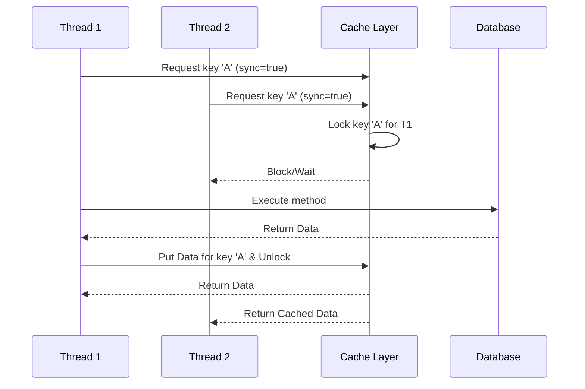

# Caching and Performance Optimization

## What is the role of caching in a Spring Boot application, and how do you enable it? <Badge type="tip" text="easy" />

::: details View Answer
**Answer:**
Caching plays a crucial role in performance optimization by storing the results of expensive operations (like database queries or complex calculations) in a fast-access storage (the cache). When the same operation is requested again, the application can serve the result directly from the cache instead of executing the expensive operation anew, significantly reducing response times and server load.

To enable caching in a Spring Boot application, you need to:
1. Add the `@EnableCaching` annotation to one of your configuration classes (usually the main application class).
2. Configure a `CacheManager` (Spring Boot auto-configures one if a supported cache provider is on the classpath).

```java
import org.springframework.boot.SpringApplication;
import org.springframework.boot.autoconfigure.SpringBootApplication;
import org.springframework.cache.annotation.EnableCaching;

@SpringBootApplication
@EnableCaching
public class MyApplication {
    public static void main(String[] args) {
        SpringApplication.run(MyApplication.class, args);
    }
}
```
:::

## Which annotation is used to trigger cache population, and how does it work? <Badge type="tip" text="easy" />

::: details View Answer
**Answer:**
The `@Cacheable` annotation is used to trigger cache population. When placed on a method, Spring intercepts the method call. It first checks if a value for the generated key already exists in the specified cache.
- If it **does exist**, the cached value is returned, and the method is *not* executed.
- If it **does not exist**, the method is executed, its return value is stored in the cache, and then the value is returned to the caller.

```java
import org.springframework.cache.annotation.Cacheable;
import org.springframework.stereotype.Service;

@Service
public class BookService {

    @Cacheable("books")
    public Book findBookById(Long id) {
        // This will only be executed if the book is not in the "books" cache
        return database.findById(id); 
    }
}
```
:::

## Explain the difference between `@CachePut` and `@Cacheable`. <Badge type="warning" text="medium" />

::: details View Answer
**Answer:**
- `@Cacheable`: Primarily used for *reading* data. It checks the cache first; if the data is present, it returns it without executing the method. If absent, it runs the method and caches the result.
- `@CachePut`: Used for *updating* data in the cache. It **always** executes the method and then updates the cache with the new result. This is useful for update or create operations where you want to ensure the cache stays synchronized with the database without bypassing the method execution.

```java
@Service
public class UserService {

    // Caches the user on read
    @Cacheable(value = "users", key = "#user.id")
    public User getUser(User user) {
        return userRepository.findById(user.getId());
    }

    // Always executes and updates the cache
    @CachePut(value = "users", key = "#user.id")
    public User updateUser(User user) {
        return userRepository.save(user);
    }
}
```
:::

## How can you remove an item from a cache or clear the entire cache in Spring Boot? <Badge type="warning" text="medium" />

::: details View Answer
**Answer:**
You use the `@CacheEvict` annotation to remove items from the cache. This is typically used when data is deleted or significantly modified, rendering the cached version stale.

- **Evicting a specific entry:** By specifying the cache name and the key, you can remove a single entry.
- **Clearing the entire cache:** By setting the `allEntries` attribute to `true`, you can remove all entries from the specified cache.

```java
@Service
public class ProductService {

    // Evicts a single product by ID
    @CacheEvict(value = "products", key = "#id")
    public void deleteProduct(Long id) {
        productRepository.deleteById(id);
    }

    // Clears the entire "products" cache
    @CacheEvict(value = "products", allEntries = true)
    public void refreshAllProducts() {
        // logic to refresh products
    }
}
```
:::

## Describe the use of `@Caching` annotation. <Badge type="warning" text="medium" />

::: details View Answer
**Answer:**
The `@Caching` annotation is a grouping annotation that allows you to apply multiple caching operations (like `@Cacheable`, `@CachePut`, or `@CacheEvict`) on a single method. This is especially useful when a single method affects multiple caches or requires a combination of eviction and put operations.

```java
import org.springframework.cache.annotation.Caching;
import org.springframework.cache.annotation.CacheEvict;
import org.springframework.cache.annotation.CachePut;

@Service
public class CustomerService {

    @Caching(
        evict = { @CacheEvict(value = "customerList", allEntries = true) },
        put   = { @CachePut(value = "customers", key = "#customer.id") }
    )
    public Customer importCustomer(Customer customer) {
        return customerRepository.save(customer);
    }
}
```
:::

## What are the common cache providers supported by Spring Boot out of the box? <Badge type="tip" text="easy" />

::: details View Answer
**Answer:**
Spring Boot provides auto-configuration for several widely used cache providers. Some of the most common ones include:
1. **ConcurrentMapCache:** The default, simple in-memory cache using `ConcurrentHashMap`. Suitable for testing and simple applications.
2. **Caffeine:** A high-performance, near-optimal in-memory caching library for Java 8+.
3. **Redis:** A popular in-memory data structure store, used as a database, cache, and message broker. Excellent for distributed caching.
4. **EhCache:** A widely used, robust, and full-featured in-memory cache.
5. **Hazelcast:** An in-memory data grid that can be used for distributed caching.
6. **JCache (JSR-107):** The standard caching API for Java, supported by various underlying providers.
:::

## How do you configure Redis as a cache provider in a Spring Boot application? <Badge type="warning" text="medium" />

::: details View Answer
**Answer:**
To configure Redis as the cache provider:

1. **Add Dependency:** Add the `spring-boot-starter-data-redis` dependency to your `pom.xml` or `build.gradle`.
```xml
<dependency>
    <groupId>org.springframework.boot</groupId>
    <artifactId>spring-boot-starter-data-redis</artifactId>
</dependency>
```

2. **Properties Configuration:** Configure the Redis connection in `application.properties` or `application.yml`. Spring Boot auto-configures the `RedisCacheManager` if the dependency is present.
```properties
spring.data.redis.host=localhost
spring.data.redis.port=6379
```

3. **Enable Caching:** Ensure `@EnableCaching` is present on a configuration class. Spring Boot will automatically detect Redis and create a `RedisCacheManager`.
:::

## How can you define custom cache keys using SpEL (Spring Expression Language)? <Badge type="warning" text="medium" />

::: details View Answer
**Answer:**
Spring allows the use of SpEL expressions in the `key` attribute of caching annotations to dynamically compute the cache key based on method arguments or other context.

- `#root.methodName`: The name of the cached method.
- `#root.args[0]`: The first argument of the method.
- `#argumentName`: The argument by its name.

```java
@Service
public class OrderService {

    // Key will be the orderId concatenated with the customerId
    @Cacheable(value = "orders", key = "#orderId + '-' + #customerId")
    public Order getOrderDetails(Long orderId, Long customerId) {
        return orderRepository.findByIdAndCustomerId(orderId, customerId);
    }

    // Accessing properties of an object argument
    @Cacheable(value = "users", key = "#request.username")
    public User findUser(UserRequest request) {
        return userRepository.findByUsername(request.getUsername());
    }
}
```
:::

## What happens if a method annotated with `@Cacheable` throws an exception? <Badge type="warning" text="medium" />

::: details View Answer
**Answer:**
By default, if a method annotated with `@Cacheable` throws an exception, the exception is propagated to the caller, and **nothing is stored in the cache**. 

This is the desired behavior in most cases, as you typically only want to cache successful results. If you cached an error state or a partial result, subsequent calls would receive that erroneous cached data instead of re-attempting the operation. The cache is only updated if the method executes successfully and returns a value.
:::

## How can you implement conditional caching in Spring Boot? <Badge type="warning" text="medium" />

::: details View Answer
**Answer:**
You can use the `condition` and `unless` attributes of `@Cacheable`, `@CachePut`, and `@CacheEvict` to selectively cache data based on SpEL expressions.

- **`condition`:** The cache operation is evaluated *before* method execution. If the expression evaluates to `false`, caching is completely bypassed (the method executes, but the result is not cached, nor is the cache checked beforehand).
- **`unless`:** The expression is evaluated *after* method execution. If it evaluates to `true`, the result is **not** cached.

```java
@Service
public class DataService {

    // Only cache if the string length is greater than 3
    @Cacheable(value = "data", condition = "#query.length() > 3")
    public String search(String query) {
        return slowSearch(query);
    }

    // Do NOT cache if the returned list is empty
    @Cacheable(value = "results", unless = "#result.isEmpty()")
    public List<String> getResults() {
        return slowDatabaseQuery();
    }
}
```
:::

## Discuss the concept of Cache Eviction policies. Why are they important for performance? <Badge type="warning" text="medium" />

::: details View Answer
**Answer:**
Cache eviction policies determine how a cache manages its limited storage space by deciding which items to remove when the cache is full or when data becomes stale.

Common policies include:
- **LRU (Least Recently Used):** Discards the least recently accessed items first.
- **LFU (Least Frequently Used):** Discards items accessed least often.
- **TTL (Time to Live):** Items are evicted after a specified duration, regardless of access patterns.
- **FIFO (First In, First Out):** Discards the oldest items first.

**Importance for Performance:**
1. **Memory Management:** Prevents the application from running out of memory (OOM errors) by bounding the cache size.
2. **Data Freshness:** TTL policies ensure that stale data is periodically refreshed, maintaining data accuracy.
3. **Hit Rate Optimization:** Policies like LRU keep the most relevant and frequently accessed data in memory, maximizing the cache hit rate and overall application speed.
:::

## How does Spring Boot handle caching for methods with no parameters? <Badge type="tip" text="easy" />

::: details View Answer
**Answer:**
When a method has no parameters, Spring uses a `SimpleKeyGenerator` to generate a default key. For a method with zero arguments, it generates a `SimpleKey.EMPTY`.

```java
@Service
public class ConfigService {

    // The key generated will be SimpleKey.EMPTY
    @Cacheable("globalConfig")
    public Configuration getGlobalConfig() {
        return database.loadConfig();
    }
}
```
If you have multiple zero-argument methods using the same cache name, they will overwrite each other's cache entries because they share the same default key. To fix this, you should specify a custom key.

```java
@Cacheable(value = "globalConfig", key = "'mySpecificConfigKey'")
public Configuration getGlobalConfig() { ... }
```
:::

## How can you mock or disable caching during unit testing? <Badge type="danger" text="hard" />

::: details View Answer
**Answer:**
Caching can interfere with unit tests, as tests might read stale data from previous test runs. There are a few ways to disable it:

1. **Using a No-Op Cache Manager:** Spring provides a `NoOpCacheManager` specifically for testing. You can define it in a test configuration class.
```java
@TestConfiguration
public class CacheTestConfig {
    @Bean
    public CacheManager cacheManager() {
        return new NoOpCacheManager();
    }
}
```

2. **Using Profiles:** Do not apply `@EnableCaching` on the main application class. Instead, put it on a configuration class tied to a specific profile (e.g., `@Profile("!test")`).

3. **Application Properties:** If using a specific provider (like Redis), you can switch to `spring.cache.type=none` in your `application-test.properties`. This auto-configures the `NoOpCacheManager`.
:::

## Explain how Spring's cache abstraction handles concurrent requests for the same cache key. <Badge type="danger" text="hard" />

::: details View Answer
**Answer:**
By default, Spring's cache abstraction does **not** handle concurrent requests for the same key gracefully. If multiple threads simultaneously request a value for a key that is not yet in the cache, they might all execute the expensive underlying method. This is known as a "Cache Stampede".

**Solution:**
Starting with Spring 4.3, you can use the `sync` attribute in `@Cacheable`.

```java
@Cacheable(value = "expensiveData", key = "#id", sync = true)
public Data getExpensiveData(Long id) {
    return slowQuery(id);
}
```

When `sync = true`, Spring synchronizes access to the cache for that specific key. Only one thread will execute the method, while the others block and wait for the result to be placed in the cache. Once the first thread finishes and caches the result, the waiting threads will retrieve the value from the cache.


:::

## What is the purpose of the `CacheManager` interface in Spring? <Badge type="warning" text="medium" />

::: details View Answer
**Answer:**
The `CacheManager` is the core SPI (Service Provider Interface) in Spring's cache abstraction. It acts as a bridge between the Spring application and the underlying caching library (like Redis, Caffeine, or EhCache). 

Its primary responsibilities are:
1. **Cache Resolution:** It provides access to individual `Cache` instances by name (e.g., getting the "users" cache).
2. **Lifecycle Management:** It manages the creation, configuration, and destruction of these underlying cache structures.

By programming against the `CacheManager` and `Cache` interfaces, Spring applications remain agnostic to the actual caching implementation, allowing developers to switch providers by simply changing the `CacheManager` bean configuration without modifying application code.
:::

## How would you optimize the performance of a Spring Boot application dealing with large database result sets? <Badge type="warning" text="medium" />

::: details View Answer
**Answer:**
Loading large result sets entirely into memory can cause `OutOfMemoryError` or severe garbage collection pauses. Optimizations include:

1. **Pagination:** Use Spring Data JPA's `Pageable` interface to fetch data in small chunks.
```java
Page<User> findAll(Pageable pageable);
```
2. **Streaming Results:** Instead of returning a `List`, return a `Stream`. JPA will keep the cursor open and fetch rows one by one (requires execution within a transaction).
```java
@Transactional(readOnly = true)
@Query("SELECT u FROM User u")
Stream<User> streamAllUsers();
```
3. **Projections:** Fetch only the columns you need using DTOs or interface-based projections instead of fetching the entire entity.
4. **Keyset Pagination (Seek Pagination):** For very deep pagination, using the last seen ID is much faster than `OFFSET/LIMIT`.
:::

## Explain the N+1 problem in JPA and how to resolve it for performance optimization. <Badge type="danger" text="hard" />

::: details View Answer
**Answer:**
The N+1 select problem occurs when an ORM framework executes 1 query to retrieve an entity, and then N additional queries to fetch its lazily-loaded associations.

For example, fetching 100 `Authors` and then accessing their `Books` collection might result in 1 query for authors and 100 separate queries for books.

**Solutions in Spring Boot / Hibernate:**
1. **Fetch JOIN:** Use the `JOIN FETCH` keyword in JPQL to retrieve the entity and its association in a single query.
```java
@Query("SELECT a FROM Author a JOIN FETCH a.books")
List<Author> findAllAuthorsWithBooks();
```
2. **Entity Graphs:** Define `@NamedEntityGraph` on the entity or use `@EntityGraph` on the repository method to specify which attributes should be fetched eagerly for a specific query.
```java
@EntityGraph(attributePaths = {"books"})
List<Author> findAll();
```
3. **Hibernate `@BatchSize`:** Instructs Hibernate to load associations in batches (e.g., fetch books for 50 authors at a time) rather than one by one.
:::

## How can asynchronous processing using `@Async` improve the performance of a Spring Boot application? <Badge type="warning" text="medium" />

::: details View Answer
**Answer:**
The `@Async` annotation allows a method to be executed in a separate thread. This improves performance (specifically, perceived response time and throughput) for operations where the main thread doesn't need the immediate result.

For example, if a user registers, you might want to save the user to the DB and send a welcome email. Sending the email can be slow. By annotating the email sending method with `@Async`, the main thread can save the user and immediately return a response to the client, while a background thread handles the email.

```java
@Service
public class EmailService {

    @Async
    public void sendWelcomeEmail(User user) {
        // Slow operation like SMTP interaction
    }
}
```
*Note: You must add `@EnableAsync` to a configuration class to activate this feature.*
:::

## What are connection pools, and how do they impact the performance of Spring Boot applications (e.g., HikariCP)? <Badge type="danger" text="hard" />

::: details View Answer
**Answer:**
A connection pool is a cache of database connections maintained so that connections can be reused when future requests to the database are required. 

Opening a new physical connection to a database is an expensive and time-consuming operation (involving network handshakes, authentication, etc.). 

**Impact on Performance:**
- **Reduced Latency:** By reusing existing open connections from the pool, the application avoids the overhead of creating new connections, resulting in much faster database interactions.
- **Resource Management:** It limits the maximum number of concurrent connections to the database, preventing the database server from being overwhelmed by too many simultaneous clients.

Spring Boot 2.x and later use **HikariCP** as the default connection pool because of its exceptional performance, reliability, and lightweight footprint.
:::

## Explain how to monitor and profile Spring Boot applications to identify performance bottlenecks. <Badge type="danger" text="hard" />

::: details View Answer
**Answer:**
To optimize performance, you must first measure it. 

1. **Spring Boot Actuator:** Provides endpoints (like `/actuator/metrics`, `/actuator/threaddump`, `/actuator/heapdump`) to monitor application health, memory usage, thread states, and HTTP request timings.
2. **Micrometer:** Spring Boot uses Micrometer to expose metrics to various monitoring systems (like Prometheus, Datadog, New Relic). You can create custom timers to measure specific method executions.
```java
@Timed(value = "order.processing.time", description = "Time taken to process order")
public void processOrder() { ... }
```
3. **APM (Application Performance Monitoring) Tools:** Tools like Dynatrace, New Relic, or open-source solutions like Apache SkyWalking attach to the JVM as agents and trace requests end-to-end, visualizing where time is spent (e.g., DB queries, external API calls).
4. **Profilers:** Tools like VisualVM, JProfiler, or Java Flight Recorder (JFR) allow deep analysis of CPU usage, memory leaks, and garbage collection behavior at the JVM level.
:::