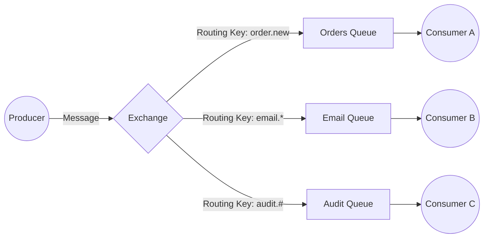
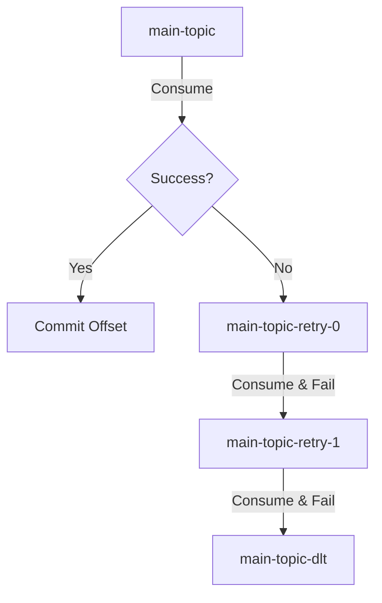

# Messaging, Kafka, and RabbitMQ

## 1. What is AMQP and how does RabbitMQ implement it? <Badge type="tip" text="easy" />

::: details View Answer
**Answer:**
AMQP (Advanced Message Queuing Protocol) is an open standard application layer protocol for message-oriented middleware. It defines features like message orientation, queuing, routing (including point-to-point and publish-and-subscribe), reliability, and security.

RabbitMQ is an implementation of the AMQP protocol. It provides a robust, highly available, and scalable message broker that supports AMQP natively, providing elements like Exchanges, Queues, and Bindings to manage message routing.
:::

## 2. Explain the core differences between RabbitMQ and Apache Kafka. <Badge type="warning" text="medium" />

::: details View Answer
**Answer:**
- **Architecture:** RabbitMQ is a traditional message broker based on queues. Messages are deleted once consumed and acknowledged. Kafka is a distributed event streaming platform built on an append-only log model, where messages are retained for a configurable period even after consumption.
- **Routing:** RabbitMQ provides complex routing capabilities via exchanges (Direct, Topic, Fanout, etc.). Kafka has simpler routing, relying primarily on Topics and Partitions.
- **Performance & Scaling:** Kafka is designed for high throughput and massive scalability, handling millions of messages per second. RabbitMQ handles lower throughput but excels in complex routing and low-latency delivery.
- **Message Replay:** Kafka allows consumers to replay messages by resetting their offsets. RabbitMQ does not support message replay natively since messages are dequeued upon processing.
:::

## 3. How do you configure a connection to RabbitMQ in a Spring Boot application? <Badge type="tip" text="easy" />

::: details View Answer
**Answer:**
In Spring Boot, you add the `spring-boot-starter-amqp` dependency. Spring Boot's auto-configuration will automatically set up the connection using properties defined in `application.yml`.

```yaml
spring:
  rabbitmq:
    host: localhost
    port: 5672
    username: guest
    password: guest
    virtual-host: /
```
:::

## 4. What is a `RabbitTemplate` and how is it used? <Badge type="tip" text="easy" />

::: details View Answer
**Answer:**
`RabbitTemplate` is the central component in Spring AMQP for sending and receiving messages synchronously. It abstracts the boilerplate code required to interact with the RabbitMQ broker.

```java
import org.springframework.amqp.rabbit.core.RabbitTemplate;
import org.springframework.stereotype.Service;

@Service
public class MessageSender {
    private final RabbitTemplate rabbitTemplate;

    public MessageSender(RabbitTemplate rabbitTemplate) {
        this.rabbitTemplate = rabbitTemplate;
    }

    public void sendMessage(String exchange, String routingKey, Object message) {
        rabbitTemplate.convertAndSend(exchange, routingKey, message);
    }
}
```
:::

## 5. Explain the different types of Exchanges in RabbitMQ. <Badge type="warning" text="medium" />

::: details View Answer
**Answer:**
Exchanges receive messages from producers and route them to queues.
- **Direct Exchange:** Routes messages to a queue based on an exact match between the message's routing key and the queue's binding key.
- **Topic Exchange:** Routes messages based on a wildcard match of the routing key (`*` for one word, `#` for zero or more words).
- **Fanout Exchange:** Broadcasts messages to all bound queues, completely ignoring the routing key.
- **Headers Exchange:** Routes messages based on multiple message header attributes rather than the routing key.


:::

## 6. How do you consume messages from a RabbitMQ queue in Spring Boot? <Badge type="tip" text="easy" />

::: details View Answer
**Answer:**
You consume messages using the `@RabbitListener` annotation on a method. The queue must exist or be declared in the application context.

```java
import org.springframework.amqp.rabbit.annotation.RabbitListener;
import org.springframework.stereotype.Component;

@Component
public class MessageConsumer {

    @RabbitListener(queues = "my.queue")
    public void receiveMessage(String message) {
        System.out.println("Received: " + message);
    }
}
```
:::

## 7. How does Spring Boot handle RabbitMQ message serialization/deserialization? <Badge type="warning" text="medium" />

::: details View Answer
**Answer:**
By default, Spring Boot uses `SimpleMessageConverter`, which handles standard Java types (Strings, byte arrays, Serializable objects). For modern applications, it is standard to exchange JSON data. You can achieve this by configuring a `Jackson2JsonMessageConverter` Bean.

```java
import org.springframework.amqp.support.converter.Jackson2JsonMessageConverter;
import org.springframework.amqp.support.converter.MessageConverter;
import org.springframework.context.annotation.Bean;
import org.springframework.context.annotation.Configuration;

@Configuration
public class RabbitConfig {
    @Bean
    public MessageConverter jsonMessageConverter() {
        return new Jackson2JsonMessageConverter();
    }
}
```
:::

## 8. Explain how manual message acknowledgment (ACK) works in Spring AMQP. <Badge type="warning" text="medium" />

::: details View Answer
**Answer:**
By default, Spring AMQP automatically acknowledges messages once the listener method completes successfully. If you need fine-grained control to prevent message loss on failure, you can enable manual acknowledgments.

Configure in `application.yml`:
```yaml
spring:
  rabbitmq:
    listener:
      simple:
        acknowledge-mode: manual
```

And in the listener:
```java
import com.rabbitmq.client.Channel;
import org.springframework.amqp.core.Message;
import org.springframework.amqp.rabbit.annotation.RabbitListener;
import org.springframework.stereotype.Component;
import java.io.IOException;

@Component
public class ManualAckConsumer {

    @RabbitListener(queues = "my.queue")
    public void process(Message message, Channel channel) throws IOException {
        long deliveryTag = message.getMessageProperties().getDeliveryTag();
        try {
            // Process the message...
            channel.basicAck(deliveryTag, false); // Acknowledge successful processing
        } catch (Exception e) {
            // Reject the message and requeue it
            channel.basicNack(deliveryTag, false, true); 
        }
    }
}
```
:::

## 9. What is a Dead Letter Exchange (DLX) in RabbitMQ and how do you configure it in Spring Boot? <Badge type="danger" text="hard" />

::: details View Answer
**Answer:**
A Dead Letter Exchange (DLX) is an exchange to which messages are routed when they cannot be delivered successfully. Common reasons include the message being rejected (with requeue=false), TTL (Time-To-Live) expiration, or queue length limit exceeded.

You configure a DLX by passing arguments to the queue definition.

```java
import org.springframework.amqp.core.*;
import org.springframework.context.annotation.Bean;
import org.springframework.context.annotation.Configuration;

@Configuration
public class DlxConfig {

    @Bean
    public DirectExchange deadLetterExchange() {
        return new DirectExchange("dlx.exchange");
    }

    @Bean
    public Queue deadLetterQueue() {
        return new Queue("dlx.queue");
    }

    @Bean
    public Binding dlxBinding() {
        return BindingBuilder.bind(deadLetterQueue()).to(deadLetterExchange()).with("dlx.routing.key");
    }

    @Bean
    public Queue mainQueue() {
        return QueueBuilder.durable("main.queue")
                .withArgument("x-dead-letter-exchange", "dlx.exchange")
                .withArgument("x-dead-letter-routing-key", "dlx.routing.key")
                .build();
    }
}
```
:::

## 10. What is Apache Kafka and what are its core concepts? <Badge type="tip" text="easy" />

::: details View Answer
**Answer:**
Apache Kafka is a distributed, high-throughput, horizontally scalable event streaming platform. 
Core concepts include:
- **Broker:** A single Kafka server that stores and manages streams of records.
- **Topic:** A logical channel or category to which records are published.
- **Partition:** Topics are divided into partitions for scalability. Each partition is an ordered, immutable sequence of records.
- **Offset:** A unique sequential identifier assigned to each record within a partition, used to track consumption.
:::

## 11. How do you configure a Kafka Producer in Spring Boot? <Badge type="tip" text="easy" />

::: details View Answer
**Answer:**
Include the `spring-kafka` dependency and set the bootstrap servers and serializers in `application.yml`.

```yaml
spring:
  kafka:
    bootstrap-servers: localhost:9092
    producer:
      key-serializer: org.apache.kafka.common.serialization.StringSerializer
      value-serializer: org.apache.kafka.common.serialization.StringSerializer
```
:::

## 12. How does the `KafkaTemplate` work in Spring Boot? <Badge type="tip" text="easy" />

::: details View Answer
**Answer:**
`KafkaTemplate` wraps the Kafka Producer API, providing convenient methods for sending messages (records) to Kafka topics.

```java
import org.springframework.kafka.core.KafkaTemplate;
import org.springframework.stereotype.Service;

@Service
public class KafkaProducerService {
    private final KafkaTemplate<String, String> kafkaTemplate;

    public KafkaProducerService(KafkaTemplate<String, String> kafkaTemplate) {
        this.kafkaTemplate = kafkaTemplate;
    }

    public void sendMessage(String topic, String key, String message) {
        kafkaTemplate.send(topic, key, message);
    }
}
```
:::

## 13. How do you configure a Kafka Consumer and use `@KafkaListener`? <Badge type="tip" text="easy" />

::: details View Answer
**Answer:**
Consumers are configured via application properties. The `@KafkaListener` annotation binds a method to listen to one or multiple topics.

```yaml
spring:
  kafka:
    consumer:
      group-id: my-group-id
      auto-offset-reset: earliest
      key-deserializer: org.apache.kafka.common.serialization.StringDeserializer
      value-deserializer: org.apache.kafka.common.serialization.StringDeserializer
```

```java
import org.springframework.kafka.annotation.KafkaListener;
import org.springframework.stereotype.Service;

@Service
public class KafkaConsumerService {

    @KafkaListener(topics = "my-topic", groupId = "my-group-id")
    public void listen(String message) {
        System.out.println("Received: " + message);
    }
}
```
:::

## 14. What are Consumer Groups in Kafka and how does Spring Boot handle them? <Badge type="warning" text="medium" />

::: details View Answer
**Answer:**
A Consumer Group is a set of consumers working together to consume data from a topic. Kafka ensures that each partition in a topic is consumed by exactly one consumer within a given consumer group. This allows for parallel processing.
In Spring Boot, the group is specified using the `groupId` property on the `@KafkaListener` annotation or via the `spring.kafka.consumer.group-id` property.
:::

## 15. How do you handle offsets and manual commits in Spring for Apache Kafka? <Badge type="danger" text="hard" />

::: details View Answer
**Answer:**
To manually commit offsets, you must disable auto-commit and change the acknowledgment mode to `MANUAL` or `MANUAL_IMMEDIATE`.

```yaml
spring:
  kafka:
    listener:
      ack-mode: manual
    consumer:
      enable-auto-commit: false
```

You then inject the `Acknowledgment` object into your `@KafkaListener` method:

```java
import org.springframework.kafka.annotation.KafkaListener;
import org.springframework.kafka.support.Acknowledgment;
import org.springframework.stereotype.Component;

@Component
public class ManualOffsetConsumer {

    @KafkaListener(topics = "my-topic")
    public void listen(String message, Acknowledgment ack) {
        try {
            // Process message
            ack.acknowledge(); // Commit offset
        } catch (Exception e) {
            // Handle error, do not acknowledge
        }
    }
}
```
:::

## 16. How does Spring Kafka support error handling and retries (e.g., RetryTopic/DLT)? <Badge type="danger" text="hard" />

::: details View Answer
**Answer:**
Spring Kafka offers robust support for non-blocking retries using the `@RetryableTopic` annotation. It automatically creates retry topics and a Dead Letter Topic (DLT). If a message processing fails, it gets forwarded to a retry topic with a backoff, and eventually to the DLT if all retries are exhausted.

```java
import org.springframework.kafka.annotation.KafkaListener;
import org.springframework.kafka.annotation.RetryableTopic;
import org.springframework.retry.annotation.Backoff;
import org.springframework.stereotype.Component;

@Component
public class ResilientConsumer {

    @RetryableTopic(
        attempts = "3",
        backoff = @Backoff(delay = 1000, multiplier = 2.0),
        autoCreateTopics = "true"
    )
    @KafkaListener(topics = "main-topic")
    public void listen(String message) {
        if (message.contains("error")) {
            throw new RuntimeException("Simulated processing failure");
        }
    }
}
```


:::

## 17. Explain the difference between `send()` and `sendDefault()` in `KafkaTemplate`. <Badge type="warning" text="medium" />

::: details View Answer
**Answer:**
- `send(topic, data)`: Explicitly sends the message to the specified topic.
- `sendDefault(data)`: Sends the message to a default topic that has been configured for the `KafkaTemplate` (usually specified via `spring.kafka.template.default-topic` property).
:::

## 18. How do you implement a request-reply pattern over messaging in Spring Boot? <Badge type="danger" text="hard" />

::: details View Answer
**Answer:**
Messaging is inherently asynchronous, but you can achieve a synchronous request-reply pattern. Spring Kafka provides `ReplyingKafkaTemplate` for this purpose. It sends a message with a correlation ID and a reply-to topic, and blocks (or returns a Future) until the consumer replies to the specified reply topic with the matching correlation ID.

```java
// Assuming ReplyingKafkaTemplate is configured as a Bean
ProducerRecord<String, RequestObj> record = new ProducerRecord<>("request-topic", requestObj);
RequestReplyFuture<String, RequestObj, ReplyObj> replyFuture = replyingKafkaTemplate.sendAndReceive(record);

// Block and get the reply
ConsumerRecord<String, ReplyObj> consumerRecord = replyFuture.get();
ReplyObj reply = consumerRecord.value();
```
:::

## 19. What is Spring Cloud Stream and how does it abstract Kafka/RabbitMQ? <Badge type="warning" text="medium" />

::: details View Answer
**Answer:**
Spring Cloud Stream is a framework for building highly scalable, event-driven microservices. It abstracts away the boilerplate of connecting to message brokers. Developers write core business logic using standard Java `java.util.function` interfaces (`Supplier`, `Function`, `Consumer`), and Spring Cloud Stream binds these functional interfaces to message broker destinations (topics/exchanges) using "Binders" (e.g., `spring-cloud-stream-binder-kafka`).

```java
@Configuration
public class StreamConfig {
    
    // Acts as a consumer
    @Bean
    public Consumer<String> processMessage() {
        return message -> System.out.println("Processed: " + message);
    }
}
```
:::

## 20. How do you handle message serialization/deserialization for custom Java objects in Spring Kafka? <Badge type="warning" text="medium" />

::: details View Answer
**Answer:**
You configure Kafka to use JSON serialization by pointing the serializers to Spring Kafka's `JsonSerializer` and `JsonDeserializer`. You also need to trust packages so the consumer can safely deserialize the classes.

```yaml
spring:
  kafka:
    producer:
      value-serializer: org.springframework.kafka.support.serializer.JsonSerializer
    consumer:
      value-deserializer: org.springframework.kafka.support.serializer.JsonDeserializer
      properties:
        spring.json.trusted.packages: "com.example.myapp.dto"
```
:::