# Asynchronous Processing and Scheduling

## 1. What is the `@Async` annotation in Spring Boot, and what does it do? <Badge type="tip" text="easy" />

::: details View Answer
The `@Async` annotation in Spring is used to mark a method as a candidate for asynchronous execution. When a method annotated with `@Async` is called, it executes in a separate thread, allowing the caller to continue its execution without waiting for the asynchronous method to finish. This is highly useful for long-running tasks, such as sending emails, making API calls, or performing heavy computations, without blocking the main application thread.
:::

## 2. How do you enable asynchronous processing in a Spring Boot application? <Badge type="tip" text="easy" />

::: details View Answer
To enable asynchronous processing, you need to add the `@EnableAsync` annotation to one of your configuration classes or the main application class.

```java
import org.springframework.boot.SpringApplication;
import org.springframework.boot.autoconfigure.SpringBootApplication;
import org.springframework.scheduling.annotation.EnableAsync;

@SpringBootApplication
@EnableAsync
public class MyApplication {
    public static void main(String[] args) {
        SpringApplication.run(MyApplication.class, args);
    }
}
```
:::

## 3. What are the two main requirements for the `@Async` annotation to work on a method? <Badge type="tip" text="easy" />

::: details View Answer
For `@Async` to work properly:
1. It must be applied to `public` methods. The AOP proxy needs to be able to intercept the method call.
2. The method must not be called from within the same class. Calling it from another method in the same class bypasses the proxy and executes the method synchronously.
:::

## 4. How do you handle exceptions thrown by a void return type `@Async` method? <Badge type="warning" text="medium" />

::: details View Answer
Exceptions thrown by `@Async` methods with a `void` return type cannot be caught by the calling thread. Instead, you need to configure an `AsyncUncaughtExceptionHandler`.

```java
import org.springframework.aop.interceptor.AsyncUncaughtExceptionHandler;
import org.springframework.context.annotation.Configuration;
import org.springframework.scheduling.annotation.AsyncConfigurer;
import java.lang.reflect.Method;

@Configuration
public class AsyncConfig implements AsyncConfigurer {
    @Override
    public AsyncUncaughtExceptionHandler getAsyncUncaughtExceptionHandler() {
        return new CustomAsyncExceptionHandler();
    }
}

class CustomAsyncExceptionHandler implements AsyncUncaughtExceptionHandler {
    @Override
    public void handleUncaughtException(Throwable ex, Method method, Object... params) {
        System.out.println("Exception message - " + ex.getMessage());
        System.out.println("Method name - " + method.getName());
    }
}
```
:::

## 5. Can an `@Async` method return a value? If so, how? <Badge type="warning" text="medium" />

::: details View Answer
Yes, an `@Async` method can return a value, but it must be wrapped in a `CompletableFuture` (or `Future`, `ListenableFuture`). This allows the caller to check the status or retrieve the result later.

```java
@Async
public CompletableFuture<String> performTask() throws InterruptedException {
    Thread.sleep(1000);
    return CompletableFuture.completedFuture("Task finished!");
}
```
:::

## 6. What happens if you call an `@Async` method from another method within the same class? <Badge type="warning" text="medium" />

::: details View Answer
If you call an `@Async` method from within the same class, the method will execute synchronously. This happens because Spring's `@Async` relies on Spring AOP, which creates a proxy around the bean. Internal method calls do not go through the proxy, so the asynchronous behavior is not triggered.
:::

## 7. How can you configure a custom `TaskExecutor` for `@Async` methods? <Badge type="warning" text="medium" />

::: details View Answer
You can define a custom `TaskExecutor` bean. If you name the bean or specify it in the `@Async` annotation, Spring will use it instead of the default `SimpleAsyncTaskExecutor`.

```java
@Bean(name = "customExecutor")
public Executor taskExecutor() {
    ThreadPoolTaskExecutor executor = new ThreadPoolTaskExecutor();
    executor.setCorePoolSize(2);
    executor.setMaxPoolSize(5);
    executor.setQueueCapacity(500);
    executor.setThreadNamePrefix("MyAsyncThread-");
    executor.initialize();
    return executor;
}
```
You can then use it like this: `@Async("customExecutor")`.
:::

## 8. What is the `@Scheduled` annotation used for in Spring Boot? <Badge type="tip" text="easy" />

::: details View Answer
The `@Scheduled` annotation is used to run tasks periodically in a Spring application. It allows you to define a method that should be executed at a fixed interval, with a fixed delay, or according to a cron expression.
:::

## 9. How do you enable scheduling in a Spring Boot application? <Badge type="tip" text="easy" />

::: details View Answer
You enable scheduling by adding the `@EnableScheduling` annotation to a configuration class or the main application class.

```java
@SpringBootApplication
@EnableScheduling
public class MyApplication {
    // ...
}
```
:::

## 10. What is the difference between `fixedRate` and `fixedDelay` in `@Scheduled`? <Badge type="warning" text="medium" />

::: details View Answer
- **`fixedRate`**: Specifies the interval between the start times of consecutive executions. It doesn't wait for the previous execution to finish. If a task takes longer than the rate, multiple executions can overlap (if the scheduler is multithreaded).
- **`fixedDelay`**: Specifies the delay between the *completion* of the previous execution and the *start* of the next execution. It guarantees that consecutive executions will never overlap.

```mermaid
gantt
    title FixedRate vs FixedDelay
    dateFormat s
    axisFormat %S
    
    section fixedRate (2s)
    Task 1 (takes 1s) : a1, 0, 1s
    Task 2 (starts after 2s) : a2, 2, 1s
    Task 3 (starts after 4s) : a3, 4, 1s
    
    section fixedDelay (2s)
    Task A (takes 1s) : b1, 0, 1s
    Task B (starts 2s after A ends) : b2, 3, 1s
    Task C (starts 2s after B ends) : b3, 6, 1s
```


:::

## 11. How can you use cron expressions with the `@Scheduled` annotation? <Badge type="tip" text="easy" />

::: details View Answer
You can use the `cron` attribute of the `@Scheduled` annotation to specify a cron expression for complex scheduling needs (e.g., "run at 10 AM every weekday").

```java
// Runs every weekday at 10:00 AM
@Scheduled(cron = "0 0 10 * * MON-FRI")
public void executeTask() {
    System.out.println("Executing task using cron");
}
```
:::

## 12. What are the constraints on a method annotated with `@Scheduled`? <Badge type="warning" text="medium" />

::: details View Answer
A method annotated with `@Scheduled` must satisfy two conditions:
1. It must have a `void` return type.
2. It must not accept any arguments.
:::

## 13. How do you run scheduled tasks asynchronously to avoid blocking each other? <Badge type="danger" text="hard" />

::: details View Answer
By default, Spring uses a single-threaded task scheduler. If one `@Scheduled` task takes a long time, it blocks other tasks. To solve this, you can:
1. Combine `@Scheduled` with `@Async` on the method.
2. Provide a custom `TaskScheduler` bean with a thread pool.

```java
@Bean
public TaskScheduler taskScheduler() {
    ThreadPoolTaskScheduler scheduler = new ThreadPoolTaskScheduler();
    scheduler.setPoolSize(5);
    scheduler.setThreadNamePrefix("MyScheduler-");
    return scheduler;
}
```
:::

## 14. How can you externalize `@Scheduled` parameters like fixed delay or cron expressions to `application.properties`? <Badge type="warning" text="medium" />

::: details View Answer
You can use Spring Expression Language (SpEL) or property placeholders inside the `@Scheduled` annotation attributes like `fixedDelayString`, `fixedRateString`, or `cron`.

```java
// application.properties
// jobs.cron.schedule=0 0 * * * *
// jobs.fixed.delay=5000

@Scheduled(cron = "${jobs.cron.schedule}")
public void runCronTask() { }

@Scheduled(fixedDelayString = "${jobs.fixed.delay}")
public void runFixedDelayTask() { }
```
:::

## 15. What is the `TaskScheduler` interface, and how do you customize it? <Badge type="danger" text="hard" />

::: details View Answer
The `TaskScheduler` interface is a core Spring abstraction for scheduling tasks. By default, Spring Boot uses a single-threaded `TaskScheduler`. You can customize it by defining a `ThreadPoolTaskScheduler` bean. This allows multiple scheduled tasks to run concurrently.

```java
@Configuration
public class SchedulingConfig implements SchedulingConfigurer {
    @Override
    public void configureTasks(ScheduledTaskRegistrar taskRegistrar) {
        ThreadPoolTaskScheduler scheduler = new ThreadPoolTaskScheduler();
        scheduler.setPoolSize(10);
        scheduler.initialize();
        taskRegistrar.setTaskScheduler(scheduler);
    }
}
```
:::

## 16. How does Spring Boot handle `@Async` and `@Transactional` together? <Badge type="danger" text="hard" />

::: details View Answer
When both `@Async` and `@Transactional` are applied to a method, Spring executes the method in a new thread (due to `@Async`). Because transactions are thread-local in Spring, the asynchronous method will start a *new* transaction independently of the calling thread's transaction. If the caller's transaction rolls back, the asynchronous method's transaction might still commit, and vice versa.
:::

## 17. Explain the `AsyncUncaughtExceptionHandler` interface. <Badge type="warning" text="medium" />

::: details View Answer
`AsyncUncaughtExceptionHandler` is an interface used to handle exceptions thrown by asynchronous methods that have a `void` return type. Since these methods do not return a `Future` or `CompletableFuture`, the calling thread cannot catch their exceptions. Implementing this interface allows you to define a centralized error-handling strategy for such cases.
:::

## 18. How can you test asynchronous methods in Spring Boot? <Badge type="danger" text="hard" />

::: details View Answer
Testing `@Async` methods can be tricky because the test thread might finish before the async task completes. You can use tools like Awaitility to wait for a certain condition or use `CompletableFuture.get()` in tests.

```java
@Test
void testAsyncMethod() throws Exception {
    CompletableFuture<String> future = asyncService.doWork();
    
    // Block and wait for result in the test
    String result = future.get(5, TimeUnit.SECONDS); 
    assertEquals("Success", result);
}
```
:::

## 19. What are common pitfalls to avoid when using `@Async`? <Badge type="warning" text="medium" />

::: details View Answer
Common pitfalls include:
- **Calling the method from the same class:** This bypasses the proxy, leading to synchronous execution.
- **Forgetting `@EnableAsync`:** The annotation is ignored without this configuration.
- **Not handling `void` return exceptions:** Uncaught exceptions can be silently swallowed without an `AsyncUncaughtExceptionHandler`.
- **Thread pool starvation:** Using the default `SimpleAsyncTaskExecutor` (which creates a new thread for every task) under high load can crash the application due to out-of-memory errors. Always define a bounded `ThreadPoolTaskExecutor`.
:::

## 20. How do you configure ShedLock or similar tools to prevent multiple instances of a scheduled task from running simultaneously in a clustered environment? <Badge type="danger" text="hard" />

::: details View Answer
In a distributed/clustered application, a `@Scheduled` task will run on every node. To prevent this, you can use a distributed lock mechanism like ShedLock. ShedLock uses an external data store (e.g., a database, Redis, or MongoDB) to ensure a task is executed at most once at the same time across all nodes.

```xml
<!-- Dependency -->
<dependency>
    <groupId>net.javacrumbs.shedlock</groupId>
    <artifactId>shedlock-spring</artifactId>
    <version>5.2.0</version>
</dependency>
<dependency>
    <groupId>net.javacrumbs.shedlock</groupId>
    <artifactId>shedlock-provider-jdbc-template</artifactId>
    <version>5.2.0</version>
</dependency>
```

```java
@Configuration
@EnableScheduling
@EnableSchedulerLock(defaultLockAtMostFor = "10m")
public class ShedLockConfig {
    @Bean
    public LockProvider lockProvider(DataSource dataSource) {
        return new JdbcTemplateLockProvider(dataSource);
    }
}

// Usage
@Scheduled(cron = "0 * * * * *")
@SchedulerLock(name = "scheduledTaskName", lockAtLeastFor = "5s", lockAtMostFor = "14m")
public void scheduledTask() {
    // Only one instance will run this at a time
}
```
:::