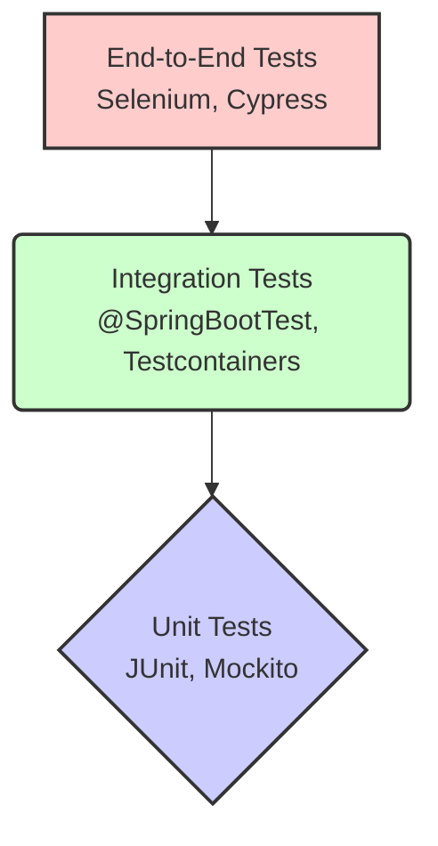

# Testing: JUnit, Mockito, and Testcontainers

## What is the purpose of `@SpringBootTest`? <Badge type="tip" text="easy" />

::: details View Answer
`@SpringBootTest` is an annotation provided by Spring Boot used for integration testing. It tells Spring Boot to search for a main configuration class (one with `@SpringBootApplication`) and use it to start a complete Spring application context for the tests.

**Example:**
```java
@SpringBootTest
class MyApplicationTests {
    @Test
    void contextLoads() {
        // Test that the context successfully loads
    }
}
```
Unlike unit tests, which are isolated and fast, tests annotated with `@SpringBootTest` load the entire application, making them slower but crucial for verifying that the application's components work together correctly.
:::

## What is Mockito and how is it used in Spring Boot testing? <Badge type="tip" text="easy" />

::: details View Answer
Mockito is a popular mocking framework for Java. In Spring Boot testing, it is used to create mock objects (fake versions of real classes or interfaces) to isolate the code being tested. By mocking dependencies, you can control their behavior and verify interactions without relying on external systems like databases or web services.

In unit tests, you typically use `@Mock` and `@InjectMocks`. In Spring integration tests, you use `@MockBean` to replace a bean in the application context with a mock.
:::

## Explain the difference between `@Mock` and `@MockBean`. <Badge type="tip" text="easy" />

::: details View Answer
- **`@Mock`**: A standard Mockito annotation used to create a mock instance of a class or interface. It does not interact with the Spring application context and is used for pure unit testing alongside `@ExtendWith(MockitoExtension.class)`.
- **`@MockBean`**: A Spring Boot annotation used to add mock objects to the Spring application context. If a bean of the specified type already exists, it is replaced by the mock. This is particularly useful in integration tests (`@SpringBootTest` or slice tests like `@WebMvcTest`) when you want to mock only a specific dependency (e.g., a service in a controller test).
:::

## What is the role of JUnit 5 `@Test` annotation? <Badge type="tip" text="easy" />

::: details View Answer
The `@Test` annotation in JUnit 5 (`org.junit.jupiter.api.Test`) marks a method as a test method. JUnit 5 discovers these methods and executes them during the test phase. Unlike JUnit 4, the JUnit 5 `@Test` annotation does not accept attributes like `expected` (for exceptions) or `timeout`; these are handled by separate assertions and annotations.
:::

## How do you assert exceptions in JUnit 5? <Badge type="tip" text="easy" />

::: details View Answer
In JUnit 5, you use the `assertThrows` method to verify that a specific exception is thrown by a piece of code. It returns the thrown exception, allowing you to further assert its properties (like the message).

**Example:**
```java
@Test
void testExceptionIsThrown() {
    IllegalArgumentException exception = assertThrows(IllegalArgumentException.class, () -> {
        myService.doSomething(-1); // Method that should throw the exception
    });
    
    assertEquals("Invalid input", exception.getMessage());
}
```
:::

## What is `@WebMvcTest` used for? <Badge type="tip" text="easy" />

::: details View Answer
`@WebMvcTest` is a Spring Boot annotation used for "slice testing" the web layer (controllers). It focuses only on testing Spring MVC components and does not load the full application context. Components like `@Service`, `@Repository`, or `@Component` are not loaded into the context, so they must be mocked using `@MockBean`.

**Example:**
```java
@WebMvcTest(UserController.class)
class UserControllerTest {
    @Autowired
    private MockMvc mockMvc;

    @MockBean
    private UserService userService;
    // ...
}
```
:::

## What is Testcontainers? <Badge type="tip" text="easy" />

::: details View Answer
Testcontainers is a Java library that provides lightweight, throwaway instances of common databases, Selenium web browsers, or anything else that can run in a Docker container. It is widely used in integration testing to spin up real, isolated dependencies (like PostgreSQL, Redis, Kafka) instead of using in-memory databases (like H2) or shared external instances.
:::

## How do you mock a void method in Mockito? <Badge type="warning" text="medium" />

::: details View Answer
In Mockito, to mock a method that returns `void` (e.g., to throw an exception or just to perform a specific action), you cannot use the standard `when(...).then(...)` syntax because `when()` requires a non-void return type. Instead, you use `doThrow()`, `doAnswer()`, or `doNothing()`.

**Example:**
```java
// Mocking a void method to throw an exception
doThrow(new RuntimeException("Error")).when(myMock).voidMethod();

// Mocking a void method to do nothing (default behavior, but can be explicit)
doNothing().when(myMock).voidMethod();
```
:::

## What is `@DataJpaTest` and when should you use it? <Badge type="warning" text="medium" />

::: details View Answer
`@DataJpaTest` is a Spring Boot slice testing annotation used specifically to test JPA repositories. It configures an in-memory database (by default, like H2), configures Hibernate, Spring Data, and the `DataSource`, and turns on SQL logging. It does not load `@Service` or `@Controller` beans. 

It should be used when you want to verify custom repository queries (e.g., JPQL or native SQL) or data access logic in isolation.
:::

## Explain the difference between `@ExtendWith(MockitoExtension.class)` and `@SpringBootTest`. <Badge type="warning" text="medium" />

::: details View Answer
- **`@ExtendWith(MockitoExtension.class)`**: Integrates Mockito with JUnit 5. It initializes mocks (`@Mock`) and injects them (`@InjectMocks`) without starting a Spring application context. Tests run very fast and are true unit tests.
- **`@SpringBootTest`**: Starts the entire Spring Boot application context. It resolves all beans, configurations, and properties. It is used for integration testing and is significantly slower than using just the Mockito extension.
:::

## How do you inject a Testcontainers database URL into the Spring Boot context? <Badge type="warning" text="medium" />

::: details View Answer
You can use the `@DynamicPropertySource` annotation in JUnit 5 to dynamically add or override Spring Boot properties after the Testcontainer has started but before the Spring context loads.

**Example:**
```java
@SpringBootTest
@Testcontainers
class DatabaseIntegrationTest {

    @Container
    static PostgreSQLContainer<?> postgres = new PostgreSQLContainer<>("postgres:15-alpine");

    @DynamicPropertySource
    static void configureProperties(DynamicPropertyRegistry registry) {
        registry.add("spring.datasource.url", postgres::getJdbcUrl);
        registry.add("spring.datasource.username", postgres::getUsername);
        registry.add("spring.datasource.password", postgres::getPassword);
    }
}
```
:::

## How does `@DynamicPropertySource` work with Testcontainers? <Badge type="warning" text="medium" />

::: details View Answer
`@DynamicPropertySource` allows adding properties with dynamic values to the `Environment` of the Spring ApplicationContext. Because Testcontainers assigns random ports to containers on the host machine to avoid conflicts, you don't know the connection details (URL, port) until the container starts. 

The method annotated with `@DynamicPropertySource` must be `static`. It uses a `DynamicPropertyRegistry` to register property names and Supplier functions (e.g., `postgres::getJdbcUrl`). Spring Boot calls these suppliers to resolve properties when initializing data sources or connections.
:::

## What is the difference between `@Spy` and `@SpyBean`? <Badge type="warning" text="medium" />

::: details View Answer
- **`@Spy`**: A Mockito annotation that wraps an actual object. It allows you to call real methods of the object while still being able to track interactions or mock specific methods (partial mocking). It is used in standard unit tests.
- **`@SpyBean`**: A Spring Boot testing annotation that wraps a Spring bean in the application context with a Mockito spy. The bean behaves normally and its real methods are invoked, but you can also verify method calls or mock specific behaviors within your integration tests.
:::

## How do you verify that a method was called exactly a certain number of times using Mockito? <Badge type="warning" text="medium" />

::: details View Answer
You use the `verify()` method in combination with `times(n)`, `never()`, `atLeastOnce()`, or `atMost()`.

**Example:**
```java
// Verify a method was called exactly 2 times
verify(myMock, times(2)).someMethod();

// Verify a method was never called
verify(myMock, never()).someMethod();

// Verify it was called at least once
verify(myMock, atLeastOnce()).someMethod();
```
:::

## Explain the testing pyramid and how JUnit, Mockito, and Testcontainers fit into it. <Badge type="danger" text="hard" />

::: details View Answer
The testing pyramid is a concept that groups tests into different layers based on their granularity, execution speed, and scope. 
- **Unit Tests (Bottom):** Fast, numerous, and isolated. This is where JUnit and Mockito shine, testing individual classes and mocking dependencies.
- **Integration Tests (Middle):** Slower, testing how components interact. Testcontainers is ideal here to provide real databases or message brokers instead of relying on in-memory mocks.
- **End-to-End Tests (Top):** Slowest, testing the full application stack from the user interface down to the database.


:::

## How do you write an integration test for a Spring Boot application using Testcontainers for Kafka and PostgreSQL? <Badge type="danger" text="hard" />

::: details View Answer
You define both containers as static fields annotated with `@Container`, start them, and then use `@DynamicPropertySource` to inject their dynamic URLs/bootstrap servers into the Spring Environment.

**Example:**
```java
@SpringBootTest
@Testcontainers
class AppIntegrationTest {

    @Container
    static PostgreSQLContainer<?> postgres = new PostgreSQLContainer<>("postgres:15-alpine");

    @Container
    static KafkaContainer kafka = new KafkaContainer(DockerImageName.parse("confluentinc/cp-kafka:7.3.0"));

    @DynamicPropertySource
    static void overrideProperties(DynamicPropertyRegistry registry) {
        registry.add("spring.datasource.url", postgres::getJdbcUrl);
        registry.add("spring.datasource.username", postgres::getUsername);
        registry.add("spring.datasource.password", postgres::getPassword);
        registry.add("spring.kafka.bootstrap-servers", kafka::getBootstrapServers);
    }
    
    @Test
    void testEndToEndFlow() {
        // Assert logic involving the DB and Kafka
    }
}
```
:::

## What are `@AutoConfigureMockMvc` and `MockMvc`? How do they differ from `TestRestTemplate`? <Badge type="danger" text="hard" />

::: details View Answer
- **`MockMvc`** provides a powerful way to test Spring MVC controllers without starting a real HTTP server. It simulates HTTP requests and validates responses by directly invoking the DispatcherServlet. It is configured automatically in `@WebMvcTest` or by using `@AutoConfigureMockMvc` with `@SpringBootTest`.
- **`TestRestTemplate`** (or `WebTestClient`) is used when the application is started on a real embedded web server (e.g., `@SpringBootTest(webEnvironment = SpringBootTest.WebEnvironment.RANDOM_PORT)`). It makes real HTTP calls over the network.
- **Difference:** `MockMvc` tests the server-side logic in a simulated environment, making it faster. `TestRestTemplate` performs a true end-to-end integration test over HTTP.
:::

## How do you handle mocking of static methods in modern Mockito (Mockito 3.4+)? <Badge type="danger" text="hard" />

::: details View Answer
Starting from Mockito 3.4, you can mock static methods using `mockStatic()`. It returns a `MockedStatic` object that is `AutoCloseable`, so it should be used within a try-with-resources block to ensure the mock is deregistered after the test, preventing interference with other tests.

**Example:**
```java
@Test
void testStaticMock() {
    try (MockedStatic<UUID> mockedUuid = mockStatic(UUID.class)) {
        UUID fakeUuid = new UUID(0, 0);
        mockedUuid.when(UUID::randomUUID).thenReturn(fakeUuid);
        
        assertEquals(fakeUuid, UUID.randomUUID());
    }
}
```
:::

## How can you reuse a Testcontainers instance across multiple test classes to improve test execution time? <Badge type="danger" text="hard" />

::: details View Answer
To avoid starting and stopping a Docker container for every test class, you can implement the **Singleton Container Pattern**. You create an abstract base class (or a singleton configuration class) that manually starts the container, and omit the `@Testcontainers` and `@Container` annotations.

**Example:**
```java
public abstract class AbstractIntegrationTest {

    static final PostgreSQLContainer<?> postgres = new PostgreSQLContainer<>("postgres:15-alpine");

    static {
        postgres.start(); // Starts once for all tests extending this class
    }

    @DynamicPropertySource
    static void configureProperties(DynamicPropertyRegistry registry) {
        registry.add("spring.datasource.url", postgres::getJdbcUrl);
        // ...
    }
}
```
All integration test classes extend `AbstractIntegrationTest`. The JVM will start the container once, and test execution time drops significantly.
:::

## Describe the difference between slice testing and full context testing in Spring Boot, providing examples of each. <Badge type="danger" text="hard" />

::: details View Answer
**Full Context Testing** loads the entire Spring application context. It wire up everything—controllers, services, repositories, and configurations. It's realistic but slow.
- **Example:** `@SpringBootTest` used for end-to-end tests or large integration tests.

**Slice Testing** loads only a specific "slice" or layer of the application context, making it faster and more focused. Spring provides several annotations to auto-configure only the beans required for that slice, leaving the rest out (requiring `@MockBean` for dependencies).
- **Examples of Slice Tests:**
  - `@WebMvcTest`: Loads only Spring MVC components (Controllers, Filters, etc.) for testing the web layer.
  - `@DataJpaTest`: Loads only JPA/Hibernate configurations, data sources, and repositories for testing the persistence layer.
  - `@JsonTest`: Tests JSON serialization/deserialization.
:::