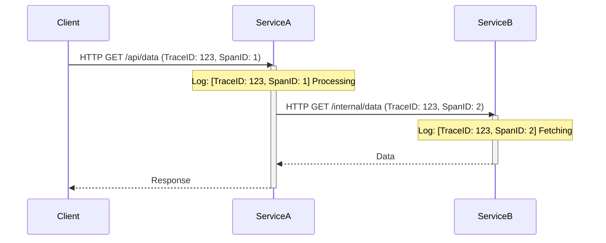

# Actuator, Observability, and Logging

## What is Spring Boot Actuator and what is its primary purpose? <Badge type="tip" text="easy" />

::: details View Answer
Spring Boot Actuator is a sub-project of Spring Boot that provides production-ready features to help you monitor and manage your application. Its primary purpose is to expose operational information about the running application, such as health, metrics, info, dump, and environment details, typically via HTTP endpoints or JMX beans.
:::

## How do you enable and expose Actuator endpoints in a Spring Boot application? <Badge type="tip" text="easy" />

::: details View Answer
To enable Actuator, you first need to add the `spring-boot-starter-actuator` dependency to your project. By default, only the `/health` and `/info` endpoints are exposed over HTTP.

```xml
<dependency>
    <groupId>org.springframework.boot</groupId>
    <artifactId>spring-boot-starter-actuator</artifactId>
</dependency>
```

To expose more endpoints over HTTP, you must configure the `management.endpoints.web.exposure.include` property in your `application.properties` or `application.yml` file.

```yaml
management:
  endpoints:
    web:
      exposure:
        include: health,info,metrics,env,loggers # Or "*" for all endpoints
```
:::

## What are some commonly used built-in Actuator endpoints and what information do they provide? <Badge type="warning" text="medium" />

::: details View Answer
Some of the most commonly used built-in endpoints include:
*   **/health**: Shows application health information.
*   **/info**: Displays arbitrary application info (e.g., version, git commit).
*   **/metrics**: Shows metrics information for the current application.
*   **/env**: Exposes properties from Spring's `ConfigurableEnvironment`.
*   **/loggers**: Shows and allows modification of the configuration of loggers in the application.
*   **/beans**: Displays a complete list of all the Spring beans in your application.
*   **/threaddump**: Performs a thread dump.
*   **/heapdump**: Returns an hprof heap dump file.
:::

## How can you secure Spring Boot Actuator endpoints? <Badge type="warning" text="medium" />

::: details View Answer
Actuator endpoints often contain sensitive information and should be secured. The standard way is to use Spring Security. 

```java
import org.springframework.context.annotation.Bean;
import org.springframework.context.annotation.Configuration;
import org.springframework.boot.actuate.autoconfigure.security.servlet.EndpointRequest;
import org.springframework.security.config.annotation.web.builders.HttpSecurity;
import org.springframework.security.web.SecurityFilterChain;

@Configuration
public class ActuatorSecurityConfig {

    @Bean
    public SecurityFilterChain securityFilterChain(HttpSecurity http) throws Exception {
        http.securityMatcher(EndpointRequest.toAnyEndpoint())
            .authorizeHttpRequests((requests) -> requests
                .requestMatchers(EndpointRequest.to("health", "info")).permitAll()
                .anyRequest().hasRole("ADMIN")
            )
            .httpBasic();
        return http.build();
    }
}
```
:::

## How do you create a custom Actuator endpoint in Spring Boot? <Badge type="warning" text="medium" />

::: details View Answer
You can create a custom endpoint by creating a standard Spring bean and annotating it with `@Endpoint`. You then define operations within the class using `@ReadOperation`, `@WriteOperation`, or `@DeleteOperation`.

```java
import org.springframework.boot.actuate.endpoint.annotation.Endpoint;
import org.springframework.boot.actuate.endpoint.annotation.ReadOperation;
import org.springframework.stereotype.Component;

@Component
@Endpoint(id = "customInfo")
public class CustomEndpoint {

    @ReadOperation
    public String getCustomInfo() {
        return "This is a custom actuator endpoint!";
    }
}
```
This endpoint will be available at `/actuator/customInfo`.
:::

## What is Micrometer and how does it relate to Spring Boot Actuator? <Badge type="warning" text="medium" />

::: details View Answer
Micrometer is a vendor-neutral application metrics facade (think SLF4J, but for metrics). Spring Boot Actuator uses Micrometer as its underlying metrics library. Actuator auto-configures Micrometer to collect various metrics (JVM, web requests, etc.) and provides a mechanism to export these metrics to various monitoring systems (like Prometheus, Datadog, New Relic) by simply adding the corresponding Micrometer registry dependency.
:::

## How do you configure a custom HealthIndicator in Spring Boot? <Badge type="warning" text="medium" />

::: details View Answer
You can create a custom health indicator to monitor the status of an external dependency or internal component by implementing the `HealthIndicator` interface or extending `AbstractHealthIndicator`.

```java
import org.springframework.boot.actuate.health.Health;
import org.springframework.boot.actuate.health.HealthIndicator;
import org.springframework.stereotype.Component;

@Component
public class CustomServiceHealthIndicator implements HealthIndicator {

    @Override
    public Health health() {
        boolean isServiceUp = checkServiceStatus();
        if (isServiceUp) {
            return Health.up().withDetail("CustomService", "Available").build();
        }
        return Health.down().withDetail("CustomService", "Unreachable").withException(new RuntimeException("Service down")).build();
    }

    private boolean checkServiceStatus() {
        // Logic to check service
        return true; 
    }
}
```
:::

## Explain the difference between `@ReadOperation`, `@WriteOperation`, and `@DeleteOperation` in custom endpoints. <Badge type="tip" text="easy" />

::: details View Answer
These annotations map to specific HTTP methods when exposed over the web:
*   `@ReadOperation`: Maps to HTTP `GET`. Used to retrieve information.
*   `@WriteOperation`: Maps to HTTP `POST`. Used to create or update information. Can accept parameters.
*   `@DeleteOperation`: Maps to HTTP `DELETE`. Used to remove or reset information.
:::

## How can you change the default base path (`/actuator`) for Actuator endpoints? <Badge type="tip" text="easy" />

::: details View Answer
You can change the base path using the `management.endpoints.web.base-path` property in your configuration file.

```yaml
management:
  endpoints:
    web:
      base-path: /manage
```
With this configuration, the health endpoint will move from `/actuator/health` to `/manage/health`.
:::

## What is distributed tracing, and how does Spring Boot 3 support it (formerly Spring Cloud Sleuth)? <Badge type="danger" text="hard" />

::: details View Answer
Distributed tracing helps track requests as they flow across multiple microservices. 
In Spring Boot 2.x, this was handled by Spring Cloud Sleuth. In Spring Boot 3, Sleuth has been replaced by the **Micrometer Tracing** project.
Spring Boot auto-configures Micrometer Tracing to generate a `traceId` (unique for the whole transaction) and a `spanId` (unique for a specific step or service jump) and injects them into logs and propagates them via HTTP headers (like W3C Trace Context or B3).


:::

## How do you implement custom metrics using Micrometer in a Spring Boot application? <Badge type="warning" text="medium" />

::: details View Answer
You can inject the `MeterRegistry` bean to create and record custom metrics like Counters, Timers, and Gauges.

```java
import io.micrometer.core.instrument.Counter;
import io.micrometer.core.instrument.MeterRegistry;
import org.springframework.stereotype.Service;

@Service
public class OrderService {

    private final Counter orderCounter;

    public OrderService(MeterRegistry meterRegistry) {
        this.orderCounter = meterRegistry.counter("orders.created", "type", "online");
    }

    public void processOrder() {
        // Business logic...
        orderCounter.increment(); // Increment the counter
    }
}
```
:::

## How can you view the application's configuration properties and their origins using Actuator? <Badge type="warning" text="medium" />

::: details View Answer
You can use the `/env` endpoint to view all properties from the `ConfigurableEnvironment`. To see exactly where a property is defined (e.g., `application.yml`, system properties, or environment variables), you can configure the endpoint to show the origin of the properties.

In `application.yml`:
```yaml
management:
  endpoint:
    env:
      show-values: always # or 'when-authorized'
```
Calling `/actuator/env/{property.name}` provides details including the property value and the source file/location.
:::

## Explain the purpose of the `/heapdump` and `/threaddump` endpoints and when you would use them. <Badge type="danger" text="hard" />

::: details View Answer
*   **/heapdump**: Returns a binary `hprof` file representing the current state of the JVM heap. You use this when investigating memory leaks or high memory consumption. You can analyze the dump using tools like Eclipse MAT or VisualVM.
*   **/threaddump**: Returns a JSON representation of the current thread state (similar to `jstack`). You use this to diagnose deadlocks, blocked threads, or high CPU usage caused by runaway loops.
:::

## How does logging configuration work in Spring Boot, and what is the default logging framework? <Badge type="tip" text="easy" />

::: details View Answer
Spring Boot uses **Logback** as the default logging framework. It provides default configurations that log to the console out of the box. You can customize logging via `application.properties`/`yml` (e.g., setting `logging.level.org.springframework=DEBUG`) or by providing a custom `logback-spring.xml` file in the classpath for more advanced configurations.
:::

## How can you change logging levels dynamically at runtime without restarting the application? <Badge type="warning" text="medium" />

::: details View Answer
You can dynamically change logging levels using the Actuator `/loggers` endpoint. 
First, ensure the endpoint is exposed. Then, send a `POST` request to `/actuator/loggers/{logger.name}` with the desired level.

Example using `curl`:
```bash
curl -i -X POST -H 'Content-Type: application/json' \
  -d '{"configuredLevel": "DEBUG"}' \
  http://localhost:8080/actuator/loggers/com.example.myapp
```
:::

## How do you configure Spring Boot to output logs in JSON format? <Badge type="warning" text="medium" />

::: details View Answer
To output logs in JSON format (often required for log aggregators like ELK or Splunk), you typically use a Logback extension like `logstash-logback-encoder`.
1. Add the dependency:
```xml
<dependency>
    <groupId>net.logstash.logback</groupId>
    <artifactId>logstash-logback-encoder</artifactId>
    <version>7.4</version>
</dependency>
```
2. Create a `logback-spring.xml` configuration file to use the `LogstashEncoder`:
```xml
<configuration>
    <appender name="CONSOLE" class="ch.qos.logback.core.ConsoleAppender">
        <encoder class="net.logstash.logback.encoder.LogstashEncoder" />
    </appender>
    <root level="INFO">
        <appender-ref ref="CONSOLE" />
    </root>
</configuration>
```
:::

## What are Logback Profiles and how do you use them in Spring Boot? <Badge type="warning" text="medium" />

::: details View Answer
Logback Profiles (using the `<springProfile>` tag in `logback-spring.xml`) allow you to optionally include or exclude logging configuration based on the active Spring environment profiles.

```xml
<configuration>
    <!-- Common configuration -->
    
    <springProfile name="dev">
        <root level="DEBUG">
            <appender-ref ref="CONSOLE" />
        </root>
    </springProfile>

    <springProfile name="prod">
        <root level="INFO">
            <appender-ref ref="FILE" />
        </root>
    </springProfile>
</configuration>
```
:::

## How does Spring Boot 3 Observability API (`ObservationRegistry`) work, and how do you create a custom observation? <Badge type="danger" text="hard" />

::: details View Answer
Spring Boot 3 introduced a unified `ObservationRegistry` that bridges metrics (Micrometer) and tracing (Micrometer Tracing). Instead of using separate APIs for timers and spans, you create a single `Observation`.

```java
import io.micrometer.observation.Observation;
import io.micrometer.observation.ObservationRegistry;
import org.springframework.stereotype.Service;

@Service
public class UserService {
    private final ObservationRegistry observationRegistry;

    public UserService(ObservationRegistry observationRegistry) {
        this.observationRegistry = observationRegistry;
    }

    public void processUser(String userId) {
        Observation.createNotStarted("user.processing", observationRegistry)
            .lowCardinalityKeyValue("userType", "premium")
            .highCardinalityKeyValue("userId", userId)
            .observe(() -> {
                // The actual business logic being timed and traced
                doProcessing();
            });
    }
    
    private void doProcessing() { /* ... */ }
}
```
This automatically generates both a metric (timer) and a trace span.
:::

## How do you correlate logs with traces using Micrometer Tracing in Spring Boot? <Badge type="danger" text="hard" />

::: details View Answer
To correlate logs with traces, you need both Micrometer Tracing and a tracing bridge (like Brave or OpenTelemetry). Spring Boot automatically injects the `traceId` and `spanId` into the MDC (Mapped Diagnostic Context) of the logging framework (like Logback).

You must ensure your logging pattern includes the MDC variables. In Spring Boot 3 with default configurations, this is often handled automatically, resulting in log patterns like:
`%d{yyyy-MM-dd HH:mm:ss} [%thread] %-5level %logger{36} - [traceId=%X{traceId}, spanId=%X{spanId}] - %msg%n`

Dependencies needed:
```xml
<dependency>
    <groupId>io.micrometer</groupId>
    <artifactId>micrometer-tracing-bridge-brave</artifactId>
</dependency>
```
:::

## What is the purpose of the `@Timed` annotation, and how do you use it? <Badge type="warning" text="medium" />

::: details View Answer
The `@Timed` annotation is used to create a Micrometer Timer metric for a specific method, measuring how long the method takes to execute and how many times it was called.

To use it, you must declare a `TimedAspect` bean (Spring Boot auto-configures this for Spring MVC/WebFlux endpoints, but you need it for arbitrary Spring Beans).

```java
import io.micrometer.core.annotation.Timed;
import org.springframework.context.annotation.Bean;
import org.springframework.context.annotation.Configuration;
import io.micrometer.core.aop.TimedAspect;
import io.micrometer.core.instrument.MeterRegistry;
import org.springframework.stereotype.Service;

@Configuration
class MetricsConfig {
    @Bean
    public TimedAspect timedAspect(MeterRegistry registry) {
        return new TimedAspect(registry);
    }
}

@Service
public class DataService {

    @Timed(value = "data.fetch.time", description = "Time taken to fetch data")
    public String fetchData() {
        // logic
        return "data";
    }
}
```
:::