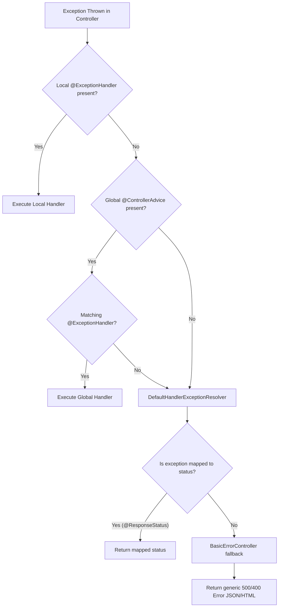

# Error Handling and Validation

## What is the purpose of `@ControllerAdvice` in Spring Boot? <Badge type="tip" text="easy" />

::: details View Answer
`@ControllerAdvice` (and `@RestControllerAdvice`) is a specialized `@Component` used to define `@ExceptionHandler`, `@InitBinder`, and `@ModelAttribute` methods that apply to all `@RequestMapping` methods across all controllers globally. It provides a centralized way to handle exceptions, avoiding duplicate error-handling code in every controller.

```java
@RestControllerAdvice
public class GlobalExceptionHandler {

    @ExceptionHandler(UserNotFoundException.class)
    public ResponseEntity<ErrorResponse> handleUserNotFound(UserNotFoundException ex) {
        ErrorResponse error = new ErrorResponse(HttpStatus.NOT_FOUND.value(), ex.getMessage());
        return new ResponseEntity<>(error, HttpStatus.NOT_FOUND);
    }
}
```
:::

## How does `@RestControllerAdvice` differ from `@ControllerAdvice`? <Badge type="tip" text="easy" />

::: details View Answer
`@RestControllerAdvice` is a convenience annotation that combines `@ControllerAdvice` and `@ResponseBody`. 
While `@ControllerAdvice` can be used to handle exceptions and return view names (like in Spring MVC), `@RestControllerAdvice` automatically serializes the returned object into the HTTP response body (typically as JSON or XML), making it ideal for REST APIs.
:::

## How can you handle a specific custom exception in a single controller? <Badge type="tip" text="easy" />

::: details View Answer
You can handle a specific exception locally within a single controller by defining a method annotated with `@ExceptionHandler` inside that controller class. This method will only catch exceptions thrown by methods within the same controller.

```java
@RestController
@RequestMapping("/api/orders")
public class OrderController {

    @GetMapping("/{id}")
    public Order getOrder(@PathVariable Long id) {
        throw new OrderNotFoundException("Order not found");
    }

    @ExceptionHandler(OrderNotFoundException.class)
    @ResponseStatus(HttpStatus.NOT_FOUND)
    public String handleOrderNotFound(OrderNotFoundException ex) {
        return ex.getMessage();
    }
}
```
:::

## Explain the execution flow when an exception occurs in a Spring Boot application. <Badge type="warning" text="medium" />

::: details View Answer
When an exception is thrown during the processing of an HTTP request, Spring follows a specific hierarchy to find the appropriate handler.


:::

## How do you enable bean validation in Spring Boot? <Badge type="tip" text="easy" />

::: details View Answer
To enable bean validation, you need to include the Spring Boot Starter Validation dependency in your `pom.xml` or `build.gradle`.

```xml
<dependency>
    <groupId>org.springframework.boot</groupId>
    <artifactId>spring-boot-starter-validation</artifactId>
</dependency>
```
Then, you annotate the incoming payload (e.g., in a controller method) with `@Valid` or `@Validated`.

```java
@PostMapping("/users")
public ResponseEntity<User> createUser(@Valid @RequestBody UserDto userDto) {
    // ...
}
```
:::

## What is the difference between `@Valid` and `@Validated`? <Badge type="warning" text="medium" />

::: details View Answer
- **`@Valid`**: A standard Java EE (Jakarta EE) annotation (`jakarta.validation.Valid`). It triggers standard bean validation on the annotated object. It does not support validation groups.
- **`@Validated`**: A Spring-specific annotation (`org.springframework.validation.annotation.Validated`). It extends the functionality of `@Valid` by supporting **validation groups**, allowing you to apply different validation rules to the same bean depending on the context (e.g., creating vs. updating).
:::

## How do you implement validation groups using `@Validated`? <Badge type="warning" text="medium" />

::: details View Answer
First, define marker interfaces for your groups:
```java
public interface OnCreate {}
public interface OnUpdate {}
```

Next, assign constraints to specific groups in your DTO:
```java
public class UserDto {
    @NotNull(groups = OnUpdate.class)
    private Long id;

    @NotBlank(groups = {OnCreate.class, OnUpdate.class})
    private String username;
}
```

Finally, specify the group in the controller using `@Validated`:
```java
@PostMapping
public void createUser(@Validated(OnCreate.class) @RequestBody UserDto user) { ... }

@PutMapping
public void updateUser(@Validated(OnUpdate.class) @RequestBody UserDto user) { ... }
```
:::

## How can you validate path variables and request parameters? <Badge type="warning" text="medium" />

::: details View Answer
To validate path variables (`@PathVariable`) and request parameters (`@RequestParam`), you must add the `@Validated` annotation at the **class level** of your controller. Then, you can apply constraint annotations directly to the method parameters.

```java
@RestController
@RequestMapping("/api/items")
@Validated // Required for method-level validation
public class ItemController {

    @GetMapping("/{id}")
    public Item getItem(@PathVariable @Min(1) Long id) {
        return new Item(id);
    }
}
```
If validation fails, a `ConstraintViolationException` is thrown.
:::

## What exception is thrown when `@Valid` fails on a `@RequestBody`, and how do you handle it? <Badge type="warning" text="medium" />

::: details View Answer
When validation fails for a `@RequestBody` annotated with `@Valid` or `@Validated`, Spring throws a `MethodArgumentNotValidException`. 

You can handle it globally to return a structured error response containing field-specific errors:

```java
@RestControllerAdvice
public class ValidationExceptionHandler {

    @ExceptionHandler(MethodArgumentNotValidException.class)
    @ResponseStatus(HttpStatus.BAD_REQUEST)
    public Map<String, String> handleValidationExceptions(MethodArgumentNotValidException ex) {
        Map<String, String> errors = new HashMap<>();
        ex.getBindingResult().getAllErrors().forEach((error) -> {
            String fieldName = ((FieldError) error).getField();
            String errorMessage = error.getDefaultMessage();
            errors.put(fieldName, errorMessage);
        });
        return errors;
    }
}
```
:::

## What is `ResponseStatusException` and when should you use it? <Badge type="tip" text="easy" />

::: details View Answer
`ResponseStatusException` is a programmatic way to throw an exception that maps directly to an HTTP status code without needing to create a custom exception class or a `@ControllerAdvice`.

It is useful for simple, one-off error cases where creating a custom exception might be overkill.

```java
@GetMapping("/{id}")
public User getUser(@PathVariable String id) {
    return userRepository.findById(id)
        .orElseThrow(() -> new ResponseStatusException(HttpStatus.NOT_FOUND, "User not found"));
}
```
:::

## How does the `@ResponseStatus` annotation work? <Badge type="tip" text="easy" />

::: details View Answer
`@ResponseStatus` can be applied to a custom exception class to map it to a specific HTTP status code. When this exception is thrown anywhere in the application, Spring will catch it and return the specified HTTP status code to the client.

```java
@ResponseStatus(code = HttpStatus.NOT_FOUND, reason = "Entity not found in the database")
public class ResourceNotFoundException extends RuntimeException {
    // ...
}
```
:::

## How can you create a custom validation annotation in Spring Boot? <Badge type="danger" text="hard" />

::: details View Answer
Creating a custom validation annotation requires two parts: the annotation interface and the validator class.

1. **The Annotation**:
```java
@Target({ElementType.FIELD})
@Retention(RetentionPolicy.RUNTIME)
@Constraint(validatedBy = AgeValidator.class)
public @interface ValidAge {
    String message() default "Age must be over 18";
    Class<?>[] groups() default {};
    Class<? extends Payload>[] payload() default {};
}
```

2. **The Validator**:
```java
public class AgeValidator implements ConstraintValidator<ValidAge, Integer> {
    @Override
    public boolean isValid(Integer value, ConstraintValidatorContext context) {
        return value != null && value >= 18;
    }
}
```
You can then use `@ValidAge` on any DTO field.
:::

## What is the purpose of `ProblemDetail` introduced in Spring Framework 6 / Spring Boot 3? <Badge type="warning" text="medium" />

::: details View Answer
`ProblemDetail` is a built-in implementation of the RFC 7807 standard ("Problem Details for HTTP APIs"). It provides a standardized JSON response structure for errors.

You can return `ProblemDetail` directly from an `@ExceptionHandler`:

```java
@ExceptionHandler(UserNotFoundException.class)
public ProblemDetail handleUserNotFound(UserNotFoundException ex) {
    ProblemDetail problemDetail = ProblemDetail.forStatusAndDetail(HttpStatus.NOT_FOUND, ex.getMessage());
    problemDetail.setTitle("User Not Found");
    problemDetail.setProperty("timestamp", Instant.now());
    return problemDetail;
}
```
This produces standard JSON like `{"type": "...", "title": "...", "status": 404, "detail": "...", "timestamp": "..."}`.
:::

## How do you globally enable RFC 7807 Problem Details in Spring Boot 3? <Badge type="tip" text="easy" />

::: details View Answer
In Spring Boot 3, you can enable standardized RFC 7807 problem details globally for all built-in Spring MVC exceptions by simply adding the following property to your `application.properties` or `application.yml`:

```properties
spring.mvc.problemdetails.enabled=true
```
:::

## What is the `BasicErrorController` in Spring Boot? <Badge type="warning" text="medium" />

::: details View Answer
`BasicErrorController` is Spring Boot's default fallback mechanism for handling errors. If an exception is not caught by any `@ExceptionHandler`, the request is forwarded to the `/error` mapping. 
`BasicErrorController` handles this endpoint, returning either an HTML error page (for browser clients) or a JSON error representation (for REST clients, based on the `Accept` header).
:::

## How can you customize the default JSON error response provided by Spring Boot? <Badge type="warning" text="medium" />

::: details View Answer
If you don't want to use `@ControllerAdvice`, you can customize the default `/error` JSON response by defining a custom `ErrorAttributes` bean. Spring Boot will use this bean to populate the error details.

```java
@Component
public class CustomErrorAttributes extends DefaultErrorAttributes {
    @Override
    public Map<String, Object> getErrorAttributes(WebRequest webRequest, ErrorAttributeOptions options) {
        Map<String, Object> errorAttributes = super.getErrorAttributes(webRequest, options);
        errorAttributes.put("custom_message", "Something went wrong!");
        errorAttributes.remove("trace"); // Remove stack trace from response
        return errorAttributes;
    }
}
```
:::

## Explain how to handle exceptions thrown during Spring Security authentication. <Badge type="danger" text="hard" />

::: details View Answer
Exceptions thrown during Spring Security filters (like `AuthenticationException` or `AccessDeniedException`) occur **before** the request reaches the DispatcherServlet. Therefore, `@ControllerAdvice` will **not** catch them.

To handle these, you must configure custom `AuthenticationEntryPoint` (for 401 Unauthorized) and `AccessDeniedHandler` (for 403 Forbidden).

```java
@Component
public class CustomAuthenticationEntryPoint implements AuthenticationEntryPoint {
    @Override
    public void commence(HttpServletRequest request, HttpServletResponse response, AuthenticationException authException) throws IOException {
        response.setStatus(HttpServletResponse.SC_UNAUTHORIZED);
        response.setContentType("application/json");
        response.getWriter().write("{\"error\": \"Unauthorized access\"}");
    }
}
```
These components are then registered in the `SecurityFilterChain`.
:::

## Can you catch a `HandlerInterceptor` exception using `@ControllerAdvice`? <Badge type="warning" text="medium" />

::: details View Answer
Yes, exceptions thrown inside the `preHandle`, `postHandle`, or `afterCompletion` methods of a `HandlerInterceptor` **can** be caught by a `@ControllerAdvice`. Since interceptors wrap the execution of the controller mapping within the `DispatcherServlet` context, any uncaught exception bubbles up to the configured `HandlerExceptionResolver` infrastructure.
:::

## How do you test error handling and validation in Spring Boot? <Badge type="warning" text="medium" />

::: details View Answer
You can test error handling using `@WebMvcTest` in combination with `MockMvc`. This allows you to simulate HTTP requests with invalid payloads and verify the resulting HTTP status and error JSON structure without starting the full server.

```java
@WebMvcTest(UserController.class)
class UserControllerTest {
    @Autowired
    private MockMvc mockMvc;

    @Test
    void whenInvalidInput_thenReturns400() throws Exception {
        mockMvc.perform(post("/users")
                .contentType(MediaType.APPLICATION_JSON)
                .content("{\"username\": \"\"}")) // Invalid payload
                .andExpect(status().isBadRequest())
                .andExpect(jsonPath("$.username").value("must not be blank"));
    }
}
```
:::

## What is the best practice for exposing error details to the client? <Badge type="warning" text="medium" />

::: details View Answer
Best practices for API error handling include:
1. **Never expose stack traces** in production to avoid security leaks.
2. Use standard HTTP status codes correctly (e.g., 400 for validation errors, 404 for not found, 401/403 for security).
3. Return a consistent, structured JSON format (like RFC 7807 `ProblemDetail`).
4. Provide meaningful error messages and, for validation errors, specify exactly which fields failed.
5. Include a unique error tracking ID or correlation ID to map client errors to backend server logs.
:::