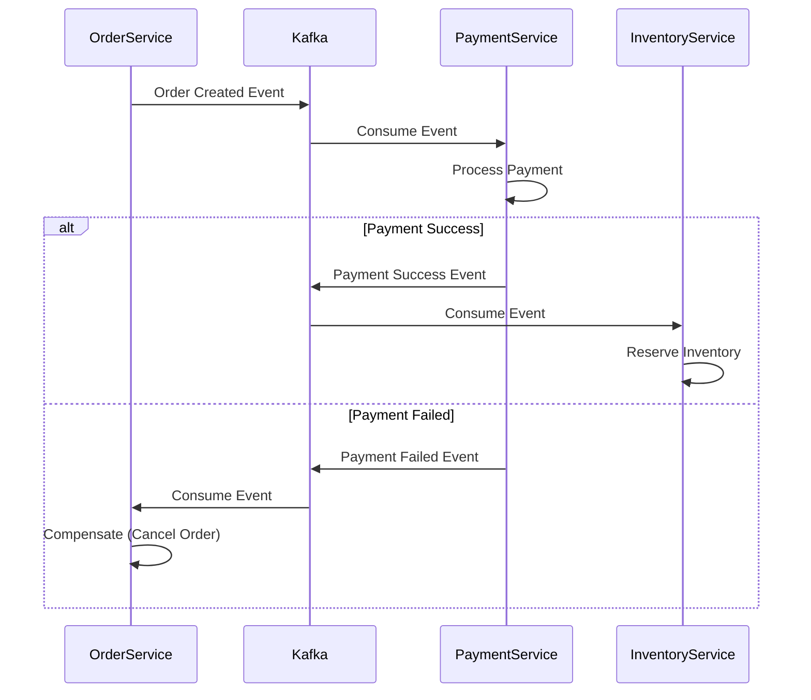

# Advanced System Design and Enterprise Patterns

## 1. How do you implement the Saga pattern in a Spring Boot microservices architecture? <Badge type="danger" text="hard" />

::: details View Answer
**Answer:**
The Saga pattern is used to manage distributed transactions across multiple microservices without locking resources. It consists of a sequence of local transactions, where each transaction updates data within a single service and publishes an event or message to trigger the next transaction in the saga.

There are two main ways to implement it:
1. **Choreography:** Services publish events and listen to events from other services to decide their next action.
2. **Orchestration:** A centralized orchestrator tells the participants what local transactions to execute.

**Implementation with Spring Boot (Orchestration using Camunda or Axon):**
You can use a state machine (like Spring State Machine) or an orchestration engine. If a local transaction fails, the orchestrator triggers compensating transactions to undo the previous steps.

```java
@Service
public class OrderOrchestrator {
    @Autowired
    private KafkaTemplate<String, OrderEvent> kafkaTemplate;

    public void createOrder(Order order) {
        // Step 1: Save order locally in PENDING state
        // Step 2: Publish event for Payment Service
        kafkaTemplate.send("payment-topic", new OrderEvent(order.getId(), "INITIATE_PAYMENT"));
    }

    @KafkaListener(topics = "payment-response")
    public void handlePaymentResponse(PaymentEvent event) {
        if (event.isSuccess()) {
            kafkaTemplate.send("inventory-topic", new OrderEvent(event.getOrderId(), "RESERVE_INVENTORY"));
        } else {
            // Trigger compensation
            cancelOrder(event.getOrderId());
        }
    }
}
```


:::

## 2. Explain the difference between API Gateway and Service Mesh. When would you use which in a Spring ecosystem? <Badge type="warning" text="medium" />

::: details View Answer
**Answer:**
Both handle network traffic, but they operate at different layers and serve different purposes.
- **API Gateway (e.g., Spring Cloud Gateway):** Sits at the edge of the system (North-South traffic). It handles routing, authentication, rate limiting, and protocol translation for external clients accessing the microservices.
- **Service Mesh (e.g., Istio, Linkerd):** Operates inside the system between microservices (East-West traffic). It handles service discovery, mTLS (mutual TLS), retries, and distributed tracing transparently using sidecar proxies.

**When to use:**
Use **Spring Cloud Gateway** to expose your APIs to frontends or external consumers, aggregate responses, and centralize edge security. Use a **Service Mesh** when you have a large number of microservices and need to offload network concerns (like retries, mTLS, and observability) from the application code to the infrastructure layer.
:::

## 3. How can you implement CQRS (Command Query Responsibility Segregation) in a Spring Boot application? <Badge type="danger" text="hard" />

::: details View Answer
**Answer:**
CQRS separates the data modification operations (Commands) from the data retrieval operations (Queries).
In Spring Boot, you can implement CQRS logically by using different services/repositories for reads and writes, or physically by using separate databases.

**Implementation with Axon Framework:**
Axon provides out-of-the-box support for CQRS and Event Sourcing in Spring Boot.

```java
// Command
public class CreateOrderCommand {
    @TargetAggregateIdentifier
    private final String orderId;
    private final String item;
    // constructors, getters
}

// Command Handler
@Aggregate
public class OrderAggregate {
    @AggregateIdentifier
    private String orderId;

    @CommandHandler
    public OrderAggregate(CreateOrderCommand command) {
        AggregateLifecycle.apply(new OrderCreatedEvent(command.getOrderId(), command.getItem()));
    }

    @EventSourcingHandler
    public void on(OrderCreatedEvent event) {
        this.orderId = event.getOrderId();
    }
}

// Query Handler (Projection)
@Service
public class OrderQueryService {
    @Autowired
    private OrderRepository repository;

    @EventHandler
    public void on(OrderCreatedEvent event) {
        repository.save(new OrderEntity(event.getOrderId(), event.getItem()));
    }
}
```
:::

## 4. What is the Strangler Fig pattern and how would you apply it to migrate a monolith to Spring Boot microservices? <Badge type="warning" text="medium" />

::: details View Answer
**Answer:**
The Strangler Fig pattern is a strategy for migrating a legacy monolithic application to a microservices architecture incrementally. Instead of rewriting the entire application at once, you gradually extract features into new microservices.

**Application with Spring Boot:**
1. **API Gateway:** Place an API Gateway (like Spring Cloud Gateway) in front of the legacy monolith.
2. **Extract:** Build a new feature or extract an existing one into a new Spring Boot microservice.
3. **Route:** Configure the API Gateway to route traffic for the specific feature to the new microservice, while routing all other traffic to the legacy monolith.
4. **Repeat:** Continue extracting features until the monolith is completely "strangled" and can be decommissioned.
:::

## 5. Explain Event Sourcing. How can it be implemented using Spring Boot and Apache Kafka? <Badge type="danger" text="hard" />

::: details View Answer
**Answer:**
Event Sourcing stores the state of a system as a sequence of state-changing events. Instead of storing the current state of an entity in a database, every change is appended to an event store. The current state is derived by replaying these events.

**Implementation with Spring Boot and Kafka:**
1. Use Kafka as the Event Store (using log compaction for retaining the latest state if needed, or keeping all events).
2. When a command is received, the Spring Boot application validates it and publishes an event to a Kafka topic.
3. A consumer (which could be the same application) listens to this topic and updates a Read Database (Projection) for fast querying.

```java
@Service
public class AccountService {
    @Autowired
    private KafkaTemplate<String, Event> kafkaTemplate;

    public void deposit(String accountId, BigDecimal amount) {
        // Validate...
        Event event = new MoneyDepositedEvent(accountId, amount, Instant.now());
        kafkaTemplate.send("account-events", accountId, event);
    }
}
```
:::

## 6. How do you handle distributed tracing in a Spring Boot microservices architecture? <Badge type="warning" text="medium" />

::: details View Answer
**Answer:**
Distributed tracing helps track a request as it flows through multiple microservices, identifying latency bottlenecks and failures.

In Spring Boot 3, **Micrometer Tracing** (replacing Spring Cloud Sleuth) is the standard.
- It provides a facade for tracing libraries like OpenZipkin Brave or OpenTelemetry.
- It automatically injects trace IDs and span IDs into logs and HTTP headers (using W3C Trace Context).

**Setup:**
1. Add dependencies for Micrometer Tracing and an exporter (e.g., Zipkin).
2. When a request hits the gateway, a `traceId` is generated.
3. This `traceId` is passed in the headers of `RestTemplate`, `WebClient`, or `FeignClient` requests to downstream services.
4. Spans are exported to a tracing server (like Zipkin or Jaeger) for visualization.
:::

## 7. What are Circuit Breakers and how are they implemented in Spring Boot using Resilience4j? <Badge type="warning" text="medium" />

::: details View Answer
**Answer:**
The Circuit Breaker pattern prevents an application from repeatedly trying to execute an operation that is likely to fail. It detects failures and temporarily blocks traffic to the failing service, allowing it time to recover.

**Implementation using Resilience4j:**
1. Add the `resilience4j-spring-boot3` dependency.
2. Configure the circuit breaker in `application.yml` (failure rate threshold, wait duration, etc.).
3. Annotate the service method with `@CircuitBreaker`.

```java
@Service
public class ExternalService {

    @CircuitBreaker(name = "backendService", fallbackMethod = "fallbackResponse")
    public String callExternalApi() {
        return restTemplate.getForObject("http://unstable-api/data", String.class);
    }

    public String fallbackResponse(Exception e) {
        return "Fallback data from local cache";
    }
}
```
:::

## 8. Discuss caching strategies in an enterprise Spring Boot application. <Badge type="warning" text="medium" />

::: details View Answer
**Answer:**
Caching improves read performance by storing frequently accessed data in memory. Spring Boot provides the `@Cacheable` abstraction.

**Strategies:**
1. **Cache-Aside (Lazy Loading):** The application checks the cache. If a miss occurs, it loads from the database and puts it in the cache. (Default Spring Cache behavior).
2. **Write-Through:** Data is written to the cache and the database synchronously.
3. **Write-Behind (Write-Back):** Data is written to the cache, and asynchronously persisted to the database.

**Technologies:**
- Local caching: Caffeine, EhCache.
- Distributed caching: Redis, Hazelcast. Use Redis when scaling horizontally across multiple Spring Boot instances to ensure cache consistency.
:::

## 9. How would you design a scalable rate limiting solution for a Spring Boot API? <Badge type="danger" text="hard" />

::: details View Answer
**Answer:**
Rate limiting prevents abuse and ensures fair usage of APIs.
For a scalable, distributed environment, relying on an in-memory rate limiter per JVM is insufficient.

**Design:**
1. **Spring Cloud Gateway with Redis:** Use Spring Cloud Gateway as the entry point. It has built-in support for distributed rate limiting using Redis and a Token Bucket algorithm.
2. **Configuration:** Define a `RedisRateLimiter` bean specifying the `replenishRate` and `burstCapacity`.
3. **Key Resolver:** Implement a `KeyResolver` to rate-limit based on IP address, user ID, or API key.

```java
@Bean
public KeyResolver userKeyResolver() {
    return exchange -> Mono.just(exchange.getRequest().getRemoteAddress().getAddress().getHostAddress());
}
```
:::

## 10. What is the Bulkhead pattern and how does it improve system resilience in Spring Boot? <Badge type="warning" text="medium" />

::: details View Answer
**Answer:**
The Bulkhead pattern isolates elements of an application into pools so that if one fails, the others continue to function. It prevents a failure in one part of the system from cascading and exhausting resources (like thread pools) across the entire application.

**Implementation in Spring Boot (Resilience4j):**
There are two types of Bulkheads in Resilience4j:
1. **SemaphoreBulkhead:** Limits concurrent executions.
2. **ThreadPoolBulkhead:** Uses a bounded queue and a fixed thread pool.

```java
@Bulkhead(name = "serviceA", type = Bulkhead.Type.THREADPOOL)
public CompletableFuture<String> callServiceA() {
    // Isolated execution
    return CompletableFuture.completedFuture("Success");
}
```
:::

## 11. Explain the Outbox pattern and its role in reliable messaging with Spring Boot. <Badge type="danger" text="hard" />

::: details View Answer
**Answer:**
The Outbox pattern solves the dual-write problem: safely updating a database and publishing a message to a broker (like Kafka/RabbitMQ) atomically.

**How it works:**
1. The Spring Boot application opens a database transaction.
2. It saves the business entity (e.g., `Order`) to its table.
3. It saves the event (e.g., `OrderCreated`) to an `outbox` table in the same database transaction.
4. A separate background process (like a Debezium CDC connector or a Spring `@Scheduled` task) reads the `outbox` table and publishes the events to the message broker, then deletes/marks them as processed.

This guarantees At-Least-Once delivery semantics without requiring a two-phase commit (2PC).
:::

## 12. How do you implement asynchronous communication between microservices using Spring Cloud Stream? <Badge type="warning" text="medium" />

::: details View Answer
**Answer:**
Spring Cloud Stream provides a binder abstraction to connect microservices to message brokers like Kafka or RabbitMQ using simple functional programming models.

**Implementation (Spring Cloud Stream v3+):**
Use `java.util.function` interfaces (`Supplier`, `Function`, `Consumer`).

```java
@Configuration
public class MessagingConfig {

    // Producer
    @Bean
    public Supplier<Order> supplyOrder() {
        return () -> new Order("123", "Laptop");
    }

    // Processor
    @Bean
    public Function<Order, ProcessedOrder> processOrder() {
        return order -> new ProcessedOrder(order.getId(), "PROCESSED");
    }

    // Consumer
    @Bean
    public Consumer<ProcessedOrder> consumeOrder() {
        return order -> System.out.println("Received: " + order.getId());
    }
}
```
Bindings are mapped to specific topics in `application.yml` via `spring.cloud.stream.bindings.<functionName>-in-0.destination`.
:::

## 13. Describe the Database per Service pattern. How do you handle cross-service transactions? <Badge type="warning" text="medium" />

::: details View Answer
**Answer:**
In microservices, each service should own its data and database to ensure loose coupling and independent scaling. No service can directly query another service's database; it must use the API.

**Handling cross-service transactions:**
Traditional ACID transactions (like 2PC) don't scale well in distributed systems. Instead, you use **BASE** (Basically Available, Soft state, Eventual consistency) transactions.
You handle this by implementing the **Saga Pattern** (orchestration or choreography) to manage data consistency eventually, using compensating transactions if a step fails.
:::

## 14. How would you design a highly available and fault-tolerant Spring Boot application? <Badge type="danger" text="hard" />

::: details View Answer
**Answer:**
A highly available (HA) Spring Boot architecture involves redundancy at every layer:
1. **Compute:** Deploy multiple instances of the Spring Boot application across different Availability Zones (AZs) using Kubernetes or cloud ASGs.
2. **Database:** Use a master-slave or multi-master database setup. Use Spring Data's `@Transactional(readOnly = true)` to route reads to replicas.
3. **Load Balancing:** Put an API Gateway or Load Balancer in front of the instances.
4. **Resilience Patterns:** Implement Circuit Breakers, Timeouts, and Bulkheads (Resilience4j) for downstream calls.
5. **Statelessness:** Ensure the application is stateless. Store session data in a distributed cache like Redis (using Spring Session).
6. **Graceful Shutdown:** Configure `server.shutdown=graceful` to allow in-flight requests to complete before terminating an instance.
:::

## 15. What is the BFF (Backend for Frontend) pattern and how is it useful in a Spring Boot ecosystem? <Badge type="warning" text="medium" />

::: details View Answer
**Answer:**
The BFF pattern involves creating a dedicated backend service for a specific frontend interface (e.g., one BFF for Web, one for Mobile).

**Usefulness:**
Instead of frontends making multiple complex calls to various microservices, they make a single call to their BFF. The BFF aggregates data from downstream microservices, formats it specifically for that client, and handles client-specific authentication.
In Spring Boot, this is often implemented using **Spring WebFlux** (reactive programming) to efficiently aggregate multiple downstream API calls concurrently.
:::

## 16. How do you manage centralized configuration in a microservices environment using Spring Cloud Config? <Badge type="tip" text="easy" />

::: details View Answer
**Answer:**
Spring Cloud Config provides a centralized server to manage configuration properties for multiple microservices across different environments.

**How it works:**
1. **Config Server:** A Spring Boot app annotated with `@EnableConfigServer`. It pulls configuration files from a backend repository (like Git).
2. **Config Client:** Microservices include the `spring-cloud-starter-config` dependency. On startup, they contact the Config Server to fetch their environment-specific properties before loading the Spring context.
3. **Dynamic Refresh:** Using Spring Cloud Bus and `@RefreshScope`, you can push configuration changes to clients without restarting them.
:::

## 17. Explain the Sidecar pattern and its implementation in a Spring-based service mesh (e.g., Istio). <Badge type="warning" text="medium" />

::: details View Answer
**Answer:**
The Sidecar pattern deploys a helper component (the sidecar) alongside the primary application (e.g., within the same Kubernetes Pod).

**Implementation:**
While Spring Cloud Netflix provided sidecars, modern architectures use service meshes like Istio.
The Spring Boot application focuses purely on business logic. An Envoy proxy container (the sidecar) is injected into the pod.
The sidecar intercepts all incoming and outgoing network traffic, handling mTLS, retries, circuit breaking, and telemetry. The Spring Boot app remains oblivious to these cross-cutting infrastructure concerns.
:::

## 18. How do you ensure idempotency in RESTful APIs developed with Spring Boot? <Badge type="warning" text="medium" />

::: details View Answer
**Answer:**
Idempotency ensures that making multiple identical requests has the same effect as making a single request, crucial for handling retries safely.

**Implementation:**
1. **HTTP Methods:** Use naturally idempotent methods (`PUT`, `DELETE`, `GET`).
2. **Idempotency Key for POST:** Require clients to send an `Idempotency-Key` header for non-idempotent operations (like payments).
3. **Processing:**
   - In a Spring `HandlerInterceptor` or Filter, check if the `Idempotency-Key` exists in a distributed cache (e.g., Redis).
   - If it exists, return the cached response.
   - If not, process the request, store the result in Redis with the key, and return the response.
:::

## 19. Discuss the pros and cons of synchronous vs asynchronous inter-service communication in Spring Boot. <Badge type="warning" text="medium" />

::: details View Answer
**Answer:**
**Synchronous (HTTP/REST, gRPC via Spring WebClient/Feign):**
- *Pros:* Simple to implement, easy to debug, immediate response (good for user-facing reads).
- *Cons:* Tight temporal coupling (both services must be up), susceptible to cascading failures, high latency chains.

**Asynchronous (Messaging via Kafka, RabbitMQ, Spring Cloud Stream):**
- *Pros:* Loose coupling, high resilience (messages are queued if receiver is down), better scalability, supports pub/sub.
- *Cons:* Complex to implement and monitor (eventual consistency), harder to trace logic flows, requires infrastructure overhead (broker).

*Enterprise Best Practice:* Use Synchronous for queries/reads, and Asynchronous for commands/state changes.
:::

## 20. How would you architect a real-time data streaming pipeline using Spring Boot, Kafka, and WebSockets? <Badge type="danger" text="hard" />

::: details View Answer
**Answer:**
This architecture is used for live dashboards or notifications.

**Architecture:**
1. **Data Ingestion:** A Spring Boot service ingests data and publishes it to a Kafka topic.
2. **Stream Processing (Optional):** Use Spring Cloud Stream with Kafka Streams to aggregate, filter, or join the data.
3. **WebSocket Gateway:** A Spring Boot application acts as the WebSocket server.
   - It connects to the client using `@EnableWebSocketMessageBroker`.
   - It consumes the processed data from Kafka using `@KafkaListener`.
   - It uses `SimpMessagingTemplate` to push the data to specific WebSocket topics that the front-end clients are subscribed to.

```java
@KafkaListener(topics = "live-dashboard")
public void consumeAndBroadcast(String message) {
    messagingTemplate.convertAndSend("/topic/updates", message);
}
```
:::