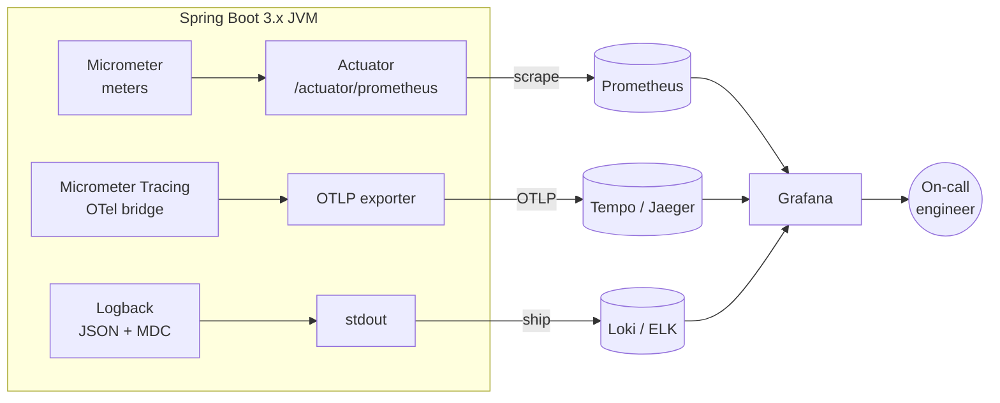
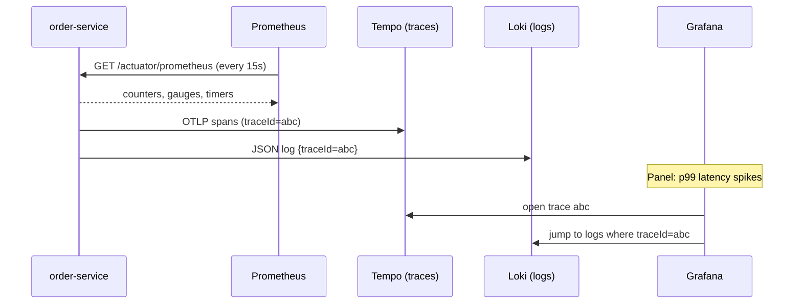

# Actuator, Observability, and Logging

> Operate Spring Boot 3.x in production — expose and secure Actuator endpoints, write health indicators and Kubernetes probes, emit Micrometer metrics to Prometheus, trace requests with Micrometer Tracing + OpenTelemetry, and ship structured JSON logs with correlation IDs.

## Mental model

**Observability** is the ability to ask arbitrary questions about your running system from the outside, without shipping new code. It rests on **three pillars**: **metrics** (cheap numeric aggregates — "p99 latency is 800ms"), **logs** (discrete, high-cardinality events — "order 42 failed validation"), and **traces** (the causal path of one request across services — "the slow call was the inventory gRPC hop"). Spring Boot wires all three: **Actuator** exposes operational endpoints, **Micrometer** is the metrics facade (think SLF4J, but for telemetry), and **Micrometer Tracing** bridges to **OpenTelemetry** for distributed traces.

The data leaves your JVM and lands in a backend you can query: Prometheus scrapes metrics, a collector receives traces (Tempo/Jaeger), and a log pipeline (Loki/ELK) indexes JSON logs. Grafana stitches them into one pane of glass, correlating by trace ID.



## Core concepts

### Enabling Actuator

Add the starter; Actuator auto-configures a family of endpoints under `/actuator`. By default only `health` is exposed over HTTP — everything else must be opted in.

```xml
<dependency>
    <groupId>org.springframework.boot</groupId>
    <artifactId>spring-boot-starter-actuator</artifactId>
</dependency>
```

```properties
# application.properties — expose a curated set, never "*" in prod
management.endpoints.web.exposure.include=health,info,metrics,prometheus,loggers
management.endpoint.health.show-details=when-authorized
management.info.env.enabled=true
management.endpoints.web.base-path=/actuator
```

Key endpoints you will actually use:

| Endpoint | Purpose |
| --- | --- |
| `/actuator/health` | Liveness/readiness aggregate; load-balancer & k8s probes |
| `/actuator/info` | Build/git metadata (version, commit) |
| `/actuator/metrics` | Browse Micrometer meters by name |
| `/actuator/prometheus` | Metrics in Prometheus exposition format |
| `/actuator/env` | Resolved configuration properties (sensitive!) |
| `/actuator/loggers` | Inspect and change log levels at runtime |
| `/actuator/threaddump` | Snapshot of all JVM threads |
| `/actuator/heapdump` | Downloadable `.hprof` for leak analysis |

::: danger
`env`, `heapdump`, `threaddump`, and `configprops` leak secrets and internals. Never expose them publicly. Put Actuator on a separate management port and network policy, and require authentication.
:::

### Securing the management endpoints

Run Actuator on its own port so you can firewall it independently of application traffic, and protect it with Spring Security.

```properties
management.server.port=9001
management.endpoints.web.exposure.include=health,info,prometheus,metrics,loggers,threaddump,heapdump
```

```java
import org.springframework.boot.actuate.autoconfigure.security.servlet.EndpointRequest;
import org.springframework.context.annotation.Bean;
import org.springframework.security.web.SecurityFilterChain;

@Bean
SecurityFilterChain actuatorChain(HttpSecurity http) throws Exception {
    http.securityMatcher(EndpointRequest.toAnyEndpoint())
        .authorizeHttpRequests(auth -> auth
            .requestMatchers(EndpointRequest.to("health", "info")).permitAll()
            .anyRequest().hasRole("OBSERVABILITY"))
        .httpBasic(withDefaults());
    return http.build();
}
```

### Custom health indicators

The aggregate `/health` is the union of all registered `HealthIndicator` beans. Implement one to surface a dependency's status; return `Health.up()`, `down()`, or `outOfService()` with details.

```java
import org.springframework.boot.actuate.health.Health;
import org.springframework.boot.actuate.health.HealthIndicator;
import org.springframework.stereotype.Component;

@Component
public class PaymentGatewayHealthIndicator implements HealthIndicator {

    private final PaymentGatewayClient client;

    public PaymentGatewayHealthIndicator(PaymentGatewayClient client) {
        this.client = client;
    }

    @Override
    public Health health() {
        try {
            var latency = client.ping();          // throws on failure
            return Health.up()
                    .withDetail("latencyMs", latency)
                    .build();
        } catch (Exception ex) {
            return Health.down(ex)
                    .withDetail("gateway", "unreachable")
                    .build();
        }
    }
}
```

::: tip
Mark slow or non-critical dependencies as separate groups so one flaky downstream does not flip your readiness probe and evict every pod. See health groups below.
:::

### Liveness and readiness for Kubernetes

Spring Boot ships dedicated **liveness** and **readiness** probes. Liveness answers "is the JVM healthy enough to keep running, or should k8s restart me?"; readiness answers "can I accept traffic right now?". They are exposed as health groups.

```properties
management.endpoint.health.probes.enabled=true
management.health.livenessstate.enabled=true
management.health.readinessstate.enabled=true
# group external dependencies into readiness only
management.endpoint.health.group.readiness.include=readinessState,db,paymentGateway
management.endpoint.health.group.liveness.include=livenessState
```

This produces `/actuator/health/liveness` and `/actuator/health/readiness`. During graceful shutdown Spring flips readiness to `OUT_OF_SERVICE` automatically, so k8s stops routing before the context closes. You can also drive state from code:

```java
import org.springframework.boot.availability.AvailabilityChangeEvent;
import org.springframework.boot.availability.ReadinessState;
import org.springframework.context.ApplicationEventPublisher;

public class WarmupService {
    private final ApplicationEventPublisher events;
    public WarmupService(ApplicationEventPublisher events) { this.events = events; }

    void cacheWarmed() {
        AvailabilityChangeEvent.publish(events, this, ReadinessState.ACCEPTING_TRAFFIC);
    }
}
```

### Micrometer metrics: counters, gauges, timers

Micrometer is a vendor-neutral metrics facade. Inject the `MeterRegistry` and record meters; a registry-specific backend (Prometheus here) exports them.

```java
import io.micrometer.core.instrument.Counter;
import io.micrometer.core.instrument.MeterRegistry;
import io.micrometer.core.instrument.Timer;

@Service
public class OrderService {

    private final Counter ordersPlaced;
    private final Timer checkoutTimer;

    public OrderService(MeterRegistry registry) {
        this.ordersPlaced = Counter.builder("orders.placed")
                .description("Total orders placed")
                .tag("channel", "web")
                .register(registry);
        this.checkoutTimer = registry.timer("checkout.duration");
        // Gauge tracks a live value via a function — never goes down on its own
        registry.gaugeCollectionSize("orders.queue.size", io.micrometer.core.instrument.Tags.empty(), queue);
    }

    public Order checkout(Cart cart) {
        return checkoutTimer.record(() -> {           // times the lambda
            Order order = process(cart);
            ordersPlaced.increment();
            return order;
        });
    }
}
```

- **Counter** — monotonically increasing (requests, errors). Query the *rate* in PromQL.
- **Gauge** — instantaneous value that can rise and fall (queue depth, cache size). Bind it to a source object so it samples on scrape.
- **Timer** — counts events *and* records their duration distribution (count, sum, max, percentiles).

::: warning
Tags become Prometheus label dimensions. Never tag with unbounded values (user IDs, request paths with IDs) — this is **cardinality explosion** and will OOM your metrics backend. Tag with bounded sets: status code, method, route template.
:::

The `@Timed` annotation times methods declaratively (requires a `TimedAspect` bean):

```java
import io.micrometer.core.aop.TimedAspect;
import io.micrometer.core.annotation.Timed;

@Bean
TimedAspect timedAspect(MeterRegistry registry) { return new TimedAspect(registry); }

@Timed(value = "report.generate", percentiles = {0.5, 0.95, 0.99})
public Report generate(Range range) { /* ... */ }
```

### Exporting to Prometheus

Add the registry; Actuator exposes `/actuator/prometheus` for scraping.

```xml
<dependency>
    <groupId>io.micrometer</groupId>
    <artifactId>micrometer-registry-prometheus</artifactId>
    <scope>runtime</scope>
</dependency>
```

```yaml
# prometheus.yml — scrape config
scrape_configs:
  - job_name: order-service
    metrics_path: /actuator/prometheus
    static_configs:
      - targets: ["order-service:9001"]
```

Add a common tag for the application name so dashboards can filter by service:

```java
@Bean
MeterRegistryCustomizer<MeterRegistry> commonTags(@Value("${spring.application.name}") String app) {
    return registry -> registry.config().commonTags("application", app);
}
```

### Distributed tracing with Micrometer Tracing + OpenTelemetry

Spring Cloud Sleuth is **removed** in Boot 3; tracing now lives in **Micrometer Tracing** with an OpenTelemetry bridge. It auto-instruments incoming HTTP, `RestClient`/`WebClient`, and messaging, propagating a `traceId`/`spanId` via W3C `traceparent` headers.

```xml
<dependency>
    <groupId>io.micrometer</groupId>
    <artifactId>micrometer-tracing-bridge-otel</artifactId>
</dependency>
<dependency>
    <groupId>io.opentelemetry</groupId>
    <artifactId>opentelemetry-exporter-otlp</artifactId>
</dependency>
```

```properties
management.tracing.sampling.probability=0.1
management.otlp.tracing.endpoint=http://otel-collector:4318/v1/traces
spring.application.name=order-service
```

Create custom spans with the `Observation` API, which produces metrics *and* traces from one instrumentation point:

```java
import io.micrometer.observation.Observation;
import io.micrometer.observation.ObservationRegistry;

@Service
public class PricingService {
    private final ObservationRegistry registry;
    public PricingService(ObservationRegistry registry) { this.registry = registry; }

    public Price quote(Cart cart) {
        return Observation.createNotStarted("pricing.quote", registry)
                .lowCardinalityKeyValue("currency", cart.currency())
                .observe(() -> compute(cart));   // emits a span + timer
    }
}
```

::: info
Sample at a fraction (10% above) in high-traffic systems to control cost; use **tail-based sampling** at the OTel Collector if you want to keep all error/slow traces while dropping the rest.
:::

### Structured logging with Logback, JSON, and MDC

Plain text logs are hard to query at scale. Emit **JSON** so the log backend can index fields, and stamp every line with the **trace ID** via the **MDC** (Mapped Diagnostic Context). Boot 3.4+ supports structured logging natively:

```properties
logging.structured.format.console=ecs
# include trace correlation in every log line
logging.pattern.correlation=[${spring.application.name:},%X{traceId:-},%X{spanId:-}]
```

Micrometer Tracing already injects `traceId`/`spanId` into the MDC, so logs and traces correlate automatically. For custom MDC keys (e.g. a business correlation ID via a filter):

```java
import org.slf4j.MDC;
import jakarta.servlet.*;
import jakarta.servlet.http.HttpServletRequest;

@Component
public class CorrelationIdFilter implements Filter {
    @Override
    public void doFilter(ServletRequest req, ServletResponse res, FilterChain chain)
            throws java.io.IOException, ServletException {
        var id = ((HttpServletRequest) req).getHeader("X-Correlation-Id");
        MDC.put("correlationId", id != null ? id : java.util.UUID.randomUUID().toString());
        try {
            chain.doFilter(req, res);
        } finally {
            MDC.clear();          // ALWAYS clear — MDC is thread-local and pooled
        }
    }
}
```

For pre-3.4 apps, use `logstash-logback-encoder` in `logback-spring.xml`:

```xml
<configuration>
  <appender name="JSON" class="ch.qos.logback.core.ConsoleAppender">
    <encoder class="net.logstash.logback.encoder.LogstashEncoder"/>
  </appender>
  <root level="INFO">
    <appender-ref ref="JSON"/>
  </root>
</configuration>
```

### Changing log levels at runtime

The `loggers` endpoint reads and **mutates** log levels without a redeploy — invaluable when debugging a live incident. Crank a package to `DEBUG`, capture the issue, then restore.

```bash
# inspect a logger
curl localhost:9001/actuator/loggers/com.acme.orders

# raise to DEBUG at runtime
curl -X POST localhost:9001/actuator/loggers/com.acme.orders \
  -H 'Content-Type: application/json' \
  -d '{"configuredLevel":"DEBUG"}'

# reset to inherited
curl -X POST localhost:9001/actuator/loggers/com.acme.orders \
  -H 'Content-Type: application/json' -d '{"configuredLevel":null}'
```

### The Grafana / Prometheus stack

The full local loop: app exports metrics + traces + JSON logs; Prometheus scrapes, Tempo ingests traces, Loki ingests logs, Grafana visualizes and links them by trace ID.



A starter alert rule (Prometheus) on error rate using the auto-provided `http.server.requests` timer:

```yaml
groups:
  - name: order-service
    rules:
      - alert: HighErrorRate
        expr: |
          sum(rate(http_server_requests_seconds_count{status=~"5..",application="order-service"}[5m]))
          / sum(rate(http_server_requests_seconds_count{application="order-service"}[5m])) > 0.05
        for: 5m
        labels: { severity: page }
        annotations: { summary: "5xx error rate > 5% for 5m" }
```

## Common pitfalls

- **Exposing `*` or `env`/`heapdump` publicly** — leaks secrets and enables DoS. Curate the include list and isolate the management port.
- **High-cardinality tags/labels** — tagging metrics with user IDs or raw URLs blows up Prometheus memory. Use bounded dimensions only.
- **Forgetting `MDC.clear()`** — thread pools reuse threads, so stale correlation IDs bleed into unrelated requests.
- **Putting flaky downstreams in liveness** — a momentary DB blip restarts otherwise-healthy pods. Keep dependencies in *readiness*, not liveness.
- **Still using Spring Cloud Sleuth** — it is gone in Boot 3; migrate to Micrometer Tracing + OTel.
- **100% trace sampling in production** — overwhelming cost and storage; sample and/or use tail sampling.
- **Logging full request bodies / PII** — structured logs are indexed and retained; redact sensitive fields.

## Best practices

- Run Actuator on a separate `management.server.port`, secured and network-isolated.
- Map `/actuator/health/liveness` and `/actuator/health/readiness` directly to k8s probes; let graceful shutdown flip readiness.
- Use the **Observation API** so one instrumentation point yields both a metric and a span.
- Always add `commonTags("application", ...)` and a build-info `info` contributor for traceability.
- Emit JSON logs to stdout and let the platform ship them — never write log files inside containers.
- Define SLO-based alerts (error rate, p99 latency) on the built-in `http.server.requests` meter.
- Keep cardinality bounded; prefer route templates over raw paths in tags.

## Interview quick-reference

| Concept | Key point |
| --- | --- |
| Actuator | Operational endpoints under `/actuator`; only `health` exposed by default |
| Securing endpoints | Separate management port + Spring Security; never expose `env`/`heapdump` |
| Health indicator | Implement `HealthIndicator`; aggregated into `/health` |
| Liveness vs readiness | Restart-me vs route-to-me; dependencies belong in readiness |
| Micrometer | Vendor-neutral metrics facade (the SLF4J of metrics) |
| Counter/Gauge/Timer | Monotonic count / live value / count+duration distribution |
| `@Timed` | Declarative method timing via `TimedAspect` |
| Cardinality | Tags = label dimensions; never use unbounded values |
| Three pillars | Metrics (aggregates), logs (events), traces (causal path) |
| Micrometer Tracing | Replaces Sleuth; OTel bridge, W3C `traceparent` propagation |
| Observation API | One API emits both metric and span |
| MDC | Thread-local context; carries `traceId`/correlation into logs; clear it |
| `loggers` endpoint | Read and change log levels at runtime via POST |
| Grafana stack | Prometheus (metrics) + Tempo (traces) + Loki (logs), linked by trace ID |

See the [interview questions](../questions/12-actuator-observability-and-logging) for drilling.
