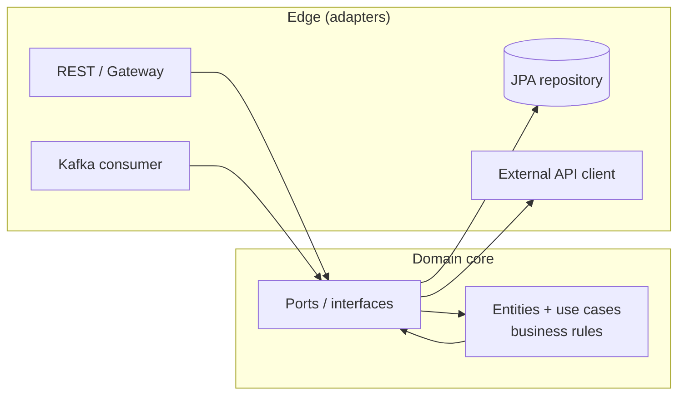
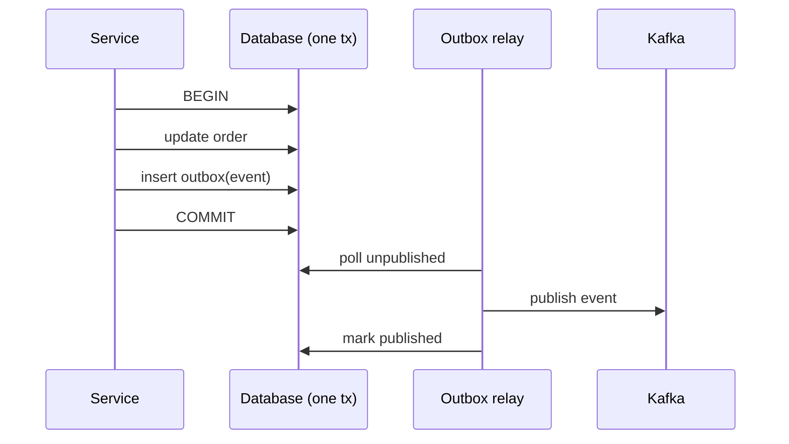
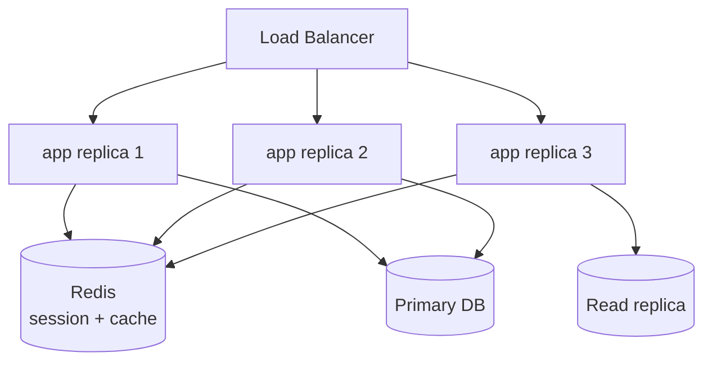

# Advanced System Design & Enterprise Patterns

> Designing production Spring Boot systems means choosing boundaries that isolate change, making operations idempotent and resilient, keeping services scalable and stateless, and building observability and security in from the start — not bolting them on later.

## Mental model

System design is about **managing change and failure at scale**. Good architecture pushes business rules to the center and keeps frameworks, databases, and transports at the edges so any of them can be swapped without rewriting the domain. At runtime, every remote interaction can fail or be retried, so operations must be **idempotent** and **resilient**; every instance can die, so state lives in datastores, not memory. The recurring question is: *when this requirement changes, or this dependency fails, how much has to change or break?*



The domain depends on **ports** (interfaces); adapters implement them. Dependencies point inward.

## Core concepts

### Layered → hexagonal → clean architecture

Classic **layered** (controller → service → repository) is fine for most apps but tends to leak persistence concerns into the domain. **Hexagonal (ports & adapters)** inverts that: the domain defines interfaces (ports), and infrastructure implements them (adapters), so the core has zero framework imports.

```java
// domain port — no Spring, no JPA
public interface OrderRepository {
    Optional<Order> byId(OrderId id);
    void save(Order order);
}

// application service — pure use case, depends only on the port
public class PlaceOrder {
    private final OrderRepository orders;
    private final PaymentPort payments;
    public PlaceOrder(OrderRepository orders, PaymentPort payments) {
        this.orders = orders; this.payments = payments;
    }
    public OrderId handle(PlaceOrderCommand cmd) {
        var order = Order.create(cmd.items());
        payments.charge(order.total());
        orders.save(order);
        return order.id();
    }
}

// adapter — the JPA detail lives at the edge
@Repository
class JpaOrderRepository implements OrderRepository {
    private final SpringDataOrderRepo repo;
    /* maps domain ↔ entity */
}
```

::: tip
You don't need full hexagonal for a CRUD app. Reach for it when the domain is rich and long-lived; the payoff is testable business logic and replaceable infrastructure.
:::

### Domain-driven design boundaries

DDD gives vocabulary for *where to draw lines*: a **bounded context** is a model with its own ubiquitous language and consistency boundary — and usually maps to one service and one database. **Aggregates** are consistency clusters guarded by an aggregate root; you keep a transaction inside one aggregate and use events between aggregates.

::: info
A bounded context is the natural seam for splitting a monolith into microservices. If you can't name clean contexts, you're not ready to split.
:::

### Idempotency

Networks retry. A `POST /payments` that runs twice must not charge twice. Make write operations idempotent with a client-supplied **idempotency key** stored on first use.

```java
@PostMapping("/payments")
public ResponseEntity<Receipt> pay(@RequestHeader("Idempotency-Key") String key,
                                   @RequestBody PaymentRequest req) {
    return idempotency.find(key)
        .map(prev -> ResponseEntity.ok(prev))             // replay stored result
        .orElseGet(() -> {
            Receipt r = service.charge(req);
            idempotency.store(key, r);                     // same tx as the write
            return ResponseEntity.status(HttpStatus.CREATED).body(r);
        });
}
```

### The transactional outbox

The **dual-write problem**: updating the DB and publishing an event are two systems — one can succeed while the other fails, leaving them inconsistent. The outbox pattern writes the event into an `outbox` table *in the same transaction* as the state change; a relay then publishes committed rows.



::: warning
Don't publish to a broker *inside* a `@Transactional` method and assume atomicity — if the transaction rolls back after the publish, you've emitted a phantom event. The outbox is the standard fix.
:::

### CQRS (when it earns its keep)

**Command Query Responsibility Segregation** separates the write model (normalized, validated) from read models (denormalized, optimized for queries), often kept in sync via events. It adds eventual consistency and complexity — use it only when read and write loads or shapes genuinely diverge.

### Resilience patterns

The same patterns as microservices apply to any external dependency: **circuit breaker** (fail fast when a dependency is unhealthy), **retry with exponential backoff + jitter** (for transient faults — only on idempotent ops), **bulkhead** (isolate thread pools so one slow dependency can't starve others), **timeout/time limiter** (never wait forever), and **rate limiter**.

```java
@Retry(name = "inventory")                 // backoff configured in yaml
@CircuitBreaker(name = "inventory", fallbackMethod = "fromCache")
@Bulkhead(name = "inventory")
public Stock check(Sku sku) { return inventoryClient.stock(sku); }
```

::: danger
Retries on a **non-idempotent** operation can duplicate side effects (double charges, double emails). Only retry reads or idempotent writes, and bound the attempts.
:::

### API design, versioning & rate limiting

Design stable contracts: consistent resource naming, correct status codes, `ProblemDetail` (RFC 7807) error bodies, pagination, and explicit **versioning** (URI `/v1/` or header) so you can evolve without breaking clients. Enforce **rate limits** at the gateway to protect downstreams.

### Scaling stateless services

Horizontal scaling requires **statelessness**: no in-memory sessions, no local file state. Push session state to Redis (Spring Session), store files in object storage, and keep caches either local-with-short-TTL or distributed. Then any instance can serve any request and you scale by adding replicas behind a load balancer.



### Consistency & distributed transactions

Within one service/aggregate, use a database transaction. Across services, you can't — choose **eventual consistency** with sagas (local transactions + compensating actions) and idempotent, ordered event handling. Decide per use case how much staleness the business tolerates.

### Worked example — an Order service

Putting it together for "place an order":

1. **API**: `POST /v1/orders` with an `Idempotency-Key`; validate the body, return `ProblemDetail` on errors.
2. **Domain**: `PlaceOrder` use case creates the `Order` aggregate, enforces invariants.
3. **Persistence + outbox**: in one transaction, save the order and insert an `OrderCreated` event.
4. **Async fan-out**: a relay publishes `OrderCreated`; payment and inventory services react (saga), with compensations on failure.
5. **Resilience**: outbound calls wrapped in circuit breaker + timeout + retry; fallbacks degrade gracefully.
6. **Scale**: service is stateless; sessions/caches in Redis; reads from a replica.
7. **Observability**: metrics on order rate/latency/errors, structured logs with a trace id, distributed traces across the saga.
8. **Security**: JWT at the gateway, method-level authorization, secrets from a vault.

## Common pitfalls

- **Anemic domain + fat services.** All logic in service classes, entities are bags of getters. Fix: put invariants on aggregates; keep services thin orchestration.
- **Dual writes.** DB commit + broker publish without atomicity drift apart. Fix: transactional outbox.
- **Non-idempotent writes behind retries.** Duplicated charges/emails. Fix: idempotency keys + idempotent handlers.
- **Stateful instances.** In-memory sessions/caches break horizontal scaling and lose data on restart. Fix: externalize state to Redis/DB/object storage.
- **CQRS/event-sourcing cargo-culting.** Added for resume value, not need. Fix: adopt only when read/write divergence justifies the complexity.
- **Distributed transactions via 2PC.** Doesn't scale, fragile. Fix: sagas + eventual consistency.
- **Observability as an afterthought.** No metrics/traces until an incident. Fix: design them in (next-door tutorial on Actuator & observability).
- **Breaking API changes.** Removing fields/changing types without versioning. Fix: additive changes, explicit versions, deprecation windows.

## Best practices

- Keep business rules in a **framework-free domain core**; isolate infrastructure behind ports.
- Draw service boundaries along **bounded contexts**; one context, one database.
- Make every write **idempotent**; use the **outbox** to publish events reliably.
- Wrap external calls in **circuit breaker + timeout + bounded retry with backoff/jitter + bulkhead**, with sensible fallbacks.
- Keep services **stateless**; externalize sessions, caches, and files so you scale horizontally.
- Prefer **eventual consistency + sagas** over cross-service transactions; tolerate staleness deliberately.
- Design **stable, versioned APIs** with `ProblemDetail` errors and pagination.
- Build in **security and observability by default**; treat secrets, metrics, logs, and traces as first-class.
- Resist complexity (CQRS, event sourcing, microservices) until a concrete requirement demands it.

## Interview quick-reference

| Concept | Key point |
| --- | --- |
| Hexagonal architecture | Domain defines ports; infra are adapters; deps point inward |
| Bounded context | Consistency + language boundary; maps to a service/DB |
| Aggregate | Consistency cluster guarded by a root; one tx per aggregate |
| Idempotency | Repeated request → same effect; key stored on first use |
| Transactional outbox | Event in same tx as write; relay publishes — fixes dual-write |
| CQRS | Separate write/read models; eventual consistency; use sparingly |
| Resilience set | Breaker + timeout + retry/backoff + bulkhead + rate limit |
| Stateless scaling | No local state → add replicas behind a load balancer |
| Saga | Local txns + compensations for cross-service consistency |
| API versioning | Additive changes, explicit versions, ProblemDetail errors |
| Eventual consistency | Cross-service writes converge over time, not instantly |

See the [interview questions](../questions/15-advanced-system-design-and-enterprise-patterns) for drilling.
