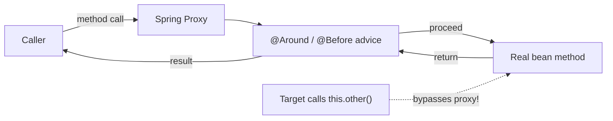
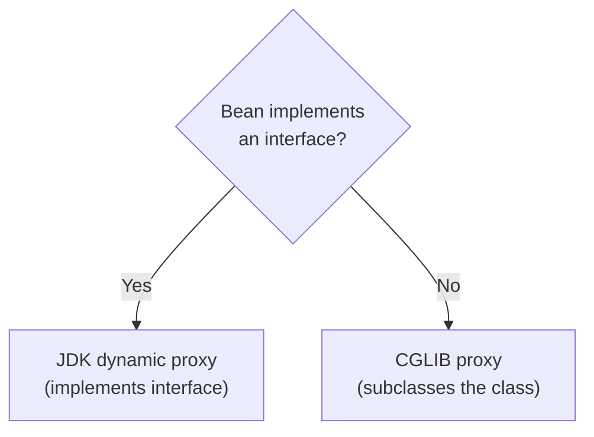
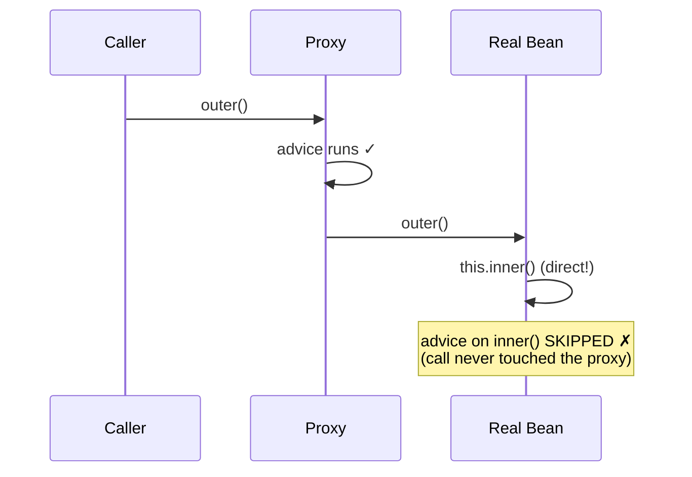

# Aspect-Oriented Programming (AOP)

> Pull cross-cutting concerns — logging, timing, security, transactions — out of your business code and into reusable aspects, and understand the proxy machinery that makes it work (and where it silently fails).

## Mental model

Some concerns — logging, metrics, security checks, transactions, caching, retry — cut *across* many classes. Scattering that code into every method is repetitive and error-prone. **AOP** lets you write the concern once as an **aspect** and declaratively apply it wherever a **pointcut** matches.

Spring implements AOP with **proxies**: when a bean has matching advice, Spring hands you not the raw object but a *proxy* that wraps it. Calls go through the proxy → it runs the advice → then delegates to your real method. This proxy model is elegant but has one famous trap: a method calling *another method on itself* bypasses the proxy entirely.



## Core concepts

### Vocabulary

| Term | Meaning |
| --- | --- |
| **Aspect** | A class (`@Aspect`) bundling cross-cutting logic |
| **Join point** | A point where advice can run (in Spring AOP: a method execution) |
| **Advice** | The action taken — `@Before`, `@After`, `@Around`, etc. |
| **Pointcut** | An expression selecting which join points to advise |
| **Target** | The real bean being advised |
| **Proxy** | The wrapper Spring injects in place of the target |
| **Weaving** | Linking aspects to targets — at runtime via proxies in Spring AOP |

Add the dependency to enable it:

```xml
<dependency>
    <groupId>org.springframework.boot</groupId>
    <artifactId>spring-boot-starter-aop</artifactId>
</dependency>
```

### The proxy model: JDK dynamic proxy vs CGLIB

Spring creates one of two proxy types:

- **JDK dynamic proxy** — used when the bean implements an interface. The proxy implements the *same interface*; you must inject by the interface type.
- **CGLIB proxy** — used when there is no interface. CGLIB generates a *subclass* of your class at runtime and overrides its methods.



::: info
Spring Boot defaults to **CGLIB for everything** (`spring.aop.proxy-target-class=true`) for consistency. Because CGLIB subclasses your bean, the class and the methods you advise **cannot be `final`** — a `final` class or method can't be overridden, so the proxy can't intercept it.
:::

### Declaring an aspect

An `@Aspect` is just a Spring `@Component` carrying advice. Here is a logging aspect over the service layer.

```java
import org.aspectj.lang.annotation.Aspect;
import org.aspectj.lang.annotation.Before;
import org.aspectj.lang.JoinPoint;
import org.slf4j.Logger;
import org.slf4j.LoggerFactory;
import org.springframework.stereotype.Component;

@Aspect
@Component
public class LoggingAspect {

    private static final Logger log = LoggerFactory.getLogger(LoggingAspect.class);

    @Before("execution(* com.example.shop.service..*(..))")
    public void logEntry(JoinPoint jp) {
        log.info("→ {} args={}", jp.getSignature().toShortString(), jp.getArgs());
    }
}
```

### Advice types

Five advice annotations cover every interception point. `@Around` is the most powerful — it wraps the call and controls whether/when it proceeds.

```java
import org.aspectj.lang.annotation.*;
import org.aspectj.lang.ProceedingJoinPoint;

@Aspect
@Component
class AuditAspect {

    @Before("execution(* com.example.shop.service.*.*(..))")
    void before() { /* runs before the method */ }

    @AfterReturning(pointcut = "execution(* com.example..*(..))", returning = "result")
    void afterReturning(Object result) { /* runs on normal return; sees the value */ }

    @AfterThrowing(pointcut = "execution(* com.example..*(..))", throwing = "ex")
    void afterThrowing(Exception ex) { /* runs only if the method threw */ }

    @After("execution(* com.example..*(..))")
    void after() { /* finally — runs whether it returned or threw */ }

    @Around("execution(* com.example..*(..))")
    Object around(ProceedingJoinPoint pjp) throws Throwable {
        Object result = pjp.proceed();   // MUST call proceed() or the method never runs
        return result;
    }
}
```

| Advice | Runs |
| --- | --- |
| `@Before` | Before the method |
| `@AfterReturning` | After a successful return (can read the result) |
| `@AfterThrowing` | After the method throws (can read the exception) |
| `@After` | Always, like a `finally` |
| `@Around` | Wraps the call; decides whether to `proceed()` and can alter args/result |

### Pointcut expressions

The `execution(...)` designator is the workhorse. Its anatomy:

```java
// execution(modifiers? return-type declaring-type? method(params) throws?)
execution(public * com.example.shop.service.*.*(..))
//        |      | |                          |  |  └─ any params
//        |      | |                          |  └──── any method
//        |      | |                          └─────── any class in that package
//        |      | └────────────────────────────────── package
//        |      └──────────────────────────────────── any return type
//        └─────────────────────────────────────────── public methods
```

Reuse pointcuts via `@Pointcut`, and prefer annotation-driven matching for clarity:

```java
@Aspect
@Component
class TimingAspect {

    @Pointcut("@annotation(com.example.shop.Timed)")   // match methods marked @Timed
    void timed() {}

    @Pointcut("within(com.example.shop.service..*)")    // any join point in the package
    void serviceLayer() {}

    @Around("timed() && serviceLayer()")               // combine pointcuts
    Object time(ProceedingJoinPoint pjp) throws Throwable {
        long start = System.nanoTime();
        try {
            return pjp.proceed();
        } finally {
            long ms = (System.nanoTime() - start) / 1_000_000;
            System.out.println(pjp.getSignature().getName() + " took " + ms + "ms");
        }
    }
}
```

Common designators: `execution` (method match), `within` (type/package), `@annotation` (method bears an annotation), `args` (argument types), `bean` (bean name).

### JoinPoint and ProceedingJoinPoint

`JoinPoint` exposes metadata about the intercepted call — signature, arguments, target. `ProceedingJoinPoint` (only available in `@Around`) adds `proceed()`, which actually invokes the wrapped method and is where you can swap arguments or short-circuit.

```java
@Around("@annotation(com.example.shop.Cacheable)")
Object cache(ProceedingJoinPoint pjp) throws Throwable {
    String key = pjp.getSignature().getName() + Arrays.toString(pjp.getArgs());
    if (store.containsKey(key)) return store.get(key);     // short-circuit: skip target
    Object value = pjp.proceed();                          // or run it
    store.put(key, value);
    return value;
}
```

::: warning
In `@Around` you **must** call `proceed()` (and return its result) or the target method never executes — a subtle way to silently disable functionality.
:::

### Ordering multiple aspects

When several aspects match the same join point, control their nesting with `@Order` (lower value = outermost / runs first on the way in).

```java
@Aspect @Component
@Order(1)                  // outermost: e.g. security check first
class SecurityAspect { }

@Aspect @Component
@Order(2)                  // then transactions
class TransactionAspect { }

@Aspect @Component
@Order(3)                  // innermost: logging closest to the method
class LoggingAspect2 { }
```

### A real-world aspect: declarative retry

A custom `@Retry` annotation plus an `@Around` aspect — the kind of reusable concern AOP is made for.

```java
import java.lang.annotation.*;

@Target(ElementType.METHOD)
@Retention(RetentionPolicy.RUNTIME)
public @interface Retry {
    int times() default 3;
}
```

```java
@Aspect
@Component
class RetryAspect {

    @Around("@annotation(retry)")
    Object retry(ProceedingJoinPoint pjp, Retry retry) throws Throwable {
        Throwable last = null;
        for (int attempt = 1; attempt <= retry.times(); attempt++) {
            try {
                return pjp.proceed();
            } catch (Exception ex) {
                last = ex;                       // retry on failure
            }
        }
        throw last;                              // exhausted all attempts
    }
}
```

```java
@Service
class PaymentClient {
    @Retry(times = 5)
    String charge(String account) { /* flaky network call */ return "ok"; }
}
```

### The self-invocation pitfall

This is the single most important AOP gotcha. Advice only runs when a call passes **through the proxy**. An *internal* call (`this.other()`) goes straight to the real object, skipping the proxy — so the advice never fires.



```java
@Service
class ReportService {

    public void outer() {
        inner();          // ❌ self-call: bypasses the proxy
    }

    @Retry(times = 3)     // advice will NOT run when called from outer()
    public void inner() { /* ... */ }
}
```

::: danger
Self-invocation breaks **every** proxy-based feature the same way: `@Transactional`, `@Cacheable`, `@Async`, `@Retryable`, and your own aspects. The annotation on an internally-called method is silently ignored — no error, just missing behavior.
:::

Fixes:

```java
// 1. Move the advised method to a separate bean (cleanest)
@Service
class ReportService {
    private final ReportWorker worker;
    ReportService(ReportWorker worker) { this.worker = worker; }
    public void outer() { worker.inner(); }   // ✓ goes through worker's proxy
}

// 2. Inject the proxy of self and call through it
@Service
class ReportService2 {
    @Autowired @Lazy
    private ReportService2 self;              // the proxy
    public void outer() { self.inner(); }     // ✓ routed through the proxy
    @Transactional public void inner() { }
}

// 3. AopContext.currentProxy() — requires exposeProxy = true (last resort)
```

## Common pitfalls

- **Self-invocation.** Internal `this.method()` calls bypass the proxy, so `@Transactional`/`@Cacheable`/`@Async`/custom advice silently don't apply. Split into another bean or call through the proxy.
- **`final` classes/methods with CGLIB.** CGLIB subclasses the target; `final` can't be overridden, so the method isn't advised (sometimes a startup error).
- **Forgetting `proceed()` in `@Around`.** The target never runs and its result is lost.
- **Advising `private` methods.** Spring AOP only intercepts externally-visible method executions on beans — `private` (and effectively self-only) methods aren't proxied.
- **Over-broad pointcuts.** `execution(* *(..))` wraps everything, hurting performance and debuggability; scope to packages/annotations.
- **Aspect on a non-bean.** AOP only applies to Spring-managed beans; objects you `new` yourself are never proxied.
- **Assuming aspect order.** Without `@Order` the nesting is undefined; set it explicitly when it matters.

## Best practices

- Use AOP for genuine cross-cutting concerns (logging, metrics, security, retry); keep business logic in the methods themselves.
- Prefer annotation-driven pointcuts (`@annotation(...)`) over brittle package-path `execution` strings.
- Define reusable named `@Pointcut`s and compose them with `&&`/`||`/`!`.
- Keep advice fast and side-effect-light — it runs on every matched call.
- Always remember the proxy boundary: design so advised methods are called from *outside* the bean.
- Set `@Order` whenever multiple aspects share join points.
- Avoid `final` on beans that need proxying; don't try to advise private methods.

## Interview quick-reference

| Concept | Key point |
| --- | --- |
| AOP purpose | Modularize cross-cutting concerns away from business logic |
| Aspect / advice / pointcut | Class of logic / the action / the selector for join points |
| Proxy model | Spring wraps beans; calls flow caller → proxy → advice → target |
| JDK vs CGLIB | Interface → JDK proxy; no interface → CGLIB subclass (Boot defaults to CGLIB) |
| Advice types | `@Before`, `@After`, `@AfterReturning`, `@AfterThrowing`, `@Around` |
| `@Around` | Wraps call; must `proceed()`; can alter args/result or short-circuit |
| Pointcut designators | `execution`, `within`, `@annotation`, `args`, `bean` |
| JoinPoint vs ProceedingJoinPoint | Metadata vs metadata + `proceed()` (only in `@Around`) |
| Ordering | `@Order` — lower value is outermost |
| Self-invocation pitfall | Internal `this.x()` bypasses the proxy → breaks `@Transactional`/`@Cacheable`/`@Async`/aspects |
| `final` limitation | CGLIB can't subclass `final` classes/methods, so they aren't advised |

See the [interview questions](../questions/02-ioc-container-and-dependency-injection) for drilling.
