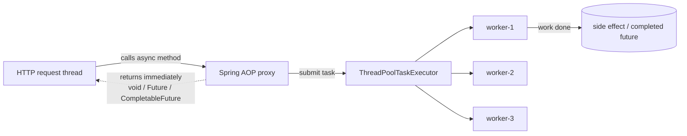
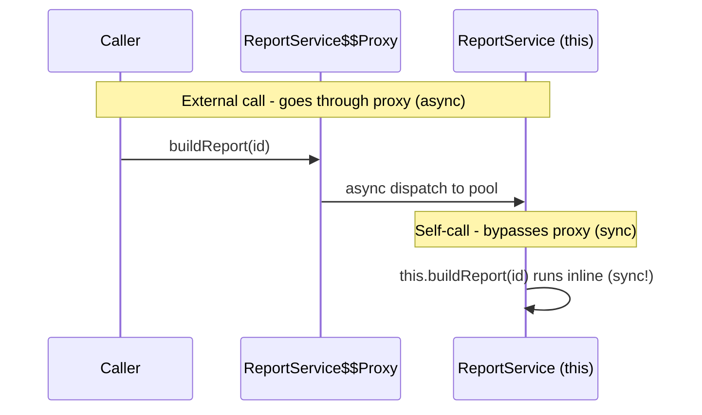

# Asynchronous Processing and Scheduling

> Run work off the request thread with `@Async`, fire periodic jobs with `@Scheduled`, coordinate them across a cluster with ShedLock, and modernize it all with Java 21 virtual threads — without falling into the proxy self-invocation trap.

## Mental model

Spring gives you two orthogonal ways to do work that isn't a direct response to a request:

- **`@Async`** — *event-driven offloading*. A caller hands a method to a background thread pool and returns immediately (or gets a `Future`/`CompletableFuture` to await later). Use it for fire-and-forget side effects (emails, audit logs) or to fan out parallel I/O.
- **`@Scheduled`** — *time-driven jobs*. A method runs on a clock: every N ms, or on a cron expression. Use it for cleanup, polling, report generation.

Both are powered by Spring AOP **proxies**: the annotated bean is wrapped so the call is intercepted and dispatched to an executor or scheduler. This is the single most important thing to internalize, because it is also the source of the most common bug — **self-invocation bypasses the proxy**.



::: info
The request thread is freed the instant the proxy submits the task. The actual work happens later on a pool worker. That is the whole point — and why you must never assume the result is ready when the async call returns.
:::

## Core concepts

### Enabling and using `@Async`

Add `@EnableAsync` to a configuration class, then annotate methods with `@Async`. A `void` method is true fire-and-forget; return `CompletableFuture<T>` when the caller needs the result.

```java
import org.springframework.scheduling.annotation.EnableAsync;

@Configuration
@EnableAsync
public class AsyncConfig { }
```

```java
import org.springframework.scheduling.annotation.Async;
import java.util.concurrent.CompletableFuture;

@Service
public class NotificationService {

    @Async                                   // fire-and-forget
    public void sendWelcomeEmail(String to) {
        mail.send(to, "Welcome!");
    }

    @Async                                   // caller can await the value
    public CompletableFuture<UserProfile> loadProfile(Long id) {
        var profile = remoteApi.fetchProfile(id);   // slow I/O off the request thread
        return CompletableFuture.completedFuture(profile);
    }
}
```

::: warning
Return `CompletableFuture<T>` (or the legacy `Future<T>`/`ListenableFuture`), never a plain `T`. A non-`void`, non-`Future` return type is computed on the caller thread anyway — the `@Async` is effectively ignored.
:::

### The self-invocation proxy pitfall

`@Async` works only when the call goes *through the proxy*. Calling an async method from another method of the **same bean** invokes it directly on `this`, skipping the proxy entirely — so it runs synchronously on the caller thread.

```java
@Service
public class ReportService {

    public void generateAll() {
        for (var id : ids) {
            buildReport(id);   // BUG: self-invocation — runs synchronously, NOT async
        }
    }

    @Async
    public void buildReport(Long id) { /* heavy work */ }
}
```



Fixes, in order of preference:

```java
// 1. Move the @Async method into a SEPARATE bean (cleanest)
@Service
public class ReportOrchestrator {
    private final ReportBuilder builder;        // injected proxy
    public void generateAll() { ids.forEach(builder::buildReport); }
}

// 2. Or self-inject the proxy and call through it
@Service
public class ReportService {
    @Autowired private ReportService self;      // the proxy, not `this`
    public void generateAll() { ids.forEach(self::buildReport); }
    @Async public void buildReport(Long id) { /* ... */ }
}
```

::: danger
This same proxy rule breaks `@Transactional`, `@Cacheable`, and `@Scheduled` too. Whenever a Spring annotation "does nothing," suspect a self-invocation. The annotated method must also be `public` for the proxy to advise it.
:::

### Custom `TaskExecutor` and thread-pool sizing

The default executor (before Spring Boot 3.2 / virtual threads) can queue unboundedly. Define an explicit `ThreadPoolTaskExecutor` so you control sizing and the rejection policy.

```java
import org.springframework.scheduling.concurrent.ThreadPoolTaskExecutor;
import java.util.concurrent.ThreadPoolExecutor;

@Bean("emailExecutor")
public Executor emailExecutor() {
    var ex = new ThreadPoolTaskExecutor();
    ex.setCorePoolSize(8);          // always-alive threads
    ex.setMaxPoolSize(16);          // grows to this only when the queue is full
    ex.setQueueCapacity(500);       // bounded! tasks wait here before maxPool kicks in
    ex.setThreadNamePrefix("email-");
    ex.setRejectedExecutionHandler(new ThreadPoolExecutor.CallerRunsPolicy()); // backpressure
    ex.initialize();
    return ex;
}
```

```java
@Async("emailExecutor")           // pick the named pool
public void sendWelcomeEmail(String to) { mail.send(to, "Welcome!"); }
```

::: tip
A `ThreadPoolTaskExecutor` grows to `maxPoolSize` **only after the queue is full**, not before. With an unbounded (default `Integer.MAX_VALUE`) queue, `maxPoolSize` is never reached. Size the queue deliberately. Rule of thumb: I/O-bound → many threads; CPU-bound → ~number of cores. `CallerRunsPolicy` applies natural backpressure by running the task on the submitting thread when the pool is saturated.
:::

### Exception handling in async methods

For `void` `@Async` methods, exceptions vanish — there's no caller to catch them. Register an `AsyncUncaughtExceptionHandler`. For `CompletableFuture` returns, the exception is captured in the future and surfaces on `get()`/`exceptionally()`.

```java
import org.springframework.aop.interceptor.AsyncUncaughtExceptionHandler;
import org.springframework.scheduling.annotation.AsyncConfigurer;

@Configuration
@EnableAsync
public class AsyncConfig implements AsyncConfigurer {
    @Override
    public AsyncUncaughtExceptionHandler getAsyncUncaughtExceptionHandler() {
        return (ex, method, params) ->
            log.error("Async {} failed with {}", method.getName(), params, ex);
    }
}
```

### CompletableFuture composition

`CompletableFuture` shines when fanning out and combining parallel async calls — without blocking a thread between steps.

```java
public CompletableFuture<Dashboard> buildDashboard(Long userId) {
    CompletableFuture<UserProfile> profile = service.loadProfile(userId);
    CompletableFuture<List<Order>> orders   = service.loadOrders(userId);

    return profile
        .thenCombine(orders, Dashboard::new)          // merge when both complete
        .orTimeout(3, TimeUnit.SECONDS)               // fail if too slow
        .exceptionally(ex -> Dashboard.empty());      // graceful fallback
}
```

::: warning
Don't call `.get()` / `.join()` on the request thread right after launching — that blocks and defeats the async benefit. Compose with `thenApply`/`thenCompose`/`thenCombine` and return the future, or block once at the very edge.
:::

### Scheduling with `@Scheduled`

Add `@EnableScheduling`, then annotate methods (no args, `void` return). Three timing modes:

```java
import org.springframework.scheduling.annotation.Scheduled;

@Component
public class Jobs {

    @Scheduled(fixedRate = 5000)          // every 5s, measured start-to-start
    public void poll() { queue.drain(); }

    @Scheduled(fixedDelay = 5000)         // 5s AFTER the previous run finishes
    public void cleanup() { temp.purge(); }

    @Scheduled(cron = "0 0 2 * * *", zone = "UTC")   // 02:00 every day
    public void nightlyReport() { reports.generate(); }
}
```

- **`fixedRate`** — fixed interval between *starts*; can overlap if a run is slow (the default scheduler is single-threaded, so it actually serializes).
- **`fixedDelay`** — fixed gap *after completion*; never overlaps.
- **`cron`** — calendar-based (`sec min hour day month weekday`); always set the `zone`.

::: tip
The default scheduler uses a **single thread**, so a long job delays all others. Configure a pool or use `@Async` on the scheduled method (through a proxy!) when jobs are heavy or must run concurrently:
```yaml
spring:
  task:
    scheduling:
      pool:
        size: 5
```
:::

### Distributed scheduling with ShedLock

In a multi-instance deployment, every node runs the same `@Scheduled` job — so a nightly report fires N times. **ShedLock** ensures only one node executes each run by acquiring a lock in a shared store (DB, Redis).

```java
import net.javacrumbs.shedlock.spring.annotation.SchedulerLock;
import net.javacrumbs.shedlock.spring.annotation.EnableSchedulerLock;

@Configuration
@EnableScheduling
@EnableSchedulerLock(defaultLockAtMostFor = "10m")
public class SchedulingConfig {
    @Bean
    LockProvider lockProvider(DataSource ds) { return new JdbcTemplateLockProvider(ds); }
}
```

```java
@Scheduled(cron = "0 0 2 * * *")
@SchedulerLock(name = "nightlyReport", lockAtLeastFor = "1m", lockAtMostFor = "9m")
public void nightlyReport() { reports.generate(); }
```

::: info
`lockAtMostFor` is a safety net: if the holding node dies without releasing, the lock auto-expires so another node can take over. `lockAtLeastFor` prevents a too-fast job from running twice on clocks that are slightly skewed. ShedLock does *not* distribute work — it just guarantees single execution.
:::

### Virtual threads (Java 21)

Spring Boot 3.2+ on Java 21 can run web requests, `@Async` tasks, and `@Scheduled` jobs on **virtual threads** — lightweight threads (millions feasible) that unmount from a carrier OS thread while blocked on I/O. One flag flips it on:

```yaml
spring:
  threads:
    virtual:
      enabled: true        # Java 21+; Tomcat, @Async, scheduling use virtual threads
```

```java
// Manual use: a fresh virtual thread per task, no pool needed
try (var executor = Executors.newVirtualThreadPerTaskExecutor()) {
    ids.forEach(id -> executor.submit(() -> process(id)));
}
```

::: tip
Virtual threads make the old "size your thread pool carefully" advice largely obsolete for **I/O-bound** work — blocking is cheap, so a thread-per-request model scales. They do **not** help CPU-bound work (still bounded by cores) and you should avoid pooling them or pinning them with `synchronized` blocks around blocking I/O (use `ReentrantLock` instead).
:::

### Events: `ApplicationEventPublisher` and `@EventListener`

In-process decoupling: publish a domain event, let listeners react. Listeners are synchronous by default (same thread/transaction) but become async with `@Async`.

```java
@Service
public class OrderService {
    private final ApplicationEventPublisher publisher;
    @Transactional
    public void place(Order o) {
        repo.save(o);
        publisher.publishEvent(new OrderPlacedEvent(o.id()));  // notify listeners
    }
}

@Component
public class OrderListeners {
    @Async
    @EventListener
    public void onPlaced(OrderPlacedEvent e) { metrics.record(e); }
}
```

### `@TransactionalEventListener`

A plain `@EventListener` runs *inside* the publishing transaction — risky for side effects like sending emails, because the transaction might still roll back afterward. `@TransactionalEventListener` defers the listener until a chosen transaction phase.

```java
import org.springframework.transaction.event.TransactionalEventListener;
import org.springframework.transaction.event.TransactionPhase;

@TransactionalEventListener(phase = TransactionPhase.AFTER_COMMIT)
public void onCommitted(OrderPlacedEvent e) {
    email.sendConfirmation(e.id());   // only fires if the tx actually committed
}
```

::: warning
`AFTER_COMMIT` listeners run after the transaction closes, so any DB write inside them needs a *new* transaction (`@Transactional(propagation = REQUIRES_NEW)`) — the original connection is already committed and gone.
:::

## Common pitfalls

- **Self-invocation** — calling an `@Async`/`@Scheduled`/`@Transactional` method from the same class bypasses the proxy and runs synchronously. Split beans or self-inject the proxy.
- **Wrong return type on `@Async`** — anything other than `void`/`Future`/`CompletableFuture` runs on the caller thread.
- **Swallowed exceptions** in `void` async methods — register an `AsyncUncaughtExceptionHandler`.
- **Unbounded executor queue** — the default queue never lets the pool reach `maxPoolSize`; set a bounded `queueCapacity` and a rejection policy.
- **Blocking on `CompletableFuture.get()`** right after launching — defeats async; compose instead.
- **Single-threaded scheduler** silently serializing jobs — configure `spring.task.scheduling.pool.size`.
- **Duplicate scheduled runs** across instances — guard with ShedLock.
- **Cron without a `zone`** — server-timezone surprises across environments.
- **`@TransactionalEventListener` DB writes** without `REQUIRES_NEW` in `AFTER_COMMIT` — the transaction is already gone.
- **Pinning virtual threads** with `synchronized` around blocking I/O — use `ReentrantLock`.

## Best practices

- Keep `@Async` methods in a dedicated bean to sidestep self-invocation entirely.
- Always define an explicit, **bounded** `ThreadPoolTaskExecutor` per workload, with a meaningful thread-name prefix and a backpressure rejection policy.
- Prefer `CompletableFuture` composition over blocking `.get()`.
- Make scheduled jobs **idempotent and short**, or offload heavy work to an executor.
- Use **ShedLock** for any scheduled job in a clustered deployment.
- On Java 21, enable `spring.threads.virtual.enabled` for I/O-bound services and drop manual pool tuning.
- Use `@TransactionalEventListener(AFTER_COMMIT)` for side effects that must not happen on rollback.
- Always set a `zone` on cron expressions and prefer UTC.

## Interview quick-reference

| Concept | Key point |
| --- | --- |
| `@EnableAsync` + `@Async` | Offload to a pool; return `void` / `Future` / `CompletableFuture` |
| Self-invocation pitfall | Same-class call bypasses the proxy → runs synchronously |
| `ThreadPoolTaskExecutor` | core/max/queue; max reached only when bounded queue is full |
| `AsyncUncaughtExceptionHandler` | Catches exceptions from `void` async methods |
| `CompletableFuture` | Compose with `thenCombine`/`thenCompose`; don't block early |
| `@EnableScheduling` + `@Scheduled` | `fixedRate` / `fixedDelay` / `cron` (set `zone`) |
| fixedRate vs fixedDelay | Start-to-start vs gap-after-completion |
| Scheduler threads | Default single-threaded; size via `spring.task.scheduling.pool` |
| ShedLock | Single execution of a job across cluster nodes |
| Virtual threads (Java 21) | `spring.threads.virtual.enabled`; cheap blocking I/O |
| `@EventListener` | In-process decoupling; sync unless `@Async` |
| `@TransactionalEventListener` | Defer to `AFTER_COMMIT`; use `REQUIRES_NEW` for DB writes |

See the [interview questions](../questions/10-asynchronous-processing-and-scheduling) for drilling.
