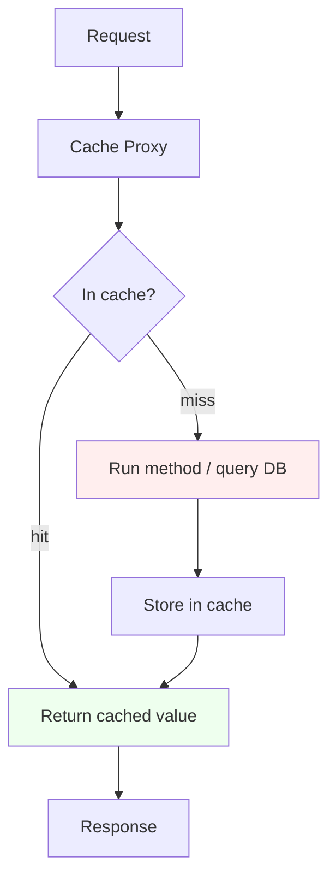
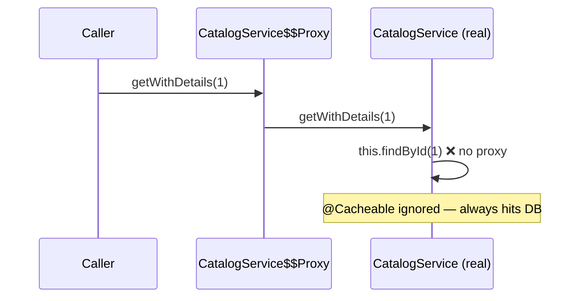
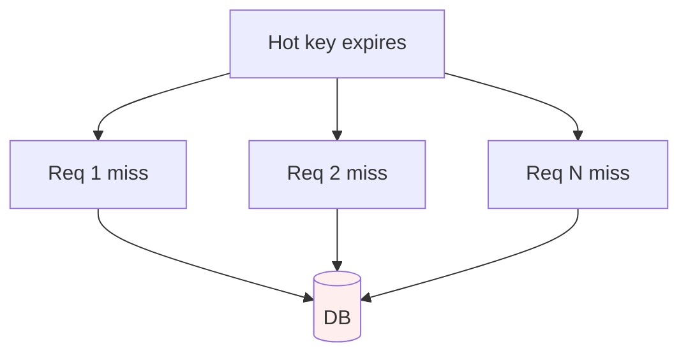

# Caching and Performance

> Use Spring's cache abstraction the right way — `@Cacheable`/`@CachePut`/`@CacheEvict`, Caffeine and Redis — dodge the self-invocation proxy trap, and hunt down the bottlenecks that actually matter.

## Mental model

Spring's cache abstraction is a thin, provider-agnostic layer driven by annotations. Like `@Transactional`, it works through an **AOP proxy**: the proxy checks the cache before calling your method and stores the result after. You pick the actual store (a `CacheManager`) — an in-process **Caffeine** cache or a distributed **Redis** cache — without changing your code.

The dominant pattern is **cache-aside (lazy loading)**: on a request, look in the cache; on a miss, load from the source of truth (DB), put it in the cache, and return it. The cache is a *copy*, not the truth — so correctness depends on eviction and TTL.



## Core concepts

### Enabling the cache abstraction

```java
@Configuration
@EnableCaching
public class CacheConfig { }
```

`@EnableCaching` switches on the proxy that interprets the caching annotations. Without it, the annotations are inert no-ops.

### `@Cacheable`

Caches the method result keyed by its arguments. On a hit the method body is **skipped entirely**.

```java
@Service
public class ProductService {
    private final ProductRepository repo;

    public ProductService(ProductRepository repo) { this.repo = repo; }

    @Cacheable(value = "products", key = "#id")
    public Product findById(Long id) {
        return repo.findById(id).orElseThrow();   // only runs on a cache miss
    }
}
```

### `@CachePut` and `@CacheEvict`

`@CachePut` **always** runs the method and updates the cache with the result — use it on writes to keep the cache fresh. `@CacheEvict` removes entries.

```java
@CachePut(value = "products", key = "#product.id")
public Product update(Product product) {
    return repo.save(product);     // method always runs; cache refreshed
}

@CacheEvict(value = "products", key = "#id")
public void delete(Long id) {
    repo.deleteById(id);
}

@CacheEvict(value = "products", allEntries = true)   // clear the whole cache
public void reloadAll() { }
```

::: warning
Don't put `@Cacheable` and `@CachePut` on the *same* method — they have conflicting semantics (skip vs always-run) and the behavior is undefined. Use `@Cacheable` for reads, `@CachePut` for writes.
:::

### Key generation and conditions

Default keys come from the method arguments via `SimpleKeyGenerator`. Use SpEL for custom keys and conditional caching.

```java
@Cacheable(
    value = "orders",
    key = "#userId + ':' + #status",         // composite SpEL key
    condition = "#status == 'ACTIVE'",        // only cache when this is true (pre)
    unless = "#result == null || #result.isEmpty()")  // skip caching (post, sees result)
public List<Order> find(Long userId, String status) { ... }
```

- `condition` is evaluated **before** invocation (no `#result` available).
- `unless` is evaluated **after** invocation and can inspect `#result` — use it to avoid caching empty/null results.

### The self-invocation proxy pitfall

Identical to the `@Transactional` trap and just as common. Caching is applied by the proxy, so an **internal call** on `this` bypasses it — the cache is never consulted or populated.

```java
@Service
public class CatalogService {

    public Product getWithDetails(Long id) {
        Product p = findById(id);   // ❌ self-invocation — @Cacheable bypassed!
        return enrich(p);
    }

    @Cacheable("products")
    public Product findById(Long id) {   // never cached when called via this.findById
        return repo.findById(id).orElseThrow();
    }
}
```



**Fix:** move the cached method to a separate bean (preferred), or self-inject the proxy.

```java
@Service
public class CatalogService {
    private final ProductService products;   // separate bean => proxied

    public CatalogService(ProductService products) { this.products = products; }

    public Product getWithDetails(Long id) {
        return enrich(products.findById(id));   // ✅ goes through the cache proxy
    }
}
```

::: danger
`@Cacheable` on a private/final method, or called internally, does nothing. This silent failure looks like the cache "isn't working" — it's almost always self-invocation.
:::

### Caffeine — fast local cache

In-process, no network hop, ideal for hot read-mostly data on a single instance.

```xml
<!-- caffeine + spring-boot-starter-cache on the classpath -->
```

```yaml
spring:
  cache:
    type: caffeine
    caffeine:
      spec: maximumSize=10000,expireAfterWrite=5m,recordStats
```

```java
@Bean
public CacheManager cacheManager() {
    CaffeineCacheManager mgr = new CaffeineCacheManager("products", "orders");
    mgr.setCaffeine(Caffeine.newBuilder()
        .maximumSize(10_000)
        .expireAfterWrite(Duration.ofMinutes(5))
        .recordStats());
    return mgr;
}
```

::: info
Caffeine is per-JVM. With multiple instances each has its own copy, so an evict on one node doesn't clear the others. For shared invalidation across a cluster, use Redis.
:::

### Redis — distributed cache

Shared across all instances; survives restarts; supports per-cache TTL.

```yaml
spring:
  data:
    redis:
      host: localhost
      port: 6379
  cache:
    type: redis
    redis:
      time-to-live: 600000        # 10 min default TTL
      cache-null-values: false
```

```java
@Bean
public RedisCacheManager cacheManager(RedisConnectionFactory cf) {
    RedisCacheConfiguration config = RedisCacheConfiguration.defaultCacheConfig()
        .entryTtl(Duration.ofMinutes(10))
        .serializeValuesWith(SerializationPair.fromSerializer(
            new GenericJackson2JsonRedisSerializer()));
    return RedisCacheManager.builder(cf)
        .cacheDefaults(config)
        .withCacheConfiguration("products",
            config.entryTtl(Duration.ofMinutes(30)))   // per-cache TTL
        .build();
}
```

::: tip
A two-tier (multi-level) cache — Caffeine as L1 in front of Redis as L2 — gives local-speed reads with cluster-wide consistency. Spring's `CompositeCacheManager` or a library like `JetCache` can wire this.
:::

### TTL, eviction, and cache stampede

**TTL** bounds staleness; **eviction** (size/LRU/LFU) bounds memory. When a hot key expires, many concurrent requests can all miss and hammer the DB at once — a **cache stampede** (thundering herd).



Mitigations:

- **Per-key locking** so only one request recomputes while others wait (Caffeine's loading cache does this; `sync = true` on `@Cacheable` serializes concurrent misses).
- **Staggered/jittered TTLs** so keys don't all expire together.
- **Refresh-ahead** — refresh entries before they expire.

```java
@Cacheable(value = "products", key = "#id", sync = true)  // only one loader per key
public Product findById(Long id) { return repo.findById(id).orElseThrow(); }
```

### Broader performance: where the time actually goes

Caching only helps if the cached work was the bottleneck. Profile first.

**Connection pooling** — an undersized or leaking HikariCP pool serializes requests (see the transactions tutorial). Often the real cause of "slow under load."

**JPA tuning** — fix the **N+1 problem** (`JOIN FETCH`/`@EntityGraph`/batch size), use projections to select fewer columns, enable JDBC batching:

```yaml
spring:
  jpa:
    properties:
      hibernate:
        jdbc.batch_size: 50
        order_inserts: true
        order_updates: true
        default_batch_fetch_size: 50
```

**Pagination** — never return unbounded lists; page large result sets and prefer keyset pagination for deep pages.

**Async / non-blocking** — offload slow, independent work so request threads aren't held.

```java
@Async
public CompletableFuture<Report> generate(Long id) {
    return CompletableFuture.completedFuture(build(id));
}
```

**HTTP response compression** — cheap latency win for JSON-heavy APIs:

```yaml
server:
  compression:
    enabled: true
    mime-types: application/json,text/html
    min-response-size: 1024
```

**Profiling and finding bottlenecks** — measure, don't guess. Use Spring Boot Actuator metrics + Micrometer/Prometheus for latency percentiles, async-profiler or JFR for CPU/allocation flame graphs, and SQL logging (p6spy/datasource-proxy) to count queries per request.

::: tip
The usual ranking of backend bottlenecks: **(1) too many/slow DB queries (N+1), (2) connection pool exhaustion, (3) missing pagination, (4) chatty remote calls, (5) serialization/GC.** Caching addresses #1 and #4 — but only after you've found them.
:::

## Common pitfalls

- **Self-invocation** — internal calls bypass the cache proxy; split into another bean.
- **`@Cacheable` on private/final methods** — silently does nothing.
- **Caching mutable objects** — callers mutate the shared cached instance; cache immutable DTOs.
- **No TTL** — stale data lingers forever; always bound staleness.
- **Cache stampede** on hot-key expiry — use `sync = true` / jittered TTL / refresh-ahead.
- **Caffeine across a cluster** — each node caches independently; evicts don't propagate. Use Redis.
- **Caching before profiling** — masking an N+1 instead of fixing it.
- **Unbounded local caches** — `maximumSize` missing leads to OOM.

## Best practices

- Cache immutable DTOs, not entities, and key on stable identifiers.
- Always set TTL and a size/eviction bound; add jitter to avoid synchronized expiry.
- Use `unless = "#result == null"` to skip caching empties; consider `cache-null-values` deliberately.
- Caffeine for single-instance hot data; Redis for shared/cluster invalidation; combine as L1/L2.
- Keep cache and DB consistent via `@CachePut`/`@CacheEvict` on writes.
- Profile with Actuator + Micrometer; count queries before reaching for a cache.
- Fix N+1, add pagination, and right-size the pool before caching.

## Interview quick-reference

| Concept | Key point |
| --- | --- |
| `@EnableCaching` | Turns on the proxy that interprets cache annotations |
| `@Cacheable` | Returns cached value; skips the method on a hit |
| `@CachePut` | Always runs and refreshes the cache (for writes) |
| `@CacheEvict` | Removes entries; `allEntries=true` clears the cache |
| `condition` vs `unless` | Pre-invocation (no result) vs post (sees `#result`) |
| Self-invocation | Internal `this` calls bypass the cache proxy |
| Caffeine vs Redis | Local per-JVM, fast vs distributed, shared, restart-safe |
| Cache-aside | Lazy load on miss; cache is a copy, not the truth |
| Cache stampede | Hot-key expiry floods the DB; fix with `sync`/jitter/refresh-ahead |
| TTL / eviction | Bound staleness / bound memory (LRU/LFU/size) |
| N+1 | The most common real bottleneck — fix before caching |
| Bottleneck hunting | Profile with Actuator/Micrometer + SQL counting; don't guess |

See the [interview questions](../questions/08-caching-and-performance-optimization) for drilling.
