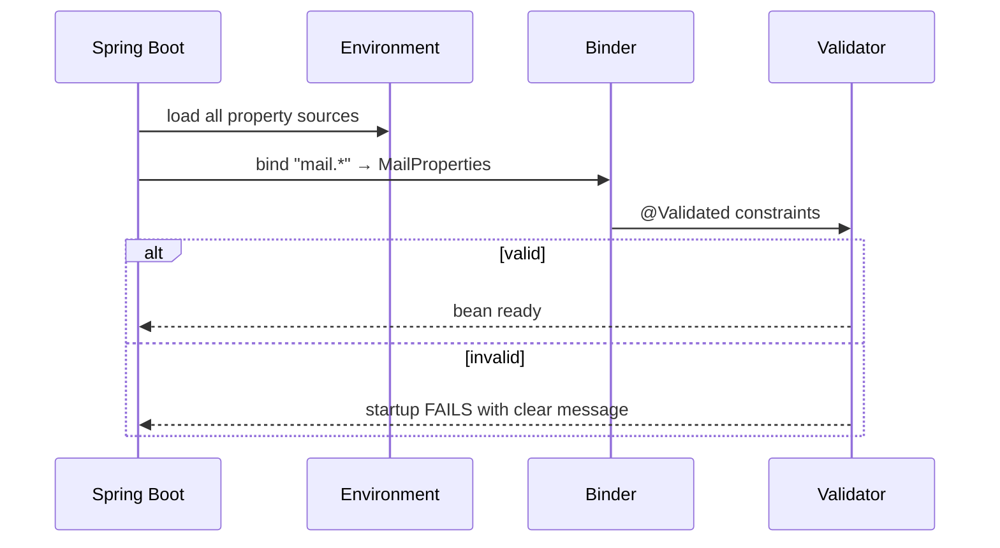

# Configuration & Profiles

> Externalise everything that changes between environments — Spring Boot's layered configuration, type-safe binding, and profiles let one jar run anywhere without a rebuild.

## Mental model

The guiding principle is **externalized configuration**: the same immutable artifact (your jar) behaves differently based on configuration supplied *from outside*. Spring Boot gathers values from many sources — files, environment variables, command-line args, secrets — merges them into a single `Environment`, and resolves a property by walking those sources in a strict **precedence order** (later sources override earlier ones). **Profiles** then let you activate environment-specific slices of that configuration.

```mermaid
flowchart TD
    subgraph Sources["Property sources (low → high precedence)"]
      D[application.yml defaults]
      P[application-{profile}.yml]
      OS[OS environment variables]
      SYS[Java system properties -D]
      CLI[Command-line --args]
    end
    D --> ENV[Spring Environment]
    P --> ENV
    OS --> ENV
    SYS --> ENV
    CLI --> ENV
    ENV --> V["@Value injection"]
    ENV --> CP["@ConfigurationProperties beans"]
    ENV --> Cond["@ConditionalOnProperty"]
```

## Core concepts

### `application.properties` vs `application.yml`

Both live in `src/main/resources` and express the same data. YAML supports hierarchy and lists natively, so it scales better for nested config; properties are flatter and simpler. Pick one per project for consistency.

```properties
# application.properties
spring.application.name=shop
server.port=8080
app.feature.checkout=true
app.allowed-origins[0]=https://shop.com
app.allowed-origins[1]=https://admin.shop.com
```

```yaml
# application.yml — same configuration
spring:
  application:
    name: shop
server:
  port: 8080
app:
  feature:
    checkout: true
  allowed-origins:
    - https://shop.com
    - https://admin.shop.com
```

::: warning
Don't keep *both* `application.properties` and `application.yml` in the same location — `.properties` wins and the YAML is silently ignored, which is a baffling bug to chase.
:::

### Property precedence order

When the same key is defined in multiple places, the **highest-precedence source wins**. The most important sources, from lowest to highest:

1. `application.yml` / `.properties` packaged in the jar
2. Profile-specific files (`application-prod.yml`)
3. `application.yml` *outside* the jar (next to it, or `./config/`)
4. OS environment variables
5. Java system properties (`-Dserver.port=9000`)
6. Command-line arguments (`--server.port=9000`)

```bash
# Command-line args beat everything in the files
java -jar shop.jar --server.port=9000 --spring.profiles.active=prod

# System property
java -Dserver.port=9001 -jar shop.jar

# Environment variable (relaxed binding: SERVER_PORT -> server.port)
SERVER_PORT=9002 java -jar shop.jar
```

::: tip
This is why the **same jar** runs unchanged across dev/staging/prod: ops overrides values via env vars or args, never by rebuilding.
:::

### `@Value` — injecting single properties

`@Value` injects one property into a field or constructor parameter, with optional defaults and SpEL.

```java
import org.springframework.beans.factory.annotation.Value;
import org.springframework.stereotype.Service;

@Service
class MailService {
    private final String host;
    private final int retries;

    MailService(
        @Value("${mail.host}") String host,                 // required
        @Value("${mail.retries:3}") int retries) {          // default = 3
        this.host = host;
        this.retries = retries;
    }
}
```

```java
@Value("${app.allowed-origins}") List<String> origins;       // comma/list binding
@Value("#{systemProperties['user.timezone']}") String tz;    // SpEL expression
```

::: warning
`@Value` scatters keys as string literals across the codebase with no type safety or IDE support. For anything beyond a one-off value, prefer `@ConfigurationProperties`.
:::

### `@ConfigurationProperties` — type-safe binding

Bind a whole group of properties to a typed object. With Java records this is concise and immutable. Register it with `@EnableConfigurationProperties` or `@ConfigurationPropertiesScan`.

```java
import org.springframework.boot.context.properties.ConfigurationProperties;
import org.springframework.boot.context.properties.bind.DefaultValue;

import java.time.Duration;
import java.util.List;

@ConfigurationProperties(prefix = "app")
public record AppProperties(
        boolean checkoutEnabled,
        @DefaultValue("5s") Duration timeout,
        List<String> allowedOrigins) {
}
```

```java
import org.springframework.boot.context.properties.EnableConfigurationProperties;
import org.springframework.context.annotation.Configuration;

@Configuration
@EnableConfigurationProperties(AppProperties.class)
class PropertiesConfig { }
```

```yaml
app:
  checkout-enabled: true
  timeout: 10s
  allowed-origins: [https://shop.com, https://admin.shop.com]
```

Inject and use it like any bean:

```java
@Service
class CheckoutService {
    private final AppProperties props;
    CheckoutService(AppProperties props) { this.props = props; }

    boolean isOpen() { return props.checkoutEnabled(); }
}
```

### Validation on bound properties

Add `@Validated` and Jakarta constraints so the app **fails fast at startup** if config is wrong — far better than a `NullPointerException` at 3 a.m.

```java
import jakarta.validation.constraints.*;
import org.springframework.boot.context.properties.ConfigurationProperties;
import org.springframework.validation.annotation.Validated;

@Validated
@ConfigurationProperties(prefix = "mail")
public record MailProperties(
        @NotBlank String host,
        @Min(1) @Max(65535) int port,
        @Email String from) {
}
```



### Relaxed binding

`@ConfigurationProperties` matches property names *loosely* — one Java field accepts kebab-case, camelCase, snake_case, and UPPER_CASE. This is what lets environment variables map to nested keys.

| Property source form | Binds to field |
| --- | --- |
| `app.checkout-enabled` (kebab — canonical in files) | `checkoutEnabled` |
| `app.checkoutEnabled` (camel) | `checkoutEnabled` |
| `APP_CHECKOUT_ENABLED` (env var) | `checkoutEnabled` |
| `app.checkout_enabled` (snake) | `checkoutEnabled` |

::: info
Relaxed binding applies to `@ConfigurationProperties`, **not** to `@Value`. With `@Value` the placeholder must match the key exactly. Another reason to prefer typed properties.
:::

### Profiles

A profile is a named bundle of configuration and beans, activated per environment. Files named `application-{profile}.yml` load only when that profile is active and layer *on top of* the base `application.yml`.

```yaml
# application.yml (always loaded)
spring:
  profiles:
    active: dev          # default; override externally

# application-dev.yml
spring:
  datasource:
    url: jdbc:h2:mem:shop

# application-prod.yml
spring:
  datasource:
    url: jdbc:postgresql://db:5432/shop
```

Activate a profile from outside the jar:

```bash
java -jar shop.jar --spring.profiles.active=prod
# or
SPRING_PROFILES_ACTIVE=prod java -jar shop.jar
```

`@Profile` gates whole beans on the active profile:

```java
import org.springframework.context.annotation.Bean;
import org.springframework.context.annotation.Configuration;
import org.springframework.context.annotation.Profile;

@Configuration
class CacheConfig {

    @Bean
    @Profile("prod")
    CacheManager redisCache() { return new RedisCacheManager(/* ... */); }

    @Bean
    @Profile("!prod")                  // any non-prod profile
    CacheManager simpleCache() { return new ConcurrentMapCacheManager(); }
}
```

Boot 3 also supports multi-document YAML with `spring.config.activate.on-profile` in one file.

### `@ConditionalOnProperty` — feature toggles

Register a bean only when a property has a given value — a clean way to ship feature flags.

```java
import org.springframework.boot.autoconfigure.condition.ConditionalOnProperty;
import org.springframework.context.annotation.Bean;

@Bean
@ConditionalOnProperty(prefix = "app.feature", name = "newCheckout",
                       havingValue = "true", matchIfMissing = false)
NewCheckoutFlow newCheckoutFlow() {
    return new NewCheckoutFlow();
}
```

```yaml
app:
  feature:
    new-checkout: true        # flip to false to disable the bean entirely
```

### Config import and external files

`spring.config.import` pulls in additional config — extra files, or remote sources like Vault and Consul. The `optional:` prefix avoids failing when the source is absent.

```yaml
spring:
  config:
    import:
      - optional:file:./local.yml          # local overrides, ignored if missing
      - optional:configserver:             # Spring Cloud Config server
```

### Secrets

Never commit secrets to `application.yml` in the jar. Supply them at runtime via environment variables, mounted files, or a secrets manager.

```yaml
spring:
  datasource:
    username: ${DB_USER}          # resolved from env at runtime
    password: ${DB_PASSWORD}      # never hard-coded
```

```bash
export DB_USER=shop
export DB_PASSWORD="$(vault kv get -field=password secret/shop/db)"
java -jar shop.jar
```

::: danger
Secrets baked into a packaged `application.yml` end up in version control and your Docker image layers. Inject them at runtime (env vars, mounted secret files, Vault) and keep them out of the build artifact entirely.
:::

### Spring Cloud Config (brief)

For many services sharing centrally-managed, versioned configuration, **Spring Cloud Config Server** serves properties from a Git repo. Clients fetch their config on startup via `spring.config.import: configserver:` and can refresh at runtime with `@RefreshScope` + the Actuator `/refresh` endpoint. Reach for it once per-jar files and env vars no longer scale across a fleet.

## Common pitfalls

- **`application.properties` and `application.yml` side by side.** Properties silently win; remove one.
- **Hard-coded secrets in committed config.** Use `${ENV_VAR}` placeholders and a secrets store; keep them out of the jar/image.
- **Expecting relaxed binding with `@Value`.** Only `@ConfigurationProperties` does fuzzy name matching; `@Value` needs an exact key.
- **Forgetting to register `@ConfigurationProperties`** — add `@EnableConfigurationProperties` or `@ConfigurationPropertiesScan`, or annotate the class with `@Component`.
- **Profile files not layering as expected.** `application-{profile}.yml` *adds to* the base file; it doesn't replace unrelated keys — and the profile must actually be active.
- **No validation on critical config.** Missing values surface as NPEs deep in runtime; add `@Validated` to fail fast at startup.
- **Setting `spring.profiles.active` inside the jar's `application.yml`** and assuming ops can't change it — external sources still override it.

## Best practices

- Externalize per-environment values; ship one jar, vary it via env vars and args.
- Prefer `@ConfigurationProperties` (records + `@Validated`) over scattered `@Value` literals.
- Use kebab-case as the canonical form in config files; rely on relaxed binding for env vars.
- Keep `application.yml` for shared defaults and `application-{profile}.yml` for deltas.
- Validate configuration so misconfiguration fails the app at startup, not in production traffic.
- Keep secrets out of the artifact — env vars, mounted files, or Vault/Cloud Config.
- Use `@ConditionalOnProperty` for feature flags so disabled features cost nothing.

## Interview quick-reference

| Concept | Key point |
| --- | --- |
| Externalized config | Same jar, different behavior via outside values |
| properties vs yml | Same data; YAML for hierarchy, properties for flat simplicity |
| Precedence | CLI args > system props > env vars > external files > profile files > packaged file |
| `@Value` | Single property, supports `${key:default}` and SpEL; no relaxed binding |
| `@ConfigurationProperties` | Type-safe group binding; records + `@Validated` for fail-fast |
| Relaxed binding | One field matches kebab/camel/snake/UPPER forms (typed props only) |
| Profiles | `@Profile`, `spring.profiles.active`, `application-{profile}.yml` layering |
| `@ConditionalOnProperty` | Register a bean only when a property matches — feature flags |
| `spring.config.import` | Pull in extra/remote config; `optional:` to tolerate absence |
| Secrets | Inject at runtime via env/Vault; never bake into the jar |
| Spring Cloud Config | Central Git-backed config for a fleet; `@RefreshScope` for live reload |

See the [interview questions](../questions/01-spring-boot-fundamentals-and-architecture) for drilling.
