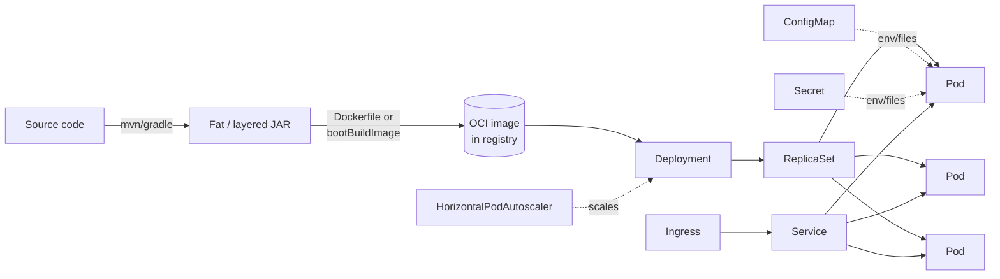
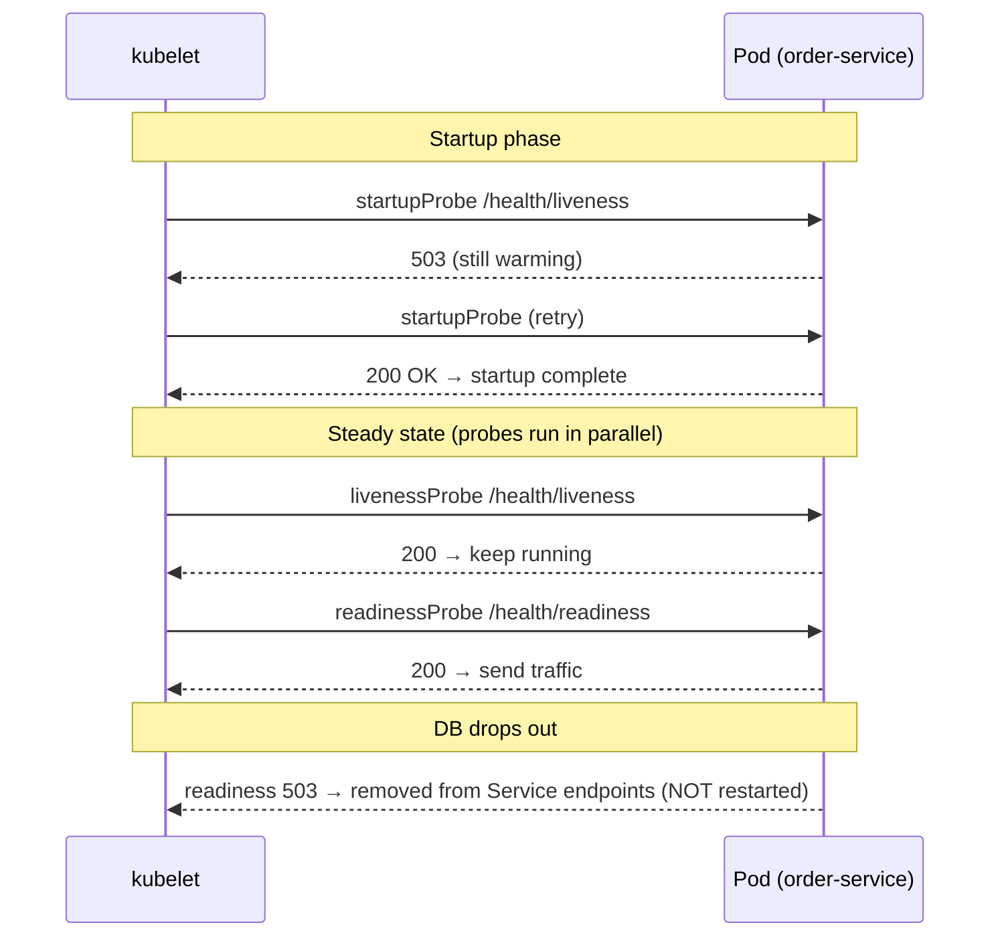

# Docker, Kubernetes, and Deployment

> Take a Spring Boot 3.x app from `mvn package` to a scaled, self-healing Kubernetes Deployment — layered images, Buildpacks, JVM container ergonomics, Actuator-backed probes, graceful shutdown, resource limits, per-environment profiles, and a CI/CD outline.

## Mental model

A deployable Spring Boot app is a **single fat JAR** that bundles your code, dependencies, and an embedded server (Tomcat by default). To run it on a platform you wrap that JAR in an **OCI image** — a layered, immutable filesystem tarball. Kubernetes then schedules **Pods** (one or more containers) from that image, fronts them with a stable **Service**, supplies configuration via **ConfigMap/Secret**, and keeps the desired number of replicas alive using **probes** that hit your Actuator endpoints.

The flow is: source → JAR → image (in a registry) → Deployment → ReplicaSet → Pods, with config injected as environment/files and traffic balanced across healthy Pods. The art is making the image small and cache-friendly, making the JVM respect container memory limits, and making startup/shutdown cooperate with the orchestrator.



## Core concepts

### Fat JAR and layered JARs

`spring-boot-maven-plugin` repackages your build into an executable fat JAR. The problem for Docker: any code change rewrites the whole JAR, busting the image layer cache and re-shipping ~50MB of unchanged dependencies on every push. **Layered JARs** split the archive into ordered layers — `dependencies`, `spring-boot-loader`, `snapshot-dependencies`, `application` — so dependencies (rarely changed) cache separately from your code (changed constantly).

```bash
# inspect the layers baked into the JAR
java -Djarmode=layertools -jar app.jar list
# => dependencies / spring-boot-loader / snapshot-dependencies / application

# extract them into directories for copying into image layers
java -Djarmode=layertools -jar app.jar extract --destination build/extracted
```

### Dockerfile best practices

Use a **multi-stage** build (build with the full JDK, run on a slim JRE), run as a **non-root** user, and copy the layered directories in cache-friendliest-last order.

```dockerfile
# syntax=docker/dockerfile:1
# ---- build stage ----
FROM eclipse-temurin:21-jdk AS build
WORKDIR /workspace
COPY .mvn/ .mvn/
COPY mvnw pom.xml ./
RUN ./mvnw dependency:go-offline -B          # cache deps before copying src
COPY src/ src/
RUN ./mvnw -q clean package -DskipTests \
 && java -Djarmode=layertools -jar target/*.jar extract --destination extracted

# ---- runtime stage ----
FROM eclipse-temurin:21-jre AS runtime
WORKDIR /app
RUN useradd --uid 10001 --no-create-home spring
USER 10001
# order matters: least-changing layer first for maximum cache reuse
COPY --from=build /workspace/extracted/dependencies/ ./
COPY --from=build /workspace/extracted/spring-boot-loader/ ./
COPY --from=build /workspace/extracted/snapshot-dependencies/ ./
COPY --from=build /workspace/extracted/application/ ./
EXPOSE 8080
ENTRYPOINT ["java", "org.springframework.boot.loader.launch.JarLauncher"]
```

::: tip
The launcher class changed in Boot 3.2+ to `org.springframework.boot.loader.launch.JarLauncher` (note `.launch.`). Using the old `org.springframework.boot.loader.JarLauncher` path will fail with `ClassNotFoundException`.
:::

### Cloud Native Buildpacks (`bootBuildImage`)

You often do not need a Dockerfile at all. Spring Boot integrates **Cloud Native Buildpacks** (Paketo) to produce an optimized, layered, non-root OCI image directly from your build, with sensible JVM defaults and a memory calculator baked in.

```bash
# Maven
./mvnw spring-boot:build-image -Dspring-boot.build-image.imageName=acme/order-service:1.4.0
# Gradle
./gradlew bootBuildImage --imageName=acme/order-service:1.4.0
```

```xml
<plugin>
  <groupId>org.springframework.boot</groupId>
  <artifactId>spring-boot-maven-plugin</artifactId>
  <configuration>
    <image>
      <name>acme/order-service:${project.version}</name>
      <env><BP_JVM_VERSION>21</BP_JVM_VERSION></env>
    </image>
  </configuration>
</plugin>
```

::: info
Buildpacks give you reproducible builds, automatic base-image patching (CVE remediation by rebasing), and SBOM generation — without maintaining Dockerfile boilerplate. Reach for a hand-written Dockerfile only when you need unusual control.
:::

### JVM container ergonomics and memory

Modern JVMs (11+) are **container-aware**: they read cgroup limits, so `-XX:MaxRAMPercentage` sizes the heap as a fraction of the container memory limit rather than the host's. Set a **memory request == limit** for predictability, and remember the heap is only part of RSS — metaspace, thread stacks, code cache, and direct buffers live off-heap.

```bash
# let the JVM use 75% of the container memory limit for the heap
JAVA_TOOL_OPTIONS="-XX:MaxRAMPercentage=75.0 -XX:InitialRAMPercentage=50.0 \
  -XX:+UseG1GC -XX:+ExitOnOutOfMemoryError"
```

::: warning
Setting a fixed `-Xmx512m` ignores the container limit and risks OOM-kills from off-heap growth, or wasted RAM. Prefer `MaxRAMPercentage` and leave ~25% headroom for non-heap memory. A container OOM-kill (exit 137) is the kernel, not the JVM — it produces no stack trace.
:::

### 12-factor configuration

Per the **12-factor** methodology, **config lives in the environment**, not the build. Bake nothing environment-specific into the image; inject it at runtime via env vars and mounted files. Spring Boot's relaxed binding maps `ORDER_DB_URL` to `order.db.url`, and Boot supports `spring.config.import` for Kubernetes ConfigMaps mounted as files.

```properties
# application.properties — defaults only; overridden per environment
spring.datasource.url=${ORDER_DB_URL:jdbc:postgresql://localhost:5432/orders}
spring.datasource.username=${ORDER_DB_USER:dev}
spring.datasource.password=${ORDER_DB_PASSWORD:dev}
server.port=8080
```

### Profiles per environment

Use Spring profiles (`application-<profile>.yml`) for environment-shaped differences, activated by `SPRING_PROFILES_ACTIVE`. Keep secrets out of profile files — those come from Secrets.

```yaml
# application-prod.yml
spring:
  jpa:
    hibernate:
      ddl-auto: validate         # never auto-create schema in prod
  flyway:
    enabled: true
logging:
  structured:
    format:
      console: ecs
management:
  endpoints:
    web:
      exposure:
        include: health,info,prometheus
```

### Kubernetes: Deployment, Service, ConfigMap, Secret

The four objects you need for a stateless service. The Deployment declares replicas and the Pod template; the Service gives a stable virtual IP/DNS name; ConfigMap and Secret feed configuration.

```yaml
apiVersion: apps/v1
kind: Deployment
metadata:
  name: order-service
spec:
  replicas: 3
  selector:
    matchLabels: { app: order-service }
  template:
    metadata:
      labels: { app: order-service }
    spec:
      terminationGracePeriodSeconds: 45      # > graceful shutdown timeout
      containers:
        - name: app
          image: acme/order-service:1.4.0
          ports: [{ containerPort: 8080 }]
          envFrom:
            - configMapRef: { name: order-config }
            - secretRef: { name: order-secrets }
          env:
            - name: SPRING_PROFILES_ACTIVE
              value: prod
            - name: JAVA_TOOL_OPTIONS
              value: "-XX:MaxRAMPercentage=75.0 -XX:+ExitOnOutOfMemoryError"
          resources:
            requests: { cpu: "500m", memory: "768Mi" }
            limits:   { cpu: "1",    memory: "768Mi" }
          startupProbe:
            httpGet: { path: /actuator/health/liveness, port: 8080 }
            failureThreshold: 30
            periodSeconds: 5                  # allows up to 150s to start
          livenessProbe:
            httpGet: { path: /actuator/health/liveness, port: 8080 }
            periodSeconds: 10
          readinessProbe:
            httpGet: { path: /actuator/health/readiness, port: 8080 }
            periodSeconds: 10
---
apiVersion: v1
kind: Service
metadata:
  name: order-service
spec:
  selector: { app: order-service }
  ports: [{ port: 80, targetPort: 8080 }]
---
apiVersion: v1
kind: ConfigMap
metadata:
  name: order-config
data:
  ORDER_DB_URL: jdbc:postgresql://orders-db:5432/orders
---
apiVersion: v1
kind: Secret
metadata:
  name: order-secrets
type: Opaque
stringData:
  ORDER_DB_PASSWORD: "s3cr3t-from-vault-or-sealed-secret"
```

### Probes mapped to Actuator

The three probe types each serve a distinct purpose, and Spring Boot's liveness/readiness health groups map onto them cleanly.



- **startupProbe** — gates the other two until the app has booted; prevents slow JVM starts from being killed as "unhealthy".
- **livenessProbe** — failure → **restart** the container. Must not depend on external systems.
- **readinessProbe** — failure → **remove from Service**, no restart. Depends on downstreams (DB, cache).

### Graceful shutdown

When k8s sends `SIGTERM`, Spring Boot can stop accepting new requests, drain in-flight ones, then close. Enable graceful shutdown and a grace period; pair it with a `preStop` delay so the Service endpoint removal propagates before the app stops listening.

```properties
server.shutdown=graceful
spring.lifecycle.timeout-per-shutdown-phase=30s
```

```yaml
lifecycle:
  preStop:
    exec: { command: ["sh", "-c", "sleep 5"] }   # let endpoint removal propagate
```

::: warning
`terminationGracePeriodSeconds` must exceed your shutdown timeout plus the `preStop` sleep, or k8s `SIGKILL`s mid-drain and you drop live requests. Here: 5s preStop + 30s drain < 45s grace.
:::

### Resource limits and horizontal scaling

Stateless services scale horizontally — add replicas behind the Service. The **HorizontalPodAutoscaler** adjusts replica count from CPU or custom (Prometheus) metrics.

```yaml
apiVersion: autoscaling/v2
kind: HorizontalPodAutoscaler
metadata:
  name: order-service
spec:
  scaleTargetRef:
    apiVersion: apps/v1
    kind: Deployment
    name: order-service
  minReplicas: 3
  maxReplicas: 12
  metrics:
    - type: Resource
      resource:
        name: cpu
        target: { type: Utilization, averageUtilization: 70 }
```

::: tip
Set CPU `requests` honestly — the HPA computes utilization against the request, and the scheduler bin-packs by it. For latency-sensitive Java apps, prefer setting **no CPU limit** (or a generous one) so the JVM is not throttled during GC/JIT, while keeping a memory limit.
:::

### GraalVM native image (brief)

For fast startup and low memory (serverless, scale-to-zero), Spring Boot 3 supports **GraalVM native images** via AOT compilation. You trade build time and some dynamic flexibility (reflection needs hints) for ~50ms startup and a fraction of the RAM.

```bash
./mvnw -Pnative spring-boot:build-image     # native, AOT-compiled image
```

::: info
Native images boot in tens of milliseconds and use far less memory, ideal for FaaS. Costs: long builds, no JIT peak-throughput, and reflection/proxy usage must be declared via reachability hints. Use it where startup/density matters, JVM JAR where peak throughput matters.
:::

### CI/CD outline

A typical pipeline: build & test → produce image → scan → push → deploy by updating the image tag (GitOps).

```yaml
# .github/workflows/deploy.yml (abridged)
jobs:
  build:
    runs-on: ubuntu-latest
    steps:
      - uses: actions/checkout@v4
      - uses: actions/setup-java@v4
        with: { distribution: temurin, java-version: '21', cache: maven }
      - run: ./mvnw -B verify                       # unit + integration tests
      - run: ./mvnw spring-boot:build-image \
               -Dspring-boot.build-image.imageName=acme/order-service:${{ github.sha }}
      - run: trivy image acme/order-service:${{ github.sha }}   # CVE scan
      - run: docker push acme/order-service:${{ github.sha }}
      # GitOps: bump the tag in the k8s manifests repo; Argo CD syncs it
```

## Common pitfalls

- **Plain fat JAR copied as one layer** — every code change re-ships all dependencies. Use layered JARs or Buildpacks.
- **Running as root** — security risk and often policy-blocked. Add a non-root `USER`.
- **Fixed `-Xmx` ignoring cgroup limits** — leads to OOM-kills (exit 137, no stack trace) or wasted RAM. Use `MaxRAMPercentage`.
- **Liveness probe that calls the database** — a DB blip restarts healthy pods. External deps belong in *readiness*.
- **No startupProbe on a slow JVM** — the liveness probe kills the app before it finishes booting.
- **Grace period shorter than shutdown timeout** — k8s SIGKILLs mid-drain, dropping requests.
- **Baking config/secrets into the image** — violates 12-factor and leaks secrets; inject via ConfigMap/Secret/env.
- **Setting an aggressive CPU limit** — throttles the JVM during GC/JIT, spiking latency.

## Best practices

- Build layered, multi-stage images on a slim JRE (or use `bootBuildImage`), running non-root.
- Size the heap with `-XX:MaxRAMPercentage` and set memory `request == limit`.
- Externalize all config (12-factor); use profiles per environment and Secrets for credentials.
- Map liveness/readiness/startup probes to Actuator health groups; keep liveness dependency-free.
- Enable `server.shutdown=graceful` and align `terminationGracePeriodSeconds` with the drain timeout + preStop.
- Scale stateless services with an HPA on CPU or Prometheus metrics; avoid in-Pod state.
- Scan images for CVEs, pin/patch base images (Buildpacks rebase), and tag images by commit SHA.
- Consider GraalVM native for startup/density-critical workloads.

## Interview quick-reference

| Concept | Key point |
| --- | --- |
| Fat vs layered JAR | Layered splits deps from app code for Docker cache reuse |
| Multi-stage build | JDK to build, slim JRE to run; smaller, safer images |
| `bootBuildImage` | Buildpacks produce optimized OCI images, no Dockerfile |
| JVM ergonomics | Container-aware JVM; size heap via `MaxRAMPercentage` |
| Exit 137 | Kernel OOM-kill, not a JVM error; leave off-heap headroom |
| 12-factor config | Config in the environment, not the image |
| Profiles | `application-<profile>.yml` via `SPRING_PROFILES_ACTIVE` |
| Deployment/Service | Declares replicas/Pod template / stable virtual IP + DNS |
| ConfigMap vs Secret | Non-sensitive vs sensitive config, injected as env/files |
| startup/liveness/readiness | Gate boot / restart-me / route-to-me |
| Liveness dependency rule | Never depend on external systems in liveness |
| Graceful shutdown | `server.shutdown=graceful`; grace period > drain timeout |
| HPA | Autoscale replicas by CPU/custom metrics; stateless only |
| GraalVM native | AOT image: ms startup, low RAM; reflection needs hints |
| CI/CD | test → image → scan → push → GitOps deploy by tag |

See the [interview questions](../questions/13-docker-kubernetes-and-deployment) for drilling.
