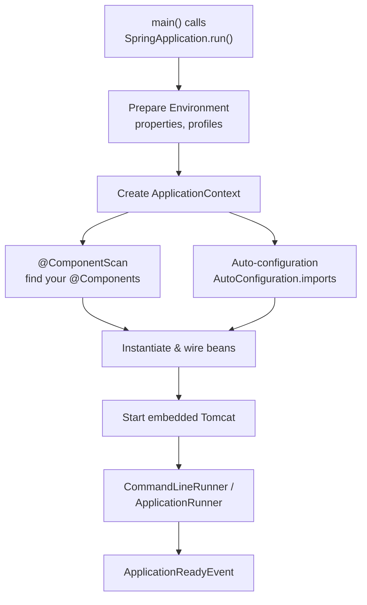
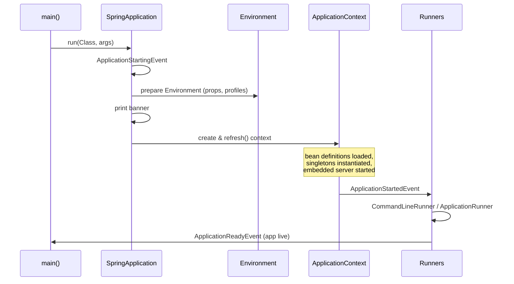

# Spring Boot Fundamentals & Architecture

> Understand what Spring Boot actually is — opinionated auto-configuration on top of the Spring container — and how a `main` method becomes a running web application with an embedded server.

## Mental model

Spring Boot is **not** a new framework; it is a layer of *opinions* over the Spring Framework. The Spring **container** (the `ApplicationContext`) creates, wires, and manages your objects (**beans**). Plain Spring made you configure that container by hand. Spring Boot flips the model: it inspects your classpath and configuration, then **auto-configures** sensible beans for you, ships **starters** that bundle dependencies, and embeds a server so your app is a self-contained executable jar.

The whole thing pivots on one annotation, `@SpringBootApplication`, which bootstraps component scanning *and* auto-configuration.



## Core concepts

### `@SpringBootApplication` and the entry point

`@SpringBootApplication` is a meta-annotation combining three: `@SpringBootConfiguration` (a specialised `@Configuration`), `@EnableAutoConfiguration` (turns on the auto-config engine), and `@ComponentScan` (discovers your beans, starting from the annotated class's package).

```java
package com.example.shop;

import org.springframework.boot.SpringApplication;
import org.springframework.boot.autoconfigure.SpringBootApplication;

@SpringBootApplication
public class ShopApplication {
    public static void main(String[] args) {
        SpringApplication.run(ShopApplication.class, args);
    }
}
```

::: tip
Place this class in the **root package** (e.g. `com.example.shop`). Component scanning starts here and walks *down*, so every sub-package is discovered automatically. Putting it deeper means siblings are silently ignored.
:::

### The Spring container: ApplicationContext vs BeanFactory

`BeanFactory` is the low-level container interface — lazy bean instantiation, basic dependency injection. `ApplicationContext` *extends* it and adds enterprise features: eager singleton instantiation at startup, event publishing, internationalisation, environment/property resolution, and `BeanPostProcessor` auto-detection. Spring Boot always gives you an `ApplicationContext`.

```java
import org.springframework.boot.SpringApplication;
import org.springframework.context.ConfigurableApplicationContext;

ConfigurableApplicationContext ctx = SpringApplication.run(ShopApplication.class, args);
OrderService service = ctx.getBean(OrderService.class);   // pull a managed bean
System.out.println(ctx.getBeanDefinitionCount());          // how many beans exist
```

| | BeanFactory | ApplicationContext |
| --- | --- | --- |
| Instantiation | Lazy | Eager (singletons up front) |
| Events | No | Yes (`ApplicationEvent`) |
| BeanPostProcessor | Manual | Auto-registered |
| i18n / properties | No | Yes |

### Auto-configuration: the `AutoConfiguration.imports` mechanism

This is the heart of Spring Boot. `@EnableAutoConfiguration` triggers a loader that reads, from every jar on the classpath, the file:

```
META-INF/spring/org.springframework.boot.autoconfigure.AutoConfiguration.imports
```

::: info
Spring Boot 2 used `spring.factories` with an `EnableAutoConfiguration` key. **Spring Boot 3 replaced this** with the `AutoConfiguration.imports` file (one fully-qualified class name per line). If you write your own starter, use the new file.
:::

Each listed class is a `@AutoConfiguration` guarded by `@Conditional` annotations, so it only activates when it *should* — e.g. Tomcat config applies only if Tomcat is on the classpath and you haven't defined your own server.

```java
import org.springframework.boot.autoconfigure.AutoConfiguration;
import org.springframework.boot.autoconfigure.condition.ConditionalOnClass;
import org.springframework.boot.autoconfigure.condition.ConditionalOnMissingBean;
import org.springframework.context.annotation.Bean;

@AutoConfiguration
@ConditionalOnClass(DataSource.class)               // only if JDBC is present
public class MyDataSourceAutoConfiguration {

    @Bean
    @ConditionalOnMissingBean                        // back off if user defined one
    public DataSource dataSource() {
        return new HikariDataSource();
    }
}
```

The `@ConditionalOnMissingBean` "back-off" rule is why auto-config never overrides *your* beans — define a `DataSource` yourself and Boot quietly steps aside.

### `@Conditional` — the gatekeeper family

Conditions are predicates evaluated during context startup. The common ones:

```java
@Bean
@ConditionalOnClass(name = "com.fasterxml.jackson.databind.ObjectMapper")  // class on classpath
@ConditionalOnMissingBean                                                  // no existing bean
@ConditionalOnProperty(prefix = "feature", name = "json", havingValue = "true")
@ConditionalOnWebApplication                                               // servlet/reactive app
public ObjectMapper objectMapper() {
    return new ObjectMapper();
}
```

::: tip
Run with `--debug` (or `debug=true`) to print the **Conditions Evaluation Report** — it lists every auto-config that matched, why, and which backed off. Indispensable when "the bean I expected isn't there".
:::

### Starters and dependency management

A **starter** is a curated, empty (no code) POM that pulls a coherent set of dependencies. `spring-boot-starter-web` brings in Spring MVC, Jackson, validation, and an embedded Tomcat — versions reconciled by the `spring-boot-dependencies` BOM, so you rarely specify versions yourself.

```xml
<parent>
    <groupId>org.springframework.boot</groupId>
    <artifactId>spring-boot-starter-parent</artifactId>
    <version>3.2.5</version>
</parent>

<dependencies>
    <dependency>
        <groupId>org.springframework.boot</groupId>
        <artifactId>spring-boot-starter-web</artifactId>   <!-- no version needed -->
    </dependency>
    <dependency>
        <groupId>org.springframework.boot</groupId>
        <artifactId>spring-boot-starter-test</artifactId>
        <scope>test</scope>
    </dependency>
</dependencies>
```

Gradle equivalent:

```bash
plugins {
    id 'org.springframework.boot' version '3.2.5'
    id 'io.spring.dependency-management' version '1.1.4'
    id 'java'
}
dependencies {
    implementation 'org.springframework.boot:spring-boot-starter-web'
    testImplementation 'org.springframework.boot:spring-boot-starter-test'
}
```

### Embedded servers

`spring-boot-starter-web` embeds **Tomcat** by default; the server runs *inside* your jar instead of you deploying a WAR into an external container. Swap it for Jetty or Undertow by excluding Tomcat and adding the alternative.

```xml
<dependency>
    <groupId>org.springframework.boot</groupId>
    <artifactId>spring-boot-starter-web</artifactId>
    <exclusions>
        <exclusion>
            <groupId>org.springframework.boot</groupId>
            <artifactId>spring-boot-starter-tomcat</artifactId>
        </exclusion>
    </exclusions>
</dependency>
<dependency>
    <groupId>org.springframework.boot</groupId>
    <artifactId>spring-boot-starter-undertow</artifactId>
</dependency>
```

Tune it via properties:

```properties
server.port=8081
server.tomcat.threads.max=200
server.tomcat.connection-timeout=20s
```

### The startup / bootstrap lifecycle

`SpringApplication.run()` orchestrates a fixed sequence, publishing events at each stage that listeners can hook into.



### Customising `SpringApplication`

You can configure the application before it runs — disable the banner, set a default profile, or change the web type.

```java
public static void main(String[] args) {
    SpringApplication app = new SpringApplication(ShopApplication.class);
    app.setBannerMode(Banner.Mode.OFF);
    app.setAdditionalProfiles("local");
    app.setWebApplicationType(WebApplicationType.SERVLET);
    app.run(args);
}
```

A custom banner is just a `banner.txt` in `src/main/resources` (it supports placeholders like `${spring-boot.version}`).

### CommandLineRunner and ApplicationRunner

Need to run code *once* after the context is ready — seed data, warm a cache, kick off a job? Implement one of these. Both run just before `ApplicationReadyEvent`. The difference is the argument type.

```java
import org.springframework.boot.ApplicationArguments;
import org.springframework.boot.ApplicationRunner;
import org.springframework.boot.CommandLineRunner;
import org.springframework.core.annotation.Order;
import org.springframework.stereotype.Component;

@Component
@Order(1)
class SeedDataRunner implements CommandLineRunner {
    @Override
    public void run(String... args) {           // raw String[] args
        System.out.println("Seeding database...");
    }
}

@Component
@Order(2)
class ReportRunner implements ApplicationRunner {
    @Override
    public void run(ApplicationArguments args) { // parsed: getOptionNames(), etc.
        if (args.containsOption("report")) {
            System.out.println("Generating report for " + args.getOptionValues("report"));
        }
    }
}
```

::: warning
Runners execute on the main thread and **block** startup until they finish. Long-running work belongs in an `@Async` task or a scheduled job, not a `CommandLineRunner`.
:::

### Project structure

A conventional Maven/Gradle layout — convention over configuration keeps the structure predictable:

```bash
src/
  main/
    java/com/example/shop/
      ShopApplication.java        # @SpringBootApplication (root package)
      controller/                 # @RestController web layer
      service/                    # @Service business logic
      repository/                 # @Repository data access
      domain/                     # entities / DTOs
      config/                     # @Configuration classes
    resources/
      application.yml             # configuration
      static/                     # served static assets
      templates/                  # server-side views
  test/
    java/com/example/shop/        # mirrors main
pom.xml | build.gradle
```

## Common pitfalls

- **`@SpringBootApplication` in the wrong package.** Component scan only sees the annotated class's package and below — keep it at the root or beans go undiscovered.
- **Expecting auto-config to override your bean.** Auto-config backs off (`@ConditionalOnMissingBean`); if you defined the bean, *yours* wins. Use `--debug` to see what matched.
- **Editing `spring.factories` for auto-config in Boot 3.** That key moved to `AutoConfiguration.imports`. The old file still works for some keys (e.g. listeners) but not for `EnableAutoConfiguration`.
- **Heavy logic in a `CommandLineRunner`.** It blocks the app from becoming ready and can break health checks.
- **Mixing an embedded server with a WAR mindset.** Don't add `provided`-scoped Tomcat or deploy to an external container unless you deliberately package a WAR.
- **Multiple `@SpringBootApplication` classes** in one module — ambiguous entry point; keep exactly one.

## Best practices

- Keep one root package and let component scanning do the work; avoid manual `@ComponentScan` base packages unless splitting modules.
- Prefer the parent POM / dependency-management plugin so the BOM governs versions.
- Use starters instead of cherry-picking individual Spring artifacts.
- Lean on auto-configuration; only define beans when you need to deviate, and rely on the back-off behaviour.
- Read the Conditions Evaluation Report (`--debug`) when a bean is missing or unexpected.
- Externalise everything environment-specific into `application.yml` / profiles, never the jar.
- Keep `main` minimal; customise via `SpringApplication`/`SpringApplicationBuilder` when needed.

## Interview quick-reference

| Concept | Key point |
| --- | --- |
| Spring Boot | Opinionated auto-configuration layer over Spring, not a separate framework |
| `@SpringBootApplication` | `@SpringBootConfiguration` + `@EnableAutoConfiguration` + `@ComponentScan` |
| ApplicationContext vs BeanFactory | Context extends factory: eager singletons, events, i18n, BPP auto-registration |
| Auto-configuration | Driven by `AutoConfiguration.imports` (Boot 3), guarded by `@Conditional` |
| `@ConditionalOnMissingBean` | Back-off rule: your bean always overrides auto-config |
| Starters | Curated dependency POMs; BOM manages versions so you omit them |
| Embedded server | Tomcat by default, inside the jar; swap to Jetty/Undertow |
| Bootstrap lifecycle | Environment → context refresh → server start → runners → ReadyEvent |
| CommandLineRunner vs ApplicationRunner | `String...` args vs parsed `ApplicationArguments`; both run at startup |
| Project structure | Root-package main class, layered packages, `resources/application.yml` |

See the [interview questions](../questions/01-spring-boot-fundamentals-and-architecture) for drilling.
