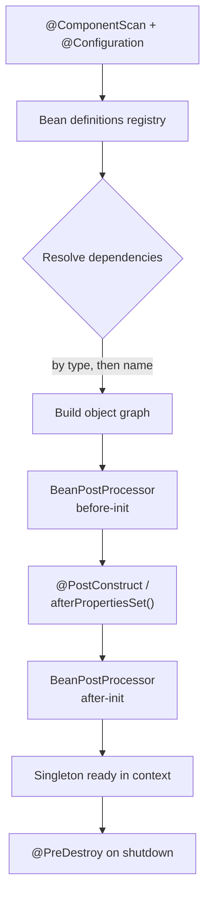
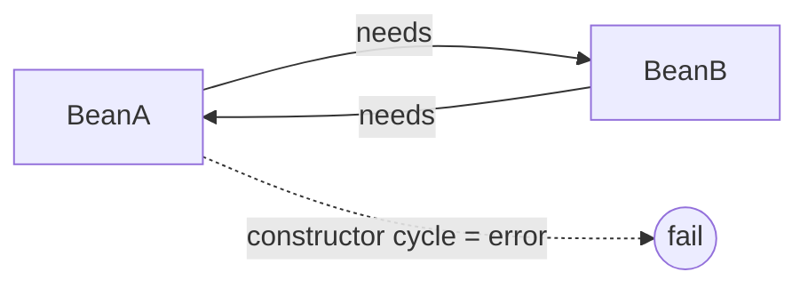

# IoC Container & Dependency Injection

> The Spring container creates and wires your objects so they never `new` their own collaborators — master beans, injection styles, scopes, and the lifecycle that turns a class into a managed component.

## Mental model

**Inversion of Control (IoC)** means you hand control of object creation and wiring to a container instead of building dependencies yourself. **Dependency Injection (DI)** is the mechanism: the container *injects* a class's collaborators through its constructor (or setters/fields). The container is the `ApplicationContext`; the objects it manages are **beans**.

The flow is: discover bean definitions (via component scan or `@Bean` methods) → instantiate → resolve and inject dependencies → run lifecycle callbacks → hand back a ready, fully-wired object graph.



## Core concepts

### Stereotype annotations: `@Component` and friends

A class annotated with a stereotype is auto-detected by component scanning and registered as a bean. They are functionally `@Component` with semantic intent:

```java
import org.springframework.stereotype.*;

@Component   // generic Spring-managed bean
class Clock { }

@Service     // business / service layer
class OrderService { }

@Repository  // persistence layer — also enables exception translation
class JdbcOrderRepository { }

@Controller  // web layer (@RestController = @Controller + @ResponseBody)
class OrderController { }
```

::: info
`@Repository` is not just cosmetic: it activates **persistence exception translation**, converting vendor-specific JDBC/JPA exceptions into Spring's consistent `DataAccessException` hierarchy.
:::

### `@Bean` and `@Configuration`

When you can't annotate the class (third-party types) or need programmatic construction, declare beans via `@Bean` methods inside a `@Configuration` class. The method's return value becomes the bean; its parameters are injected.

```java
import com.fasterxml.jackson.databind.ObjectMapper;
import org.springframework.context.annotation.Bean;
import org.springframework.context.annotation.Configuration;

@Configuration
public class AppConfig {

    @Bean
    public ObjectMapper objectMapper() {
        ObjectMapper mapper = new ObjectMapper();
        mapper.findAndRegisterModules();
        return mapper;
    }

    @Bean
    public OrderValidator orderValidator(ObjectMapper mapper) {  // mapper injected
        return new OrderValidator(mapper);
    }
}
```

::: tip
`@Configuration` classes are CGLIB-proxied so that calling one `@Bean` method from another returns the **same singleton**, not a fresh instance. With `@Configuration(proxyBeanMethods = false)` (the "lite" mode) that guarantee is dropped — faster startup, but inter-method calls create new objects.
:::

### Injection styles — and why constructor wins

Spring supports three injection points. Use **constructor injection**.

```java
import org.springframework.stereotype.Service;

@Service
class OrderService {

    private final OrderRepository repository;   // immutable, guaranteed set
    private final PaymentGateway gateway;

    // No @Autowired needed for a single constructor (Spring 4.3+)
    OrderService(OrderRepository repository, PaymentGateway gateway) {
        this.repository = repository;
        this.gateway = gateway;
    }
}
```

```java
// Setter injection — for optional or reconfigurable dependencies
@Autowired(required = false)
public void setMetrics(MetricsClient metrics) { this.metrics = metrics; }

// Field injection — concise but discouraged
@Autowired private OrderRepository repository;   // avoid
```

| Style | Pros | Cons |
| --- | --- | --- |
| Constructor | `final` fields, immutable, fails fast, testable without Spring, exposes too-many-deps smell | verbose for many deps |
| Setter | good for optional deps | mutable, object can exist half-wired |
| Field | least code | not testable without reflection, hides deps, no `final`, encourages circular refs |

::: warning
Field injection breaks plain-JUnit testing (you must use reflection or a Spring context to set the field) and silently hides bloated dependency lists. Prefer constructor injection everywhere.
:::

### `@Autowired`, `@Qualifier`, `@Primary`

By default Spring autowires **by type**. When several beans match one type, disambiguate with `@Primary` (a default winner) or `@Qualifier` (pick by name at the injection point).

```java
import org.springframework.context.annotation.Primary;
import org.springframework.beans.factory.annotation.Qualifier;
import org.springframework.stereotype.*;

interface PaymentGateway { }

@Service @Primary
class StripeGateway implements PaymentGateway { }   // chosen when no qualifier

@Service @Qualifier("legacy")
class PaypalGateway implements PaymentGateway { }

@Service
class CheckoutService {
    private final PaymentGateway gateway;
    CheckoutService(@Qualifier("legacy") PaymentGateway gateway) {  // forces PayPal
        this.gateway = gateway;
    }
}
```

You can also inject *all* matching beans as a collection or map (key = bean name):

```java
CheckoutService(List<PaymentGateway> all, Map<String, PaymentGateway> byName) { }
```

### Bean scopes

A scope controls how many instances exist and how long they live. Singleton (one per container) is the default; prototype creates a new instance per request; web scopes tie lifetime to an HTTP request/session.

```java
import org.springframework.beans.factory.config.ConfigurableBeanFactory;
import org.springframework.context.annotation.Scope;
import org.springframework.web.context.WebApplicationContext;

@Service
@Scope(ConfigurableBeanFactory.SCOPE_PROTOTYPE)   // new instance per lookup
class ReportBuilder { }

@Component
@Scope(value = WebApplicationContext.SCOPE_REQUEST,
       proxyMode = ScopedProxyMode.TARGET_CLASS)   // one per HTTP request
class RequestContext { }
```

| Scope | Lifetime |
| --- | --- |
| `singleton` (default) | One shared instance per container |
| `prototype` | New instance every injection / `getBean` |
| `request` | One per HTTP request (web) |
| `session` | One per HTTP session (web) |
| `application` | One per `ServletContext` |

::: danger
Injecting a `prototype` (or `request`) bean into a `singleton` captures **one** instance forever — the singleton is wired once at startup. Use a `proxyMode`, an `ObjectProvider`, or method injection to get a fresh instance each time.
:::

### Bean lifecycle and callbacks

Spring offers three ways to hook init/destroy. The annotation pair is the modern, framework-agnostic choice.

```java
import jakarta.annotation.PostConstruct;
import jakarta.annotation.PreDestroy;
import org.springframework.beans.factory.InitializingBean;
import org.springframework.beans.factory.DisposableBean;

@Component
class ConnectionPool implements InitializingBean, DisposableBean {

    @PostConstruct                       // 1. preferred: runs after injection
    void warmUp() { System.out.println("warming pool"); }

    @Override
    public void afterPropertiesSet() {   // 2. interface callback (couples to Spring)
        System.out.println("initializingBean");
    }

    @PreDestroy                          // runs on context shutdown
    void drain() { System.out.println("draining pool"); }

    @Override
    public void destroy() { System.out.println("disposableBean"); }
}
```

Order during init: constructor → dependency injection → `BeanPostProcessor.postProcessBeforeInitialization` → `@PostConstruct` → `afterPropertiesSet()` → `@Bean(initMethod)` → `postProcessAfterInitialization`.

### BeanPostProcessor — the extension hook

A `BeanPostProcessor` intercepts *every* bean between instantiation and readiness. It is how Spring itself implements `@Autowired`, AOP proxies, `@Async`, and more.

```java
import org.springframework.beans.factory.config.BeanPostProcessor;
import org.springframework.stereotype.Component;

@Component
class TimingPostProcessor implements BeanPostProcessor {
    @Override
    public Object postProcessAfterInitialization(Object bean, String name) {
        // could wrap `bean` in a proxy here
        return bean;
    }
}
```

### Circular dependencies

If A needs B and B needs A *through constructors*, neither can be built first — Spring fails fast at startup. Spring can resolve circular **field/setter** singletons via early references, but the real fix is to break the cycle.



Fixes, in order of preference: redesign to remove the cycle, extract a third collaborator, or — as a last resort — break it with `@Lazy`:

```java
@Service
class A {
    private final B b;
    A(@Lazy B b) { this.b = b; }   // injects a lazy proxy, deferring B's creation
}
```

::: warning
Spring Boot 2.6+ **disables** circular-reference resolution by default. You must either fix the design or set `spring.main.allow-circular-references=true` — but treat that flag as a code smell, not a solution.
:::

### `@Lazy` and `ObjectProvider`

`@Lazy` defers a bean's creation until first use (handy for expensive beans or breaking cycles). `ObjectProvider` gives a singleton a safe, on-demand handle to other beans — perfect for getting fresh prototypes or optional dependencies without nulls or eager wiring.

```java
import org.springframework.beans.factory.ObjectProvider;
import org.springframework.stereotype.Service;

@Service
class ReportService {
    private final ObjectProvider<ReportBuilder> builders;   // ReportBuilder is prototype

    ReportService(ObjectProvider<ReportBuilder> builders) {
        this.builders = builders;
    }

    String run() {
        ReportBuilder fresh = builders.getObject();          // new prototype each call
        return fresh.build();
    }
}
```

`ObjectProvider` also handles optionality cleanly: `provider.getIfAvailable()`, `getIfUnique()`, or `ifAvailable(b -> ...)`.

## Common pitfalls

- **Field injection.** Hides dependencies, blocks `final`, and makes plain unit tests painful. Use constructor injection.
- **Prototype-in-singleton.** The prototype is resolved once; add a scoped proxy or inject an `ObjectProvider` for genuinely fresh instances.
- **Constructor circular dependency.** Fails at startup since 2.6; redesign instead of toggling `allow-circular-references`.
- **Ambiguous autowiring.** Multiple candidates of one type throw `NoUniqueBeanDefinitionException` — add `@Primary` or `@Qualifier`.
- **Calling a `@Bean` method directly** from another in a `proxyBeanMethods=false` config — you get a new instance, not the singleton.
- **Relying on `@PostConstruct` order across beans.** Init order follows the dependency graph, not declaration order; don't assume sequencing between unrelated beans.

## Best practices

- Default to constructor injection with `final` fields; let a single constructor skip `@Autowired`.
- Prefer `@Primary` for the common default and `@Qualifier` for the exception.
- Keep beans stateless so singleton scope is safe and thread-friendly.
- Use `@PostConstruct`/`@PreDestroy` over `InitializingBean`/`DisposableBean` to avoid coupling to Spring interfaces.
- Use `ObjectProvider` for optional or prototype dependencies instead of `@Autowired(required=false)` fields.
- Treat circular dependencies as design feedback — extract a third class.
- Reserve `@Bean`/`@Configuration` for third-party types and programmatic setup; use stereotypes for your own classes.

## Interview quick-reference

| Concept | Key point |
| --- | --- |
| IoC vs DI | IoC = container owns object creation; DI = the wiring mechanism |
| Stereotypes | `@Component`/`@Service`/`@Repository`/`@Controller` — scanned beans; `@Repository` adds exception translation |
| `@Bean` / `@Configuration` | Programmatic beans; full `@Configuration` proxies methods to keep singletons |
| Injection styles | Constructor (preferred: immutable, testable) vs setter (optional) vs field (avoid) |
| `@Qualifier` / `@Primary` | Disambiguate by name vs declare a default candidate |
| Scopes | singleton (default), prototype, request, session, application |
| Prototype-in-singleton | Resolved once — use proxy / `ObjectProvider` for fresh instances |
| Lifecycle | constructor → inject → BPP-before → `@PostConstruct` → `afterPropertiesSet` → BPP-after; `@PreDestroy` on shutdown |
| BeanPostProcessor | Intercepts every bean; powers `@Autowired`, AOP, `@Async` |
| Circular dependency | Constructor cycle fails fast (2.6+); fix design or `@Lazy` as last resort |
| `ObjectProvider` | Lazy, optional, fresh-prototype access from a singleton |

See the [interview questions](../questions/02-ioc-container-and-dependency-injection) for drilling.
