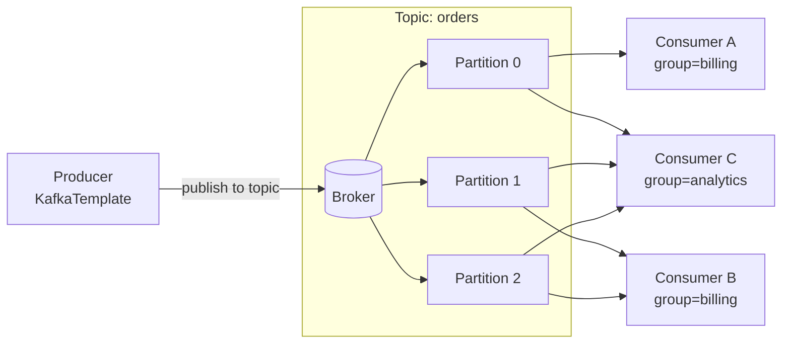
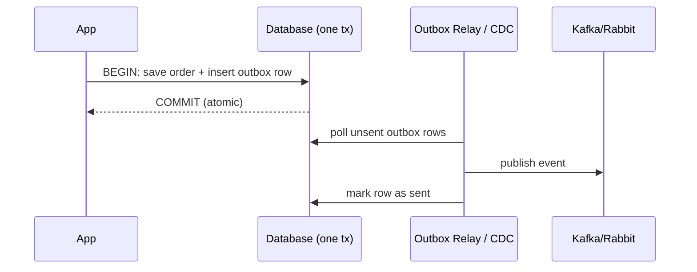
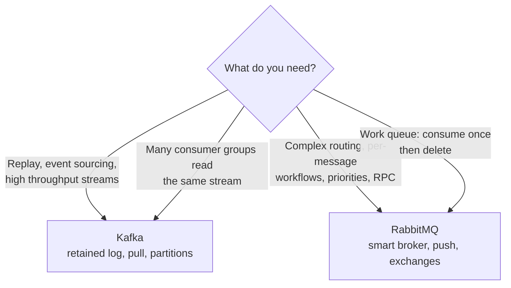

# Messaging with Kafka and RabbitMQ

> Decouple services with asynchronous messaging — master Spring for Apache Kafka and Spring AMQP/RabbitMQ, their delivery guarantees, error handling, and the patterns (idempotency, transactional outbox) that keep distributed systems correct.

## Mental model

Synchronous calls couple the caller's fate to the callee: if the downstream service is slow or down, the caller blocks or fails. **Asynchronous messaging** inverts this — a producer writes a message to a **broker** and moves on; one or more consumers process it later, at their own pace. This buys you **temporal decoupling** (services need not be up simultaneously), **load levelling** (the broker absorbs spikes), and **fan-out** (many consumers, one event).

Two broker families dominate the Spring world:

- **Apache Kafka** — a distributed, partitioned, replicated *commit log*. Messages are retained and *replayable*; consumers track their own position (offset). Built for high-throughput streaming and event sourcing.
- **RabbitMQ** — a traditional *message broker* (AMQP). A smart broker routes messages through exchanges to queues; messages are typically consumed once and removed. Built for flexible routing and per-message workflows.



::: info
Within one consumer group, each partition is consumed by exactly one consumer — that is how Kafka scales horizontally and preserves per-partition ordering. Different groups each get the *full* stream independently.
:::

## Core concepts

### Why async messaging at all

Consider an order service that must charge a card, reserve stock, and email a receipt. Doing it all inline makes a slow, brittle request. Publish an `OrderPlaced` event instead and let billing, inventory, and notification services react independently.

```java
// Synchronous: caller blocks on every downstream, fails if any is down
public Order placeOrder(OrderRequest req) {
    var order = orders.save(new Order(req));
    billing.charge(order);        // slow, may time out
    inventory.reserve(order);     // may be down
    email.sendReceipt(order);     // not even critical
    return order;
}

// Asynchronous: persist + publish, return fast; consumers react later
public Order placeOrder(OrderRequest req) {
    var order = orders.save(new Order(req));
    events.publish(new OrderPlaced(order.id(), order.total()));
    return order;
}
```

### Spring for Apache Kafka: producing

`KafkaTemplate` is the producer entry point. Configure serializers, then send to a topic — optionally with a **key** that decides the partition (same key → same partition → ordered).

```yaml
spring:
  kafka:
    bootstrap-servers: localhost:9092
    producer:
      key-serializer: org.apache.kafka.common.serialization.StringSerializer
      value-serializer: org.springframework.kafka.support.serializer.JsonSerializer
      acks: all                 # wait for all in-sync replicas — durability
      properties:
        enable.idempotence: true   # no duplicate writes on retry
        max.in.flight.requests.per.connection: 5
```

```java
import org.springframework.kafka.core.KafkaTemplate;
import org.springframework.stereotype.Service;

@Service
public class OrderPublisher {

    private final KafkaTemplate<String, OrderPlaced> template;

    public OrderPublisher(KafkaTemplate<String, OrderPlaced> template) {
        this.template = template;
    }

    public void publish(OrderPlaced event) {
        // key = orderId → all events for an order land on the same partition (ordered)
        template.send("orders", event.orderId(), event)
                .whenComplete((result, ex) -> {
                    if (ex != null) log.error("publish failed", ex);
                    else log.info("offset {}", result.getRecordMetadata().offset());
                });
    }
}
```

::: tip
`enable.idempotence=true` (default in modern clients) makes the producer safe to retry: the broker dedupes by producer id + sequence number, so a network blip won't write the message twice.
:::

### Topics, partitions, consumer groups, and offsets

A **topic** is a named log split into **partitions**. Each message has an **offset** — its position in the partition. A **consumer group** is a set of consumers that share the partitions of a topic; Kafka stores each group's committed offset so it knows where to resume.

```java
import org.springframework.kafka.annotation.KafkaListener;

@KafkaListener(topics = "orders", groupId = "billing", concurrency = "3")
public void onOrder(OrderPlaced event) {
    billing.charge(event.orderId(), event.total());
}
```

- **More partitions** → more parallelism (max useful consumers per group = partition count).
- **Ordering** is guaranteed *per partition only*, never across a topic.
- Scaling out consumers beyond the partition count leaves the extras idle.

### Manual acknowledgement and offset commits

By default Spring auto-commits offsets. For at-least-once safety you often want **manual ack** so the offset advances only after successful processing.

```yaml
spring:
  kafka:
    consumer:
      enable-auto-commit: false
    listener:
      ack-mode: manual          # you call ack.acknowledge()
```

```java
import org.springframework.kafka.support.Acknowledgment;

@KafkaListener(topics = "orders", groupId = "billing")
public void onOrder(OrderPlaced event, Acknowledgment ack) {
    billing.charge(event.orderId(), event.total());  // do the work first
    ack.acknowledge();                               // then commit the offset
}
```

::: warning
Commit the offset *after* processing, never before. If you ack first and then crash, the message is lost (silently skipped on restart). Ack-after-work gives **at-least-once** — the message may be redelivered, so processing must be **idempotent**.
:::

### Delivery semantics and idempotency

There are three guarantees. In practice you choose between the first two:

| Semantic | Meaning | Cost |
| --- | --- | --- |
| At-most-once | Ack before processing; may lose messages | Cheap, lossy |
| At-least-once | Ack after processing; may duplicate | The default, safe target |
| Exactly-once | No loss, no dup (Kafka transactions / `read-process-write`) | Complex, throughput hit |

Since at-least-once means **duplicates happen**, make consumers idempotent — usually with a dedupe key.

```java
@KafkaListener(topics = "orders", groupId = "billing")
@Transactional
public void onOrder(OrderPlaced event, Acknowledgment ack) {
    // Idempotency guard: insert ignores if this event was already handled
    if (processed.markIfNew(event.eventId())) {
        billing.charge(event.orderId(), event.total());
    }
    ack.acknowledge();
}
```

Kafka's **exactly-once** within the cluster is enabled with a transactional producer (`transactional.id`) + `isolation.level=read_committed`, letting a consume-transform-produce loop commit offsets and output atomically. It does *not* extend to external side effects like calling a payment API.

### Error handling, retry, and the Dead Letter Topic

Spring Kafka's `DefaultErrorHandler` retries with backoff, then routes poison messages to a **Dead Letter Topic (DLT)** so the consumer isn't stuck reprocessing a bad record forever.

```java
import org.springframework.kafka.listener.DefaultErrorHandler;
import org.springframework.kafka.listener.DeadLetterPublishingRecoverer;
import org.springframework.util.backoff.FixedBackOff;

@Bean
public DefaultErrorHandler errorHandler(KafkaTemplate<Object, Object> template) {
    var recoverer = new DeadLetterPublishingRecoverer(template);  // -> orders.DLT
    var backOff = new FixedBackOff(1000L, 3);                     // 3 retries, 1s apart
    var handler = new DefaultErrorHandler(recoverer, backOff);
    handler.addNotRetryableExceptions(IllegalArgumentException.class); // fail fast
    return handler;
}
```

::: tip
Use `@RetryableTopic` for non-blocking retries: failed records go to timed retry topics (`orders-retry-0`, `-1`, ...) instead of blocking the main partition, then to the DLT. This keeps healthy messages flowing while bad ones back off.
:::

### Spring AMQP / RabbitMQ: exchanges, queues, bindings

RabbitMQ routes via **exchanges**. A producer publishes to an exchange with a **routing key**; **bindings** connect exchanges to **queues** based on that key. Exchange types: `direct` (exact key), `topic` (wildcard patterns), `fanout` (broadcast), `headers`.

```mermaid
flowchart LR
    PUB[RabbitTemplate] -->|routingKey=order.created| EX{{topic exchange<br/>orders.exchange}}
    EX -->|order.*| Q1[(billing.queue)]
    EX -->|order.created| Q2[(audit.queue)]
    EX -.->|order.*| DLX{{DLX<br/>orders.dlx}}
    DLX --> DLQ[(orders.dlq)]
    Q1 --> L1[@RabbitListener billing]
    Q2 --> L2[@RabbitListener audit]
```

```java
import org.springframework.amqp.core.*;

@Configuration
public class RabbitConfig {

    @Bean TopicExchange ordersExchange() { return new TopicExchange("orders.exchange"); }

    @Bean Queue billingQueue() {
        return QueueBuilder.durable("billing.queue")
                .withArgument("x-dead-letter-exchange", "orders.dlx")  // DLX wiring
                .build();
    }

    @Bean Binding billingBinding(Queue billingQueue, TopicExchange ordersExchange) {
        return BindingBuilder.bind(billingQueue).to(ordersExchange).with("order.*");
    }
}
```

### Publishing and consuming with Spring AMQP

`RabbitTemplate` publishes; `@RabbitListener` consumes. Configure a JSON message converter so POJOs serialize cleanly.

```java
@Service
public class OrderAmqpPublisher {
    private final RabbitTemplate rabbit;
    public OrderAmqpPublisher(RabbitTemplate rabbit) { this.rabbit = rabbit; }

    public void publish(OrderPlaced event) {
        rabbit.convertAndSend("orders.exchange", "order.created", event);
    }
}

@Component
public class BillingListener {
    @RabbitListener(queues = "billing.queue", concurrency = "3-10")
    public void onOrder(OrderPlaced event) {
        billing.charge(event.orderId(), event.total());
    }
}
```

### RabbitMQ ack/nack and the Dead Letter Exchange

With manual acks, you explicitly `basicAck`, `basicNack` (optionally requeue), or `basicReject`. A message nacked without requeue (or expired/over-limit) is routed to the queue's **Dead Letter Exchange (DLX)**.

```yaml
spring:
  rabbitmq:
    listener:
      simple:
        acknowledge-mode: manual
        default-requeue-rejected: false   # rejected -> DLX, not infinite requeue
```

```java
import com.rabbitmq.client.Channel;
import org.springframework.amqp.support.AmqpHeaders;
import org.springframework.messaging.handler.annotation.Header;

@RabbitListener(queues = "billing.queue")
public void onOrder(OrderPlaced event, Channel channel,
                    @Header(AmqpHeaders.DELIVERY_TAG) long tag) throws IOException {
    try {
        billing.charge(event.orderId(), event.total());
        channel.basicAck(tag, false);
    } catch (TransientException e) {
        channel.basicNack(tag, false, true);   // requeue: retry later
    } catch (PoisonException e) {
        channel.basicNack(tag, false, false);  // don't requeue: send to DLX
    }
}
```

::: danger
`default-requeue-rejected: true` (the default) + an always-failing message = an infinite hot loop that pegs CPU and starves the queue. Always pair a DLX with `default-requeue-rejected: false`, or cap retries.
:::

### The transactional outbox pattern

The hardest bug in messaging: you save to the DB *and* publish to the broker, but they are two systems with no shared transaction. A crash between them leaves the DB updated but the event lost (or vice versa — a **dual-write** problem).

The **outbox** fixes this. Write the event into an `outbox` table *in the same DB transaction* as your business data. A separate relay (a poller, or Change Data Capture via Debezium) reads the table and publishes to the broker, marking rows sent.



```java
@Transactional
public Order placeOrder(OrderRequest req) {
    var order = orders.save(new Order(req));
    // Same transaction as the order write — no dual-write gap
    outbox.save(new OutboxEvent("OrderPlaced", toJson(new OrderPlaced(order.id()))));
    return order;
}
```

::: info
The relay gives at-least-once publishing (a crash after publish but before "mark sent" replays the event), so downstream consumers still need idempotency. The outbox guarantees the event is *never lost*, not that it's published exactly once.
:::

### Consumer concurrency

Both stacks let you process in parallel. In Kafka, `concurrency = N` spawns N consumer threads in the group (capped usefully at the partition count). In RabbitMQ, `concurrency = "min-max"` scales listener threads against a single queue.

```java
// Kafka: 3 threads, needs >= 3 partitions to fully use them
@KafkaListener(topics = "orders", groupId = "billing", concurrency = "3")

// RabbitMQ: 3 to 10 consumer threads, auto-scaled by load
@RabbitListener(queues = "billing.queue", concurrency = "3-10")
```

::: warning
Concurrency trades ordering for throughput. In Kafka, ordering holds only within a partition, so concurrent threads process different partitions in parallel — fine if you keyed related messages together. In RabbitMQ, multiple consumers on one queue means no global ordering at all.
:::

### Kafka vs RabbitMQ tradeoffs



- **Kafka**: log-based, messages retained and replayable, consumer-pull, ordering per partition, scales to millions/sec. Dumb broker, smart consumers.
- **RabbitMQ**: queue-based, messages removed on ack, broker-push, rich routing/priorities/TTL, lower latency for small workloads. Smart broker, simple consumers.

## Common pitfalls

- **Assuming exactly-once by default.** Kafka and RabbitMQ are at-least-once in practice — design idempotent consumers with a dedupe key.
- **Committing/acking before processing.** Loses messages on crash. Always ack *after* successful work.
- **Dual writes** (DB + broker without a shared transaction). Use the transactional outbox.
- **Infinite requeue loops** in RabbitMQ from poison messages — wire a DLX and disable blind requeue.
- **Expecting global ordering.** Kafka orders per partition; concurrency and multiple partitions break total order.
- **More consumers than partitions** in Kafka — the surplus sit idle, wasting resources.
- **Unbounded retries** blocking a partition or queue — use bounded backoff and a DLT/DLQ.
- **Forgetting `acks=all`** on critical Kafka producers — `acks=1` can lose data if the leader fails before replication.

## Best practices

- Default to **at-least-once + idempotent consumers**; reserve exactly-once for true read-process-write loops.
- Enable producer idempotence (`enable.idempotence=true`) and `acks=all` for durable Kafka writes.
- Use **manual ack after processing** for safety-critical flows.
- Always configure a **DLT (Kafka)** or **DLX/DLQ (RabbitMQ)** with bounded retries and backoff.
- Key Kafka messages by entity id to preserve per-entity ordering.
- Use the **transactional outbox** (poller or Debezium CDC) whenever a DB change must produce an event.
- Carry an `eventId` and a `traceId` on every message for dedupe and observability.
- Right-size partitions/concurrency to your throughput and ordering needs up front — repartitioning later is disruptive.

## Interview quick-reference

| Concept | Key point |
| --- | --- |
| Async messaging | Temporal decoupling, load levelling, fan-out via a broker |
| Topic / partition / offset | Topic = log; partition = ordered shard; offset = position |
| Consumer group | Shares partitions; one consumer per partition per group |
| `KafkaTemplate` / `@KafkaListener` | Produce / consume in Spring for Apache Kafka |
| Delivery semantics | At-most / at-least (default) / exactly-once |
| Idempotency | Required because at-least-once duplicates; use a dedupe key |
| Manual ack | Commit offset after work to avoid loss; enables redelivery |
| DLT / `@RetryableTopic` | Poison-message sink; non-blocking timed retries |
| Exchange / binding / routing key | RabbitMQ routing: direct / topic / fanout / headers |
| `RabbitTemplate` / `@RabbitListener` | Produce / consume in Spring AMQP |
| ack/nack + DLX | Reject without requeue routes to dead-letter exchange |
| Transactional outbox | Write event in same DB tx; relay publishes — fixes dual-write |
| Kafka vs RabbitMQ | Replayable log/streaming vs smart-broker routing/work queues |
| Consumer concurrency | Threads per group/queue; trades ordering for throughput |

See the [interview questions](../questions/09-messaging-kafka-and-rabbitmq) for drilling.
