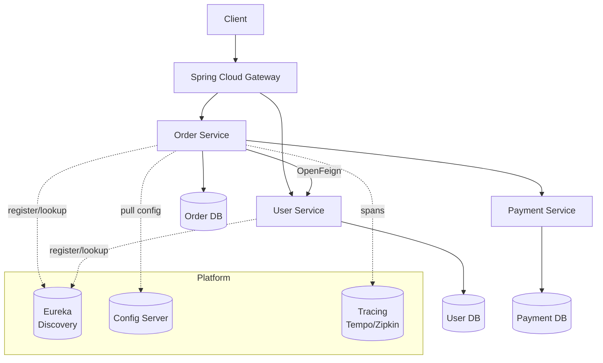
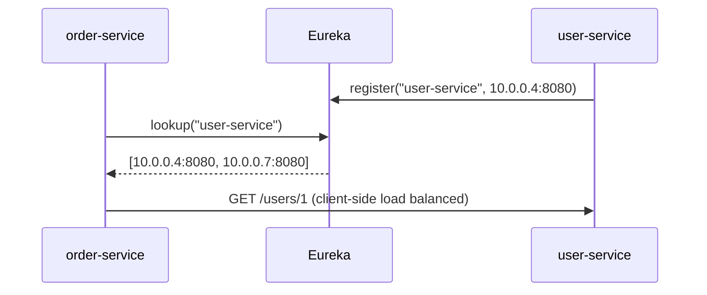
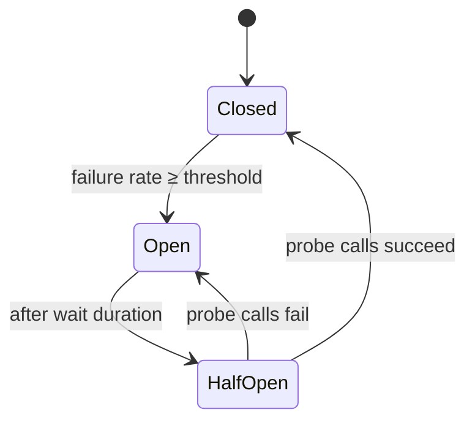
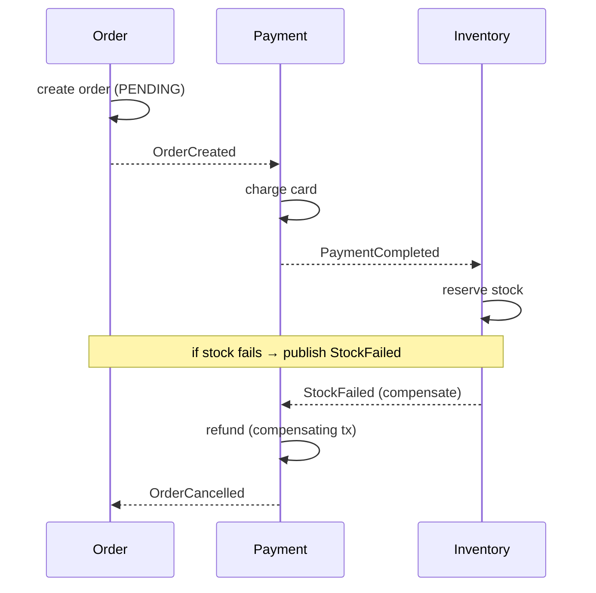

# Microservices & Spring Cloud

> Split a system into independently deployable services, then use Spring Cloud to solve the problems that split creates — finding each other, configuring centrally, routing at the edge, calling resiliently, and tracing across the mesh.

## Mental model

A monolith is one deployable with in-process calls; a microservice architecture is many small deployables that talk over the network. You trade *simplicity* for *independent deployability and scaling* — and inherit the **fallacies of distributed computing**: the network is unreliable, has latency, and partitions. Spring Cloud is a toolbox that addresses each new cost: **discovery** (where is the service?), **config server** (one source of truth for settings), **gateway** (one front door), **resilience** (survive a slow/dead dependency), and **tracing** (follow one request across services).



::: info
**Database-per-service** is the defining constraint: each service owns its data and no other service touches its tables. Sharing a database recreates a distributed monolith with none of the benefits.
:::

## Core concepts

### Monolith vs microservices — when to split

Start with a **modular monolith**. Split into services only when you have a real driver: independent scaling, separate release cadence, team ownership boundaries, or fault isolation. Premature splitting adds network latency, distributed-transaction pain, and operational overhead before you have the maturity to absorb it.

::: warning
Microservices are an *organizational* solution as much as a technical one (Conway's Law). If one team owns five "services," you've added distribution cost without the autonomy benefit — keep it a monolith.
:::

### Service discovery (Eureka)

Services come and go and get dynamic IPs in containers. A **discovery server** is a registry where instances register themselves and clients look others up by logical name.

```java
@SpringBootApplication
@EnableEurekaServer            // the registry
public class DiscoveryApplication { public static void main(String[] a) {
    SpringApplication.run(DiscoveryApplication.class, a);
}}
```

```yaml
# a client service registers itself
spring:
  application:
    name: order-service        # logical id others use
eureka:
  client:
    service-url:
      defaultZone: http://discovery:8761/eureka
```



::: tip
In Kubernetes you often *skip* Eureka entirely — k8s Services + DNS provide discovery and load balancing natively. Use Spring Cloud discovery when you're not on a platform that gives it to you.
:::

### Centralized configuration (Config Server)

Instead of baking config into each deployable, a **Config Server** serves environment-specific properties from a Git repo. Services pull their config at startup (and can refresh at runtime).

```java
@SpringBootApplication
@EnableConfigServer
public class ConfigApplication { /* ... */ }
```

```yaml
# config server points at a git backend
spring:
  cloud:
    config:
      server:
        git:
          uri: https://github.com/acme/config-repo
```

```yaml
# a client imports its config
spring:
  application: { name: order-service }
  config:
    import: "optional:configserver:http://config:8888"
```

### Declarative HTTP clients (OpenFeign / HTTP Interface)

Calling another service shouldn't mean hand-rolling URLs and JSON parsing. **OpenFeign** turns an interface into an HTTP client; Spring 6's native **HTTP Interface** does the same without the extra dependency.

```java
@FeignClient(name = "user-service")          // resolved via discovery + load balancing
public interface UserClient {
    @GetMapping("/users/{id}")
    UserDto getUser(@PathVariable Long id);
}
```

```java
// Spring 6 native alternative — declarative HTTP Interface
public interface UserClient {
    @GetExchange("/users/{id}")
    UserDto getUser(@PathVariable Long id);
}
// built from a WebClient/RestClient with HttpServiceProxyFactory
```

### Client-side load balancing

With Spring Cloud LoadBalancer, a call to `http://user-service/...` is resolved to one of the registered instances. The `name` in `@FeignClient` *is* the logical service id, not a host.

::: info
This is **client-side** load balancing: the caller picks an instance from the discovery list. A gateway or k8s Service does **server-side** load balancing at the edge. Real systems often use both.
:::

### API Gateway (Spring Cloud Gateway)

The gateway is the single entry point: it routes external requests to internal services and centralizes cross-cutting concerns — auth, rate limiting, CORS, request rewriting — so each service doesn't reimplement them.

```yaml
spring:
  cloud:
    gateway:
      routes:
        - id: orders
          uri: lb://order-service          # lb:// = load-balanced via discovery
          predicates:
            - Path=/api/orders/**
          filters:
            - StripPrefix=1
            - name: RequestRateLimiter
              args:
                redis-rate-limiter.replenishRate: 10
                redis-rate-limiter.burstCapacity: 20
```

### Resilience with Resilience4j

A slow or dead dependency must not take you down. **Resilience4j** provides circuit breakers, retries, bulkheads, rate limiters, and time limiters as annotations or programmatic decorators. The **circuit breaker** trips open after a failure threshold, fails fast for a cooldown, then probes with half-open calls.

```java
@Service
public class OrderService {

    @CircuitBreaker(name = "user", fallbackMethod = "userFallback")
    @Retry(name = "user")
    @Bulkhead(name = "user")                  // bound concurrent calls
    public UserDto fetchUser(Long id) {
        return userClient.getUser(id);
    }

    private UserDto userFallback(Long id, Throwable t) {
        return UserDto.unknown(id);           // degrade gracefully
    }
}
```

```yaml
resilience4j:
  circuitbreaker:
    instances:
      user:
        sliding-window-size: 20
        failure-rate-threshold: 50           # open at 50% failures
        wait-duration-in-open-state: 10s
```



::: warning
Use **Resilience4j**, not Hystrix — Hystrix is end-of-life. And always pair a circuit breaker with a **time limiter**: a breaker can't trip on calls that hang forever.
:::

### Distributed tracing (Micrometer Tracing)

One user request fans out across services; to debug it you need a **trace id** that propagates through every hop. Micrometer Tracing (the successor to Spring Cloud Sleuth) injects/propagates trace and span ids and exports to Zipkin/Tempo via OpenTelemetry.

```xml
<dependency>
  <groupId>io.micrometer</groupId>
  <artifactId>micrometer-tracing-bridge-otel</artifactId>
</dependency>
<dependency>
  <groupId>io.opentelemetry</groupId>
  <artifactId>opentelemetry-exporter-zipkin</artifactId>
</dependency>
```

```yaml
management:
  tracing:
    sampling:
      probability: 1.0        # sample 100% in dev; lower in prod
```

With the trace id in the MDC, logs across all services for one request share a correlation id.

### Inter-service communication & the Saga pattern

Synchronous calls (REST/gRPC) are simple but couple availability — if a downstream is down, you're down. **Asynchronous messaging** (Kafka/RabbitMQ) decouples services and absorbs spikes. Because you can't run an ACID transaction across services, multi-service workflows use a **saga**: a sequence of local transactions, each publishing an event, with **compensating actions** to undo on failure.



::: tip
Combine sagas with the **transactional outbox** pattern (write the event in the same DB transaction as the state change, relay it afterwards) to avoid the dual-write problem where the DB commits but the message is lost.
:::

## Common pitfalls

- **Distributed monolith.** Services that must deploy together and share a database have all the cost of distribution and none of the autonomy. Fix: database-per-service, async contracts, independent releases.
- **No resilience around remote calls.** A single slow dependency exhausts threads and cascades. Fix: circuit breaker **+ time limiter +** bulkhead, with a fallback.
- **Synchronous chains.** A → B → C → D multiplies latency and failure probability. Fix: shorten chains; prefer events for non-critical paths.
- **Trying for cross-service ACID.** Two-phase commit across services doesn't scale. Fix: sagas with compensations + idempotent handlers.
- **Using deprecated tooling.** Hystrix, Ribbon, and Sleuth are EOL. Fix: Resilience4j, Spring Cloud LoadBalancer, Micrometer Tracing.
- **Config drift.** Per-service ad-hoc config diverges across environments. Fix: Config Server / a single config source, profile per environment.
- **No correlation id.** Without distributed tracing, a failing request is unfindable. Fix: Micrometer Tracing + MDC in logs from day one.

## Best practices

- Start as a **modular monolith**; extract services only with a concrete driver.
- Enforce **database-per-service**; communicate via APIs and events, never shared tables.
- Make every remote call **resilient** (breaker + timeout + retry-with-backoff) and **idempotent**.
- Put cross-cutting concerns (auth, rate limit, CORS) at the **gateway**.
- Centralize configuration and externalize secrets; use **profiles per environment**.
- Build in **observability** (metrics, structured logs with trace ids, distributed tracing) from the start.
- Prefer **asynchronous events** for decoupling; use **sagas + outbox** for cross-service workflows.
- On Kubernetes, lean on platform discovery/LB and reserve Spring Cloud for what k8s doesn't give you.

## Interview quick-reference

| Concept | Key point |
| --- | --- |
| Monolith vs microservices | Independent deploy/scale vs added network/ops cost |
| Database-per-service | Each service owns its data; no shared tables |
| Service discovery | Registry (Eureka) or platform DNS to locate instances |
| Config Server | Central, versioned, environment-specific configuration |
| API Gateway | Single entry; routing + auth/rate-limit/CORS at the edge |
| OpenFeign / HTTP Interface | Declarative HTTP clients resolved via discovery + LB |
| Client vs server LB | Caller picks instance vs edge/k8s distributes |
| Circuit breaker | Trip open on failures, fail fast, half-open probe (Resilience4j) |
| Time limiter + bulkhead | Bound call duration / concurrent calls to isolate failure |
| Saga | Local txns + compensations instead of distributed ACID |
| Outbox | Event written in same tx, relayed later — fixes dual-write |
| Distributed tracing | Propagate trace id across hops (Micrometer Tracing + OTel) |

See the [interview questions](../questions/07-microservices-and-spring-cloud) for drilling.
