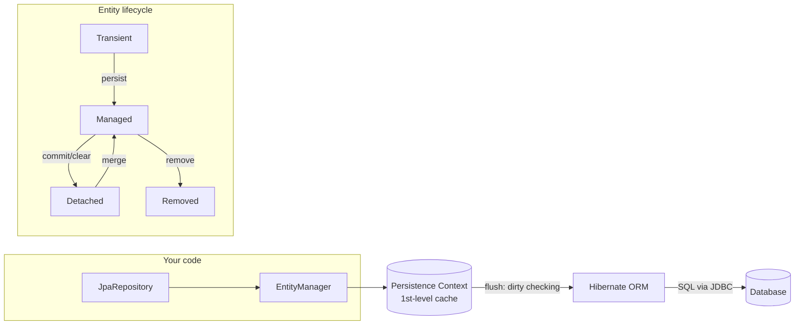
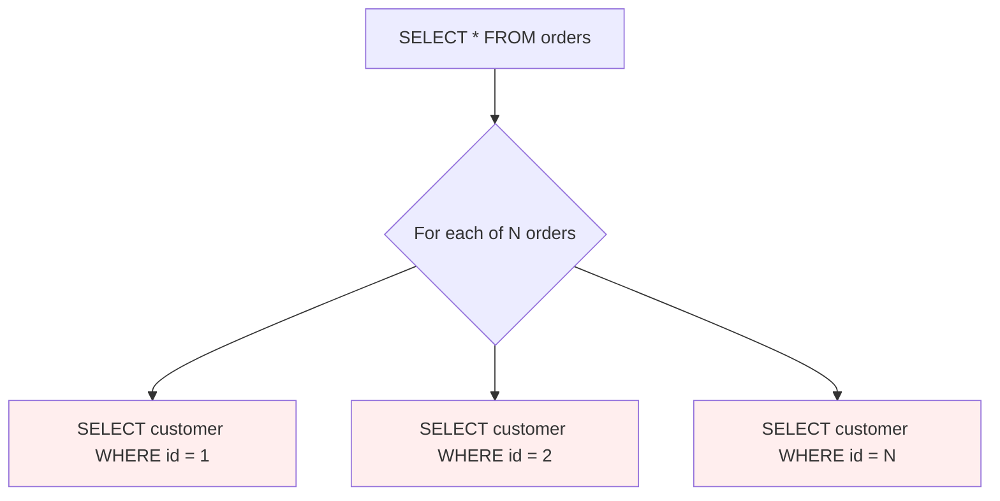

# Spring Data JPA and Hibernate

> Map objects to tables the right way — entities, relationships, fetch types, and the persistence context — and crush the N+1 problem that sinks most JPA codebases.

## Mental model

Three layers stack on top of each other, and conflating them is the root of most confusion:

- **JPA** is a *specification* (`jakarta.persistence.*`) — annotations and interfaces (`EntityManager`, `@Entity`, `@Query`) with no behavior of their own.
- **Hibernate** is the *implementation* — the ORM engine that actually generates SQL, manages the persistence context, does dirty checking, and talks to the JDBC driver. Spring Boot 3 ships **Hibernate 6**.
- **Spring Data JPA** is a *convenience layer* on top of JPA — it generates repository implementations from interface method names so you write almost no boilerplate.

At runtime the heart of everything is the **persistence context** (a.k.a. first-level cache): a `Map` of managed entities scoped to a transaction. While an entity is *managed*, Hibernate tracks changes and flushes them as SQL at commit — you never call `update()`.



## Core concepts

### Entity mapping with `@Entity`

An entity is a plain Java class mapped to a table. It needs an `@Id`, a no-arg constructor (JPA contract), and should *not* be `final`.

```java
import jakarta.persistence.*;

@Entity
@Table(name = "customers", indexes = @Index(columnList = "email"))
public class Customer {

    @Id
    @GeneratedValue(strategy = GenerationType.IDENTITY)
    private Long id;

    @Column(nullable = false, length = 120)
    private String name;

    @Column(unique = true)
    private String email;

    @Enumerated(EnumType.STRING)   // store "ACTIVE", never the ordinal
    private Status status;

    protected Customer() { }       // JPA needs a no-arg ctor

    public Customer(String name, String email) {
        this.name = name;
        this.email = email;
        this.status = Status.ACTIVE;
    }
    // getters / business methods
}
```

::: warning
Never store enums with `@Enumerated(EnumType.ORDINAL)` (the default). Reordering the enum silently corrupts every existing row. Always use `EnumType.STRING`.
:::

### `@Id` and `@GeneratedValue` strategies

```java
@Id @GeneratedValue(strategy = GenerationType.IDENTITY)   // DB auto-increment
@Id @GeneratedValue(strategy = GenerationType.SEQUENCE)   // DB sequence (Postgres)
@Id @GeneratedValue(strategy = GenerationType.UUID)       // Hibernate 6 UUID
```

- **IDENTITY** — relies on an auto-increment column. Simple, but it **disables JDBC batch inserts** because Hibernate must execute each `INSERT` immediately to learn the generated id.
- **SEQUENCE** — uses a database sequence; Hibernate can pre-allocate ids (`allocationSize`) and batch inserts. Preferred on Postgres/Oracle.
- **TABLE** — emulates a sequence with a table; avoid, it's slow and contention-prone.

::: tip
On Postgres prefer `SEQUENCE` with a pooled optimizer (`allocationSize = 50`) when you do bulk inserts — it slashes round-trips.
:::

### Relationships and the owning side

The **owning side** is the entity whose table holds the foreign key — it is the side *without* `mappedBy`. Only changes to the owning side are persisted.

```java
@Entity
public class Order {
    @Id @GeneratedValue(strategy = GenerationType.IDENTITY)
    private Long id;

    // Owning side: orders table has customer_id FK
    @ManyToOne(fetch = FetchType.LAZY)
    @JoinColumn(name = "customer_id")
    private Customer customer;

    @OneToMany(mappedBy = "order", cascade = CascadeType.ALL, orphanRemoval = true)
    private List<OrderLine> lines = new ArrayList<>();

    public void addLine(OrderLine line) {   // keep both sides in sync
        lines.add(line);
        line.setOrder(this);
    }
}
```

```java
@Entity
public class OrderLine {
    @Id @GeneratedValue(strategy = GenerationType.IDENTITY)
    private Long id;

    @ManyToOne(fetch = FetchType.LAZY)   // owning side of the FK
    @JoinColumn(name = "order_id")
    private Order order;
}
```

For `@ManyToMany`, model the join table explicitly when it carries data; otherwise:

```java
@ManyToMany
@JoinTable(name = "student_course",
    joinColumns = @JoinColumn(name = "student_id"),
    inverseJoinColumns = @JoinColumn(name = "course_id"))
private Set<Course> courses = new HashSet<>();
```

### Fetch types: LAZY vs EAGER

| Association | Default fetch |
| --- | --- |
| `@ManyToOne`, `@OneToOne` | **EAGER** |
| `@OneToMany`, `@ManyToMany` | **LAZY** |

::: danger
Make **every** association `fetch = FetchType.LAZY`. EAGER `@ManyToOne` quietly triggers extra joins/selects on every query and is a leading cause of the N+1 problem. Fetch what you need explicitly per query instead.
:::

### The N+1 problem and how to fix it

This is the single most important JPA performance bug. You load N orders, then accessing each order's lazy association fires **one more query per order** — 1 + N queries.

```java
List<Order> orders = orderRepository.findAll();      // 1 query
for (Order o : orders) {
    o.getCustomer().getName();                       // N extra queries!
}
```



**Fix 1 — `JOIN FETCH` in JPQL** (one query, you choose the joins):

```java
@Query("SELECT o FROM Order o JOIN FETCH o.customer WHERE o.status = :s")
List<Order> findByStatusWithCustomer(@Param("s") Status status);
```

**Fix 2 — `@EntityGraph`** (declarative, reuses derived queries):

```java
@EntityGraph(attributePaths = {"customer", "lines"})
List<Order> findByStatus(Status status);
```

**Fix 3 — batch fetching** for collections (turns N selects into N/size `IN` queries):

```yaml
spring:
  jpa:
    properties:
      hibernate:
        default_batch_fetch_size: 50
```

::: tip
Use `JOIN FETCH` for *one* collection at most per query — fetching two collections causes a Cartesian product. For multiple collections, fetch one with a join and the rest via `default_batch_fetch_size`.
:::

### `JpaRepository` and derived query methods

Spring Data generates the implementation from the method name at startup.

```java
public interface OrderRepository extends JpaRepository<Order, Long> {

    List<Order> findByStatus(Status status);
    Optional<Order> findByIdAndStatus(Long id, Status status);
    List<Order> findByCustomerNameContainingIgnoreCase(String fragment);
    long countByStatus(Status status);
    boolean existsByCustomer_Email(String email);
    List<Order> findTop10ByStatusOrderByCreatedAtDesc(Status status);
}
```

### `@Query` — JPQL and native SQL

```java
// JPQL: operates on entities and fields, DB-agnostic
@Query("SELECT o FROM Order o WHERE o.total > :min")
List<Order> findExpensive(@Param("min") BigDecimal min);

// Native: raw SQL when you need DB-specific features
@Query(value = "SELECT * FROM orders WHERE total > :min", nativeQuery = true)
List<Order> findExpensiveNative(@Param("min") BigDecimal min);

// Modifying query: needs @Modifying + a transaction
@Modifying
@Query("UPDATE Order o SET o.status = :s WHERE o.createdAt < :cutoff")
int expireOld(@Param("s") Status s, @Param("cutoff") Instant cutoff);
```

::: warning
A `@Modifying` query bypasses the persistence context — entities already loaded in memory keep their stale values. Call it before loading, or `clear()` the context after.
:::

### Pagination and sorting

```java
Page<Order> findByStatus(Status status, Pageable pageable);

Pageable page = PageRequest.of(0, 20, Sort.by("createdAt").descending());
Page<Order> result = orderRepository.findByStatus(Status.ACTIVE, page);
result.getTotalElements();   // runs a separate COUNT query
result.getContent();
```

::: tip
For deep pagination on huge tables, offset pagination (`LIMIT/OFFSET`) gets slow. Prefer **keyset (seek) pagination** — `WHERE id < :lastSeenId ORDER BY id DESC LIMIT 20`.
:::

### Projections: interface and DTO

Don't load full entities when you only need a few columns.

```java
// Interface projection: Spring proxies it, selects only these columns
public interface OrderSummary {
    Long getId();
    BigDecimal getTotal();
    String getCustomerName();   // nested path o.customer.name
}

List<OrderSummary> findByStatus(Status status);

// DTO (class) projection via JPQL constructor expression
@Query("SELECT new com.app.OrderDto(o.id, o.total) FROM Order o")
List<OrderDto> fetchDtos();
```

### Persistence context, dirty checking, and flush modes

While an entity is **managed**, you mutate it like a normal object — no `save()` needed. At flush time Hibernate compares each managed entity to its loaded snapshot and emits `UPDATE`s for changed ones. This is **dirty checking** (automatic dirty checking).

```java
@Transactional
public void rename(Long id, String name) {
    Order order = orderRepository.findById(id).orElseThrow();
    order.setName(name);     // no save() call — dirty checking flushes the UPDATE
}
```

Flush is triggered: on transaction commit, before a query that might be affected (default `FlushMode.AUTO`), or explicitly via `flush()`.

::: info
First-level cache means `findById(1L)` twice in one transaction hits the DB once — the second call returns the same managed instance from the persistence context.
:::

### Cascade types and `orphanRemoval`

Cascade propagates operations from parent to children. `orphanRemoval = true` deletes a child once it's removed from the parent collection.

```java
@OneToMany(mappedBy = "order",
           cascade = CascadeType.ALL,   // PERSIST, MERGE, REMOVE, REFRESH, DETACH
           orphanRemoval = true)
private List<OrderLine> lines = new ArrayList<>();

order.getLines().remove(line);  // orphanRemoval => DELETE FROM order_lines ...
```

`CascadeType.REMOVE` deletes children when the parent is deleted; `orphanRemoval` also deletes a child *detached* from the collection. Don't use `CascadeType.ALL` on `@ManyToMany` — you'll delete shared records.

### Optimistic locking with `@Version`

Prevents lost updates without holding DB locks. Hibernate adds `WHERE version = ?` to the `UPDATE` and increments the version; a mismatch throws `OptimisticLockException`.

```java
@Entity
public class Account {
    @Id @GeneratedValue private Long id;
    @Version private long version;     // managed by Hibernate
    private BigDecimal balance;
}
```

```sql
UPDATE account SET balance = ?, version = 6 WHERE id = ? AND version = 5;
-- 0 rows updated => someone else changed it => OptimisticLockException
```

### JPA auditing

```java
@Configuration
@EnableJpaAuditing
class JpaConfig { }

@Entity
@EntityListeners(AuditingEntityListener.class)
public class Order {
    @CreatedDate   private Instant createdAt;
    @LastModifiedDate private Instant updatedAt;
    @CreatedBy     private String createdBy;   // needs an AuditorAware bean
}
```

## Common pitfalls

- **The N+1 problem** — lazy associations accessed in a loop. Fix with `JOIN FETCH`, `@EntityGraph`, or `default_batch_fetch_size`.
- **EAGER fetching everywhere** — make all associations LAZY and fetch per query.
- **`@Enumerated` ordinal** — corrupts data on enum reorder; always `EnumType.STRING`.
- **Calling `save()` on a managed entity** — redundant; dirty checking already flushes it.
- **Two collections in one `JOIN FETCH`** — Cartesian explosion; fetch one, batch the rest.
- **`@ManyToMany` with `CascadeType.ALL`** — deletes shared rows; use `PERSIST`/`MERGE` only.
- **Forgetting to sync both sides** of a bidirectional relationship — add helper methods.
- **`@Modifying` query leaving stale entities** in the context — clear after.

## Best practices

- Default every association to `FetchType.LAZY`.
- Use DTO/interface projections for read-heavy endpoints — don't hydrate full graphs.
- Prefer `SEQUENCE` ids with batching over `IDENTITY` for bulk writes.
- Add `@Version` to entities updated concurrently.
- Keep `equals`/`hashCode` based on a business key or the id only once assigned — never on the whole entity.
- Turn on `spring.jpa.properties.hibernate.format_sql=true` plus `show-sql` in dev, and watch query counts with a tool like `datasource-proxy` or p6spy.
- Keep transactions thin (see the transactions tutorial) and resolve lazy data inside them.

## Interview quick-reference

| Concept | Key point |
| --- | --- |
| JPA vs Hibernate vs Spring Data | Spec vs implementation vs repository convenience layer |
| Persistence context | Transaction-scoped 1st-level cache of managed entities |
| Dirty checking | Managed entities auto-flush UPDATEs at commit — no `save()` |
| Owning side | Side without `mappedBy`; holds the FK; only it persists changes |
| Default fetch | `@ManyToOne`/`@OneToOne` EAGER, `@OneToMany`/`@ManyToMany` LAZY |
| N+1 problem | 1 query + N lazy loads; fix with JOIN FETCH / @EntityGraph / batch size |
| `@EntityGraph` | Declarative eager loading on a derived query |
| `GenerationType` | IDENTITY (no batch) vs SEQUENCE (batchable) vs UUID |
| Projections | Interface proxy or DTO constructor — select fewer columns |
| Cascade / orphanRemoval | Propagate ops to children / delete detached children |
| `@Version` | Optimistic locking via version column, throws on conflict |
| Auditing | `@CreatedDate`/`@LastModifiedDate` + `@EnableJpaAuditing` |

See the [interview questions](../questions/04-spring-data-jpa-and-hibernate) for drilling.
