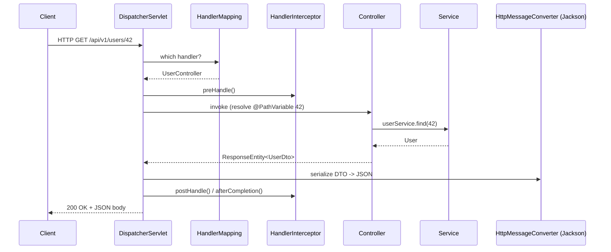
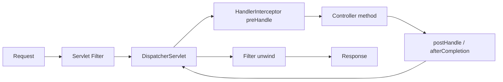

# Spring MVC and REST APIs

> Master how Spring MVC turns an HTTP request into a controller method, how to design clean REST endpoints with the modern annotations, and how to layer controllers, services, and repositories the way senior teams do.

## Mental model

Spring MVC is built around a single **front controller**: the `DispatcherServlet`. Every request enters through it, and the servlet orchestrates a pipeline of collaborators — a `HandlerMapping` to find the right controller method, a `HandlerAdapter` to invoke it, argument resolvers to bind `@PathVariable`/`@RequestParam`/`@RequestBody`, and `HttpMessageConverter`s (Jackson for JSON) to serialize the return value. Your controller is a thin coordination layer; the real work belongs in services, and persistence belongs in repositories.



## Core concepts

### The DispatcherServlet request lifecycle

The `DispatcherServlet` is auto-registered by Spring Boot. For each request it: (1) resolves the handler via `HandlerMapping`, (2) applies matching `HandlerInterceptor`s, (3) invokes the method through a `HandlerAdapter` that resolves arguments and converts the body, (4) handles exceptions via `HandlerExceptionResolver`, and (5) writes the response through an `HttpMessageConverter`. You rarely touch it directly, but knowing the pipeline explains *where* to hook custom behavior.

```java
@RestController
@RequestMapping("/api/v1/users")
public class UserController {

    private final UserService userService;          // constructor injection

    public UserController(UserService userService) {
        this.userService = userService;
    }

    @GetMapping("/{id}")
    public UserDto getUser(@PathVariable Long id) {
        return userService.findById(id);
    }
}
```

::: info
`@RestController` is `@Controller` + `@ResponseBody`. With it, every method return value is written to the response body via message converters rather than resolved as a view name.
:::

### @RestController vs @Controller

`@Controller` is for server-side rendered views: a method returns a `String` view name resolved by a `ViewResolver` (Thymeleaf, JSP). `@RestController` is for APIs: return values become the response body. Mixing them on one class is a smell — pick the role per controller.

```java
@Controller                         // renders HTML templates
public class PageController {
    @GetMapping("/dashboard")
    public String dashboard(Model model) {
        model.addAttribute("title", "Dashboard");
        return "dashboard";          // -> templates/dashboard.html
    }
}
```

### Request mapping annotations

`@RequestMapping` is the general form; the composed shortcuts (`@GetMapping`, `@PostMapping`, `@PutMapping`, `@PatchMapping`, `@DeleteMapping`) bind to specific HTTP methods and read better. You can narrow by path, method, `params`, `headers`, `consumes`, and `produces`.

```java
@PostMapping(
    consumes = MediaType.APPLICATION_JSON_VALUE,
    produces = MediaType.APPLICATION_JSON_VALUE)
public ResponseEntity<UserDto> create(@RequestBody @Valid CreateUserRequest req) {
    UserDto created = userService.create(req);
    URI location = URI.create("/api/v1/users/" + created.id());
    return ResponseEntity.created(location).body(created);   // 201 + Location
}
```

### Binding inputs: @PathVariable, @RequestParam, @RequestBody

- `@PathVariable` binds a templated URI segment (`/users/{id}`).
- `@RequestParam` binds query/form parameters (`?status=ACTIVE&page=0`), with `defaultValue` and `required`.
- `@RequestBody` deserializes the request body (JSON) into an object via Jackson.

```java
@GetMapping
public Page<UserDto> list(
        @RequestParam(defaultValue = "ACTIVE") Status status,
        @RequestParam(defaultValue = "0") int page,
        @RequestParam(defaultValue = "20") int size) {
    return userService.search(status, PageRequest.of(page, size));
}
```

::: tip
Prefer typed parameters (`Status`, `int`, `LocalDate`) over `String`. Spring's converters bind and validate the type for you, and bad input becomes a clean 400 instead of a parse error buried in your code.
:::

### ResponseEntity, status codes, and content negotiation

`ResponseEntity<T>` gives full control over status, headers, and body. Use `@ResponseStatus` for the simple constant case. Choose status codes deliberately: `201 Created` with a `Location` header for creation, `204 No Content` for a successful delete, `200/202` for updates, `4xx` for client errors, `5xx` for server faults.

```java
@DeleteMapping("/{id}")
@ResponseStatus(HttpStatus.NO_CONTENT)              // 204, empty body
public void delete(@PathVariable Long id) {
    userService.delete(id);
}

@GetMapping("/{id}")
public ResponseEntity<UserDto> get(@PathVariable Long id) {
    return userService.findOptional(id)
        .map(ResponseEntity::ok)                    // 200
        .orElseGet(() -> ResponseEntity.notFound().build());  // 404
}
```

Content negotiation picks the response format from the `Accept` header (or a path/param strategy). With Jackson on the classpath, JSON is the default; add the XML module to also serve `application/xml`.

### DTOs vs entities

Never expose JPA entities directly. Entities carry persistence concerns (lazy proxies, bidirectional relations, internal fields) that leak or cause serialization loops and over-posting vulnerabilities. Map to purpose-built DTOs at the boundary — Java `record`s are perfect.

```java
public record UserDto(Long id, String name, String email) {}

public record CreateUserRequest(
    @NotBlank String name,
    @Email String email) {}

// mapping (manual, MapStruct, or a factory method)
static UserDto toDto(User e) {
    return new UserDto(e.getId(), e.getName(), e.getEmail());
}
```

::: warning
Serializing entities is a top source of bugs: `LazyInitializationException`, infinite recursion on `@OneToMany`/`@ManyToOne` back-references, and accidental exposure of password hashes. DTOs make the contract explicit and stable.
:::

### Jackson serialization control

Jackson maps Java to JSON. Shape the output with annotations and config rather than hand-rolled strings.

```java
public record OrderDto(
    Long id,
    @JsonProperty("created_at") Instant createdAt,
    @JsonInclude(JsonInclude.Include.NON_NULL) String note) {}
```

```yaml
# application.yml — global Jackson defaults
spring:
  jackson:
    default-property-inclusion: non_null
    serialization:
      write-dates-as-timestamps: false   # ISO-8601 strings, not epoch millis
    property-naming-strategy: SNAKE_CASE
```

### HATEOAS (brief)

HATEOAS enriches responses with links so clients can discover actions. Spring HATEOAS provides `EntityModel` and link builders. It is powerful for evolvable APIs but adds payload weight — adopt it deliberately, not by default.

```java
EntityModel<UserDto> model = EntityModel.of(dto,
    linkTo(methodOn(UserController.class).getUser(dto.id())).withSelfRel(),
    linkTo(methodOn(UserController.class).list(null, 0, 20)).withRel("users"));
```

### Filters vs interceptors

Both intercept requests, at different layers:

- **`Filter`** (Servlet API) runs *outside* Spring MVC, around the whole `DispatcherServlet`. Use for cross-cutting concerns that aren't MVC-aware: logging, compression, request IDs, security.
- **`HandlerInterceptor`** runs *inside* MVC, with access to the resolved handler. Use for MVC-specific concerns: auth checks per handler, timing, populating `Model`.



```java
@Component
public class TimingInterceptor implements HandlerInterceptor {
    @Override
    public boolean preHandle(HttpServletRequest req, HttpServletResponse res, Object handler) {
        req.setAttribute("start", System.nanoTime());
        return true;                       // false short-circuits the request
    }
    @Override
    public void afterCompletion(HttpServletRequest req, HttpServletResponse res,
                                Object handler, Exception ex) {
        long ms = (System.nanoTime() - (long) req.getAttribute("start")) / 1_000_000;
        res.setHeader("X-Elapsed-Ms", String.valueOf(ms));
    }
}

@Configuration
public class WebConfig implements WebMvcConfigurer {
    private final TimingInterceptor timing;
    public WebConfig(TimingInterceptor timing) { this.timing = timing; }

    @Override
    public void addInterceptors(InterceptorRegistry registry) {
        registry.addInterceptor(timing).addPathPatterns("/api/**");
    }
}
```

### CORS

Cross-Origin Resource Sharing controls which browser origins may call your API. Configure it globally for consistency; `@CrossOrigin` on a controller is fine for narrow cases.

```java
@Configuration
public class CorsConfig implements WebMvcConfigurer {
    @Override
    public void addCorsMappings(CorsRegistry registry) {
        registry.addMapping("/api/**")
            .allowedOrigins("https://app.example.com")   // never "*" with credentials
            .allowedMethods("GET", "POST", "PUT", "DELETE")
            .allowedHeaders("*")
            .allowCredentials(true)
            .maxAge(3600);
    }
}
```

::: danger
`allowedOrigins("*")` combined with `allowCredentials(true)` is invalid and a security risk. Use `allowedOriginPatterns` if you genuinely need wildcard-with-credentials, and scope it tightly.
:::

### Clean controller -> service -> repository layering

Keep each layer single-purpose: controllers translate HTTP <-> Java and validate input; services own business logic and transactions; repositories own persistence. Dependencies point inward and are injected through constructors.

```java
@Service
public class UserService {
    private final UserRepository repo;
    public UserService(UserRepository repo) { this.repo = repo; }

    @Transactional
    public UserDto create(CreateUserRequest req) {
        User saved = repo.save(new User(req.name(), req.email()));
        return UserController.toDto(saved);
    }

    @Transactional(readOnly = true)
    public UserDto findById(Long id) {
        return repo.findById(id).map(UserController::toDto)
            .orElseThrow(() -> new UserNotFoundException(id));
    }
}

public interface UserRepository extends JpaRepository<User, Long> {
    List<User> findByStatus(Status status);
}
```

### Outbound calls: RestClient, WebClient, RestTemplate

To call other services you have three clients:

- **`RestTemplate`** — the classic synchronous client. Still supported but in maintenance mode; no new features.
- **`RestClient`** (Spring 6.1+) — the modern synchronous, fluent replacement for `RestTemplate`. Prefer it for blocking MVC apps.
- **`WebClient`** — non-blocking and reactive (from WebFlux); use it in reactive apps or when you need streaming/concurrency even in MVC.

```java
@Bean
RestClient restClient(RestClient.Builder builder) {
    return builder.baseUrl("https://payments.internal").build();
}

PaymentDto pay(ChargeRequest req) {
    return restClient.post()
        .uri("/charges")
        .body(req)
        .retrieve()
        .onStatus(HttpStatusCode::is4xxClientError,
                  (request, response) -> { throw new PaymentRejectedException(); })
        .body(PaymentDto.class);
}
```

### API versioning

Version so you can evolve without breaking clients. Common strategies: **URI path** (`/api/v1/...`) — simplest and most visible; **header/media-type** (`Accept: application/vnd.example.v2+json`) — cleaner URLs but harder to test; **query param** (`?version=2`) — easy but pollutes URLs. Pick one and apply it consistently.

```java
@RestController
@RequestMapping("/api/v2/users")   // path versioning: explicit and cache-friendly
public class UserControllerV2 { /* ... */ }
```

## Common pitfalls

- **Returning entities instead of DTOs** — causes lazy-load exceptions, recursion, and data leaks. Map at the boundary.
- **Fat controllers** — business logic in controllers makes them untestable. Push logic into services.
- **Field injection (`@Autowired` on fields)** — hides dependencies and breaks immutability/testability. Use constructor injection.
- **Wrong status codes** — returning `200` for errors or creation. Use `201`, `204`, `404`, `409` deliberately.
- **`@RequestParam` for everything** — body data belongs in `@RequestBody`; identifiers belong in the path.
- **CORS wildcard with credentials** — invalid and unsafe.
- **Still reaching for `RestTemplate`** in new code — prefer `RestClient` (sync) or `WebClient` (reactive).

## Best practices

- Keep controllers thin: bind, validate, delegate, return `ResponseEntity`.
- Use records as immutable DTOs and validate request DTOs with `@Valid`.
- Choose precise HTTP status codes and set `Location` on creation.
- Centralize Jackson config in `application.yml`; control fields with annotations.
- Configure CORS globally and scope origins tightly.
- Use `@Transactional(readOnly = true)` for queries, write transactions in the service layer.
- Version your API from day one and document with OpenAPI/springdoc.

## Interview quick-reference

| Concept | Key point |
| --- | --- |
| DispatcherServlet | Front controller orchestrating handler mapping, adapters, converters |
| `@RestController` vs `@Controller` | Body serialization vs view-name resolution |
| `@GetMapping` etc. | Composed shortcuts of `@RequestMapping` per HTTP method |
| `@PathVariable` / `@RequestParam` / `@RequestBody` | URI segment / query param / deserialized body |
| `ResponseEntity` | Full control of status, headers, body |
| Status codes | 201+Location, 204 delete, 404/409 client errors |
| DTOs vs entities | Never serialize entities; map at the boundary |
| Jackson | `HttpMessageConverter` for JSON; configure globally + annotations |
| Filter vs HandlerInterceptor | Servlet-level (outside MVC) vs MVC-aware (has handler) |
| CORS | Browser origin policy; never `*` with credentials |
| Layering | Controller -> Service (`@Transactional`) -> Repository |
| Outbound clients | RestClient (sync, modern), WebClient (reactive), RestTemplate (legacy) |
| Versioning | URI path / media-type / query param — pick one consistently |

See the [interview questions](../questions/03-spring-mvc-and-rest-apis) for drilling.
