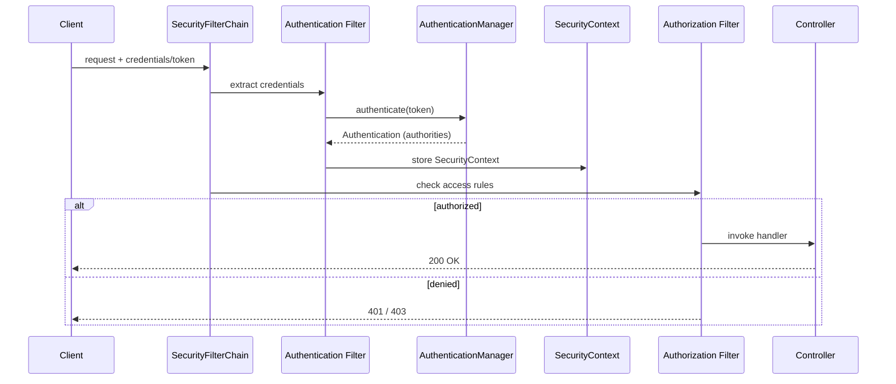
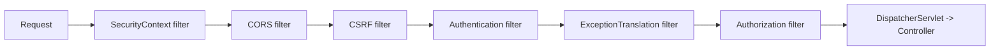
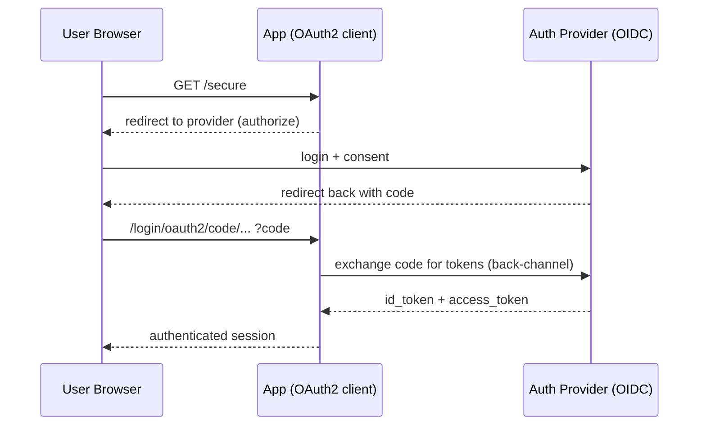

# Spring Security and OAuth2

> Learn how Spring Security 6's filter chain authenticates and authorizes every request, configure it with the modern lambda DSL (no `WebSecurityConfigurerAdapter`), and wire up stateless JWT resource servers and OAuth2/OIDC login.

## Mental model

Spring Security is, at its core, a **chain of servlet filters** placed in front of your application. Each incoming request walks the `SecurityFilterChain`: filters establish *who you are* (**authentication**) and later checks decide *what you may do* (**authorization**). Authentication produces an `Authentication` object stored in the `SecurityContext`; authorization consults its **authorities**. Everything else — login forms, JWT validation, CSRF, CORS, session management — is a filter or a decision rule plugged into this chain.



## Core concepts

### The filter chain and its order

Requests pass through ordered filters: `SecurityContextPersistenceFilter` (restore context), `CorsFilter`, `CsrfFilter`, the authentication filter(s) (`UsernamePasswordAuthenticationFilter`, `BearerTokenAuthenticationFilter`, etc.), `ExceptionTranslationFilter` (turns auth errors into 401/403), and finally `AuthorizationFilter` (the access decision, just before your controller). Order matters: authentication must run before authorization.



### Authentication vs authorization

- **Authentication** — verifying identity (username/password, JWT, OAuth2 token). Result: an `Authentication` with a principal and granted authorities.
- **Authorization** — deciding whether that identity may perform an action (URL rules, method security). Result: allow or deny (`403`).

A `401 Unauthorized` means *not authenticated*; a `403 Forbidden` means *authenticated but not allowed*.

### SecurityFilterChain bean (Spring Security 6 lambda DSL)

`WebSecurityConfigurerAdapter` is **removed** in Spring Security 6. You now define a `SecurityFilterChain` `@Bean` configured with the lambda DSL. This is component-based and composable — declare multiple chains for different path groups.

```java
@Configuration
@EnableWebSecurity
public class SecurityConfig {

    @Bean
    SecurityFilterChain api(HttpSecurity http) throws Exception {
        http
            .securityMatcher("/api/**")
            .authorizeHttpRequests(auth -> auth
                .requestMatchers(HttpMethod.GET, "/api/public/**").permitAll()
                .requestMatchers("/api/admin/**").hasRole("ADMIN")
                .anyRequest().authenticated())
            .csrf(csrf -> csrf.disable())                 // stateless API
            .sessionManagement(sm -> sm
                .sessionCreationPolicy(SessionCreationPolicy.STATELESS))
            .oauth2ResourceServer(oauth -> oauth.jwt(Customizer.withDefaults()));
        return http.build();
    }
}
```

::: info
With multiple `SecurityFilterChain` beans, use `securityMatcher(...)` to scope each one and `@Order` to control which is consulted first. This cleanly separates, say, a stateless `/api/**` chain from a session-based UI chain.
:::

### UserDetailsService and password encoding

For username/password auth, `UserDetailsService` loads a user by username; the returned `UserDetails` carries the (hashed) password and authorities. Spring compares the submitted password using a `PasswordEncoder`.

```java
@Service
public class JpaUserDetailsService implements UserDetailsService {
    private final UserRepository repo;
    public JpaUserDetailsService(UserRepository repo) { this.repo = repo; }

    @Override
    public UserDetails loadUserByUsername(String username) {
        UserEntity u = repo.findByUsername(username)
            .orElseThrow(() -> new UsernameNotFoundException(username));
        return User.withUsername(u.getUsername())
            .password(u.getPasswordHash())
            .authorities(u.getRoles().toArray(String[]::new))
            .build();
    }
}

@Bean
PasswordEncoder passwordEncoder() {
    return new BCryptPasswordEncoder();   // or Argon2PasswordEncoder for new systems
}
```

::: danger
Never store plaintext or fast-hashed (MD5/SHA-256) passwords. Use an adaptive hash: **BCrypt** (default, battle-tested) or **Argon2** (memory-hard, preferred for new systems). Use `DelegatingPasswordEncoder` (the `{bcrypt}`/`{argon2}` prefix) so you can rotate algorithms over time.
:::

### Roles vs authorities

An **authority** is any granted permission string (`READ_ORDERS`). A **role** is an authority conventionally prefixed with `ROLE_` (`ROLE_ADMIN`). `hasRole("ADMIN")` checks for `ROLE_ADMIN`; `hasAuthority("ROLE_ADMIN")` is equivalent. Use fine-grained authorities for permission-based access and roles for coarse grouping.

```java
.authorizeHttpRequests(auth -> auth
    .requestMatchers("/admin/**").hasRole("ADMIN")          // ROLE_ADMIN
    .requestMatchers("/orders/**").hasAuthority("READ_ORDERS"))
```

### Method security

Enable annotation-based authorization with `@EnableMethodSecurity`. `@PreAuthorize` runs *before* the method (most common), `@PostAuthorize` *after* (can inspect the return value), and `@Secured`/`@RolesAllowed` are simpler role checks. SpEL lets you express ownership rules.

```java
@Configuration
@EnableMethodSecurity                       // prePostEnabled = true by default
public class MethodSecurityConfig {}

@Service
public class OrderService {

    @PreAuthorize("hasRole('ADMIN')")
    public void deleteAll() { /* ... */ }

    @PreAuthorize("hasAuthority('READ_ORDERS') and #userId == authentication.name")
    public List<Order> ordersFor(String userId) { /* ... */ }

    @PostAuthorize("returnObject.owner == authentication.name")
    public Order getOrder(Long id) { /* ... */ }
}
```

### Stateless JWT auth (resource server)

For APIs, prefer **stateless** auth: the client sends a signed JWT as `Authorization: Bearer <token>`, and the resource server validates the signature and claims on each request — no server session. Spring Security's resource server support does the heavy lifting.

```yaml
spring:
  security:
    oauth2:
      resourceserver:
        jwt:
          issuer-uri: https://auth.example.com/   # discovers JWKS for signature checks
```

```java
@Bean
SecurityFilterChain resourceServer(HttpSecurity http) throws Exception {
    http
        .authorizeHttpRequests(a -> a.anyRequest().authenticated())
        .sessionManagement(sm -> sm.sessionCreationPolicy(SessionCreationPolicy.STATELESS))
        .oauth2ResourceServer(oauth -> oauth.jwt(jwt ->
            jwt.jwtAuthenticationConverter(jwtAuthConverter())));   // map claims -> authorities
    return http.build();
}

// Map a custom "roles" claim to ROLE_* authorities
JwtAuthenticationConverter jwtAuthConverter() {
    var roles = new JwtGrantedAuthoritiesConverter();
    roles.setAuthoritiesClaimName("roles");
    roles.setAuthorityPrefix("ROLE_");
    var conv = new JwtAuthenticationConverter();
    conv.setJwtGrantedAuthoritiesConverter(roles);
    return conv;
}
```

::: tip
The resource server validates the JWT signature against the provider's JWKS (fetched from `issuer-uri`) and checks `exp`/`iss`/`aud`. You don't decode tokens by hand — inject `@AuthenticationPrincipal Jwt jwt` to read claims.
:::

### OAuth2 / OIDC login and client

There are three OAuth2 roles in Spring Security:

- **Resource server** (above) — validates access tokens for your API.
- **OAuth2 login** — your app is a web client letting users sign in with Google/GitHub/Okta via the authorization-code flow; you receive an OIDC `id_token`.
- **OAuth2 client** — your app calls *other* protected APIs on a user's behalf, managing tokens for you.



```yaml
spring:
  security:
    oauth2:
      client:
        registration:
          google:
            client-id: ${GOOGLE_CLIENT_ID}
            client-secret: ${GOOGLE_CLIENT_SECRET}
            scope: openid, profile, email
```

```java
@Bean
SecurityFilterChain login(HttpSecurity http) throws Exception {
    http
        .authorizeHttpRequests(a -> a.anyRequest().authenticated())
        .oauth2Login(Customizer.withDefaults());   // enables OIDC code flow
    return http.build();
}
```

### CSRF

Cross-Site Request Forgery tricks an authenticated browser into submitting a forged state-changing request. Spring Security enables CSRF protection by default for **session/cookie-based** apps (it issues a token the form/JS must echo). For **stateless token-based APIs** (Bearer JWT) there is no ambient session cookie to abuse, so CSRF is typically disabled.

```java
// Cookie-backed token for SPA + session apps
http.csrf(csrf -> csrf.csrfTokenRepository(
        CookieCsrfTokenRepository.withHttpOnlyFalse()));

// Pure stateless JWT API
http.csrf(csrf -> csrf.disable());
```

::: warning
Disable CSRF **only** when authentication isn't carried by an automatically-sent credential (cookie/session). If you use cookie-based sessions, keep CSRF on — disabling it opens a real attack surface.
:::

### CORS and session management

Configure CORS in the security chain so preflight requests are handled before auth rules. Choose a session policy: `STATELESS` for JWT APIs, `IF_REQUIRED` for traditional apps. You can also cap concurrent sessions and protect against fixation.

```java
http
    .cors(Customizer.withDefaults())   // uses a CorsConfigurationSource bean
    .sessionManagement(sm -> sm
        .sessionCreationPolicy(SessionCreationPolicy.IF_REQUIRED)
        .sessionFixation(sf -> sf.migrateSession())   // new session id on login
        .maximumSessions(1));                          // one active session per user

@Bean
CorsConfigurationSource corsConfigurationSource() {
    var cfg = new CorsConfiguration();
    cfg.setAllowedOrigins(List.of("https://app.example.com"));
    cfg.setAllowedMethods(List.of("GET", "POST", "PUT", "DELETE"));
    cfg.setAllowCredentials(true);
    var source = new UrlBasedCorsConfigurationSource();
    source.registerCorsConfiguration("/**", cfg);
    return source;
}
```

### Common attacks defended

Spring Security mitigates many OWASP risks out of the box: **CSRF** (token), **session fixation** (id rotation on auth), **clickjacking** (`X-Frame-Options`), **XSS** hardening via security headers and `Content-Security-Policy`, **brute force** (you add lockout/rate limits), and **credential theft** (adaptive password hashing + HTTPS/HSTS). Keep the defaults on and add the rest.

```java
http.headers(h -> h
    .frameOptions(f -> f.sameOrigin())                       // clickjacking
    .contentSecurityPolicy(csp -> csp.policyDirectives("default-src 'self'"))
    .httpStrictTransportSecurity(hsts -> hsts.includeSubDomains(true)));
```

## Common pitfalls

- **Reaching for `WebSecurityConfigurerAdapter`** — removed in Security 6; define a `SecurityFilterChain` bean.
- **Disabling CSRF on cookie/session apps** — leaves a real CSRF hole; only disable for stateless token APIs.
- **`hasRole("ROLE_ADMIN")`** — `hasRole` adds the `ROLE_` prefix itself; pass `"ADMIN"`.
- **Weak password hashing** — MD5/SHA are unsafe; use BCrypt/Argon2 via `DelegatingPasswordEncoder`.
- **Decoding JWTs manually** — let the resource server validate signature/claims; read via `@AuthenticationPrincipal Jwt`.
- **Sessions on a JWT API** — set `SessionCreationPolicy.STATELESS` so no `JSESSIONID` is created.
- **CORS misconfigured after auth** — configure CORS in the chain so preflight succeeds; never `*` origin with credentials.

## Best practices

- Define one or more `SecurityFilterChain` beans with the lambda DSL; scope each with `securityMatcher`.
- Default-deny: end rules with `.anyRequest().authenticated()`.
- Use stateless JWT for APIs; session + CSRF for server-rendered UIs.
- Hash passwords with BCrypt/Argon2 through `DelegatingPasswordEncoder`.
- Map JWT/OIDC claims to authorities and use `@PreAuthorize` for fine-grained rules.
- Configure CORS via a `CorsConfigurationSource` bean with tight origins.
- Keep security headers (HSTS, CSP, frame options) enabled and serve over HTTPS.
- Externalize all client secrets and issuer URIs to config/secret stores.

## Interview quick-reference

| Concept | Key point |
| --- | --- |
| Filter chain | Ordered servlet filters; auth before authorization |
| Authentication vs authorization | Who you are (401) vs what you may do (403) |
| `SecurityFilterChain` bean | Security 6 replacement for `WebSecurityConfigurerAdapter` |
| Lambda DSL | Composable config; multiple chains via `securityMatcher`/`@Order` |
| `UserDetailsService` | Loads user + hashed password + authorities |
| Password encoding | BCrypt/Argon2 via `DelegatingPasswordEncoder` |
| Roles vs authorities | `ROLE_`-prefixed authority vs any permission string |
| Method security | `@PreAuthorize`/`@PostAuthorize`/`@Secured` with SpEL |
| JWT resource server | Stateless; validate signature/claims against JWKS |
| OAuth2 roles | Resource server / OAuth2 login / OAuth2 client |
| OIDC login | Authorization-code flow yielding an `id_token` |
| CSRF | On for cookie/session apps; off for stateless token APIs |
| Session policy | `STATELESS` for JWT, `IF_REQUIRED` for UIs |
| Attacks defended | CSRF, fixation, clickjacking, XSS headers, weak hashing |

See the [interview questions](../questions/06-spring-security-and-oauth2) for drilling.
