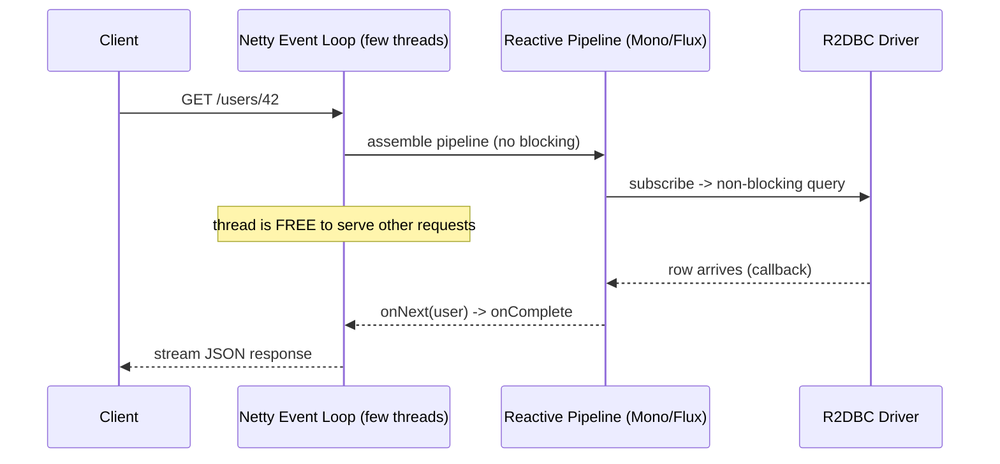
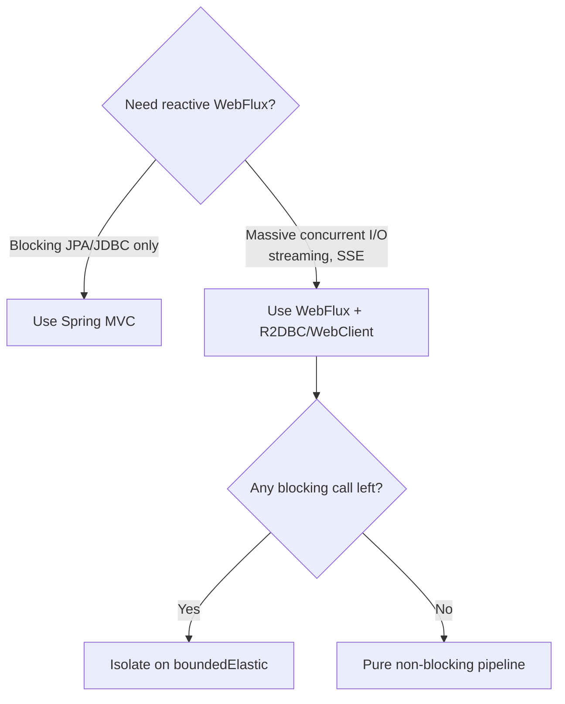

# Spring WebFlux and Reactive Programming

> Understand the reactive model behind Project Reactor's `Mono` and `Flux`, how WebFlux trades a thread-per-request model for a small event loop with backpressure, and — critically — when reactive is worth it and when it is not.

## Mental model

Traditional Spring MVC uses **one thread per request**: a thread is borrowed from a pool, blocks on I/O (DB, downstream call), and is returned when done. Under high concurrency you run out of threads and pay heavy context-switching costs. **WebFlux** flips this: a tiny pool of **event-loop** threads (Netty by default) never blocks — work is described as a *pipeline* of operators over a `Mono` (0–1 item) or `Flux` (0–N items), and the runtime resumes the pipeline when data is ready. **Backpressure** lets a slow consumer tell a fast producer to slow down, so memory stays bounded.



## Core concepts

### Publishers: Mono and Flux

Project Reactor provides two `Publisher` types. A `Mono<T>` emits at most one element (a single user, a count, a completion). A `Flux<T>` emits zero to many (a stream of events, a result set). Nothing happens until something **subscribes** — operators only *describe* the work.

```java
Mono<User> one = Mono.just(new User(1L, "Ada"));
Flux<Integer> many = Flux.range(1, 5)
    .map(i -> i * 2)               // 2,4,6,8,10
    .filter(i -> i > 4);           // 6,8,10

// Lazy: this does nothing until subscribed
Flux<String> names = repository.findAll().map(User::name);
names.subscribe(System.out::println);   // NOW it runs
```

::: info
Reactive streams are **lazy and declarative**. Building a `Flux` is free; the data flows only on subscription. In a WebFlux controller, *Spring subscribes for you* when it writes the response — never call `.block()` to "get the value".
:::

### WebFlux vs MVC

| Aspect | Spring MVC | Spring WebFlux |
| --- | --- | --- |
| Runtime | Servlet container (Tomcat) | Netty event loop (or Servlet 3.1+) |
| Threading | Thread per request, blocking | Few threads, non-blocking |
| Return types | `T`, `ResponseEntity<T>` | `Mono<T>`, `Flux<T>` |
| Data access | JPA/JDBC (blocking) | R2DBC, reactive Mongo (non-blocking) |
| Backpressure | None | Built-in |
| Best for | Most apps, blocking drivers | Massive concurrency, streaming |

Both can serve the same REST semantics; the difference is the execution model underneath.

### Annotated vs functional endpoints

WebFlux supports the familiar annotation style **and** a functional router style. Annotations feel like MVC; routers keep routing logic in code and are handy for fine-grained composition.

```java
// Annotated style — looks like MVC, returns reactive types
@RestController
@RequestMapping("/api/users")
public class UserController {
    private final UserRepository repo;
    public UserController(UserRepository repo) { this.repo = repo; }

    @GetMapping("/{id}")
    public Mono<User> get(@PathVariable Long id) {
        return repo.findById(id)
            .switchIfEmpty(Mono.error(new UserNotFoundException(id)));
    }

    @GetMapping
    public Flux<User> all() { return repo.findAll(); }
}
```

```java
// Functional style — routes + handlers as beans
@Configuration
public class UserRoutes {
    @Bean
    RouterFunction<ServerResponse> routes(UserHandler handler) {
        return RouterFunctions.route()
            .GET("/api/users/{id}", handler::get)
            .GET("/api/users", handler::all)
            .build();
    }
}

@Component
class UserHandler {
    private final UserRepository repo;
    UserHandler(UserRepository repo) { this.repo = repo; }

    Mono<ServerResponse> get(ServerRequest req) {
        Long id = Long.valueOf(req.pathVariable("id"));
        return repo.findById(id)
            .flatMap(u -> ServerResponse.ok().bodyValue(u))
            .switchIfEmpty(ServerResponse.notFound().build());
    }
    Mono<ServerResponse> all(ServerRequest req) {
        return ServerResponse.ok().body(repo.findAll(), User.class);
    }
}
```

### R2DBC for reactive data access

JPA/JDBC are blocking and must not be used in WebFlux. **R2DBC** is the reactive SQL standard; repositories return `Mono`/`Flux` and the driver never blocks the event loop.

```java
public interface UserRepository extends ReactiveCrudRepository<User, Long> {
    Flux<User> findByStatus(Status status);
    Mono<User> findByEmail(String email);
}
```

```yaml
spring:
  r2dbc:
    url: r2dbc:postgresql://localhost:5432/app
    username: app
    password: secret
```

::: warning
Putting a blocking JPA repository or `jdbcTemplate` call inside a WebFlux handler blocks an event-loop thread and can stall the whole application under load. If you must use a blocking driver, you probably want plain MVC instead.
:::

### WebClient for non-blocking outbound calls

`WebClient` is the reactive HTTP client. It composes naturally into pipelines and never blocks while awaiting downstream responses.

```java
@Bean
WebClient paymentsClient(WebClient.Builder builder) {
    return builder.baseUrl("https://payments.internal").build();
}

Mono<Receipt> charge(ChargeRequest req) {
    return webClient.post()
        .uri("/charges")
        .bodyValue(req)
        .retrieve()
        .onStatus(HttpStatusCode::is4xxClientError,
                  resp -> Mono.error(new PaymentRejectedException()))
        .bodyToMono(Receipt.class)
        .timeout(Duration.ofSeconds(3))
        .retryWhen(Retry.backoff(2, Duration.ofMillis(200)));
}
```

### Composing pipelines: operators

`map` transforms synchronously; `flatMap` transforms into another publisher and flattens (use it for nested async calls); `zip` combines parallel sources; `concatMap` preserves order. Chaining keeps everything non-blocking.

```java
Mono<OrderView> view = orderRepo.findById(id)            // Mono<Order>
    .flatMap(order -> Mono.zip(
        userRepo.findById(order.userId()),               // parallel calls
        itemRepo.findByOrderId(order.id()).collectList())
        .map(t -> new OrderView(order, t.getT1(), t.getT2())));
```

### Error operators

Reactive errors are signals, not thrown exceptions — handle them with operators in the chain.

```java
repo.findById(id)
    .switchIfEmpty(Mono.error(new UserNotFoundException(id)))  // empty -> error
    .onErrorResume(UserNotFoundException.class,
                   e -> Mono.just(User.anonymous()))          // recover
    .onErrorMap(DataAccessException.class,
                e -> new ServiceUnavailableException(e))       // translate
    .doOnError(e -> log.error("lookup failed", e));            // side-effect only
```

### Schedulers and the blocking pitfall

Operators run on whatever thread emitted the signal — usually the event loop. `subscribeOn`/`publishOn` move work to a different `Scheduler`. If you are forced to call a blocking API, isolate it on `Schedulers.boundedElastic()` so the event loop stays free.

```java
Mono<String> safeBlocking = Mono.fromCallable(() -> legacyBlockingCall())
    .subscribeOn(Schedulers.boundedElastic());   // offload blocking work
```



::: danger
Never call `.block()`, `Thread.sleep()`, a blocking JDBC/JPA call, or `synchronized` I/O on an event-loop thread. One blocked event-loop thread removes a large slice of your total throughput and can cascade into timeouts everywhere. Reactor's `BlockHound` agent can detect these in tests.
:::

### When to use reactive — and when NOT

Reactive pays off when you have **very high concurrency over I/O**: thousands of slow connections, streaming/SSE/WebSocket, many fan-out downstream calls, or strict resource constraints. It does **not** pay off — and adds real cost — when your stack is blocking (JPA/JDBC), your team isn't fluent in Reactor, or load is moderate. Reactive code is harder to read, debug (stack traces are fragmented), and profile. For most CRUD services, MVC (optionally on virtual threads in Java 21+) is simpler and fast enough.

::: tip
Java 21 **virtual threads** give blocking-style MVC code much of WebFlux's scalability without the paradigm shift. If your only goal is "handle more concurrent requests," try virtual threads before rewriting to reactive.
:::

### Testing with StepVerifier

Reactor's `StepVerifier` drives a publisher through its signals and asserts them in order — including errors and completion — so you test pipelines without blocking.

```java
@Test
void emitsUsersThenCompletes() {
    Flux<String> names = Flux.just("Ada", "Linus").map(String::toUpperCase);

    StepVerifier.create(names)
        .expectNext("ADA")
        .expectNext("LINUS")
        .verifyComplete();
}

@Test
void errorsWhenMissing() {
    Mono<User> result = service.find(999L);   // empty -> error
    StepVerifier.create(result)
        .expectError(UserNotFoundException.class)
        .verify();
}
```

## Common pitfalls

- **Blocking inside a pipeline** — `.block()`, JDBC, `Thread.sleep` on the event loop stalls throughput. Offload to `boundedElastic` or use MVC.
- **Subscribing manually in controllers** — let Spring subscribe; returning the `Mono`/`Flux` is enough.
- **Mixing JPA with WebFlux** — JPA is blocking; use R2DBC for reactive persistence.
- **`map` where `flatMap` is needed** — `map` with an async function yields `Mono<Mono<T>>`; use `flatMap` to flatten.
- **Throwing instead of signaling** — return `Mono.error(...)`; thrown exceptions in lambdas can be lost.
- **Adopting reactive for moderate load** — complexity without payoff; prefer MVC/virtual threads.
- **Forgetting timeouts/retries** on `WebClient` — non-blocking still needs bounded waits.

## Best practices

- Choose reactive deliberately: high-concurrency I/O and streaming, with a fully non-blocking stack.
- Keep pipelines pure — no blocking calls; isolate unavoidable blocking on `boundedElastic`.
- Use R2DBC/`ReactiveCrudRepository` and `WebClient` end-to-end.
- Model errors as signals with `onErrorResume`/`onErrorMap`/`switchIfEmpty`.
- Add `timeout` and `retryWhen` to outbound calls.
- Test every pipeline with `StepVerifier`; run `BlockHound` in tests to catch blocking.
- Consider Java 21 virtual threads on MVC before committing to a reactive rewrite.

## Interview quick-reference

| Concept | Key point |
| --- | --- |
| `Mono` vs `Flux` | 0–1 element vs 0–N elements; both lazy `Publisher`s |
| Lazy execution | Nothing runs until `subscribe`; operators only describe work |
| MVC vs WebFlux | Thread-per-request blocking vs event-loop non-blocking |
| Netty event loop | Few threads must never block |
| Backpressure | Consumer controls producer rate; bounded memory |
| Annotated vs functional | `@RestController` style vs `RouterFunction` handlers |
| R2DBC | Reactive SQL; JPA/JDBC are blocking and forbidden |
| `WebClient` | Non-blocking HTTP client for outbound calls |
| `map` vs `flatMap` | Sync transform vs async transform + flatten |
| Error operators | `onErrorResume`/`onErrorMap`/`switchIfEmpty` |
| Schedulers | `boundedElastic` to offload unavoidable blocking |
| When NOT to use | Blocking stack, moderate load — prefer MVC/virtual threads |
| `StepVerifier` | Asserts signals in order without blocking |

See the [interview questions](../questions/03-spring-mvc-and-rest-apis) for drilling.
