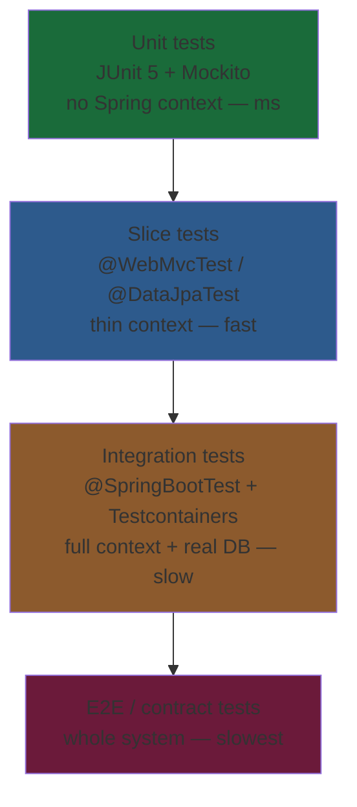
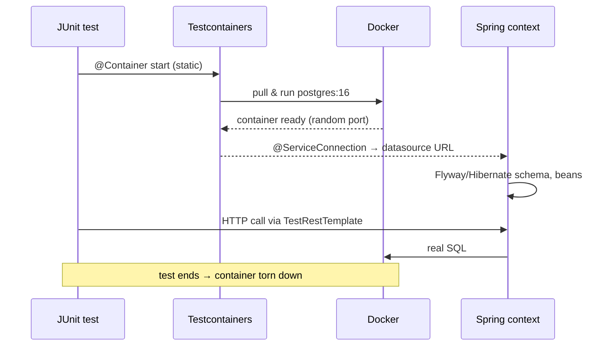

# Testing Spring Boot Applications

> Test fast where you can and realistically where it matters — pure unit tests with JUnit 5 + Mockito, focused slice tests for web/JPA layers, and full integration tests against real infrastructure with Testcontainers.

## Mental model

Tests trade **speed** for **confidence**. A unit test that mocks everything runs in milliseconds but proves little about wiring; a full `@SpringBootTest` against a real database proves the system works but is slow. The skill is choosing the cheapest test that still answers the question you have. Spring Boot gives you a *ladder* of options — plain JUnit, **test slices** that boot a thin sub-context, and the **full context** — and Testcontainers lets the slow rungs run against the same Postgres/Kafka you use in production instead of an H2 lookalike.



Most of your tests should sit at the bottom (many, fast); a handful of integration tests guard the seams.

## Core concepts

### Unit tests with JUnit 5 + Mockito

A true unit test instantiates the class under test directly and **mocks its collaborators** — no Spring context, no database, no network. This is where business logic belongs.

```java
@ExtendWith(MockitoExtension.class)
class OrderServiceTest {

    @Mock OrderRepository repository;          // collaborator → mocked
    @Mock PaymentGateway gateway;
    @InjectMocks OrderService service;         // class under test, mocks wired in

    @Test
    void placesOrderAndCharges() {
        var order = new Order(1L, BigDecimal.TEN);
        when(repository.save(any(Order.class))).thenAnswer(inv -> inv.getArgument(0));
        when(gateway.charge(BigDecimal.TEN)).thenReturn(Receipt.ok("txn-1"));

        Order saved = service.place(order);

        assertThat(saved.getStatus()).isEqualTo(Status.PAID);
        verify(gateway).charge(BigDecimal.TEN);          // interaction asserted
        verify(repository).save(argThat(o -> o.getStatus() == Status.PAID));
    }
}
```

::: tip
Use constructor injection in your production classes — then `@InjectMocks` (or just `new OrderService(repo, gateway)`) works without any Spring magic, and the test documents the real dependencies.
:::

::: warning
Don't boot a Spring context just to test a method that has no Spring behaviour. `@SpringBootTest` on a pure-logic class is the single most common cause of slow test suites.
:::

### Stubbing vs verifying

Mockito does two distinct things: **stub** return values (`when(...).thenReturn(...)`) and **verify** interactions (`verify(...)`). Stub what the code *reads*; verify what it *causes*.

```java
when(repository.findById(1L)).thenReturn(Optional.of(order));   // stub: input
verify(emailSender).send(eq("welcome"), any());                  // verify: side effect
verify(repository, never()).delete(any());                       // verify absence
verifyNoMoreInteractions(emailSender);                           // strictness
```

::: info
Mockito 5 (bundled with Boot 3) uses the inline mock maker by default, so it can mock `final` classes/methods without extra configuration.
:::

### Web slice tests — `@WebMvcTest` + MockMvc

`@WebMvcTest` boots **only** the web layer (controllers, JSON converters, validation, filters, `@ControllerAdvice`) — no services, no repositories. You supply collaborators with `@MockBean`.

```java
@WebMvcTest(OrderController.class)
class OrderControllerTest {

    @Autowired MockMvc mvc;
    @MockBean OrderService service;            // replaces the real bean in the slice

    @Test
    void returns201OnCreate() throws Exception {
        when(service.place(any())).thenReturn(new Order(1L, Status.PAID));

        mvc.perform(post("/api/orders")
                .contentType(MediaType.APPLICATION_JSON)
                .content("""
                    {"amount": 10.00}
                """))
            .andExpect(status().isCreated())
            .andExpect(header().string("Location", "/api/orders/1"))
            .andExpect(jsonPath("$.status").value("PAID"));
    }

    @Test
    void returns400OnInvalidBody() throws Exception {
        mvc.perform(post("/api/orders")
                .contentType(MediaType.APPLICATION_JSON)
                .content("""{"amount": -5}"""))
            .andExpect(status().isBadRequest())
            .andExpect(jsonPath("$.title").value("Bad Request"));   // ProblemDetail
    }
}
```

This verifies routing, status codes, JSON (de)serialization, validation and exception handling without touching the database.

### JPA slice tests — `@DataJpaTest`

`@DataJpaTest` boots only JPA: repositories, `EntityManager`, and (by default) an in-memory database with rolled-back transactions per test. Use it to test queries, mappings, and derived methods.

```java
@DataJpaTest
class OrderRepositoryTest {

    @Autowired OrderRepository repository;
    @Autowired TestEntityManager em;

    @Test
    void findsByStatus() {
        em.persist(new Order(null, Status.PAID));
        em.persist(new Order(null, Status.PENDING));
        em.flush();

        List<Order> paid = repository.findByStatus(Status.PAID);

        assertThat(paid).hasSize(1);
    }
}
```

::: warning
The default `@DataJpaTest` swaps in an embedded DB (H2). H2 is *not* Postgres — it silently accepts SQL Postgres rejects and lacks `jsonb`, partial indexes, etc. For anything non-trivial, disable the replacement and point it at Testcontainers (next section):
```java
@DataJpaTest
@AutoConfigureTestDatabase(replace = AutoConfigureTestDatabase.Replace.NONE)
```
:::

### Integration tests with Testcontainers

Testcontainers spins up real Docker containers (Postgres, Kafka, Redis…) for the duration of your tests, so integration tests run against the *actual* engines you ship. Spring Boot 3.1+ wires them in with `@ServiceConnection` — no manual datasource properties needed.

```java
@SpringBootTest(webEnvironment = WebEnvironment.RANDOM_PORT)
@Testcontainers
class OrderIntegrationTest {

    @Container
    @ServiceConnection                                 // auto-configures the datasource
    static PostgreSQLContainer<?> postgres =
        new PostgreSQLContainer<>("postgres:16-alpine");

    @Autowired TestRestTemplate rest;
    @Autowired OrderRepository repository;

    @Test
    void createsAndPersistsOrder() {
        var response = rest.postForEntity("/api/orders",
                Map.of("amount", "10.00"), Order.class);

        assertThat(response.getStatusCode()).isEqualTo(HttpStatus.CREATED);
        assertThat(repository.count()).isEqualTo(1);
    }
}
```



::: tip
Mark the container `static` so one container is shared across all methods in the class (started once). For sharing across many test classes, use the **singleton container pattern** — start it in a base class and reuse it.
:::

### `@MockBean` and `@TestConfiguration`

In a full or slice context, `@MockBean` replaces a bean in the application context with a Mockito mock — useful to stub out a payment gateway or external API. `@TestConfiguration` supplies test-only beans without polluting production config.

```java
@SpringBootTest
class CheckoutTest {

    @MockBean PaymentGateway gateway;          // real context, fake gateway

    @TestConfiguration
    static class Clocks {
        @Bean Clock fixedClock() {
            return Clock.fixed(Instant.parse("2026-01-01T00:00:00Z"), ZoneOffset.UTC);
        }
    }
}
```

::: warning
Every distinct combination of `@MockBean`/`@TestConfiguration`/properties produces a **new cached context**. Too many variations defeat Spring's context caching and your suite slows to a crawl. Keep configurations consistent so contexts are reused.
:::

### Reactive endpoints — `WebTestClient`

For WebFlux (or any app via `RANDOM_PORT`), `WebTestClient` is the fluent, non-blocking equivalent of MockMvc.

```java
@WebFluxTest(OrderController.class)
class ReactiveOrderTest {
    @Autowired WebTestClient client;
    @MockBean OrderService service;

    @Test
    void getsOrder() {
        when(service.find(1L)).thenReturn(Mono.just(new Order(1L, Status.PAID)));
        client.get().uri("/api/orders/1")
            .exchange()
            .expectStatus().isOk()
            .expectBody().jsonPath("$.status").isEqualTo("PAID");
    }
}
```

### Parameterized tests & fluent assertions

JUnit 5 `@ParameterizedTest` removes copy-paste; AssertJ gives readable, chainable assertions.

```java
@ParameterizedTest
@CsvSource({ "0, REJECTED", "10, PAID", "1000000, REJECTED" })
void validatesAmount(BigDecimal amount, Status expected) {
    assertThat(service.place(new Order(null, amount)).getStatus())
        .isEqualTo(expected);
}

// AssertJ: descriptive failures, collection/exception support
assertThat(orders)
    .hasSize(2)
    .extracting(Order::getStatus)
    .containsExactly(Status.PAID, Status.PENDING);

assertThatThrownBy(() -> service.place(null))
    .isInstanceOf(IllegalArgumentException.class)
    .hasMessageContaining("order");
```

### Test data builders

Avoid brittle, repetitive setup with builders that default everything and let each test override only what it cares about.

```java
static Order.OrderBuilder anOrder() {        // sensible defaults
    return Order.builder().id(1L).amount(BigDecimal.TEN).status(Status.PENDING);
}

@Test
void example() {
    var paid = anOrder().status(Status.PAID).build();   // override one field
}
```

## Common pitfalls

- **Using `@SpringBootTest` everywhere.** Booting the full context for logic tests makes suites slow and flaky. Fix: pure unit tests for logic, slices for layers, full context only for true integration.
- **Trusting H2 to behave like Postgres.** H2 accepts SQL your prod DB rejects and lacks `jsonb`/window features. Fix: Testcontainers with the real image.
- **Context cache thrashing.** Many different `@MockBean`/property combos create many contexts. Fix: standardize test configuration; group integration tests on one base config.
- **Starting a container per test method.** Non-`static` `@Container` restarts Docker every method. Fix: `static` containers, or the singleton pattern across classes.
- **Asserting implementation, not behaviour.** Over-using `verify` on every call couples tests to internals. Fix: verify meaningful side effects, assert outputs.
- **Forgetting transaction rollback semantics.** `@DataJpaTest` rolls back; `@SpringBootTest` does *not* by default — leftover rows leak between tests. Fix: add `@Transactional` or clean up explicitly.
- **Mocking what you don't own without an integration test.** Mocking the HTTP client means you never test real serialization. Fix: pair mocks with at least one wire-level test (Testcontainers / WireMock).

## Best practices

- Follow the pyramid: **many unit tests, some slice tests, few integration tests.**
- Prefer **constructor injection** so units are testable without Spring.
- Use the **narrowest slice** that exercises what you're testing (`@WebMvcTest`, `@DataJpaTest`, `@JsonTest`).
- Run integration tests against **real engines via Testcontainers**, not H2.
- Keep test configuration uniform to maximize **context caching**.
- Make tests **deterministic**: inject a fixed `Clock`, control randomness, avoid `Thread.sleep` (use Awaitility for async).
- Name tests by behaviour (`returns400OnInvalidBody`) and assert with **AssertJ** for readable failures.
- Keep one logical assertion theme per test; use `@ParameterizedTest` for variations.

## Interview quick-reference

| Concept | Key point |
| --- | --- |
| Test pyramid | Many fast unit tests, few slow integration tests |
| Unit test | No Spring context; mock collaborators with Mockito |
| `@WebMvcTest` | Web slice only; MockMvc + `@MockBean` for services |
| `@DataJpaTest` | JPA slice; rolled-back tx; replace H2 with Testcontainers |
| `@SpringBootTest` | Full context; does *not* roll back by default |
| `@MockBean` vs `@Mock` | Replaces a context bean vs a plain Mockito mock |
| Testcontainers | Real Dockerized DB/Kafka; `@ServiceConnection` auto-wires |
| Context caching | Same config is reused; varied config = new contexts = slow |
| `WebTestClient` | Reactive/HTTP fluent client for WebFlux & RANDOM_PORT |
| AssertJ | Fluent, chainable assertions with rich failure messages |

See the [interview questions](../questions/11-testing-junit-mockito-and-testcontainers) for drilling.
