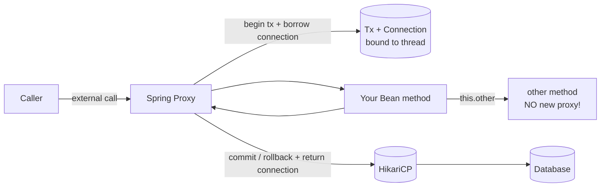
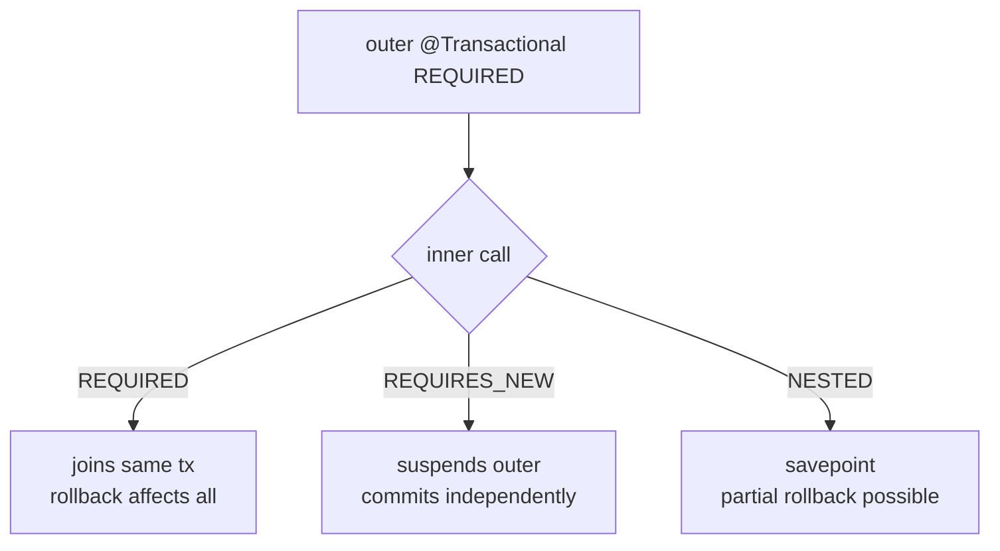
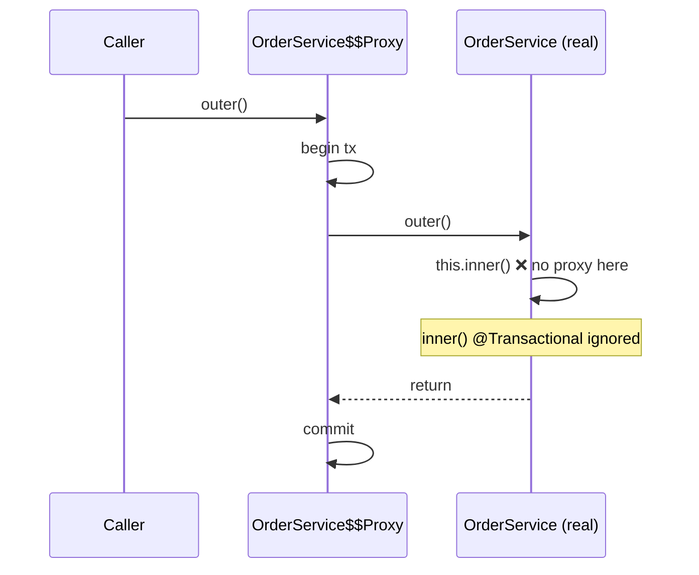

# Transactions and Connection Pooling

> Master `@Transactional` — propagation, isolation, rollback rules — sidestep the proxy self-invocation trap, and size HikariCP so your app doesn't starve under load.

## Mental model

`@Transactional` is **declarative** transaction management implemented with an **AOP proxy**. Spring wraps your bean in a proxy that opens a transaction before the method runs and commits (or rolls back) after it returns. The transaction is bound to the current thread via a `ThreadLocal`, and so is the database `Connection` borrowed from the pool.

Two consequences flow from this design and explain 90% of transaction bugs:

1. Because the proxy intercepts *external* calls only, a method calling another `@Transactional` method on `this` **bypasses the proxy** — the annotation is ignored.
2. A connection is held for the *entire* transaction. Long transactions hold connections, and a too-small pool starves under load.



## Core concepts

### `@Transactional` semantics

Put it on the **service layer**, not the controller or repository. The whole method body runs in one atomic unit: all writes commit together or none do.

```java
@Service
public class TransferService {

    private final AccountRepository accounts;

    public TransferService(AccountRepository accounts) {  // constructor injection
        this.accounts = accounts;
    }

    @Transactional
    public void transfer(Long from, Long to, BigDecimal amount) {
        Account src = accounts.findById(from).orElseThrow();
        Account dst = accounts.findById(to).orElseThrow();
        src.withdraw(amount);          // dirty checking flushes both
        dst.deposit(amount);           // commit => both, exception => neither
    }
}
```

### Propagation levels

Propagation decides what happens when a transactional method is called while a transaction is *already* active.

```java
@Transactional(propagation = Propagation.REQUIRES_NEW)
public void writeAuditLog(AuditEvent e) { ... }
```

| Propagation | Behavior |
| --- | --- |
| `REQUIRED` (default) | Join the current tx, or start one if none |
| `REQUIRES_NEW` | Always suspend the current tx and start a fresh independent one |
| `NESTED` | Savepoint inside the current tx; inner rollback doesn't kill outer |
| `SUPPORTS` | Join if one exists, else run non-transactionally |
| `MANDATORY` | Must run inside an existing tx, else throw |
| `NEVER` | Must run with no tx, else throw |
| `NOT_SUPPORTED` | Suspend any tx and run non-transactionally |



::: tip
Use `REQUIRES_NEW` for an audit/log row that must persist **even if the main transaction rolls back**. Be aware it borrows a *second* connection from the pool simultaneously — relevant to pool sizing.
:::

### Isolation levels and the anomalies they prevent

Isolation controls how concurrent transactions see each other's uncommitted/committed changes.

| Anomaly | What happens |
| --- | --- |
| Dirty read | Read another tx's *uncommitted* change |
| Non-repeatable read | Same row read twice returns different values |
| Phantom read | Same query returns new *rows* the second time |

| Isolation | Dirty | Non-repeatable | Phantom |
| --- | --- | --- | --- |
| READ_UNCOMMITTED | possible | possible | possible |
| READ_COMMITTED | prevented | possible | possible |
| REPEATABLE_READ | prevented | prevented | possible |
| SERIALIZABLE | prevented | prevented | prevented |

```java
@Transactional(isolation = Isolation.REPEATABLE_READ)
public Report buildReport() { ... }
```

::: info
Postgres defaults to READ_COMMITTED; MySQL/InnoDB defaults to REPEATABLE_READ. Higher isolation costs concurrency. Often **optimistic locking with `@Version`** is a better fix for lost updates than cranking isolation to SERIALIZABLE.
:::

### Rollback rules: checked vs unchecked

By default Spring rolls back on **`RuntimeException` and `Error`**, but **commits on checked exceptions**. This surprises everyone.

```java
@Transactional
public void process() throws IOException {
    repo.save(entity);
    throw new IOException("boom");   // checked => transaction COMMITS by default!
}

// Force rollback on a checked exception:
@Transactional(rollbackFor = IOException.class)
public void processSafely() throws IOException { ... }

// Or prevent rollback on a specific runtime exception:
@Transactional(noRollbackFor = NotFoundException.class)
public void lookup() { ... }
```

::: danger
A checked exception does **not** trigger rollback unless you add `rollbackFor`. If your method throws checked exceptions and must be atomic, set `rollbackFor` explicitly or you'll commit half-finished work.
:::

::: warning
Catching an exception inside a `@Transactional` method and swallowing it means **no rollback happens** — the proxy never sees the exception. Also, once a transaction is marked rollback-only, any later commit attempt throws `UnexpectedRollbackException`.
:::

### Read-only transactions

```java
@Transactional(readOnly = true)
public List<OrderDto> listOrders() { ... }
```

`readOnly = true` lets Hibernate skip dirty-checking snapshots (`FlushMode.MANUAL`) and lets the driver/DB route to read replicas. Use it on every query-only service method — it's a free performance win and a safety guard.

### The proxy / self-invocation pitfall

This is the most notorious `@Transactional` bug. A call to another method on the **same object** does not go through the proxy, so its `@Transactional` is silently ignored.

```java
@Service
public class OrderService {

    @Transactional
    public void outer() {
        inner();   // ❌ self-invocation — proxy bypassed, inner's @Transactional ignored
    }

    @Transactional(propagation = Propagation.REQUIRES_NEW)
    public void inner() { ... }   // runs in outer's tx, NOT a new one
}
```



**Fixes:** split `inner()` into a separate bean (cleanest), self-inject the proxy, or use `TransactionTemplate`.

```java
@Service
public class OrderService {
    private final AuditService auditService;   // separate bean => goes through proxy

    public OrderService(AuditService auditService) {
        this.auditService = auditService;
    }

    @Transactional
    public void outer() {
        auditService.inner();   // ✅ proxied call honors REQUIRES_NEW
    }
}
```

::: warning
The same proxy rule means `@Transactional` on `private`, `final`, or `static` methods does nothing — the proxy can only intercept public, overridable methods. Spring AOP can't override them.
:::

### Transaction boundaries and layering

```
Controller (no tx)  ->  Service (@Transactional)  ->  Repository (joins the tx)
```

Keep the transaction at the service layer where the use-case boundary lives. Don't make controllers transactional (the view/serialization shouldn't hold a connection), and don't rely on repository-level transactions for multi-step business logic.

::: tip
Keep transactions **short**. Never call a slow REST API or `Thread.sleep` inside a transaction — you're holding a pooled connection the whole time and will exhaust the pool under load.
:::

### HikariCP connection pooling

HikariCP is the default pool in Spring Boot. The pool lends a fixed set of physical connections; a transaction holds one for its lifetime.

```yaml
spring:
  datasource:
    hikari:
      maximum-pool-size: 10          # see sizing note below
      minimum-idle: 10               # often = max for steady latency
      connection-timeout: 30000      # ms to wait for a connection before failing
      idle-timeout: 600000           # ms before an idle conn is retired
      max-lifetime: 1800000          # < DB/proxy timeout; recycle conns
      leak-detection-threshold: 20000  # log a stack trace if held > 20s
```

**Pool sizing:** bigger is *not* better. A practical starting formula is `connections = (core_count * 2) + effective_spindle_count`. For most services a pool of **10** outperforms 100 — more connections just add context-switching and DB lock contention. Size to the DB's capacity and remember `REQUIRES_NEW` can consume two connections per request.

::: danger
**Connection leaks** starve the pool: every new request blocks for `connection-timeout` then fails. Set `leak-detection-threshold` to catch the offending code path. The usual cause is a long transaction or a connection borrowed outside Spring's management.
:::

### `LazyInitializationException`

Accessing a lazy association *after* the transaction (and its persistence context) closed throws `LazyInitializationException` — classic when serializing an entity in the controller.

```java
// ❌ Service returns entity; controller serializes order.getLines() AFTER tx closed
// => LazyInitializationException: could not initialize proxy - no Session
```

**Fixes (best to worst):** fetch what you need with `JOIN FETCH`/`@EntityGraph` inside the transaction and return a **DTO**; or keep the work inside the transactional boundary. Do **not** reach for `spring.jpa.open-in-view` (it's on by default but holds the connection through view rendering — disable it and fetch explicitly).

```yaml
spring:
  jpa:
    open-in-view: false   # recommended: forces explicit fetching, frees connections sooner
```

### Programmatic transactions with `TransactionTemplate`

When you need fine-grained control, a tiny scope, or to dodge the self-invocation problem, manage transactions programmatically.

```java
@Service
public class ReportService {
    private final TransactionTemplate tx;

    public ReportService(PlatformTransactionManager txManager) {
        this.tx = new TransactionTemplate(txManager);
        this.tx.setPropagationBehavior(TransactionDefinition.PROPAGATION_REQUIRES_NEW);
    }

    public Report run() {
        return tx.execute(status -> {
            try {
                return doWork();
            } catch (RuntimeException e) {
                status.setRollbackOnly();   // explicit rollback signal
                throw e;
            }
        });
    }
}
```

## Common pitfalls

- **Self-invocation** — calling a `@Transactional` method via `this` bypasses the proxy. Split into another bean.
- **`@Transactional` on private/final methods** — silently ignored; the proxy can't intercept them.
- **Checked exceptions don't roll back** by default — add `rollbackFor`.
- **Swallowing exceptions** inside the method — no rollback, since the proxy never sees them.
- **Long transactions** holding pooled connections during slow I/O — exhaust HikariCP.
- **Oversized pools** — more connections add contention; size to DB capacity.
- **`LazyInitializationException`** — accessing lazy data after the tx; return DTOs.
- **Leaving `open-in-view` on** — holds a connection through view rendering.

## Best practices

- Annotate the **service layer**; keep controllers and repositories out of transaction declaration.
- Mark all query-only methods `@Transactional(readOnly = true)`.
- Keep transactions short; never do remote calls/sleeps inside them.
- Set `rollbackFor` whenever the method throws checked exceptions that must roll back.
- Configure HikariCP `leak-detection-threshold` and `max-lifetime`; start with a small pool.
- Disable `open-in-view` and fetch needed data explicitly into DTOs.
- Prefer optimistic locking (`@Version`) over high isolation levels for lost-update protection.
- Use `TransactionTemplate` for narrow scopes or to avoid self-invocation.

## Interview quick-reference

| Concept | Key point |
| --- | --- |
| `@Transactional` | AOP proxy begins/commits/rolls back around the method |
| Self-invocation | `this.method()` bypasses the proxy — annotation ignored |
| REQUIRED vs REQUIRES_NEW | Join existing tx vs suspend and start an independent one |
| NESTED | Savepoint; inner rollback doesn't kill the outer tx |
| Isolation levels | Trade concurrency for preventing dirty/non-repeatable/phantom reads |
| Default rollback | RuntimeException/Error roll back; checked exceptions commit |
| `rollbackFor` | Force rollback on checked exceptions |
| `readOnly` | Skips dirty checking; may route to read replicas |
| LazyInitializationException | Lazy access after tx closed; return DTOs / JOIN FETCH |
| HikariCP sizing | Small pool wins; ~`(cores*2)+spindles`; watch leaks |
| `leak-detection-threshold` | Logs a stack trace when a connection is held too long |
| TransactionTemplate | Programmatic tx control; avoids self-invocation |

See the [interview questions](../questions/05-database-transactions-and-connection-pooling) for drilling.
