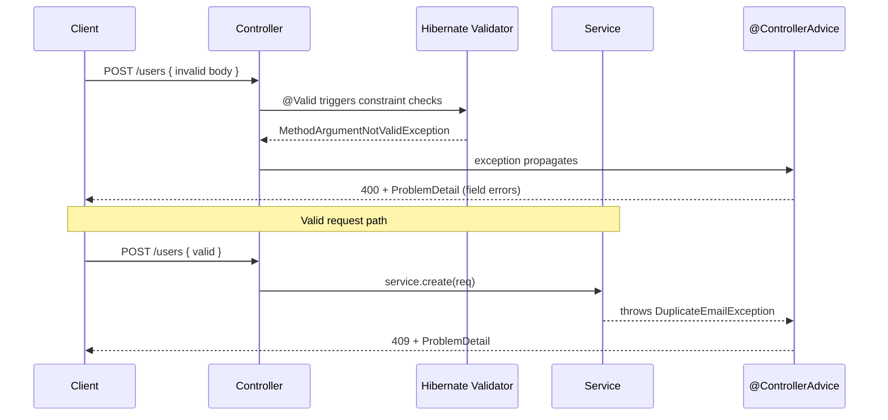

# Validation and Error Handling

> Validate input at the edge with Jakarta Bean Validation, then turn every failure into a consistent, machine-readable error response using `@ControllerAdvice` and RFC 7807 `ProblemDetail`.

## Mental model

Two cooperating mechanisms keep a Spring API robust. **Bean Validation** (Jakarta Validation, implemented by Hibernate Validator) declares constraints with annotations and rejects bad input *before* it reaches your business logic. **Centralized error handling** (`@ControllerAdvice` + `@ExceptionHandler`) catches whatever does go wrong — validation failures, domain exceptions, unexpected faults — and maps each to a single, predictable response shape. The goal: invalid input never corrupts state, and every error looks the same to the client.



## Core concepts

### Bean Validation basics

Add `spring-boot-starter-validation` to pull in Hibernate Validator. Annotate fields with constraints; Spring runs them when you mark the argument `@Valid`. The constraint vocabulary is rich: `@NotNull`, `@NotBlank`, `@NotEmpty`, `@Size`, `@Min`/`@Max`, `@Positive`, `@Email`, `@Pattern`, `@Past`/`@Future`.

```java
public record CreateUserRequest(
    @NotBlank(message = "name is required")
    @Size(max = 100) String name,

    @NotBlank @Email String email,

    @Min(18) @Max(120) int age,

    @Pattern(regexp = "\\+?[0-9]{7,15}", message = "invalid phone")
    String phone) {}
```

::: info
Know the difference: `@NotNull` (not null, but `""` passes), `@NotEmpty` (not null and size > 0), `@NotBlank` (not null and at least one non-whitespace char — strings only).
:::

### Validating @RequestBody

Put `@Valid` before the body parameter. On failure Spring throws `MethodArgumentNotValidException` *before* the method body runs, so the controller only ever sees valid data.

```java
@PostMapping
public ResponseEntity<UserDto> create(@Valid @RequestBody CreateUserRequest req) {
    return ResponseEntity.status(HttpStatus.CREATED).body(userService.create(req));
}
```

### Validating path variables and request params

These aren't bound to a bean, so put constraints directly on the parameters and annotate the *class* with `@Validated`. Failures surface as `ConstraintViolationException` (note: a different exception than the body case).

```java
@RestController
@RequestMapping("/api/v1/users")
@Validated                                    // enables method-level constraint checks
public class UserController {

    @GetMapping("/{id}")
    public UserDto get(@PathVariable @Positive Long id) {
        return userService.findById(id);
    }

    @GetMapping
    public List<UserDto> search(
            @RequestParam @Size(min = 2, max = 50) String q,
            @RequestParam(defaultValue = "10") @Max(100) int limit) {
        return userService.search(q, limit);
    }
}
```

::: warning
`@Valid` on a body produces `MethodArgumentNotValidException`; `@Validated` on params/path produces `ConstraintViolationException`. Handle **both** in your advice, or one class of errors will fall through to a generic 500.
:::

### @Valid vs @Validated

- **`@Valid`** is the standard Jakarta annotation; it triggers validation and cascades into nested objects (e.g. a `List<@Valid Item>` or a nested DTO).
- **`@Validated`** is Spring's variant; it adds **validation groups** support and enables method-level validation on a bean (needed for param/path constraints).

```java
public record OrderRequest(
    @NotNull Long customerId,
    @NotEmpty @Valid List<LineItem> items) {}   // cascade into each LineItem

public record LineItem(@NotNull Long sku, @Positive int qty) {}
```

### Custom constraints

When built-ins don't fit, define an annotation plus a `ConstraintValidator`. This keeps domain rules declarative and reusable.

```java
@Target({ ElementType.FIELD, ElementType.PARAMETER })
@Retention(RetentionPolicy.RUNTIME)
@Constraint(validatedBy = StrongPasswordValidator.class)
public @interface StrongPassword {
    String message() default "password too weak";
    Class<?>[] groups() default {};
    Class<? extends Payload>[] payload() default {};
}

public class StrongPasswordValidator
        implements ConstraintValidator<StrongPassword, String> {
    private static final Pattern P =
        Pattern.compile("^(?=.*[A-Z])(?=.*[0-9])(?=.*[^A-Za-z0-9]).{12,}$");

    @Override
    public boolean isValid(String value, ConstraintValidatorContext ctx) {
        return value != null && P.matcher(value).matches();
    }
}
```

### Validation groups

Groups let one DTO carry different rules per use case — e.g. an `id` is required on update but absent on create. Mark each group as a tag interface, assign constraints to it, then activate it with `@Validated(Group.class)`.

```java
public interface OnCreate {}
public interface OnUpdate {}

public record SaveUserRequest(
    @Null(groups = OnCreate.class)            // must be absent when creating
    @NotNull(groups = OnUpdate.class)         // must be present when updating
    Long id,
    @NotBlank String name) {}

@PostMapping
public UserDto create(@Validated(OnCreate.class) @RequestBody SaveUserRequest r) { ... }

@PutMapping("/{id}")
public UserDto update(@Validated(OnUpdate.class) @RequestBody SaveUserRequest r) { ... }
```

### Custom exceptions

Model domain failures as typed exceptions carrying the data the handler needs. Keep them free of HTTP concerns — the advice decides the status.

```java
public class UserNotFoundException extends RuntimeException {
    private final Long id;
    public UserNotFoundException(Long id) {
        super("User %d not found".formatted(id));
        this.id = id;
    }
    public Long getId() { return id; }
}

public class DuplicateEmailException extends RuntimeException {
    public DuplicateEmailException(String email) {
        super("Email already registered: " + email);
    }
}
```

### ProblemDetail (RFC 7807)

Spring Framework 6 ships `ProblemDetail`, a standard `application/problem+json` body with `type`, `title`, `status`, `detail`, `instance`, plus custom properties. Adopt it for a uniform, interoperable error contract instead of bespoke maps.

```java
ProblemDetail pd = ProblemDetail.forStatusAndDetail(
    HttpStatus.NOT_FOUND, "User 42 not found");
pd.setType(URI.create("https://errors.example.com/user-not-found"));
pd.setTitle("Resource not found");
pd.setProperty("userId", 42);
pd.setProperty("timestamp", Instant.now());
```

A produced response looks like:

```json
{
  "type": "https://errors.example.com/user-not-found",
  "title": "Resource not found",
  "status": 404,
  "detail": "User 42 not found",
  "userId": 42,
  "timestamp": "2026-06-29T10:15:30Z"
}
```

::: tip
Enable Spring's built-in RFC 7807 responses for framework exceptions with `spring.mvc.problemdetails.enabled=true`. Your `@ControllerAdvice` can then extend `ResponseEntityExceptionHandler` and override only the cases you want to customize.
:::

### Global error handling with @ControllerAdvice

`@RestControllerAdvice` (= `@ControllerAdvice` + `@ResponseBody`) centralizes exception-to-response mapping across all controllers. Each `@ExceptionHandler` method handles a type and returns a `ProblemDetail` or `ResponseEntity`.

```java
@RestControllerAdvice
public class GlobalExceptionHandler extends ResponseEntityExceptionHandler {

    // Body validation: @Valid @RequestBody
    @Override
    protected ResponseEntity<Object> handleMethodArgumentNotValid(
            MethodArgumentNotValidException ex, HttpHeaders headers,
            HttpStatusCode status, WebRequest request) {
        ProblemDetail pd = ProblemDetail.forStatusAndDetail(
            HttpStatus.BAD_REQUEST, "Validation failed");
        List<Map<String, String>> errors = ex.getBindingResult().getFieldErrors().stream()
            .map(fe -> Map.of("field", fe.getField(),
                              "message", Objects.toString(fe.getDefaultMessage(), "invalid")))
            .toList();
        pd.setProperty("errors", errors);
        return ResponseEntity.badRequest().body(pd);
    }

    // Param/path validation: @Validated
    @ExceptionHandler(ConstraintViolationException.class)
    public ProblemDetail handleConstraint(ConstraintViolationException ex) {
        ProblemDetail pd = ProblemDetail.forStatusAndDetail(
            HttpStatus.BAD_REQUEST, "Constraint violation");
        pd.setProperty("violations", ex.getConstraintViolations().stream()
            .map(v -> v.getPropertyPath() + ": " + v.getMessage()).toList());
        return pd;
    }

    @ExceptionHandler(UserNotFoundException.class)
    public ProblemDetail handleNotFound(UserNotFoundException ex) {
        ProblemDetail pd = ProblemDetail.forStatusAndDetail(HttpStatus.NOT_FOUND, ex.getMessage());
        pd.setProperty("userId", ex.getId());
        return pd;
    }

    @ExceptionHandler(DuplicateEmailException.class)
    public ProblemDetail handleDuplicate(DuplicateEmailException ex) {
        return ProblemDetail.forStatusAndDetail(HttpStatus.CONFLICT, ex.getMessage());
    }

    @ExceptionHandler(Exception.class)              // safety net — log, don't leak
    public ProblemDetail handleUnexpected(Exception ex) {
        log.error("Unhandled exception", ex);
        return ProblemDetail.forStatusAndDetail(
            HttpStatus.INTERNAL_SERVER_ERROR, "An unexpected error occurred");
    }

    private static final Logger log =
        LoggerFactory.getLogger(GlobalExceptionHandler.class);
}
```

```mermaid
flowchart TD
    EX[Exception thrown] --> ADV{@RestControllerAdvice}
    ADV -->|MethodArgumentNotValid| B400[400 + field errors]
    ADV -->|ConstraintViolation| C400[400 + violations]
    ADV -->|UserNotFound| N404[404 ProblemDetail]
    ADV -->|DuplicateEmail| D409[409 ProblemDetail]
    ADV -->|Anything else| G500[500 + log, no leak]
```

::: danger
The catch-all `@ExceptionHandler(Exception.class)` must **log the cause server-side but never echo stack traces, SQL, or class names to the client**. Leaked internals are reconnaissance gifts to attackers. Return a generic message and a correlation ID instead.
:::

### Returning structured, consistent errors

Whatever shape you choose, keep it identical across every endpoint. A predictable envelope (RFC 7807 here) lets clients write one error-handling path. Include a correlation/trace id so support can match a client report to server logs.

```java
@ExceptionHandler(Exception.class)
public ProblemDetail handle(Exception ex, WebRequest req) {
    ProblemDetail pd = ProblemDetail.forStatusAndDetail(
        HttpStatus.INTERNAL_SERVER_ERROR, "Unexpected error");
    pd.setProperty("traceId", MDC.get("traceId"));   // from logging/tracing context
    return pd;
}
```

## Common pitfalls

- **Forgetting `@Valid`/`@Validated`** — constraints are silently ignored and bad data flows through.
- **Handling only `MethodArgumentNotValidException`** — param/path failures throw `ConstraintViolationException` and slip to a 500.
- **Missing `@Validated` on the class** — `@PathVariable`/`@RequestParam` constraints never run.
- **Validating entities instead of request DTOs** — couples persistence to input rules; validate dedicated request objects.
- **Leaking internals** — returning stack traces or exception class names to clients.
- **Per-controller try/catch** — duplicated, inconsistent handling; centralize in advice.
- **Catching `Exception` and returning 200** — swallows failures; clients can't react.

## Best practices

- Validate request DTOs at the controller boundary with `@Valid` and cascade into nested objects.
- Use `@Validated` (class-level) for method-parameter constraints and validation groups.
- Standardize on `ProblemDetail` (RFC 7807) for one uniform error contract.
- Centralize handling in one `@RestControllerAdvice`, optionally extending `ResponseEntityExceptionHandler`.
- Write domain exceptions free of HTTP details; map status in the advice.
- Always include a correlation/trace id and log the full cause server-side.
- Prefer custom constraints over scattering validation logic through services.

## Interview quick-reference

| Concept | Key point |
| --- | --- |
| Bean Validation | Jakarta Validation API, Hibernate Validator implementation |
| `@NotNull`/`@NotEmpty`/`@NotBlank` | Non-null / non-empty / non-whitespace (string) |
| `@Valid` vs `@Validated` | Standard + cascade vs Spring + groups + method-level |
| Body validation | `@Valid @RequestBody` -> `MethodArgumentNotValidException` |
| Param/path validation | `@Validated` class + `ConstraintViolationException` |
| Custom constraint | Annotation + `ConstraintValidator` |
| Validation groups | Different rules per use case via tag interfaces |
| `@ControllerAdvice` | Centralized `@ExceptionHandler` mapping |
| `ProblemDetail` | RFC 7807 `application/problem+json` standard body |
| `ResponseEntityExceptionHandler` | Base class to customize framework exception responses |
| Catch-all handler | Log cause, return generic 500, never leak internals |
| Consistency | One error envelope + trace id across all endpoints |

See the [interview questions](../questions/14-error-handling-and-validation) for drilling.
